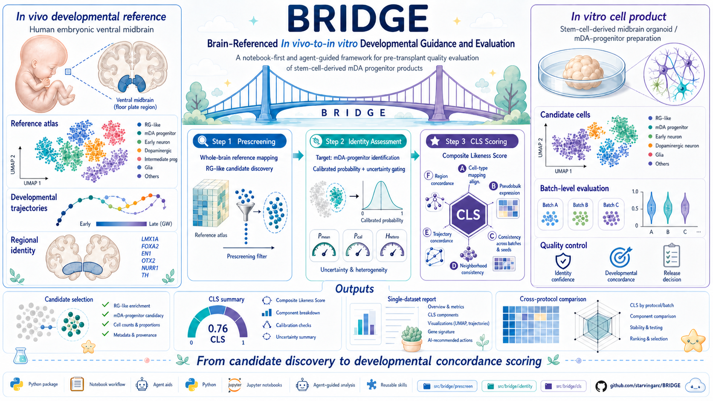

<p align="center">
  
</p>

<p align="center">
  
  
  
  <a href="docs/formal_workflows.md"></a>
  <a href="docs/agent_demo.md"></a>
</p>

# BRIDGE

**A developmental-reference evaluation platform for pre-transplant mDA progenitor cell products.**

<em>🌉 Candidate discovery, identity stability, and multidimensional developmental concordance.</em>

## 🧭 Background

Stem-cell-based replacement therapy is an important regenerative strategy for Parkinsonian dopaminergic circuit repair. Pre-transplant mDA progenitor products are evaluated as developmentally staged cells with defined regional identity, fate stability, and subsequent differentiation potential.

BRIDGE uses human embryonic ventral midbrain references to guide candidate-cell discovery, target identity assessment, and multidimensional developmental concordance scoring. The workflow organizes single-cell evidence for quality control, process optimization, and cross-protocol comparison.

| Evaluation layer | Biological focus |
| --- | --- |
| **Developmental reference** | Human embryonic ventral midbrain programs as the in vivo baseline. |
| **Candidate identity** | Calibrated probability, prediction variability, and entropy. |
| **Composite Likeness Score** | Identity, expression, transferability, neighborhood, trajectory, and regulon concordance. |

## ✨ Workflow

| Step | Role | Output |
| --- | --- | --- |
| **Step0** | Prepare environment, config, model assets, and run directory. | Ready-to-run workspace |
| **Step1** | Map one in vitro `.h5ad` against a whole-brain reference. | RG candidate annotations and Step1 report |
| **Step2** | Refine mDA progenitor identity with probability and uncertainty. | Candidate-bearing data, thresholds, probability tables, Step2 report |
| **Step3** | Quantify developmental concordance with CLS components A-F. | Component scores, weighted CLS, single-dataset and protocol-comparison reports |

## 🚀 Agent Use (Recommended)

The public demo flow is designed to be driven by a coding agent. For a first-time install, send this to Claude Code, Codex, or another agent:

```text
Help me install https://github.com/starvingarc/BRIDGE
```

Then copy the step command you need. Use `/...` in Claude Code and `@...` in Codex.

| Skill | Claude Code | Codex | Purpose |
| --- | --- | --- | --- |
| `bridge-step0` | `/bridge-step0` | `@bridge-step0` | Initialize environment, assets, config, and run directory. |
| `bridge-step1` | `/bridge-step1` | `@bridge-step1` | Prescreen an in vitro dataset and write a notebook-native Step1 report. |
| `bridge-step2` | `/bridge-step2` | `@bridge-step2` | Run target identity assessment and write a Step2 report. |
| `bridge-step3` | `/bridge-step3` | `@bridge-step3` | Run CLS scoring and optional protocol comparison. |

Full copy-paste demo prompts are in [docs/agent_demo.md](docs/agent_demo.md). Model assets are declared in [models/assets.json](models/assets.json) and fetched separately from public object storage.

## 🧪 Manual Use

```bash
pip install git+https://github.com/starvingarc/BRIDGE.git
# or, from a cloned source tree:
pip install -e ".[workflow]"
```

Notebook entry points:

```python
from bridge.prescreen import prescreen
from bridge.identity import identify
from bridge.cls import CLSContext, component_A, component_B, component_C, component_D, component_E, component_F, score

from bridge.prescreen.report import write_report as write_prescreen_report
from bridge.identity.report import write_report as write_identity_report
from bridge.cls.report import write_report as write_cls_report, compare_reports
```

Each step is designed to be called from a notebook, with report functions that render figures and tables in the notebook while also saving reproducible artifacts under `report/`.

## 🗺️ Explore

- [Agent demo script](docs/agent_demo.md)
- [Skills](docs/skills.md)
- [Formal workflows](docs/formal_workflows.md)
- [Thesis-to-code mapping](docs/thesis_to_code.md)
- [Roadmap](docs/roadmap.md)

## 🛠️ Development

```bash
PYTHONPATH=src pytest -q
```

```text
src/bridge/        Python package
configs/           public config templates
models/            model metadata and asset entry point
notebooks/         formal notebook examples and placeholders
docs/              workflow documentation and roadmap
.claude/skills/    repository-local Step0-Step3 skills
```

## Citation

BRIDGE is research software under active development. If you use it in a study, please cite the repository and include the commit hash used for analysis.
