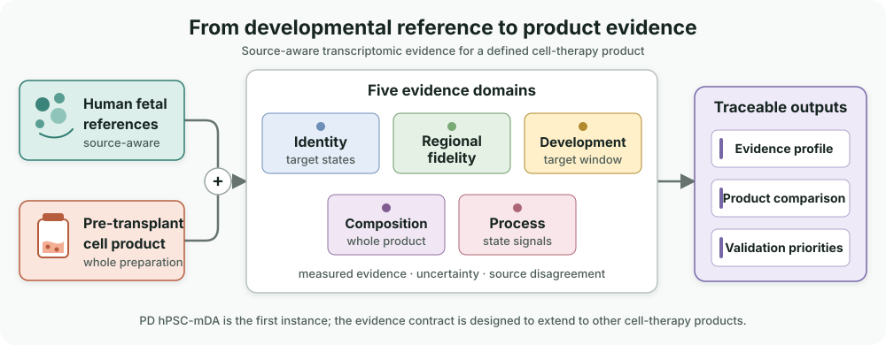

# BRIDGE

**Development-aware transcriptomic evidence for cell-therapy products.**

Parkinson's disease hPSC-derived midbrain dopaminergic (hPSC-mDA) products are the first biological instance.



## Biological question

Given a pre-transplant cell product, which intended developmental and regional identities are supported by its transcriptome, where does the full composition diverge, and which uncertainties should be tested next?

## Five evidence domains

| Domain | Evidence question |
|---|---|
| Target identity | Are the intended lineage and cell states represented? |
| Regional fidelity | Does the product support the intended anatomical identity rather than an off-axis fate? |
| Developmental compatibility | How does the product align with a researcher-defined developmental window? |
| Off-target control | What target, adjacent, off-axis, and unresolved states make up the whole product? |
| Proliferation & Stress Response | Without reassigning cell identity or composition, which stage-conditioned proliferation, stress-response, death-associated, or residual pluripotency-like transcriptomic signals require review? |

## Current biological progress

The first pilot asked whether fetal ventral-midbrain references can identify intended
states in a pre-transplant product while refusing unrelated neural and non-neural
cells.

| Biological question | Data examined | Current finding | Meaning for product evaluation |
|---|---|---|---|
| Can broad fetal ventral-midbrain states be recognized? | Donor-aware Chen vMB scRNA-seq splits | Several methods recover broad states, with uneven performance across labels | Exploratory state composition is possible, but no state is released for formal reporting |
| Can fine RG/Nb-derived states be separated? | Seven priority L2 states | Some methods separate these states internally, but external support and marker review are incomplete | Fine regional or developmental claims remain unavailable |
| Can unrelated cells be rejected? | Cortical organoid, neural crest, motor-neuron and mesenchymal OOD data | Tested inductive methods can force these cells into known ventral-midbrain labels | Formal target, regional-fidelity and off-target conclusions are blocked |
| Can markers provide an independent check? | Internal marker/program cards | Negative-marker coverage is incomplete and all seven L2 marker cards remain unfrozen | Marker evidence remains a shadow interpretation channel |

The P0-02 scientific freeze remains an independent future review step. Current
engineering does not encode its draft biological decisions: P0-03 instead reads
versioned ProductDefinitionCard and StateRoleMap objects, so later review can
change those inputs without changing tool code. Unresolved boundaries remain
provisional or unavailable.

## Repository status

| Package | Status |
|---|---|
| P0-01 Input Audit & QC | Executable candidate |
| P0-02 Cell-State Evidence | Executable shadow; no state or method frozen |
| P0-03 Target Identity & Regional Fidelity | Executable configurable candidate over P0-02 composition; no embedded biological role map, spatial result or score |
| P0-04 Developmental Compatibility | Executable configurable static candidate; developmental window and state roles are versioned inputs, while reference-stage/time-course evidence remains unavailable |
| P0-08 Evidence Sufficiency | Executable deterministic candidate over versioned upstream evidence; no score or real-case conclusion |
| P0-09 Evidence Compiler & Reconciler | Executable deterministic candidate for immutable evidence graphs and bounded read-only queries; no score or claim verification |
| P0-10 Report Claim Verifier | Executable deterministic candidate; `verified` means evidence/package correspondence, not biological truth or public release |
| P0-05–P0-07, P0-11–P0-12 | Scientific contracts only; executors pending |

## Minimal usage

```bash
python -m pip install -e ".[qc,evidence]"
bridge-tool list
bridge-tool describe P0-02
bridge-tool validate --request request.json
bridge-tool run --request request.json
```

Each run preserves the input and records the applicable measurement, reference, method, artifact, and checksum provenance.

## Scientific boundaries

- BRIDGE reports research-use transcriptomic evidence, uncertainty, and evidence gaps.
- Missing, unresolved, and out-of-reference evidence is not treated as a negative result.
- Candidate or shadow evidence does not establish clinical efficacy, safety, potency, GMP release, or an absolute product ranking.
- Post-transplant graft evidence is analyzed independently and is not back-propagated into the pre-transplant profile.
- No frozen P0 domain score is currently published.

## Documentation

- [Documentation index](docs/index.md)
- [Product requirements](docs/BRIDGE_PRD.md)
- [Scientific principles](docs/product-principles.md)
- [Tool Package cards](tool_packages/)
- [Method and source knowledge](knowledge/README.md)
- [Agent integration](docs/agent-integration.md)
