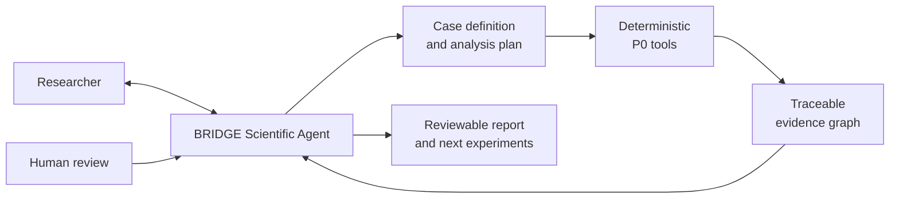

<div align="center">

<h1>BRIDGE</h1>

<p><strong>An evidence-grounded scientific agent for cell-therapy product evaluation</strong></p>

<p>Define the case · plan the analysis · orchestrate validated tools · reconcile evidence · prepare reviewable reports</p>

<p>
  <a href="https://github.com/starvingarc/BRIDGE/actions/workflows/ci.yml"></a>
  
  
  <a href="LICENSE"></a>
</p>

<p>
  <a href="docs/BRIDGE_PRD.md">Product</a> ·
  <a href="docs/README.md">Documentation</a> ·
  <a href="docs/agent-integration.md">Agent integration</a> ·
  <a href="docs/tool-packages.md">P0 tools</a> ·
  <a href="examples/README.md">Examples</a> ·
  <a href="CONTRIBUTING.md">Contributing</a>
</p>

</div>

> [!IMPORTANT]
> BRIDGE's target product is a scientific evaluation **Agent**. The current
> `main` branch is its deterministic P0 capability layer: all 12 tools are
> callable, while the conversational Agent, Web UI and task orchestration are
> not yet integrated. Scientific methods remain `candidate` or `shadow`; no P0
> `ScoreContract` is frozen and every domain score remains `null`.

## Overview

BRIDGE is designed to work with researchers evaluating cell-therapy products.
It keeps uploaded data, product definitions, developmental context, analysis
choices, uncertainty and claims connected in one reviewable evidence chain. The
Agent asks for missing information and coordinates the workflow; deterministic
tools own measurements, states, provenance and refusal behavior.


```mermaid
flowchart LR
    R[Researcher] <--> A[BRIDGE Scientific Agent]
    A --> C[Case definition<br/>and analysis plan]
    C --> T[Deterministic<br/>P0 tools]
    T --> E[Traceable<br/>evidence graph]
    E --> A
    A --> O[Reviewable report<br/>and next experiments]
    H[Human review] --> A
```

Parkinson's disease hPSC-derived midbrain dopaminergic products are the first
biological use case. Other products require their own reviewed definitions,
references, priors and measurement specifications; BRIDGE does not hard-code
one laboratory's state map or thresholds into the Agent.

## Current P0 foundation

| Stage | Packages | Responsibility |
|---|---|---|
| Intake and state evidence | **P0-01** Input Audit & QC · **P0-02** Cell-State Evidence | Audit uploaded expression data and assemble source-aware state evidence |
| Product-domain evidence | **P0-03** Target/Regional · **P0-04** Development · **P0-05** Off-target · **P0-06** Proliferation/Stress | Produce descriptive, externally configured domain evidence |
| Product context | **P0-07** Comparison & Stability · **P0-12** Optional Graft Assessment | Compare eligible product bundles and keep graft evidence independent |
| Evidence governance | **P0-08** Sufficiency · **P0-09** Compiler · **P0-10** Claim Verifier · **P0-11** Public-safe Export | Gate sufficiency, compile evidence, verify claims and write a local allowlisted export |

Each module has an executable adapter, versioned JSON interface, request
example, Tool Card, scientific task card and validation record. See the
[P0 Tool Package guide](docs/tool-packages.md) for inputs, outputs and refusal
semantics.

## Install and call the current tool layer

BRIDGE currently requires Python 3.12.

```bash
git clone https://github.com/starvingarc/BRIDGE.git
cd BRIDGE
python -m pip install -e ".[qc,evidence]"

bridge-tool list
bridge-tool describe P0-02
bridge-tool validate --request /absolute/path/to/request.json
bridge-tool run --request /absolute/path/to/request.json
```

The CLI and Python SDK use the same contracts. Start with the
[committed requests](examples/README.md) or the
[fully synthetic scRNA upload fixture](examples/demo-data/scrna-upload-v0.1/).
Example paths and checksums are placeholders unless stated otherwise.

## Scientific scope

| Evidence domain | Question | Boundary |
|---|---|---|
| Target identity | Are intended lineage and states represented? | Not released identity or potency |
| Regional fidelity | Is there transcriptomic regional support? | Not spatial localization |
| Developmental compatibility | Is evidence compatible with a supplied window? | Not biological age |
| Off-target control | How is the whole product composition accounted for? | Not physical removal, safety or release control |
| Proliferation & Stress Response | Which stage-conditioned signals require review? | Not cell fitness, causality or safety |

BRIDGE keeps `missing`, `unknown`, `unavailable`, `negative` and `alert`
distinct and never fills missing evidence with zero. It does not claim clinical
efficacy, clinical safety, validated potency, GMP release or an absolute product
ranking.

P0-02 remains under biological review: current pilot evidence supports
exploratory composition, not a released state assignment. See the
[pilot record](docs/validation/p0_02_scientific_freeze_pilot_20260811.md),
[reference registry](docs/bridge_spec_v0.1/data_reference_registry.md) and
[active scientific plan](plans/p0-02-cell-state-scientific-freeze.md).

## Documentation

| Goal | Start here |
|---|---|
| Understand the Agent product | [Product requirements](docs/BRIDGE_PRD.md) · [Agent integration boundary](docs/agent-integration.md) |
| Review the biology | [Product and scientific principles](docs/product-principles.md) · [P0 scientific specifications](docs/bridge_spec_v0.1/README.md) |
| Call or integrate a tool | [P0 Tool Package guide](docs/tool-packages.md) · [request examples](examples/README.md) |
| Inspect exact interfaces and evidence | [Tool Cards](src/bridge/tool_packages/cards/) · [JSON Schemas](src/bridge/resources/schemas/) · [validation index](docs/validation/README.md) |
| Contribute safely | [Contributing](CONTRIBUTING.md) · [privacy and provenance](docs/privacy-and-provenance.md) · [security](SECURITY.md) |

## Scientific foundations

The first use case is informed by human fetal-midbrain and hPSC-mDA studies
([La Manno et al., *Cell* 2016](https://doi.org/10.1016/j.cell.2016.09.027);
[Xu et al., *JCI* 2022](https://doi.org/10.1172/JCI156768)), single-cell analysis
and QC methods ([Wolf et al., *Genome Biology* 2018](https://doi.org/10.1186/s13059-017-1382-0);
[Wolock et al., *Cell Systems* 2019](https://doi.org/10.1016/j.cels.2018.11.005)),
and safeguards for cross-dataset annotation and experimental units
([Abdelaal et al., *Genome Biology* 2019](https://doi.org/10.1186/s13059-019-1795-z);
[Zimmerman et al., *Nature Communications* 2021](https://doi.org/10.1038/s41467-021-21038-1)).
These sources motivate the design; they do not validate BRIDGE's internal
reference, thresholds or product conclusions.

BRIDGE is available under the [MIT License](LICENSE).
