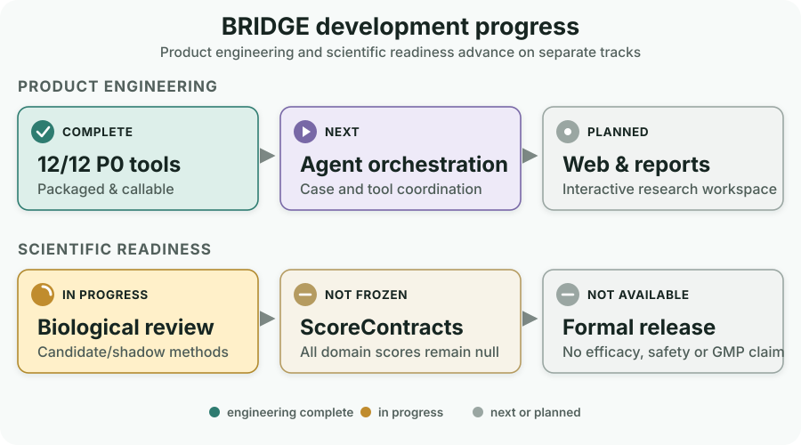

<h1>BRIDGE</h1>

<strong>A scientific Agent for cell-therapy product evaluation</strong>

BRIDGE helps academic and industry R&amp;D teams organize single-cell measurements, product definitions and experimental context into traceable product evidence.

  
  
  
  
  

  <a href="#who-bridge-is-for">Who it is for</a> ·
  <a href="#the-product-experience-we-are-building">Product experience</a> ·
  <a href="#development-progress">Development progress</a> ·
  <a href="#available-today">Available today</a> ·
  <a href="#documentation">Documentation</a>

## Evaluate the product, not just the dataset

Cell-therapy products are heterogeneous preparations. Their evaluation must
connect cell identity, regional fidelity, developmental state, complete product
composition, process-associated signals and evidence quality—not reduce the
answer to a marker list or a single score.

BRIDGE is being built to help researchers define the product under evaluation,
coordinate reproducible analyses and review every conclusion against its data,
method and provenance. Parkinson's disease hPSC-derived midbrain dopaminergic
products are the first biological use case; other products require their own
reviewed definitions, references and measurement specifications.

## Who BRIDGE is for

<table>
  <tr>
    <td width="34%">
      <strong>Cell-therapy researchers</strong>  
      Wet-lab, translational and product R&amp;D teams evaluating preparations,
      differentiation protocols, timepoints and batches.
    </td>
    <td width="33%">
      <strong>Computational collaborators</strong>  
      Scientists who inspect data lineage, methods, measurement contracts,
      uncertainty and reproducibility.
    </td>
    <td width="33%">
      <strong>Agent and platform integrators</strong>  
      Teams that call versioned P0 tools while keeping scientific measurements
      deterministic and auditable.
    </td>
  </tr>
</table>

BRIDGE is a research system for product evaluation. It is not intended for
patient-facing decisions, clinical diagnosis or GMP release.

## The product experience we are building

<table>
  <thead>
    <tr>
      <th>You provide</th>
      <th>BRIDGE evaluates</th>
      <th>You receive</th>
    </tr>
  </thead>
  <tbody>
    <tr>
      <td>Pre-transplant product scRNA-seq, a product definition, and sample and assay metadata</td>
      <td>Identity, development, composition, process signals, comparison eligibility and evidence sufficiency</td>
      <td>A traceable product profile, evidence gaps, alerts, validation priorities and a reviewable report</td>
    </tr>
  </tbody>
</table>

The intended Agent confirms information that changes the analysis, coordinates
registered tools, reconciles evidence and supports follow-up questions. The
current repository does not yet provide this end-to-end upload and Web
experience; its implementation status is shown below.

## Development progress

**How to read this status:** engineering completion refers to packaged,
callable tool interfaces. It does not establish biological validity or product
release readiness. Current methods remain `candidate` or `shadow`, no P0
`ScoreContract` is frozen, and every `domain_score` remains `null`.

## Available today

The current `main` branch provides the deterministic capability layer that the
future Agent will call:

- 12 executable P0 Tool Packages with versioned JSON requests and results.
- A shared Python SDK and CLI for discovery, validation and execution.
- Tool Cards, scientific task cards, examples and validation records.
- A fully synthetic scRNA-seq upload fixture for integration testing.
- Explicit provenance, evidence-state and refusal semantics.

The conversational Agent, task orchestration, Web workspace and interactive
reporting are not yet integrated. See the
[P0 Tool Package guide](docs/tool-packages.md) for the maintained tool inventory,
inputs, outputs and refusal behavior.

### Call the current tool layer

BRIDGE currently requires Python 3.12.

~~~bash
git clone https://github.com/starvingarc/BRIDGE.git
cd BRIDGE
python -m pip install -e ".[qc,evidence]"

bridge-tool list
bridge-tool describe P0-02
bridge-tool validate --request /absolute/path/to/request.json
bridge-tool run --request /absolute/path/to/request.json
~~~

Start with the [committed requests](examples/README.md) or the
[fully synthetic scRNA upload fixture](examples/demo-data/scrna-upload-v0.1/).
Example paths and checksums are placeholders unless stated otherwise.

## What BRIDGE evaluates

| Evaluation area | Product question |
|---|---|
| Target identity and regional fidelity | Are intended lineage and region-associated states represented? |
| Developmental compatibility | Is the observed evidence compatible with a researcher-confirmed target window? |
| Complete composition and off-target control | How is the whole preparation accounted for, including unknown and off-target states? |
| Proliferation & Stress Response | Which stage-conditioned process signals require review? |
| Comparison and evidence governance | Are products comparable, is the evidence sufficient, and can each claim be traced? |

BRIDGE keeps `missing`, `unknown`, `unavailable`, `negative` and
`alert` distinct and never fills missing evidence with zero. It does not claim
clinical efficacy, clinical safety, validated potency, GMP release or an
absolute product ranking. Transcriptomic alerts are review signals, not safety
conclusions.

P0-02 remains under biological review: current pilot evidence supports
exploratory composition, not a released state assignment. See the
[pilot record](docs/validation/p0_02_scientific_freeze_pilot_20260811.md) and
[active scientific plan](plans/p0-02-cell-state-scientific-freeze.md).

## Documentation

| Audience | Start here |
|---|---|
| Cell-therapy researchers | [Product requirements](docs/BRIDGE_PRD.md) · [product and scientific principles](docs/product-principles.md) · [synthetic upload example](examples/demo-data/scrna-upload-v0.1/) |
| Computational collaborators | [P0 scientific specifications](docs/bridge_spec_v0.1/README.md) · [Tool Package guide](docs/tool-packages.md) · [validation records](docs/validation/README.md) |
| Agent and platform integrators | [Agent integration](docs/agent-integration.md) · [tool contract](docs/tool-contract.md) · [request examples](examples/README.md) |
| Contributors | [Contributing](CONTRIBUTING.md) · [privacy and provenance](docs/privacy-and-provenance.md) · [security](SECURITY.md) |

## Scientific foundations

The first use case is informed by human fetal-midbrain and hPSC-mDA studies
([La Manno et al., *Cell* 2016](https://doi.org/10.1016/j.cell.2016.09.027);
[Xu et al., *JCI* 2022](https://doi.org/10.1172/JCI156768)), single-cell analysis
and QC methods ([Wolf et al., *Genome Biology* 2018](https://doi.org/10.1186/s13059-017-1382-0);
[Wolock et al., *Cell Systems* 2019](https://doi.org/10.1016/j.cels.2018.11.005)),
and safeguards for cross-dataset annotation and experimental units
([Abdelaal et al., *Genome Biology* 2019](https://doi.org/10.1186/s13059-019-1795-z);
[Zimmerman et al., *Nature Communications* 2021](https://doi.org/10.1038/s41467-021-21038-1)).

These sources motivate the design; they do not validate BRIDGE's internal
references, thresholds or product conclusions.

BRIDGE is available under the [MIT License](LICENSE).
