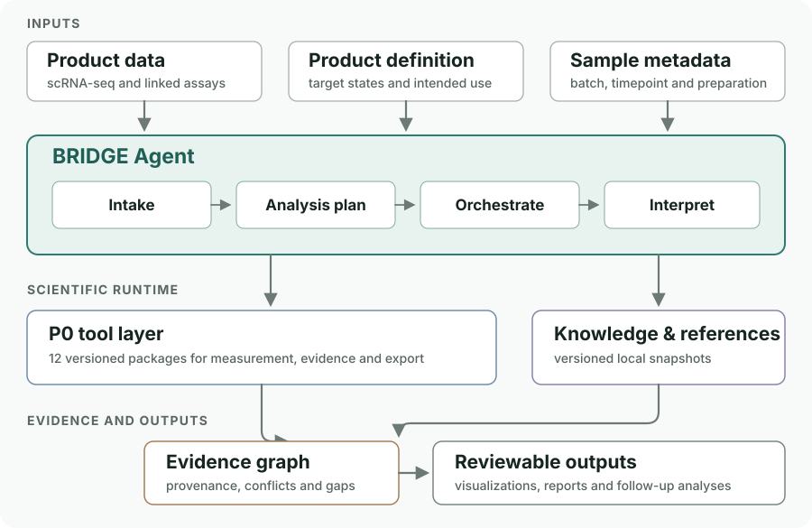

<h1>BRIDGE</h1>

  <strong>Brain-Referenced In vivo-to-in vitro Developmental Guidance and Evaluation</strong> 
  Scientific agent for cell-therapy product evaluation

  
  
  

  <a href="#architecture">Architecture</a> ·
  <a href="#development-status">Status</a> ·
  <a href="#quickstart">Quickstart</a> ·
  <a href="#documentation">Documentation</a>

BRIDGE coordinates product definition, analysis planning, scientific tools,
evidence reconciliation and report generation for single-cell evaluation of
cell-therapy products. PD hPSC-derived midbrain dopaminergic products are the
first use case.

## Architecture

The Agent manages intake, planning, tool orchestration and interpretation.
Registered P0 tools produce versioned measurements and evidence records.

## Development status

| Area | Current status |
|---|---|
| P0 tool packages | 12/12 implemented and callable |
| Agent orchestration | In development |
| Web interface | Planned |
| Scientific validation | In progress |

## Quickstart

The current release exposes the P0 tool layer through one CLI and Python
interface.

~~~bash
git clone https://github.com/starvingarc/BRIDGE.git
cd BRIDGE
python -m pip install -e ".[qc,evidence]"

bridge-tool list
bridge-tool describe P0-02
bridge-tool validate --request /absolute/path/to/request.json
bridge-tool run --request /absolute/path/to/request.json
~~~

See the [Tool Package guide](docs/tool-packages.md) for all 12 tools, their
inputs, outputs and refusal behavior. Example requests and a fully synthetic
scRNA-seq upload fixture are available under [examples](examples/README.md).

## Scientific scope

BRIDGE currently covers target and regional identity, developmental
compatibility, complete product composition, proliferation and stress response,
product comparison, evidence sufficiency, claim verification and public-safe
export.

Current methods remain `candidate` or `shadow`. P0 ScoreContracts are not
frozen and `domain_score` remains `null`. Clinical efficacy, safety,
validated potency, GMP release and absolute product ranking are outside the
current scope.

## Documentation

- [Product requirements](docs/BRIDGE_PRD.md)
- [Agent integration](docs/agent-integration.md)
- [P0 Tool Packages](docs/tool-packages.md)
- [Scientific specifications](docs/bridge_spec_v0.1/README.md)
- [Examples](examples/README.md)
- [Contributing](CONTRIBUTING.md)

## References

The first use case is informed by human fetal-midbrain and hPSC-mDA studies
([La Manno et al., *Cell* 2016](https://doi.org/10.1016/j.cell.2016.09.027);
[Xu et al., *JCI* 2022](https://doi.org/10.1172/JCI156768)) and established
single-cell analysis and validation practices. These sources guide the design
and do not validate BRIDGE's internal methods or product conclusions.

BRIDGE is available under the [MIT License](LICENSE).
