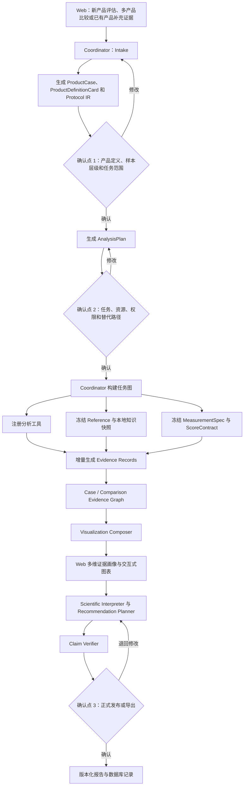
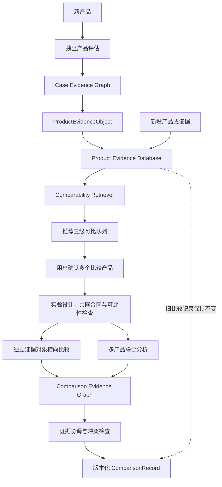

# BRIDGE 细胞治疗产品评估智能体 PRD v0.1

| 项目 | 内容 |
| --- | --- |
| 项目全称 | Brain-Referenced In vivo-to-in vitro Developmental Guidance and Evaluation |
| 产品形态 | 科学评估智能体（Scientific Agent） |
| 文档版本 | `v0.1` |
| 修订日期 | 2026-08-28 |
| 状态 | `current_primary_specification` |
| 适用范围 | 研究用途的细胞治疗产品转录组评估；PD hPSC-mDA 为首个实例 |
| 文档权威性 | 本文档是 BRIDGE 当前唯一主规范；Registry 和 Task Card 是受其约束的实施附件 |

> **当前实现状态：** BRIDGE 的产品定位是科学评估智能体；当前 `main` 只实现了智能体将调用的确定性 P0 工具层。第 6 节描述的端到端对话、案例确认、分析规划、任务编排、Web 交互和报告闭环尚未集成。本文中的正式 `domain_score` 描述的是完成独立验证后的目标合同；当前尚无 P0 `ScoreContract` 冻结，因此所有活动模块必须保持 `domain_score=null`。工具可调用、安装成功、候选指标或任务卡完成均不能替代智能体产品完成或科学评分验证。

## 目录

1. [项目目标](#1-项目目标)
2. [现有资源](#2-现有资源)
3. [评估内容](#3-评估内容)
4. [分析工具与知识库](#4-分析工具与知识库)
5. [部署与运行要求](#5-部署与运行要求)
6. [Agent 功能需求](#6-agent-功能需求)
7. [附录](#7-附录)

## 1. 项目目标

### 1.1 要解决的问题

体外分化获得的细胞治疗产品通常包含多种细胞状态。不同分化方案、时间点和批次之间可能同时存在目标细胞比例、区域身份、发育程度、离轴分化和过程应激等差异。

现有评估通常依赖少量 marker、人工注释或单一参考数据，难以系统回答以下问题：

- 产品中实际包含哪些细胞。
- 目标细胞是否具有正确的区域和谱系身份。
- 产品处于什么发育状态。
- 是否存在 off-target、unknown 或异常细胞状态。
- 不同方案、时间点和批次的差异来自哪里。
- 哪些结论有充分证据，哪些仍需补充实验。

BRIDGE 希望将分散的数据、分析工具和外部知识组织成统一、可追溯的评估流程。

### 1.2 产品定位

BRIDGE 是面向细胞治疗产品的科学评估智能体。

系统通过 Agent 完成案例确认、分析规划、工具调用、知识检索、证据整合和报告生成。具体指标由注册的分析工具计算，Agent 负责选择合适的工具和知识来源，并将结果解释为湿实验人员可以理解和核查的结论。

BRIDGE 面向不同类型的细胞治疗产品扩展。PD hPSC-mDA 作为首个完整应用，通过替换产品定义、参考数据和领域知识，可进一步支持其他疾病和细胞产品。

### 1.3 PD hPSC-mDA 首个应用场景

当前版本主要评估移植前的 hPSC-mDA 分化细胞，并支持比较不同分化方案、时间点、批次和 preparation。

系统重点分析：

- 中脑腹侧底板和 mDA 谱系身份。
- 前后轴、背腹轴和邻近脑区身份。
- 祖细胞、未成熟神经元和成熟神经元等发育状态。
- target、acceptable adjacent、off-target 和 unknown 组成。
- residual pluripotency、异常增殖、应激和其他过程异常。
- 调控、通路、代谢、通讯及空间支持证据。
- 结果对 reference、模型和分析方法的稳定性。

当发现目标身份不足、发育状态不匹配或异常程序升高时，BRIDGE 可以提出可验证的改进假设和补充实验，例如需要核查的细胞群、marker、通路或处理环节。系统不直接给出未经验证的小分子剂量和处理时序。

### 1.4 输入与输出

#### 用户需要提供

| 输入类型 | 内容 |
| --- | --- |
| 产品数据 | 移植前完整制剂的 scRNA-seq 数据 |
| 产品定义 | 预期细胞类型、目标状态和产品用途 |
| 样本信息 | 细胞系、分化方案、时间点、批次和 preparation |
| 数据说明 | assay、表达矩阵、metadata 字段及已知预处理过程 |

Agent 首先检查输入是否完整，并向用户确认会影响分析设计的关键信息。

#### 用户可选补充

用户可以补充自己的：

- 发育参考或对照数据。
- 空间转录组和组织染色数据。
- 与移植前 preparation 明确关联的 graft scRNA-seq/snRNA-seq。
- 新批次、新时间点或新的分化方案。

新增资源需要经过数据审计和适用性检查，并与系统预置资源分别记录。系统不会在来源不明确时自动合并数据。

graft 数据只进入独立后验分析，不用于修改移植前分域评估分数。

#### 输出

BRIDGE 输出四类结果：

| 类型 | 含义 |
| --- | --- |
| `Q - Quantification` | 目标身份、发育状态、组成、过程警报和稳定性等量化结果 |
| `E - Explanation` | 差异驱动因素、相关生物过程、支持证据和冲突证据 |
| `R - Recommendation` | 可验证的改进假设、补充测量和下一步验证实验 |
| `G - Gate/Alert` | 数据不可用、证据不足、OOD、关键异常和停止条件 |

最终报告包括产品多维画像、条件化产品比较、主要问题、证据充分性、结果来源和当前不可得结论。

BRIDGE 当前不输出临床疗效、安全性、validated potency、GMP 放行结论或跨场景绝对产品排名。

## 2. 现有资源

### 2.1 数据资源总览

BRIDGE 已整理的数据分为六类。各类数据的角色不同，不会因为都能转换为 h5ad 而被混合使用。

| 数据类别 | 主要内容 | 在 BRIDGE 中的用途 | 是否作为移植前产品输入 |
| --- | --- | --- | --- |
| 发育 reference | 人胎腹侧中脑、全脑和早期胚胎 scRNA-seq/snRNA-seq | 定义区域、谱系、发育和邻近状态 | 否 |
| 移植前产品数据 | 多实验室、方案、时间点和批次的体外分化 scRNA-seq | 产品画像、方案比较和稳定性评测 | 是，需按 sample/preparation 建立案例 |
| 空间与正交数据 | 空间转录组、组织染色和解剖信息 | 验证 marker 的空间特异性和组织位置 | 否 |
| 机制校准数据 | 谱系条形码、应激、扰动和疾病背景数据 | 校准阶段、转变、风险和鲁棒性证据 | 否 |
| OOD 数据 | 皮层、脊髓、运动神经元、神经嵴和 MSC 等 | 检验特异性、unknown 和拒答能力 | 否 |
| graft 数据 | 动物移植后的人源 graft scRNA-seq/snRNA-seq | 独立后验分析 | 否 |

每项数据在 Data/Reference Registry 中分别记录四类状态：`availability` 表示文件或对象是否可获得，`metadata_status` 表示样本合同是否完整，`access_policy` 表示访问和披露限制，`evaluation_eligibility` 表示能否进入 reference、开发、校准、sealed test 或正式比较。下表中的 `available` 只表示本地对象可读取或可运行，不等于已经获得正式评估资格。

### 2.2 人胎发育参考数据

| 数据家族 | Assay 与材料 | 发育时间与解剖范围 | 当前规模 | 主要用途 | 状态与限制 |
| --- | --- | --- | ---: | --- | --- |
| Chen vMB scRNA | scRNA-seq，whole cells | GW7/8/9/12/16/20；人胚腹侧中脑 | 61,455 cells | 早期区域、祖细胞和目标/邻近程序 | `available`；需冻结样本表、ROI 和 annotation |
| Chen vMB snRNA | snRNA-seq，nuclei | GW14/16/18/20/24/25；人胚腹侧中脑 | 87,467 nuclei | 中晚期神经元和 DA subtype coverage | `available`；与 scRNA 为不同胚胎 |
| Chen vMB combined | scRNA-seq + snRNA-seq 整合对象 | 12 个非配对胚胎、10 个孕周；腹侧中脑 | 148,922 profiles | state ontology、reference mapping 和发育背景 | 派生对象；年龄与模态存在混杂 |
| Chen RG/Nb states | 从 Chen sc/sn 派生的状态集 | 腹侧中脑；14 个区域 RG/Nb states | 15,095 profiles | mFP/mBIP/mBMP 目标和邻近状态 | 不作为独立 reference 计数 |
| Chen neurogenesis states | 从 Chen sc/sn 派生的神经发生状态集 | 腹侧中脑发育 | 83,017 profiles | DA/GABA/Glut/RG/Nb 状态和发育程序 | candidate；不是因果谱系真值 |
| Braun et al., 2023 (`EGAS00001004107`; HCA `cbd2911f-252b-4428-abde-69e270aefdfc`) | scRNA-seq；论文另含 spatial | PCW5-14；第一孕期全脑多区域 | 1,548,209 cells | 全脑区域和广谱离轴背景 | `available`；全脑 reference 不替代 vMB reference |
| Zeng et al., 2023 (`GSE155121`) | scRNA-seq；PCW4 10x spatial | PCW3-12；全胚、全头和全脑 | 400,141 human cells | 早期胚胎、神经管、脑和非神经背景 | `available`；区域与年龄标签需冻结 |
| La Manno et al., 2016 (`GSE76381`) | 人胎 VM scRNA-seq | PCW6-11；腹侧中脑 | 1,977 fetal cells | 独立经典 VM 发育 reference | `available`；旧平台且样本量较小 |
| Birtele et al., 2022 (`GSE192405`) | 人胎 VM scRNA-seq 与原代培养 | 6-11 周 post-conception；腹侧中脑 | 13 个 GEO samples；processed CSV 可用 | 原代胎儿 VM maturation external-source 候选 | `converted_conditionally_approved`；raw reads 不公开；仅允许 source/stage-level holdout 与 provisional-group sensitivity，不允许 biological-replicate 或 donor-level inference |

旧 Step1 reference 由 Chen legacy scRNA、Braun 和 Zeng 构建，full object 为 2,011,383 profiles。其 350,000-cell train、100,000-cell technical holdout 和 523,478-profile regional RG 仅用于旧流程复现、软件回归和血缘审计，不视为新 BRIDGE 的独立生物学验证。

### 2.3 主要移植前 mDA 产品样数据

| 数据家族 | 起始细胞、体系与目标产物 | Assay 与体外时间 | 当前规模 | BRIDGE 用途 | 状态与限制 |
| --- | --- | --- | ---: | --- | --- |
| Xu/Chen 2022 (`GSE204796`) | hPSC；2D/神经球 mDA 分化；VM floor-plate/mDA progenitors | scRNA-seq；D8/D14/D21/D28/D35 | 37,397 cells | 发育时间序列和方法开发 | `available`；五个时间点分开建案，graft 分开 |
| Studer/Tabar Boost vs Boost+ (`E-MTAB-14729`) | hPSC；2D Boost/Boost+ mDA 分化；VM floor-plate/mDA progenitors | scRNA-seq；D16/D25/D40 | 26,303 cells | 冻结后的 sealed competitor test | `sealed`；仅在 BRIDGE 合同冻结后运行，不进入 RAG、reference、prior、训练、校准或调参 |
| Storm/Parmar RC17 (`GSE200610`) | RC17 hESC；2D VM 分化；移植用 VM floor-plate/mDA progenitors | scRNA-seq D16；multiome D16/D18 | D16 scRNA 8,166 cells | 单时间点临床相关比较 | `sealed`；不等于患者 GMP lot，graft 与 multiome 分层 |
| LR-USC mDA scRNA (`GSE227070`; parent SuperSeries `GSE227071`) | H9 hESC 和 4X lineage-restricted USC；2D mDA 分化 | scRNA-seq；D16/D28/D62 | 48,196 cells | cell-source、stage 和 protocol shift | `available`；本 scRNA query 不含 GBX2-KO；D62 与 D16/D28 不视为同一产品阶段 |
| La Manno in-vitro (`GSE76381`) | hESC/iPSC；2D mDA 分化；VM progenitors/mDA neurons | scRNA-seq；hESC D0/D12/D17/D35，iPSC D42/D63 | 2,052 cells | 历史时间序列和平台 sanity check | `available`；样本量小，不支持 rare-state 正式比较 |
| Jerber population-scale iPSC DA (`EGAS00001002885`; `EGAD00001006157`) | 215 条 iPSC lines；pooled 2D mDA 分化 | scRNA-seq；D11/D30/D52，D52 含 rotenone block | 765,851 cells | donor、batch、timepoint 和扰动鲁棒性 | `available`；需按 donor/batch/condition 去重 |
| BrainSTEM Toh (`GSE281535`) | hPSC；3D midbrain organoid；midbrain/mDA lineage | scRNA-seq；D20/D25/D30/D40/D50/D60 | 34,702 cells；48 sequencing sublibraries，每个时间点 8 个 | 2D/3D domain shift 和时间点描述 | `available`；在 biological sample/organoid/replicate map 冻结前，48 个 sublibraries 不得称为 48 个生物学重复，只能作 timepoint-level descriptive analysis |
| Fiorenzano VM organoid (`GSE168323`) | hPSC；3D VM organoid；VM/mDA neurons 及前体 | scRNA-seq；D15/D30/D60/D90/D120 | 91,034 cells | organoid trajectory 和区域比较 | `available`；organoid 不与 2D product 直接排名 |
| SphereDiff（陈跃军组，Cell Stem Cell 研究关联） | hPSC；3D sphere differentiation；mDA progenitors | scRNA-seq；论文原始序列位于受控项目 `HRA008865`；本地 BRIDGE v1 对象为 D28 | 正式 `count_ready` 输入尚未与本地对象一一对应；v1 对象 9,547 cells | v1 历史结果对照；上游输入闭合后再作真实上传验证 | `analysis_ready_only`；关联 Zhang et al., Cell Stem Cell 2025；不得用已注释对象冒充原始计数上传 |
| MacroDiff（陈跃军组内部数据） | hPSC；内部两类 mDA differentiation protocol；mDA progenitors | scRNA-seq；Protocol A 为 D14/D21/D28，Protocol B 为 D28 | 六个原始计数 capture 共 78,542 个 cell-called barcodes；v1 下游对象 57,464 cells | P0-01 多-capture 真实上传验证；内部时间序列和跨 protocol 比较 | `count_ready_private`、`internal_unpublished`；不把 capture 当生物学重复，不公开原始数据、样本标识或服务器路径 |
| Tiklová pre-graft RC17 (`GSE118412`) | RC17 hESC；2D VM 分化；VM/mDA progenitors | Smart-seq2/scRNA-seq；D16 | 404 hESC-derived cells | 与长期 graft 显式关联的历史 sanity check | `available`；样本量小且平台较旧；同源 fetal VM 256 cells 作为 reference，不计入产品分母 |
| Studer/MSK-DA01 protocol-linked D16 | 本地 D16 分化样本；已发表 MSK-DA01/Studer floor-plate 方案作为 protocol context | scRNA-seq；D16 | 原始过滤计数矩阵 11,087 个 cell-called barcodes；v1 下游对象 9,046 cells | P0-01 单-capture 真实 MTX 上传验证；已发表方案比较 | `count_ready_private`；Piao et al., Cell Stem Cell 2021 支持产品与方案背景，但当前证据不把本地测序文件声称为该论文公开数据 |

### 2.4 空间转录组与染色验证

| 数据家族 | 数据类型 | 时间与解剖范围 | 当前规模/状态 | BRIDGE 用途 | 关键限制 |
| --- | --- | --- | --- | --- | --- |
| Chen hEB58 | Visium HD segmented tissue profiles | GW7；人胚中脑，section 2/9 | 225,107 + 186,054 = 411,161 profiles；18,085 probes；`available` | marker 空间特异性、解剖锚定和算法可行性 | 两张切片来自同一胚胎；方向和 ROI 待冻结 |
| Chen 冠状/矢状空间数据 | 人胚中脑空间转录组 | 单时间点；冠状和矢状切面 | `pending`；数据等待返回 | donor/section-aware anatomical reference | 返回后需登记 assay、donor、section、ROI 和 QC |
| Chen 人胚中脑 marker 染色 | IF/IHC | 具体 GW/PCW、切面和 ROI 待样本表冻结 | 实验进行中 | 验证 mDA、底板、区域边界和非目标 marker | 样本、抗体批次和成像条件冻结前不进入量化 |
| Braun 2023 spatial | 论文公开空间数据 | PCW5-14 第一孕期全脑 | 论文级可用；本地 spatial 版本待冻结 | 全脑解剖和区域 context | 不以论文图像代替可运行 snapshot |
| Zeng 2023 PCW4 spatial | 10x spatial | PCW4；全胚/全头/早期脑 | 公开数据；待独立版本与 ROI 审计 | early anatomy context | 不与体外产品直接比较 |

空间和染色数据当前主要用于 reference 构建和正交验证。单一胚胎的多张切片不视为多个生物学重复。

### 2.5 OOD 与机制校准数据

#### 机制与风险校准

| 数据家族 | 体系与时间 | 当前规模 | 用途 | 限制 |
| --- | --- | ---: | --- | --- |
| SISBAR (`GSE207921`) | H9 hESC mDA 分化 + lineage barcode；D13/D21/D30/D45 | 47,155 cells | stage transition 和 lineage-state consistency | 只支持实际观测到的转变 |
| SISBAR replicates (`GSE221592`) | H9 hESC mDA 分化 + lineage barcode；Stage I-IV | 168,805 cells | replicate-aware transition calibration | combined 和 split objects 不重复计数 |
| LMX1A/BFP sorting + MPP+ (`GSE249360`) | iPSC mDA；sorting groups；basal/MPP+ 24 h | 1,530 cells | sorting/stress 边界 | 确切分化 D 待核实 |
| Opioid-exposed midbrain organoid (`GSE260711`) | iPSC midbrain organoid；D53 acute、D77 chronic、D79 withdrawal | 20,322 cells | perturbation 与 stress robustness | 药物暴露不是产品质量标签 |

#### 跨体系与疾病背景鲁棒性

| 数据家族 | 体系与时间 | 当前规模 | 用途 | 限制 |
| --- | --- | ---: | --- | --- |
| FOUNDIN-PD / Bressan | 多供体 iPSC mDA；本地主要为 D65 | 416,216 cells | donor 和 disease-context robustness | 来源版本与正式 accession 待冻结 |
| Fernandes PD models | iPSC dopaminergic neurons；D47 子集 | 2,728 cells | disease/stress context | 只代表当前子集 |
| PINK1 mDA (`GSE183248`) | PD/control iPSC mDA；D6/D15/D21 等 | 3,324-cell local subset | mutation/stage robustness | 子集不代表完整研究 |
| LRRK2 midbrain organoid (`GSE133894`) | WT/LRRK2-G2019S iPSC organoid；D35/D70 | 10,517 cells | organoid disease/region robustness | 来源映射已修正，需保留 provenance |
| Familial-PD mDA (`GSE213569`) | familial-PD/control iPSC mDA；D48 | 11,066-cell control subset | control/source robustness | 本地只含 control 子集 |
| VM-striatum-cortex assembloid (`GSE219247`) | hPSC assembloid；D60 VM 子集 | 1,244 cells | multi-region domain shift | 只代表 fVmidbrain 子集 |
| MIRO1/RHOT1 PD organoid (`GSE264097`) | patient/isogenic/healthy-control iPSC midbrain organoid；D60 | 原始数据已下载 | mitochondrial 和 neuron-astrocyte disease-context robustness | `pending`；尚未转换，疾病模型不作为产品质量标签 |

#### Negative/OOD panel

| 数据家族 | Assay、时间与生物场景 | 当前规模 | OOD 用途 | 状态/限制 |
| --- | --- | ---: | --- | --- |
| Fan fetal cortex (`GSE120046`) | scRNA-seq；PCW7-28；人胎大脑皮层 | 13,124 cells | in-vivo forebrain/cortex OOD | `available` |
| Connected cerebral organoids (`GSE190729`) | scRNA-seq；体外时间待核实；cerebral organoid | 17,636 cells | cortical/cerebral OOD | `available`；timepoint metadata 待补 |
| Reproducible cortical organoids (`GSE129519`) | scRNA-seq；3 个月；dorsal forebrain/cortex | 10,000 sampled cells | high-quality cortical OOD | 两个 cell line 各 5,000 sampled |
| hiPSC motor neurons (`GSE267791`) | scRNA-seq；D 待核实；spinal motor neurons | 1,341 cells | neuronal but non-mDA OOD | `available`；样本量小，timepoint metadata 待补 |
| Developing human spinal cord (`GSE188516`) | scRNA-seq + snRNA-seq；PCW17-18；脊髓 | 20,000 sampled profiles | ventral CNS but non-midbrain OOD | 保留 sc/sn 模态区别 |
| Neural crest/sympathoadrenal (`GSE221853`) | scRNA-seq；D0-D28；hESC trunk neural crest | 29,857 cells | peripheral neural-crest OOD | `available` |
| Bone-marrow MSC (`GSE224152`) | scRNA-seq；成人骨髓 MSC | 1,771 cells | non-neural/mesenchymal OOD | `available`；样本量小 |
| Whole-brain organoids (`GSE86153`) | scRNA-seq；3/6 个月；heterogeneous brain organoid | 10,000 sampled cells | heterogeneous brain OOD | 每个时间点 5,000 sampled |
| hESC neural lineages (`GSE86982`) | scRNA-seq；D 待核实；前脑及中/后脑神经谱系 | 2,365 cells | difficult neural/caudal OOD | `available`；timepoint metadata 待补 |

OOD 数据用于检验 BRIDGE 能否识别非目标生物场景，不代表“低质量 PD 产品”。评测需以 study、sample 和 timepoint 分组，不使用 cell-level random split 冒充外部验证。

#### 待转换、受控或排除资源

| 数据家族 | 当前状态 | 处理方式 |
| --- | --- | --- |
| `GSE75140`、`GSE218457`、`GSE138002`、`GSE132672` | 原始或 processed 数据已下载，待转换/核实 | 作为 cortex、retina 和 organoid OOD reserve |
| `GSE160625`、`GSE75748` | 已下载，待转换 | 作为 mesoderm/endoderm severe OOD reserve |
| Nishimura/Arenas 与 Ásgrímsdóttir datasets | `controlled_access` | 获得合法访问和 sample map 前不宣称可运行 |
| Luo fetal cerebellum (`GSE198565`) | `excluded` | 来源论文已撤稿，隔离于 reference、prior 和 benchmark |
| `GSE216323` scATAC archive | `excluded`；当前模态不适用 | 不作为当前 scRNA 产品输入 |

### 2.6 移植后 graft 数据

| 数据家族 | 宿主与模型 | Graft assay | 移植后时间 | 主要覆盖状态 | 与移植前 preparation 的关系 |
| --- | --- | --- | --- | --- | --- |
| Xu/Chen (`GSE204796`) | PD 小鼠模型 | human EGFP+ graft scRNA-seq | 4 个月 | mDA neurons 和 off-target neuronal states | 同一研究家族；sorted/unsorted preparation map 冻结后作后验比较 |
| Boost/Boost+ (`E-MTAB-14729`) | 6-OHDA 大鼠模型 | human graft snRNA-seq | 1/9 个月 | graft maturation、mDA subtype 和 off-target context | 按 Boost/Boost+ preparation 显式关联；仅在主评估冻结后查看 |
| Storm/Parmar (`GSE200610`) | 6-OHDA 大鼠 PD 模型 | human graft snRNA-seq + lineage barcode context | 3/6 个月 | DA neurons、astrocytes、VLMCs 等 | 来源于 RC17 D18 preparation；按 preparation/barcode 显式关联 |
| Tiklová (`GSE118412`, `GSE132758`) | 大鼠 PD 模型 | Smart-seq2/scRNA-seq | 6/12 个月 | DA neurons、astrocytes、VLMCs 及其他 graft-derived cells | 来源 D16 VM preparation；移植前 404-cell block 见 2.3，graft 原始块待转换 |

graft 的分析单位为 `animal/graft x post-transplant timepoint`。只有在存在明确的来源 preparation 和连接证据时，Agent 才能生成 preparation-graft 描述性关联。graft 结果不用于回填移植前分域评估分数、训练标签或疗效/安全性结论。

#### 公开数据主要来源

| 数据 | 短引用 | DOI |
| --- | --- | --- |
| Braun 2023 | Braun et al., *Science* (2023) | [10.1126/science.adf1226](https://doi.org/10.1126/science.adf1226) |
| Zeng 2023 / `GSE155121` | Zeng et al., *Cell Stem Cell* (2023) | [10.1016/j.stem.2023.04.016](https://doi.org/10.1016/j.stem.2023.04.016) |
| La Manno / `GSE76381` | La Manno et al., *Cell* (2016) | [10.1016/j.cell.2016.09.027](https://doi.org/10.1016/j.cell.2016.09.027) |
| Birtele / `GSE192405` | Birtele et al., *Development* (2022) | [10.1242/dev.200504](https://doi.org/10.1242/dev.200504) |
| SISBAR / `GSE207921`, `GSE221592` | You et al., *Cell Stem Cell* (2023) | [10.1016/j.stem.2023.02.007](https://doi.org/10.1016/j.stem.2023.02.007) |
| Xu/Chen / `GSE204796` | Xu et al., *JCI* (2022) | [10.1172/JCI156768](https://doi.org/10.1172/JCI156768) |
| Boost/Boost+ / `E-MTAB-14729` | Kim et al., *JCI* (2026) | [10.1172/JCI190954](https://doi.org/10.1172/JCI190954) |
| Storm/Parmar / `GSE200610` | Storm et al., *Science Advances* (2024) | [10.1126/sciadv.adn3057](https://doi.org/10.1126/sciadv.adn3057) |
| LR-USC scRNA / `GSE227070`（parent SuperSeries `GSE227071`） | Maimaitili et al., *Nature Communications* (2023) | [10.1038/s41467-023-43471-0](https://doi.org/10.1038/s41467-023-43471-0) |
| Jerber population-scale DA | Jerber et al., *Nature Genetics* (2021) | [10.1038/s41588-021-00801-6](https://doi.org/10.1038/s41588-021-00801-6) |
| BrainSTEM Toh / `GSE281535` | Toh et al., *Science Advances* (2025) | [10.1126/sciadv.adu7944](https://doi.org/10.1126/sciadv.adu7944) |
| Fiorenzano / `GSE168323` | Fiorenzano et al., *Nature Communications* (2021) | [10.1038/s41467-021-27464-5](https://doi.org/10.1038/s41467-021-27464-5) |
| SphereDiff / Chen 组 Cell Stem Cell 研究 | Zhang et al., *Cell Stem Cell* (2025) | [10.1016/j.stem.2025.10.001](https://doi.org/10.1016/j.stem.2025.10.001) |
| MSK-DA01 product/protocol context | Piao et al., *Cell Stem Cell* (2021) | [10.1016/j.stem.2021.01.004](https://doi.org/10.1016/j.stem.2021.01.004) |
| LMX1A/BFP + MPP+ / `GSE249360` | Cardo et al., *Cells* (2023) | [10.3390/cells12242860](https://doi.org/10.3390/cells12242860) |
| Opioid organoid / `GSE260711` | Kim et al., *Advanced Science* (2024) | [10.1002/advs.202400847](https://doi.org/10.1002/advs.202400847) |
| FOUNDIN-PD | Bressan et al., *Cell Genomics* (2023) | [10.1016/j.xgen.2023.100261](https://doi.org/10.1016/j.xgen.2023.100261) |
| Fernandes PD models | Fernandes et al., *Cell Reports* (2020) | [10.1016/j.celrep.2020.108263](https://doi.org/10.1016/j.celrep.2020.108263) |
| PINK1 mDA / `GSE183248` | Novak et al., *Communications Biology* (2022) | [10.1038/s42003-021-02973-7](https://doi.org/10.1038/s42003-021-02973-7) |
| LRRK2 organoid / `GSE133894` | Zagare et al., *American Journal of Human Genetics* (2022) | [10.1016/j.ajhg.2021.12.009](https://doi.org/10.1016/j.ajhg.2021.12.009) |
| Familial-PD mDA / `GSE213569` | Virdi et al., *npj Parkinson's Disease* (2022) | [10.1038/s41531-022-00423-7](https://doi.org/10.1038/s41531-022-00423-7) |
| VM-striatum-cortex assembloid / `GSE219247` | Reumann et al., *Nature Methods* (2023) | [10.1038/s41592-023-02080-x](https://doi.org/10.1038/s41592-023-02080-x) |
| MIRO1/RHOT1 PD organoid / `GSE264097` | Zagare et al., *npj Systems Biology and Applications* (2025) | [10.1038/s41540-025-00509-x](https://doi.org/10.1038/s41540-025-00509-x) |
| Fan cortex / `GSE120046` | Fan et al., *Science Advances* (2020) | [10.1126/sciadv.aaz2978](https://doi.org/10.1126/sciadv.aaz2978) |
| Connected cerebral organoid / `GSE190729` | Osaki et al., *Nature Communications* (2024) | [10.1038/s41467-024-46787-7](https://doi.org/10.1038/s41467-024-46787-7) |
| Cortical organoid / `GSE129519` | Velasco et al., *Nature* (2019) | [10.1038/s41586-019-1289-x](https://doi.org/10.1038/s41586-019-1289-x) |
| Motor neuron / `GSE267791` | Hayakawa-Yano et al., *PNAS* (2024) | [10.1073/pnas.2401531121](https://doi.org/10.1073/pnas.2401531121) |
| Human spinal cord / `GSE188516` | Andersen et al., *Nature Neuroscience* (2023) | [10.1038/s41593-023-01311-w](https://doi.org/10.1038/s41593-023-01311-w) |
| Neural crest / `GSE221853` | Saldana-Guerrero et al., *Nature Communications* (2024) | [10.1038/s41467-024-47945-7](https://doi.org/10.1038/s41467-024-47945-7) |
| Bone-marrow MSC / `GSE224152` | Fiévet et al., *Stem Cell Research & Therapy* (2023) | [10.1186/s13287-023-03437-x](https://doi.org/10.1186/s13287-023-03437-x) |
| Whole-brain organoid / `GSE86153` | Quadrato et al., *Nature* (2017) | [10.1038/nature22047](https://doi.org/10.1038/nature22047) |
| hESC neural lineages / `GSE86982` | Furchtgott et al., *eLife* (2017) | [10.7554/eLife.20488](https://doi.org/10.7554/eLife.20488) |
| Cerebral organoid/neocortex / `GSE75140` | Camp et al., *PNAS* (2015) | [10.1073/pnas.1520760112](https://doi.org/10.1073/pnas.1520760112) |
| Human retina / `GSE138002` | Lu et al., *Developmental Cell* (2020) | [10.1016/j.devcel.2020.04.009](https://doi.org/10.1016/j.devcel.2020.04.009) |
| Cortical organoid stress / `GSE132672` | Bhaduri et al., *Nature* (2020) | [10.1038/s41586-020-1962-0](https://doi.org/10.1038/s41586-020-1962-0) |
| hiPSC chondrogenesis / `GSE160625` | Wu et al., *Nature Communications* (2021) | [10.1038/s41467-020-20598-y](https://doi.org/10.1038/s41467-020-20598-y) |
| hESC definitive endoderm / `GSE75748` | Chu et al., *Genome Biology* (2016) | [10.1186/s13059-016-1033-x](https://doi.org/10.1186/s13059-016-1033-x) |
| Commercial neural organoids / `GSE218457` | 公开 GEO 记录 | DOI 待核实 |
| Nishimura/Arenas | Nishimura et al., *Stem Cell Reports* (2023) | [10.1016/j.stemcr.2022.10.016](https://doi.org/10.1016/j.stemcr.2022.10.016) |
| Ásgrímsdóttir radial glia | Ásgrímsdóttir et al., *Nature Neuroscience* (2026) | [10.1038/s41593-026-02200-8](https://doi.org/10.1038/s41593-026-02200-8) |
| Luo fetal cerebellum / `GSE198565` | Luo et al., *Nature* (2022；已撤稿) | [10.1038/s41586-022-05487-2](https://doi.org/10.1038/s41586-022-05487-2) |
| hPSC teratoma scATAC / `GSE216323` | Liu et al., *Stem Cell Reports* (2023) | [10.1016/j.stemcr.2023.10.018](https://doi.org/10.1016/j.stemcr.2023.10.018) |
| Tiklová graft / `GSE118412`, `GSE132758` | Tiklová et al., *Nature Communications* (2020) | [10.1038/s41467-020-16225-5](https://doi.org/10.1038/s41467-020-16225-5) |

## 3. 评估内容

BRIDGE 以完整移植前 preparation 为评估对象，以 sample/preparation 为比较单位。各评估域分别输出 raw metrics、分域评估分数、证据充分性和限制，任何域的高分都不能抵消 unknown、证据不足或关键警报。

### 3.1 评估结果结构

每项评估结果包含：

- 可直接解释的 raw metrics 和分母。
- 输入充分且通过任务级分析验证时发布的 0-100 `domain_score`。
- 样本差异、模型差异和 reference 敏感性等不确定性。
- 当前证据状态、适用范围和限制。
- 可追溯的数据、分析结果、知识来源、`MeasurementSpec` 和 `ScoreContract` 版本。

`domain_score` 是各评估域独立的分数，只表示产品在已确认 ProductDefinitionCard、reference、prior 和测量合同下，对该域转录组证据要求的符合程度。它不表示临床效度、产品质量真值、疗效、安全性或 potency。

| `score_state` | `domain_score` | 发布含义 |
| --- | --- | --- |
| `available` | 0-100 | 已通过任务级分析验证，可作为正式分域分数发布 |
| `shadow` | 可有候选数值 | 方法或合同仍在验证，只能用于开发和辅助解释 |
| `unavailable` | `null` | 输入、适用性或必要证据不足，不计算也不补值 |

BRIDGE 的核心评估架构包括：

| 阶段 | 评估域 | 主要回答的问题 |
| --- | --- | --- |
| P0 | Target Identity | 完整制剂中有多少细胞支持声明的目标身份 |
| P0 | Regional Fidelity | 目标相关细胞是否具有正确的解剖区域身份 |
| P0 | Developmental Compatibility | 产品是否与研究者确认的目标发育窗口相容 |
| P0 | Off-target Control | 已知离轴状态的组成和负担如何 |
| P0 | Proliferation & Stress Response | 在不重新判定细胞身份或组成的前提下，是否出现偏离目标阶段背景、需要复核的增殖、应激、死亡相关程序或残余多能性样信号 |
| P1 | Regulatory Coherence | 产品是否具有与目标身份和阶段相容的调控状态 |
| P1 | Functional Program Readiness | 目标相关功能程序是否完整且方向一致 |
| P1 | Metabolic Integrity | 代谢和线粒体状态是否与目标阶段相容 |
| P1 | Assay Translatability | 计算结果能否转化为可执行的检测和分选指标 |
| P2 | Niche Compatibility | 产品内部通讯潜势及其空间支持是否与预期发育环境相容 |
| Gate | Unknown/OOD | 当前 reference 和模型不能可靠解释多少细胞 |
| Gate | Critical Alerts | 是否存在必须单独核查的高关注转录信号 |
| Gate | Evidence Sufficiency | 当前数据和证据是否足以支持相应结论 |

P0/P1/P2 表示实现和验证顺序，不表示科学重要性。五个 P0 域未来分别建立冻结的 `MeasurementSpec` 和 `ScoreContract`；P1 和 P2 域当前只展示 raw metrics、证据状态与缺口。完成独立分析验证后，才可通过新版本合同引入分域评分。

BRIDGE 不计算综合总分，也不生成跨场景绝对产品排名。

### 3.2 数据质量与可分析性

Agent 首先检查表达矩阵、数据层含义、基因标识、样本层级、metadata、细胞数量、基因覆盖、基础 QC 和稀有状态检测能力，并确定哪些评估模块可以运行。

该步骤输出 Data Readiness、可运行模块和证据缺口。技术质量不足不会被解释为生物学低分；受影响的结果标记为 `unavailable` 或降低证据充分性。

### 3.3 目标细胞与区域身份

Target Identity 评估完整制剂中支持预期细胞身份的比例，并将 acceptable adjacent 状态单独报告。

Regional Fidelity 评估腹侧中脑及底板区域支持，同时展示间脑、后脑、前脑或外周谱系等区域偏移。

报告包含 target 和 adjacent 组成、区域支持、主要偏移方向、不确定性及冲突证据。目标 marker 表达不足、模型不一致或 reference 覆盖不足分别说明。

### 3.4 发育状态与目标窗口

Agent 根据产品用途、分化阶段和已有独立证据，在交流过程中向用户提供多个候选目标窗口。

PD-mDA 首版默认预选“移植用 VM floor-plate/mDA progenitor”，并允许选择更早的 patterning progenitor 或更晚的 immature mDA 状态。

研究者确认目标窗口后，BRIDGE 才计算 Developmental Compatibility 的 raw metrics 和发育画像。当前仍保持 `domain_score=null`；未确认窗口时继续报告主要发育状态与候选窗口依据，但该域 `score_state=unavailable`。

体外分化日与人胎 GW/PCW 分别保留，系统不自动换算，也不根据现有数据宣称全局最佳收获阶段。

### 3.5 完整制剂组成与 OOD

组成分析以全部移植前细胞为分母，区分：

- `target`
- `acceptable_adjacent`
- `known_off_target`
- `unknown`

报告展示各类比例、主要 off-target 状态、模型分歧和 unknown 组成。稀有异常状态同时报告当前细胞数支持的检测能力，区分“未检测到”和“当前数据无法排除”。

unknown 不自动计为 target 或已知 off-target。当 unknown 过高或 reference 覆盖不足时，Off-target Control 返回 `unavailable`，并由 Unknown/OOD gate 提示。

### 3.6 增殖、应激反应与关键警报

Proliferation & Stress Response 在已有 Cell-State 与组成证据基础上，评估与目标阶段相联系的增殖、stress、hypoxia、UPR、apoptosis、EMT 和其他转录程序偏移；它不重新判定细胞身份或计算 off-target 比例。

残余多能性样信号、严重异常增殖、明显非神经污染及无法解释的样本冲突进入 Critical Alerts。

Critical Alerts 独立展示，不被其他域的高分抵消。报告只能称为需要进一步核查的转录组证据，不能解释为临床安全性或肿瘤风险结论。

### 3.7 知识增强核心域

知识增强模块当前形成独立的 raw evidence panel，用于解释与 ProductDefinitionCard 中声明目标的相容程度。它们不采用“信号越强越好”的统一规则，也不生成候选分数。

| 评估域 | 主要内容 | 当前证据目标 | 解释边界 |
| --- | --- | --- | --- |
| Regulatory Coherence | TF 状态、调控网络、motif 和外部调控证据 | 目标身份和阶段所需调控程序的一致性 | inferred activity 不等于真实 TF 占位 |
| Functional Program Readiness | patterning、神经发生、dopamine、轴突、突触等程序 | 目标阶段相关功能程序的完整性和方向一致性 | 不等于实际功能或 potency |
| Metabolic Integrity | 线粒体、氧化还原、能量代谢、mitophagy 和代谢应激 | 代谢状态与目标阶段的相容程度 | 不等于真实代谢通量 |
| Assay Translatability | surfaceome、secretome、marker 组合和跨样本稳定性 | 计算结果转化为 flow、IF 或其他检测方案的可行性 | 高分表示更容易检测，不表示产品质量更高 |
| Niche Compatibility | sender-receiver、receiver response、ECM 和空间位置支持 | 产品内部互作潜势与预期发育环境的相容程度 | 不等于真实通讯或移植后微环境重建 |

每个域分别保存：

- `measured`：当前样本中直接测得的表达或蛋白证据。
- `inferred`：由模型和知识库推断的调控、通路、代谢或通讯状态。
- `prior_only`：外部知识支持，但当前样本尚未直接验证的关系。

P1/P2 当前保留 raw metrics、`domain_score=null`、`score_state=shadow/unavailable` 和证据缺口。只有满足数据覆盖、上下文匹配、跨样本稳定性和独立分析验证要求时，才可通过新的 `MeasurementSpec` 和 `ScoreContract` 引入正式分域评分。

对于仅有解离 scRNA-seq 的产品，Niche Compatibility 不发布正式分数，只报告 Communication Potential；其 `score_state` 保持 `shadow`。获得 receiver-response、空间、共培养或其他正交证据并完成分析验证后再晋升。

同一上游数据或知识来源支持多个域时，应标记为共享 evidence family，不能描述为多项相互独立的证据。

### 3.8 产品比较与稳定性

产品比较需要具有相容的 ProductDefinitionCard、目标窗口、sampling context 和 assay。统计和比较单位为 sample/preparation，单个细胞不作为独立生物学重复。

系统可以比较同一目标阶段下的不同方案和批次，也可以描述同一方案随时间的变化。输出包括：

- 各 P0 域的 raw metric 差异；只有未来同一冻结 ScoreContract 下才比较 `domain_score`。
- P1/P2 raw evidence 的探索性差异，并明确展示 `score_state=shadow/unavailable`。
- 主要细胞状态、程序和知识证据驱动因素。
- 批次、时间点、reference 和模型选择的影响。
- 结果的稳定性和不可比较项。

不满足可比条件时返回 `not_comparable`。不同目标窗口、产品类型或 assay 之间不强制排序。

### 3.9 证据充分性与改进建议

Evidence Sufficiency 分别展示 Data Readiness、Model Robustness 和 Prior Applicability，不合并成产品质量分。

| 状态 | 含义 |
| --- | --- |
| `negative` | 已完成适用且有足够检测能力的测量，未获得预先定义的目标证据 |
| `missing` | 必需的数据、metadata 或测量尚未提供 |
| `unknown` | 当前 reference、模型或知识不能可靠解释该状态 |
| `unavailable` | 因适用性、数据质量或前置条件不足，当前结果不能计算 |
| `alert` | 检测到需要人工复核和正交验证的高关注信号 |

当知识库覆盖不足、上下文不匹配或不同知识来源冲突时，相应知识增强域返回 `unavailable` 或保持 shadow，不能转换为低产品分数。

Agent 根据已获得的证据解释主要差异，提出可证伪的改进假设、补充测量和下一步验证实验。建议必须说明依据、预期观察结果和能够区分的解释，不直接给出未经验证的小分子剂量或处理时序。

### 3.10 graft 独立后验分析

graft 仅在存在明确 preparation-to-graft 关联时进行描述性分析。分析单位为 `animal/graft x post-transplant timepoint`，输出 graft 组成、成熟状态、异常状态及其与来源 preparation 的支持或冲突证据。

graft 的 scRNA-seq 和 snRNA-seq 需要分别处理。其结果不回填移植前分域评估分数、阈值或训练标签，也不用于生成疗效或安全性结论。

## 4. 分析工具与知识库

本章只确定分析任务、推荐工具组合、基本流程和发布条件。工具版本、参数、环境、许可证、完整输入条件、benchmark 及官方资料统一记录在 [P0 科学规格索引](bridge_spec_v0.1/README.md) 链接的任务卡、Tool Package Card 与知识快照中。

### 4.1 使用原则

- Agent 根据 ProductCase 选择已注册的分析任务。
- 每项任务先完成方法 benchmark，再冻结正式方法和独立校验方法。
- 工具与适用的 reference、ontology 或知识快照绑定使用。
- 每个正式 `domain_score` 必须绑定冻结的 `MeasurementSpec` 和 `ScoreContract`。
- 确定性工具负责计算，LLM 负责编排、检索、解释和报告。
- 输入或证据不足时返回 `unavailable`，不临时替换方法。
- 实时联网信息不改变当次分域评估分数。

### 4.2 P0 核心分析任务

| 分析任务 | 推荐工具与流程 | 主要输出 |
| --- | --- | --- |
| 输入审计与 QC | BRIDGE Case Validator → [AnnData](https://anndata.readthedocs.io/) → [Scanpy QC](https://scanpy.readthedocs.io/en/stable/api/scanpy.pp.calculate_qc_metrics.html)；Scrublet 条件运行 | Data Readiness、可运行模块和数据缺口 |
| Cell-State Evidence | 按 Anatomy、Lineage、Development 和 Process 分轴；透明基线、分类/映射方法及 ontology/open-set 方法分别 benchmark | 层级 prediction set、方法分歧和 unknown |
| 目标与区域身份 | Cell-State evidence → ProductDefinitionCard → marker 与独立 reference 校验 | Target Identity、Regional Fidelity |
| 发育状态 | 真实时间点组成与 pseudobulk → 发育 reference；[CellRank](https://cellrank.readthedocs.io/) 和 [scVelo](https://scvelo.readthedocs.io/) 条件运行 | 发育组成和 Developmental Compatibility |
| 完整制剂组成 | 对全部细胞聚合 target、adjacent、off-target 和 unknown，并估计稀有状态检测能力 | 组成比例、置信区间和 Off-target Control |
| 增殖与应激反应 | 阶段条件化的增殖、stress、hypoxia、UPR、apoptosis 等程序；CNV 工具保持 shadow | Proliferation & Stress Response 和 Critical Alerts |
| 产品比较 | sample/preparation 级 pseudobulk、组成比较、下采样及 reference/preprocessing swap | 差异驱动因素和稳定性 |

Cell-State 各状态轴分别比较 marker/program、reference correlation、监督分类、reference mapping、ontology-aware 和开放集方法；基础模型暂作为 shadow 候选。完成 source holdout、OOD、校准和跨模态测试后再冻结正式方法。

### 4.3 知识增强分析任务

| 分析任务 | 推荐工具与知识 | 发布条件 |
| --- | --- | --- |
| Regulatory Coherence | [decoupler](https://decoupler.readthedocs.io/) + CollecTRI；[pySCENIC](https://github.com/aertslab/pySCENIC) 独立校验；multiome 条件下使用 SCENIC+ | 区分表达、activity、regulon 和外部 motif/ChIP 证据 |
| Functional Program Readiness | 冻结功能程序 + AUCell；PROGENy、Reactome 和 GO 用于通路推断与解释 | 不解释为真实功能或 potency |
| Metabolic Integrity | MitoCarta 程序与 pseudobulk expression；flux 工具保持 shadow | 无代谢组或示踪时不称为真实通量 |
| Communication Potential | [LIANA](https://liana-py.readthedocs.io/)；CellPhoneDB 作为共享方法/知识家族的审计通道；receiver-response、空间或正交实验作为独立校验 | 解离 scRNA 只发布通讯潜势；共享 ligand-receptor 来源不重复计权 |
| 空间证据 | [SpatialData](https://spatialdata.scverse.org/) → cell2location → Squidpy | donor、section、坐标和 reference 满足要求后发布 |
| Assay Translatability | [HPA](https://www.proteinatlas.org/about/download) + [UniProt](https://www.uniprot.org/help/api_queries) + 产品表达和内部 assay catalog | 蛋白验证前只输出候选检测指标 |
| 改进假设 | 产品缺口 + Protocol IR + ChEMBL、PubChem、DGIdb 和扰动知识 | 最多三项可验证假设，不形成产品分数或给出剂量及时序 |

所有知识增强结果分别标记为 `measured`、`inferred` 或 `prior_only`。未经任务级验证的结果保持 shadow。

### 4.4 graft、证据与报告

| 分析任务 | 基本流程 | 边界 |
| --- | --- | --- |
| graft 后验分析 | 确认 preparation linkage → graft-specific QC 和状态映射 → animal/graft 级组成与状态比较 | 不回填移植前分域评估分数或训练标签 |
| Evidence 编译 | 工具结果、reference 和知识命中 → Evidence Record → Case Evidence Graph | 数字和来源必须可追溯 |
| 报告与 Claim 核验 | 确定性规则核对数字、比较资格和证据状态；LLM 生成受约束解释 | LLM 无权修改分数或批准发布 |
| Public-safe 输出 | 从字段白名单直接生成公开摘要 | 禁止输出私有 metadata、内部编号和路径 |

### 4.5 附录任务卡

每项分析任务建立独立任务卡，并由 [P0 科学规格索引](bridge_spec_v0.1/README.md) 导航，记录：

- 科学问题和适用场景。
- 官方文档、官方源码和方法依据。
- 候选工具比较与推荐理由。
- 输入、reference 和知识库依赖。
- 完整分析流程、参数和输出结构。
- 失败条件、拒答规则和结果边界。
- benchmark、验证数据和晋升标准。
- 软件版本、运行环境、资源和许可证。

只有状态为 `frozen` 且绑定有效 `MeasurementSpec` 和 `ScoreContract` 的任务卡可以发布正式 `domain_score`；`candidate`、`conditional` 和 `shadow` 结果只用于方法开发或辅助解释。

## 5. 部署与运行要求

BRIDGE 不依赖特定主机或固定硬件。每次工具运行必须绑定版本化的
`environment_spec_id`，并记录工具版本、输入 checksum、方法与 reference
版本及产物 manifest，使同一请求可以在兼容环境中复核。

部署环境需要满足以下要求：

- Python 版本、系统依赖和可选加速依赖由环境规范声明。
- CPU、内存、GPU 和临时存储按所选工具、数据规模及 reference 估算。
- 未公开数据与内部运行信息保留在受控环境；公开报告和仓库内容不得包含内部路径、凭据或私有标识。
- 资源不足、环境不兼容或输入不可访问时必须明确失败，不得静默降级为科学结论。

## 6. Agent 功能需求

BRIDGE 以 Web 作为主要交互界面。Agent 负责确认案例、规划分析、调用工具、检索知识、整合证据、组织可视化、解释结果和生成建议；确定性工具负责计算 raw metrics、分域评估分数和状态。

系统以能力合同约束实现，不限定单 Agent、多 Agent 或具体框架。

### 6.1 Agent 总体工作流

系统支持三类入口：

- 评估一个新产品。
- 比较数据库中的多个产品。
- 为已有产品补充新数据或验证结果。

Agent 默认显示当前阶段、已完成任务、阻塞原因和受影响结果；工具参数、日志和产物可按需展开。

### 6.2 ProductCase 建立

新产品至少提供：

- scRNA-seq 数据或已登记的数据资产。
- donor/cell line、sample、preparation、lot、batch、timepoint、biological replicate 和 technical replicate 对应关系。
- `data_role`、evaluation eligibility、sampling context 和访问策略。
- 产品类型、目标细胞、分化阶段和预期用途。
- assay、表达矩阵和已知预处理说明。
- source accession、asset version、checksum、source family 和 leakage group。
- reference policy、prior snapshot 和拟使用的 ProductDefinitionCard 版本。
- 可选的 SOP、分化流程或实验记录。

Agent 检查输入结构和样本层级，并从实验记录中提取 `Protocol IR` 草稿。系统优先推荐已版本化的 `ProductDefinitionCard`；没有适用模板时，可以生成候选草稿，但必须由研究者确认后才能进入正式评估。

Agent 只追问会改变分析设计的问题，不根据文件名推断数据角色、样本关系或 graft linkage。缺失信息只影响相关任务，不自动解释为产品异常。

Studer/Bocchi 2026 预印本相关资源必须拆成四个独立 artifact 管理：fetal atlas reference、使用 93 个 programs 的 CapybaraBrain method、汇集 19 项研究和 641,539 个体外细胞的 HDNA atlas，以及单独的 PCA/kNN mapping notebook。四者均 checksum-bound、competitor-isolated，不得合并为一个独立验证来源，也不得计入 BRIDGE 的 external-validation 分母。官方预印本为 [bioRxiv v1](https://www.biorxiv.org/content/10.64898/2026.06.19.733041v1)，数据入口为 [dopamine development portal](https://developmental.cellatlas.io/dopamine)。

BRIDGE 设置两条隔离轨道：其一按原论文、代码、reference、marker 和参数进行版本化复现，仅用于外部比较；其二使用 BRIDGE 自有标签、reference、marker、独立实现和 source/donor holdout 校准，评测相同或相关的方法类型。BRIDGE 的独立重点是 source-aware open-world 产品评估和 exact-to-parent-to-unknown 拒答，而不是再次构建同一 fetal-atlas mapping workflow。

竞争轨中的代码、atlas、标签、marker、lineage hierarchy、阈值、模型输出及派生产物不得进入 BRIDGE 的 RAG、prior、训练、校准、调参或正式 Evidence Graph。只有在 BRIDGE 方法和评测合同冻结后，竞争轨结果才可作为明确标注的 baseline 展示，不得反向修改当次评分或建议。`E-MTAB-14729` 仅在同一冻结条件下作为 sealed competitor test 运行。

### 6.3 分析计划与任务执行

`AnalysisPlan` 需要说明：

- 运行和跳过哪些任务，以及相应原因。
- 使用哪些工具、reference、知识快照、`MeasurementSpec` 和 `ScoreContract`。
- 分析单位、比较对象和执行顺序。
- 预计资源、联网需求和运行权限。
- 失败条件、停止条件和允许的替代路径。

P0 核心任务默认进入计划。P1/P2 任务由 Agent 根据数据条件和当前科学问题推荐，用户确认后运行；P0 发现异常时也可以追加补充计划。

用户确认 AnalysisPlan 后，批准范围内的任务自动执行。计划外联网、高资源任务、未注册工具或探索性代码需要再次确认。

工具失败时：

- 只有执行故障可以触发自动替代；替代工具必须预先注册、写入计划，并共享相同输入合同、`MeasurementSpec`、`ScoreContract` 和验证范围。
- 输入不满足分析合同的任务直接返回 `unavailable`，不得通过更换方法绕过。
- 其他替代工具需要用户确认，结果统一标记为 `exploratory`。
- 未受影响的任务继续运行并保留部分结果。

正式运行优先使用冻结的本地知识快照。实时联网结果只能用于解释、发现冲突或进入知识策展队列，不能修改当次分域评估分数。

外部模型供应方式、身份认证、权限控制、敏感数据上下文和数据出境策略当前标记为 `open_design`。这些决策必须在正式 Web 部署前另行冻结，本 PRD 当前不预设实现方案。

### 6.4 产品数据库与多产品比较

原始文件进入统一数据存储；数据库保存数据索引、hash、ProductCase、证据对象和不可变合同快照，包括 ProductDefinitionCard、reference、prior、tool、algorithm、`MeasurementSpec`、`ScoreContract`、分析及报告版本。新产品完成独立评估后写入 Product Evidence Database。

可比队列分为：

| 等级 | 用途 |
| --- | --- |
| `strictly_comparable` | ProductDefinitionCard、目标阶段、assay、sampling context、reference、prior、MeasurementSpec、ScoreContract 和算法版本一致，mandatory P0 域可用 |
| `contextual_comparator` | 存在时间、方案或模态差异，只进行条件化解释 |
| `reference_or_OOD` | 用于定位、特异性和拒答验证，不作为产品优劣对照 |

独立评估使用冻结 reference 和方法，不受数据库中其他产品影响。联合分析可以同时包含多个可比产品，用于共享状态对齐、差异发现和稳定性检查，不改写已有产品的独立结果。

不同合同版本产生的产品结果不能直接进入正式比较。选定产品必须按同一冻结合同重跑；旧 ProductEvidenceObject 和 ComparisonRecord 保持不变。

比较模式包括：

| `comparison_mode` | 发布条件 |
| --- | --- |
| `descriptive_only` | 每组只有一个独立 preparation，报告分域分数差异、效应大小和稳定性，不生成显著性或方案层面推广结论 |
| `inferential` | 满足对应 MeasurementSpec 预注册的最小独立重复、设计和模型假设后，才发布推断统计 |

正式统计以 sample/preparation 为单位。合同不一致时返回 `not_comparable`；产品、实验室、protocol 或 batch 无法区分时返回 `not_estimable`，不得将混杂效应解释为产品差异。

方法在开发期完成 benchmark 和冻结；新产品运行期只检查输入适用性、数据质量和 OOD。每次比较生成新的 ComparisonRecord，旧结果不被覆盖。

### 6.5 Evidence Graph 与冲突协调

每个产品保存独立的 `CaseEvidenceGraph`，每次多产品比较生成 `ComparisonEvidenceGraph`。分析结果通过 Evidence Record 增量写入图中。

主要关系包括：

- `derived_from`：结果来自哪个样本、工具、reference 或知识快照。
- `supports` / `contradicts`：证据支持或反对哪个结论。
- `depends_on`：结果依赖哪些上游数据或分析。
- `same_evidence_family`：识别同源或相关证据，避免重复计数。
- `applicable_to`：证据适用于哪些产品、状态和比较问题。
- `missing_for`：当前结论仍缺少哪些证据。

证据协调状态包括：

| 状态 | 含义 |
| --- | --- |
| `stable` | 独立与联合结果均通过输入资格、方法适用性和校准检查，完成 evidence-family 去重后方向一致 |
| `consensus_supported` | 初始结果存在差异，经预注册且证据家族独立的冻结方法校验后获得支持 |
| `integration_sensitive` | 结论对联合分析或整合方法敏感 |
| `unstable` | 冲突无法解决，停止定向比较结论 |

Evidence Reconciler 根据冻结规则完成证据去重、适用性检查和冲突判断。不同方法家族的结果不能进行简单多数投票。Evidence Sufficiency Evaluator 以确定性规则整合 Data Readiness、Model Robustness 和 Prior Applicability；当前只允许 `score_state=shadow/unavailable`，未来冻结 ScoreContract 后才可引入 `available`。LLM 负责解释图中的支持、反对和缺失证据，无权修改数值、阈值或协调状态。

### 6.6 Visualization Composer 与 Web 交互

截至 2026-08-28，BRIDGE 已批准大屏和手机竖屏的结果阅读方向，并实现独立的
`VisualizationArtifact` v0.2 数据绑定合同与 figure registry v0.1；集成式 Web
结果页和 Visualization Composer 仍未实现。当前 P0-01 只产生两类 QC 图，
P0-02 只产生组成、reference 支持、marker 和冲突图，且这些现有组件仍登记为
`legacy_untyped`；其他证据域仍以结构化结果为主。以下内容是后续实现必须遵守的设计合同，不表示对应页面已经存在。

#### 用户问题与默认阅读顺序

使用者不需要先理解 P0 编号。默认结果页依次回答：

1. 上传的数据能否支持所请求的分析；
2. 整个细胞产品由哪些细胞和细胞状态组成；
3. 这些身份得到多少独立来源和不同方法的支持；
4. 目标谱系、中脑区域特征和发育阶段是否符合已审核的产品定义；
5. 是否存在需要复核的非目标、未知、稀有、增殖或应激信号；
6. 在可比较的前提下，不同产品、批次或时间点有何差异；
7. 哪些解释有支持、存在冲突或仍缺证据；
8. 下一步最值得补充什么测量或人工审核。

首页使用六行“产品证据概览”：数据可用性、细胞组成与身份、目标谱系与区域支持、发育阶段相容性、非目标/未知/稀有状态，以及增殖与应激信号。每行显示文字状态、一个关键观察、分母、独立来源家族数、主要限制和证据下钻入口。不得使用综合总分、总体排名、雷达图或红绿灯式产品等级；缺失或技术上不可评估的证据显示为 `missing` 或 `unavailable`，不得画成 0。

#### 核心图表体系

下表第一列是使用者的阅读需求，只用于组织分析路径，不作为图题。正式图题必须直接描述
所示变量、比较对象和分析范围，避免把技术质量评估表述为对整项分析的笼统可信度判断。

| 使用者关注点（非图题） | 默认主图 | 需要时展开 | 证据来源 | 当前不足 |
|---|---|---|---|---|
| 输入数据是否满足后续分析条件 | **数据质量与分析资格评估**：声明观测数 → 结构与矩阵语义有效 → 候选 QC 状态 → 下游视图可用性 | **各 capture 的质量指标分布**；**文库复杂度与线粒体转录本比例**；**质量标记组合及细胞数量**；不同 QC view 的结果敏感性 | Input Audit & QC（P0-01） | 目前只有汇总直方图和散点图，缺逐 capture、阈值、观测流向和敏感性 |
| 产品里有什么？ | L1/L2/L3 层级组成图，明确分开已支持、prediction set、unknown/OOD 和 unresolved，并显示区间与分母 | 可展开至每个状态、来源和观测；UMAP 只作探索，不作为身份依据 | Cell-State Evidence（P0-02） | 当前组成图缺 prediction set、区间和层级交互 |
| 这些状态可靠吗？ | 来源 × 细胞状态证据矩阵：分别显示内部参考、Birtele、La Manno 等来源的支持、反对、冲突或不可评估 | 方法一致性矩阵、marker dot plot、校准曲线、prediction-set coverage、OOD 分布、unknown 原因 | Cell-State Evidence（P0-02） | 当前 forced-label/OOD 问题尚未被直观展示 |
| 目标细胞和区域身份符合预期吗？ | target / acceptable adjacent / off-target / unresolved 组成区间图 | 区域证据热图、reference correlation、program activity、连续身份权重、NNLS residual；空间投射仅在具备合格数据时出现 | Target Identity & Regional Fidelity（P0-03） | 已有结构化比例和方法结果，但没有正式图形产物 |
| 发育阶段合适吗？ | 双分母发育阶段画像：完整产品和 target-related observations 分开显示 | 按 reference source/modality 分面的 stage-support ridge/heatmap；多个真实时间点时显示 sample-level 趋势 | Developmental Compatibility（P0-04） | 不能只给一个“发育年龄”；单时间点必须明确动态证据不可用 |
| 有没有不想要或无法解释的细胞？ | 完整产品组成与 unknown 原因图 | rare-state 观测值、零观测上界、LOD、spike-in recovery curve；多来源 OOD 分歧 | Off-target Control（P0-05） | 结构化结果已有比例、区间和检出曲线字段，但尚未渲染 |
| 是否存在增殖、细胞周期或应激信号？ | sample × program 证据热图，同时显示 reference envelope、gene coverage 和 evidence state | whole-product/state-specific 分布、S/G2M、方法一致性、ProtocolIR 时间线和 review flag | Proliferation & Stress Response（P0-06） | 必须写成“需要复核的转录信号”，不能画成安全性或 potency 结论 |
| 多个批次或工艺有什么差别？ | 逐指标效应量森林图：raw delta、区间、分母和可比性 | composition delta、program heatmap、preparation-level points、batch/lot 距离和敏感性矩阵 | Product Comparison & Stability（P0-07） | 仅在满足可比合同时显示；单个 preparation 只能作描述性比较，不能排名 |
| 为什么能得出这个判断？ | 领域 × Data Readiness / Model Robustness / Prior Applicability 三轴证据矩阵 | 选择结论后显示“来源 → Evidence → Claim → Requirement”证据链及尚缺证据 | Evidence Sufficiency / Compiler & Reconciler（P0-08/P0-09） | 已有结构化结果；现有图投影按 ID 截断，不适合结论下钻 |
| 报告能否使用或分享？ | Claim 核对表：数值、单位、分母、区间、措辞和证据引用 | 被阻断的句子、修改建议、公开导出字段清单 | Claim Verifier / Public-safe Export（P0-10/P0-11） | 当前核对工具不检查图表；仍缺机器可读的图表核对回执 |
| 有移植后数据吗？ | 独立的 graft 组成、reference support 和 program 图 | animal/graft/timepoint、fine subtype、method sensitivity | Optional Graft Assessment（P0-12） | 必须放在独立页，不能反向改变移植前产品结论 |

移植后视图始终与移植前产品证据分开，不得反向改变移植前结论。

#### 阅读、交互与证据状态

大屏采用一张主科学图、紧凑导航/筛选区和证据检查器；手机竖屏一次只显示一张主图，筛选变成 chips 或 bottom sheet，证据详情变成可恢复的 bottom drawer。必要时可为密集矩阵或证据图提供手机横屏检查模式，但竖屏本身仍必须说清主要观察。

选择任一图形元素时必须能看到：

- 精确值、numerator、denominator、单位和区间；
- evidence state 与 scientific status；
- 数据、reference、method、Card 和环境版本；
- Evidence IDs 与来源家族依赖；
- missing、conflict 和 applicability 原因；
- 对应的结构化记录或表格行；
- 只针对该证据的 Agent 追问入口。

关键数值和限制不能只依赖 hover；tap、focus 和键盘选择必须等价。URL 只允许保存公开的 selection、tab、filter 和 drill-down ID，不得包含私有路径、sample ID 或原始 payload。

颜色只能辅助文字、形状和纹理，不能独自承担状态含义：

| 含义 | 视觉约定 |
|---|---|
| measured 或与独立来源一致的支持证据 | 低饱和 teal，并显示状态文字 |
| 冲突或需要复核 | amber，并配冲突符号或轮廓 |
| unknown 或 OOD | purple，并明确写出 unknown/OOD |
| alert | vermilion，仅用于已定义的复核信号 |
| missing 或 unavailable | cool gray；unavailable 可使用纹理 |
| 背景或未选中内容 | neutral gray/navy |

`negative`、`missing`、`unknown`、`unavailable` 和 `alert` 必须保持不同。没有触发转录组复核信号不能画成绿色“安全通过”。candidate、shadow 和 exploratory 结果在 Web 和导出中持续显示文字标记。所有 active domain 继续保持 `domain_score=null`。

#### 正式图形的数据绑定

正式图必须由 typed、checksummed 的 visualization data artifact 生成。P0-01
和 P0-02 当前 `ToolRun` 仍使用 byte-compatible 的 `VisualizationArtifact`
v0.1。独立的 v0.2 合同已经实现下列追加字段，但尚未嵌入 `ToolRun`；只有在
各图族的后续 PR 提供 package-owned data Schema、表格回退和渲染验证后，figure
registry 才能从 `legacy_untyped` 升为 `typed_candidate`：

- component 和 component-version；
- visualization-data Schema URI、object version 和 SHA-256；
- Evidence IDs 与 mark-to-record lookup key；
- numerator、denominator、denominator scope、unit 和 interval semantics；
- evidence state、scientific status、missingness 和 applicability；
- ProductCase、ProductDefinitionCard、MeasurementSpec 和所选 DataView；
- reference、method、environment 和 source-family 绑定；
- 允许的 filter、selection 和 drill-down 状态；
- 静态 render、表格 fallback、alt text 和 long description；
- 每个 renderer 使用的 export profile、数据 hash 和配置 hash。

Web/Agent 可通过 `bridge-tool figures list/show/validate` 或 Python interface
查询组件及其迁移状态。注册本身不提升图、方法、状态或结论的科学等级。

科学工具负责数值和科学状态；Visualization Composer 只负责视图变换和与 renderer 无关的 figure brief；Web 只负责布局、选择和导航，不得重算科学指标。静态 SVG/PDF/PNG 和交互 Web 必须消费同一份绑定数据并表达同一条观察和限制。在至少两个真实图族需要同一接口之前，不建立庞大的通用 chart grammar。

#### 出版、无障碍与实现顺序

正式导出优先使用可编辑 SVG/PDF，PNG 只作为栅格衍生物；采用一致的 Arial/Helvetica-compatible 字体、直接标签和色盲友好配色，不使用 rainbow scale 或仅靠红绿区分。图中必须写明分母、独立实验单位数和区间定义，并同时提供机器可读表格和文字替代。固定字体、排序、尺寸和 metadata，用于确定性图像回归。

组件选择按以下顺序进行：

1. 优先调用当前 Tool Package Card 已声明、可绑定 `VisualizationArtifact` 的组件；
2. 缺少组件时，查看分析工具的官方绘图接口、官方源码示例和可视化 skill；
3. 在服务器隔离环境中检查数据绑定、尺度、标签、缺失状态、移动端和视觉质量；
4. 未登记图形只能以 `exploratory` 展示，通过审核前不得进入正式报告。

可参考 [Scanpy plotting](https://scanpy.readthedocs.io/en/latest/tutorials/plotting/core.html)、[CellRank plotting](https://cellrank.readthedocs.io/en/stable/api/plotting.html)、[LIANA](https://liana-py.readthedocs.io/en/latest/api.html)、[Squidpy](https://squidpy.readthedocs.io/en/stable/api.html)、[Vitessce](https://vitessce.io/docs/) 和 [Cytoscape.js](https://js.cytoscape.org/)，但是否采用仍取决于真实数据绑定、可复现性和任务适用性。

共享 visualization data binding 和 figure registry 已先行完成。后续实现不按
P0 编号机械排序，而按上表的使用者问题和完整图表族分别提交 PR：

1. 输入数据是否满足后续分析条件；
2. 产品里有什么；
3. 这些状态可靠吗；
4. 目标细胞和区域身份符合预期吗；
5. 发育阶段合适吗；
6. 有没有不想要或无法解释的细胞；
7. 是否存在增殖、细胞周期或应激信号；
8. 多个批次或工艺有什么差别；
9. 为什么能得出这个判断；
10. 报告能否使用或分享；
11. 有移植后数据吗。

一个图表族可以消费一个或多个 Tool Package 的结构化结果；PR 边界由用户问题、
数据合同和完整阅读路径决定，而不是由 P0 编号决定。Web 结果页只消费已经登记
并通过该图表族验收的组件。

当前阶段先完成可独立审阅的科学分析图：确定数据编码、分母、区间、缺失状态、
静态 SVG/PNG 和表格回退。Web 页面布局、响应式适配、交互控件与前端 renderer
在分析图通过审核后另行实现；后续 UI 不得改变已经审核的数据语义。

P0-02 继续使用现有科学工作线，不新开第二条 P0-02 分支。图形只能继承 producing tool 的证据状态，不得提升 method、state 或 claim。

一个图族只有同时满足以下条件才算完成：科学问题和默认阅读路径已记录；数据 artifact 有 typed Schema、version 和 hash；missing、unknown、unavailable、conflict、alert fixture 完整；每个 mark 可追溯到结构化记录和 Evidence ID；desktop、mobile、静态导出和表格 fallback 表达同一条观察；语义断言和确定性图像检查通过；私有路径和 ID 不进入 URL 或公开导出；精确 Git SHA 在服务器验证；结论不超出 producing tool 的证据。

### 6.7 解释、建议与迭代

Agent 先展示多维证据画像、主要差异、冲突和证据缺口，再收集用户可用预算、剩余样本、实验平台和时间限制。

用户可以围绕任一评估域、细胞状态、图表或 Evidence Graph 节点持续追问。回答必须引用相应 Evidence ID，并区分 `measured`、`inferred`、`prior_only`、`missing` 和 `unknown`。

系统最多生成三项 `RecommendationCard`，覆盖：

- 补全 metadata、时间点或测量。
- 验证异常细胞状态、marker 或生物程序。
- 提出需要减少、增强或调整的状态与过程，以及可验证的工艺假设。

每项建议记录依据、反对证据、预期结果、反驳条件、可能影响的评估域和所需资源。P0 不直接提供未经验证的小分子剂量或处理时序。

新结果进入系统后创建新的 Case 版本，只重跑受影响任务，并重新执行证据整合、可视化和 Claim 核验。Recommendation-Outcome Records 用于后续离线 benchmark、人工审核和版本升级，不在线自动修改评分合同。

### 6.8 报告核验与发布

Claim Verifier 检查：

- 数字、图表和结论能否追溯到 Evidence ID。
- `negative`、`missing`、`unknown`、`unavailable` 和 `alert` 是否正确区分。
- 产品是否满足正式比较条件。
- `comparison_mode` 是否与独立 preparation 数量和 MeasurementSpec 一致。
- exploratory 结果是否被错误写入正式结论。
- 分域评估分数是否被错误表述为产品质量、临床效度或综合排名。
- 是否包含疗效、安全性、potency、GMP 放行或其他禁止主张。
- public-safe 输出是否包含私有路径、内部编号或受限 metadata。

核验失败时返回 `release_blocked`。内部报告草稿可以自动生成；正式发布或 public-safe 导出需要用户确认。

`ProductCase`、`AnalysisPlan`、`MeasurementSpec`、`ScoreContract`、`MeasurementResult`、`ProductEvidenceObject`、`CaseEvidenceGraph`、`ComparisonEvidenceGraph`、`ComparisonRecord`、`VisualizationArtifact`、`RecommendationCard` 和 `ClaimVerificationResult` 均采用追加式版本管理；当前对外字段以 [公开 JSON Schema](../src/bridge/resources/schemas/) 为准，尚未实现的对象保持候选设计。

### 6.9 P0 验收要求

- 至少一张 PD ProductDefinitionCard 完成湿实验专家审核，并冻结 mandatory P0 域。
- 五个 P0 域均冻结 raw metric、分母、方向、missing behavior、`MeasurementSpec` 和 `ScoreContract`；输入充分时生成正式 `domain_score`。
- source holdout、OOD、稀有状态 spike-in/LOD、下采样和 reference/preprocessing swap 达到预注册的分析验证标准。
- 同一产品独立运行和进入多产品联合分析时，核心结果满足预注册稳定性要求。
- 缺失 metadata、工具失败和 OOD 不会被解释为产品失败；不满足条件的域正确返回 `shadow` 或 `unavailable`。
- 单 preparation 比较进入 `descriptive_only`；只有满足独立重复要求的比较进入 `inferential`。
- Evidence Graph 能追踪来源、同源证据、冲突和缺失，多产品比较不会修改既有产品证据对象。
- Claim Verifier 的数字复制正确率为 100%，禁止主张出现次数为 0；正式图表和结论均可追溯到 Evidence ID。
- 三类用户入口均能完成案例确认、分析、可视化和报告流程，新证据能够触发增量重算和新的报告版本。
- 至少一名湿实验用户和一名 Agent 实现者完成真实文档与报告走查。

## 7. 附录

| 附录 | 文档 | 用途 |
| --- | --- | --- |
| A | [数据与 Reference Registry](bridge_spec_v0.1/data_reference_registry.md) | 数据角色、血缘、状态、访问与评测资格 |
| B | [Tool Package Cards](../src/bridge/tool_packages/cards/) | 工具、输入、输出、边界、环境和实现状态 |
| C | [Knowledge Catalog](../knowledge/README.md) | 打包知识快照、当前方法短名单与策展入口 |
| D | [Conda Environment Contracts](../environments/README.md) | 工具运行所需的通用 Conda 环境合同 |
| E | [P0 Scientific Specifications](bridge_spec_v0.1/README.md) | 各分析任务合同、验证要求和发布状态 |
| F | [Public JSON Schemas](../src/bridge/resources/schemas/) | 当前 Agent、证据、比较、可视化和运行对象合同 |
| G | [Validation Records](validation/) | 当前服务器集成和科学 pilot 证据 |
