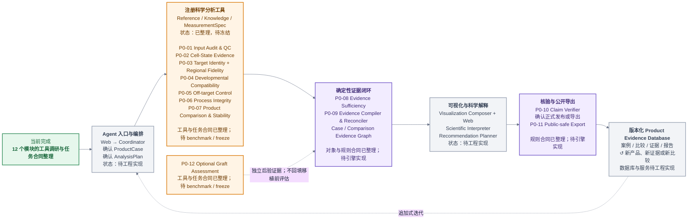

# BRIDGE P0 工具与工作流总览

**版本：** v0.1

**整理日期：** 2026-08-10
**当前阶段：** 工具调研与分析合同已整理，方法 benchmark、冻结与工程实现待开展

## 项目定位

BRIDGE 面向细胞治疗产品的转录组评估。PD hPSC-mDA 是首个完整应用实例，P0 以移植前 scRNA-seq 为主要输入，对产品身份、发育状态、完整组成和过程状态形成可追溯的多维证据画像。

P0 支持产品之间的条件化比较、异常解释、证据缺口识别和补充验证建议。可选 graft 数据进入独立后验分析，不回填移植前评估结果。

## 当前结论

- 已完成 12 个 P0/可选 graft 模块的工具调研和任务合同整理。
- 当前工具目录覆盖 396 个去重后的 `tool × capability` 条目。
- 五个移植前核心科学域尚未建立正式指数，当前以 raw metrics、证据状态和不确定性为主。
- P0 不生成综合总分、绝对产品排名、临床疗效、安全性、potency 或 GMP 放行结论。
- 正式运行前仍需完成方法 benchmark、reference 与 prior 冻结、MeasurementSpec 和 ScoreContract 验证。

## P0 主工作流

> 输入审计与 QC → Cell-State Evidence → 五个科学域 → 产品比较与稳定性 → 证据充分性 → Evidence Graph → Claim Verifier → Public-safe Export

五个核心科学域包括：

1. Target Identity
2. Regional Fidelity
3. Developmental Compatibility
4. Off-target Control
5. Process Integrity

Optional Graft Assessment 与移植前主流程并行，仅在用户提供 graft 数据时启用。

*图 1. BRIDGE Agent 架构与 P0 工具整理进度。颜色表示下一阶段；不代表方法 benchmark、正式评分或系统工程实现已经完成。*

---

## 一、输入与细胞状态基础层

### P0-01 Input Audit & QC

- **目标：** 确认输入是否满足后续分析要求，生成可追溯的 QC 视图。
- **主要输入：** 表达对象、样本层级信息；raw droplet 数据为可选输入。
- **核心工具：** BRIDGE Case Validator、AnnData/Scanpy、Scrublet；cell calling、ambient RNA 和 R 工具按输入条件启用。
- **主要输出：** `QCReadinessProfile`、`all_cells_view`、`eligible_cells_view` 和 `sensitivity_views`。
- **环境需求：** Python 单细胞核心环境；raw droplet 与 R 工具按需隔离。
- **当前状态：** 候选工具已整理，待验证和冻结。

### P0-02 Cell-State Evidence / Annotation

- **目标：** 围绕团队内部腹侧中脑标签体系，形成多方法细胞状态证据、prediction set、soft assignment 和 unknown。
- **主要输入：** QC 合格表达对象、内部 annotation、reference 和标签层级。
- **核心工具：** marker/program、reference correlation、CellTypist、SingleR/scmap、reference mapping、open-set 和连续身份方法。
- **主要输出：** `CellStateEvidence`、soft assignment、prediction set、方法分歧和 unknown reason。
- **环境需求：** Python 单细胞核心环境；R、ontology、open-set 和模型工具按需隔离。
- **当前状态：** 方法目录完成，待 source/lab/modality holdout benchmark。

---

## 二、移植前核心科学域

### P0-03 Target Identity & Regional Fidelity

- **目标：** 分别评估目标细胞身份和腹侧中脑区域支持。
- **主要输入：** `CellStateEvidence`、`ProductDefinitionCard`、发育 reference 和空间 reference。
- **核心工具：** soft composition、marker/program、pseudobulk correlation、层级区域映射和空间投射。
- **主要输出：** `TargetIdentityProfile`、`RegionalFidelityProfile` 和 `SpatialReferenceProjectionProfile`。
- **环境需求：** Python 单细胞核心环境；存在空间输入时启用空间组学环境。
- **当前状态：** 工具已整理，正式指数尚未设计。

### P0-04 Developmental Compatibility

- **目标：** 评估产品与研究者确认发育窗口之间的转录组相容性。
- **主要输入：** `CellStateEvidence`、`DevelopmentWindowSpec`、真实 D/Stage 和可选时间序列。
- **核心工具：** 阶段 soft composition、pseudobulk reference-stage support、ordinal mapping 和 sample-level time trend；轨迹方法作为条件性证据。
- **主要输出：** `DevelopmentalCompatibilityProfile` 和可选 `LineageCalibrationRecord`。
- **环境需求：** Python 单细胞核心环境；R/Bioconductor、轨迹与 velocity 环境按需启用。
- **当前状态：** 工具已整理，正式指数尚未设计。

### P0-05 Off-target Control

- **目标：** 描述完整制剂中的非目标成分、known off-target、unknown/OOD 和稀有状态检出能力。
- **主要输入：** `CellStateEvidence`、state-role evidence 和全部 eligible product cells。
- **核心工具：** role-aware soft composition、bootstrap、OOD/open-set、rare-state LOD；组成模型按独立重复条件启用。
- **主要输出：** `OffTargetControlProfile`，包括组成、unknown reason、OOD 和检测边界。
- **环境需求：** Python 单细胞核心环境；R/Bioconductor、Bayesian 与 open-set 工具按需隔离。
- **当前状态：** 工具已整理，正式指数尚未设计。

### P0-06 Process Integrity

- **目标：** 评估阶段条件化的增殖、应激、缺氧、UPR、凋亡和残余多能性等过程状态。
- **主要输入：** 表达对象、`CellStateEvidence`、目标阶段和 `ProtocolIR` metadata。
- **核心工具：** UCell、decoupler、Scanpy program scoring、pseudobulk 复核、cell-cycle 和 rare-state LOD；CNV 仅作 shadow 通道。
- **主要输出：** `ProcessIntegrityProfile` 和 `TranscriptomicReviewFlag`。
- **环境需求：** Python 单细胞核心环境；R/Bioconductor 与 CNV 工具按需隔离。
- **当前状态：** 工具已整理，正式指数尚未设计。

---

## 三、产品比较与证据闭环

### P0-07 Product Comparison & Stability

- **目标：** 在可比合同下比较不同产品、方案、时间点和 batch/lot/preparation 的稳定性。
- **主要输入：** 多个冻结的 `ProductEvidenceObject`、replicate map 和共同分析合同。
- **核心工具：** effect size 与区间、组成模型、sample-level pseudobulk、mixed models 和 integration sensitivity。
- **主要输出：** `ComparisonRecord` 和 `ComparisonEvidenceGraph`。
- **环境需求：** Python 单细胞核心环境；R/Bioconductor、Bayesian 与 integration benchmark 按需隔离。
- **当前状态：** 工具已整理；不生成综合产品排名。

### P0-08 Evidence Sufficiency

- **目标：** 确定性整合 Data Readiness、Model Robustness 和 Prior Applicability，判断每个域的证据是否足以解释。
- **主要输入：** QC、域级结果、benchmark、敏感性分析、reference 和 prior 版本。
- **核心工具：** BRIDGE deterministic gate、Pydantic 和 JSON Schema。
- **主要输出：** `EvidenceSufficiencyProfile` 和案例级域状态摘要。
- **环境需求：** Evidence 与报告治理环境。
- **当前状态：** 证据合同已整理，规则引擎待实现。

### P0-09 Evidence Compiler & Reconciler

- **目标：** 将分析结果编译为原子 Evidence Records，构建 Evidence Graph，并按冻结规则协调支持、冲突和缺失证据。
- **主要输入：** `MeasurementResult`、`ToolRun`、分析合同、reference/prior 和 artifact version。
- **核心工具：** JSON/Parquet、LadybugDB、NetworkX 和 BRIDGE deterministic reconciler。
- **主要输出：** `EvidenceRecordSet`、`CaseEvidenceGraph` 和 `ComparisonEvidenceGraph`。
- **环境需求：** Evidence 与报告治理环境。
- **当前状态：** 对象与图合同已整理，待实现。

### P0-10 Claim Verifier

- **目标：** 核验报告中的数字、Evidence ID、状态、图表、措辞和发布资格。
- **主要输入：** `ReportDraft`、`ClaimBlock`、`ValueBinding`、policy 和 Evidence Graph。
- **核心工具：** deterministic verifier、Pydantic/JSON Schema、Markdown/Jinja 和双语规则；LLM 仅负责语义复核。
- **主要输出：** `ClaimVerificationResult` 和 `VerifiedReport`。
- **环境需求：** Evidence 与报告治理环境；正式发布时增加 Web 渲染与验证环境。
- **当前状态：** 核验合同已整理，待实现。

### P0-11 Public-safe Export

- **目标：** 从通过 Claim Verifier 的报告生成公开字段白名单候选包。
- **主要输入：** eligible `VerifiedReport`、allowlist policy 和公开图表 payload。
- **核心工具：** allowlist projection、regex、Pillow/XML、hash/zip；辅助扫描器作为第二道检查。
- **主要输出：** `PublicSafeReport` 和带 manifest/hash 的候选发布包。
- **环境需求：** Evidence 与报告治理环境；正式发布时增加 Web、文件检查和辅助扫描环境。
- **当前状态：** 导出合同已整理，待实现。

---

## 四、可选移植后分析

### P0-12 Optional Graft Assessment

- **目标：** 对移植后 graft 进行独立的组成、mDA reference support、成熟状态和稳定性分析。
- **主要输入：** 可选 `GraftCase`、graft scRNA/snRNA、animal/timepoint 和 preparation linkage metadata。
- **核心工具：** graft validator、species/QC、cell-state ensemble、soft composition 和 mDA reference mapping。
- **主要输出：** `GraftAssessment` 和可选 `PreparationGraftAssociationRecord`。
- **环境需求：** Python 单细胞核心环境；R/Bioconductor、混合物种与 lineage 工具按需隔离。
- **当前状态：** 可选模块；当前数据主要支持描述性分析。

---

## 五、运行环境需求

| 环境类型 | 必备能力 | 适用任务 | 启用条件 |
|---|---|---|---|
| Python 单细胞核心环境 | AnnData/Scanpy、统计建模、常规可视化和注册 Python 工具 | P0-01 至 P0-07；P0-12 主流程 | 默认需要 |
| Evidence 与报告治理环境 | schema 校验、Evidence Graph、规则引擎、报告渲染和结构化导出 | P0-08 至 P0-11 | 端到端闭环需要 |
| R/Bioconductor 方法环境 | R 注释、组成比较、pseudobulk、混合模型和独立 benchmark | 多方法 benchmark 与正式 R 通道 | 条件启用 |
| Web 渲染与发布验证环境 | 浏览器渲染、响应式检查、图表与公开文件验证 | P0-10、P0-11 | 正式发布前启用 |
| 空间组学环境 | 空间对象、区域定位、reference 投射和空间可视化 | P0-03 及空间正交证据 | 有空间输入时启用 |
| 轨迹与 velocity 环境 | 轨迹、方向性、velocity 和 optimal transport | P0-04 及部分校准任务 | 输入满足 MeasurementSpec 时启用 |
| Agent 与 LLM 运行环境 | 对话编排、受控检索和语义复核 | P0-10 及未来 Web Agent | 条件启用，与确定性计算分离 |
| 工具专用隔离环境 | raw droplet、Bayesian/JAX、CNV、混合物种、lineage、基础模型和 competitor reproduction | 对应条件工具 | 按 AnalysisPlan 建立 |

具体依赖版本和 lock file 在工具进入 benchmark 前冻结。

## 六、共用拒答与验证规则

1. 缺少必要 metadata、分母、reference、`MeasurementSpec` 或适用输入时，返回 `unavailable` 或 `not_assessed`，不补值。
2. `negative`、`missing`、`unknown`、`unavailable` 和 `alert` 分开记录；零观测不等于不存在。
3. 细胞不能充当生物学重复；重复不足时降级为 `descriptive_only` 或 `not_estimable`。
4. 正式结果只使用冻结工具、reference、prior 和合同；candidate、shadow 与 exploratory 结果不进入正式结论。
5. 同一 evidence family 先去重，不按工具数量投票，也不临时选择最有利方法。
6. 方法需接受 source/lab/modality holdout、下采样、reference/preprocessing sensitivity 和 OOD/拒答测试。
7. 报告不输出临床疗效、安全性、potency、GMP 放行、绝对产品排名或全局最佳收获日结论。

## 七、当前能力边界与下一步

### 当前可形成的结果

- 对移植前 scRNA-seq 建立输入质量、细胞状态、目标身份、区域身份、发育相容性、非目标组成和过程状态证据画像。
- 在产品定义、assay、sampling context 和分析合同一致时，开展多产品、多批次和多时间点的条件化比较。
- 区分生物学低支持、证据缺失、unknown/OOD、技术不可判定和需要复核的转录信号。
- 将分析结果、知识来源、冲突、缺失和报告结论连接到可追溯的 Evidence Graph。
- 在提供明确 linkage 时，对 graft 进行独立描述性分析和 preparation-graft 证据关联。

### 尚未建立的能力

- 五个核心科学域尚未形成经过独立验证的正式指数。
- 当前缺少疗效、安全性和功能真值，无法训练或验证临床结局预测模型。
- 当前结果不能替代 potency assay、基因组稳定性检测、动物实验或 GMP 放行检测。
- 现阶段不学习全局最佳收获时间，也不从 graft 结果反推移植前产品评分。

### 下一步工作

1. 冻结 ProductDefinitionCard、样本层级、MeasurementSpec、reference 和 prior snapshot。
2. 对候选方法开展 source、lab、donor 和 modality holdout benchmark，并验证 OOD、下采样和 reference sensitivity。
3. 为通过 benchmark 的工具冻结版本、参数、输入合同、输出合同和失败条件。
4. 实现 Evidence Sufficiency、Evidence Compiler、Claim Verifier 和 Public-safe Export 的确定性闭环。
5. 在 raw metrics 和证据门控稳定后，再设计并验证五个核心域的正式指数。
