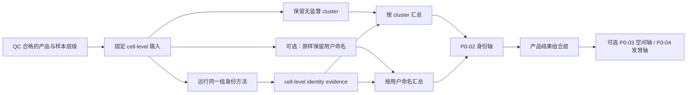

# BRIDGE P0 Cell-State Evidence 任务卡

| 字段 | 内容 |
| --- | --- |
| Task ID | `TASK-CELL-STATE-v0.1` |
| 文档版本 | `0.2-draft` |
| 日期 | 2026-08-31 |
| 状态 | `candidate` |
| 适用范围 | 移植前产品 scRNA-seq 为首版主路径；移植前 snRNA 仅作条件性跨模态分析，移植后 graft snRNA 由 P0-12 独立评估 |
| Annotation snapshot | `BRIDGE-PD-vMB-ANNOTATION-v0.1-draft` |
| 主要输出 | `CellStateEvidenceProfile` |
| 当前实现 | P0-02 v0.4.9 可执行 shadow baseline；科学冻结合同与 pilot harness 已建立 |

## 1. 任务目标

本任务先保留待评产品的观测分组，再使用团队已有的人腹侧中脑 annotation 和
reference 解释各分组与体内细胞身份的对应关系，并记录 prediction set、
unknown/OOD 与方法分歧。用户没有提供命名时以 QC 后的 cluster 为默认展示单位；
用户提供命名时原样保留该命名，并与 cluster 及 BRIDGE reference interpretation
并列展示。P0-02 只向产品结果组合层提供身份轴；发育阶段和空间对应分别由 P0-04
与 P0-03 的独立结果产生，缺少时显示 `not_assessed`。

P0 不预设某一种注释方法更优。候选方法先按相同标签、reference、holdout 和输出合同进行 benchmark，再冻结可用于正式分析的方法组合。Cell-State 结果只表示转录组证据，不直接表示临床疗效、安全性、potency 或放行结论。

## 2. 内部 Annotation

### 2.1 使用原则

- BRIDGE 生成的 reference interpretation 使用 BRIDGE 内部名称；用户提供的命名
  原样显示并记录 provenance，不被内部名称静默覆盖。
- 每个产品至少保留一套 QC 后 cluster 分组。用户命名是可选的第二套分组，不等于
  BRIDGE 已确认的细胞身份。
- CL、UBERON、HsapDv 和 GO 只建立 `exact`、`broader`、`narrower`、`related` 或 `unmapped` crosswalk，不覆盖内部名称。
- 每个标签记录来源、人工注释、标签迁移、人工协调、派生子集或模型预测等 provenance。
- 当前标签均为 `freeze_required`，完成生物学定义、marker、父子关系和审核记录后才能冻结。

### 2.2 当前标签层级

| 层级 | 来源 | 规模 | 当前角色 | 状态 |
| --- | --- | ---: | --- | --- |
| L1 broad `cell_type` | 团队统一 vocabulary；运行时按 source-specific reference 分开支持 | 18 类 | P0 shadow 候选 | `freeze_required` |
| L2 RG/Nb-derived states | `REF-CHEN-RGNB-v1` | 15,095 cells；14 类 | P0 正式候选 | `freeze_required` |
| L3 neurogenesis subsubtypes | `REF-CHEN-NEUROGENESIS-SUBSUB-v1-draft` | 77,382 cells；16 类 | 细粒度候选 | `shadow` |

L1 包含：`Astrocyte`、`Endothelial_Cell`、`Fibroblast`、`Glioblast`、`Immune_Cell`、`Neuroblast`、`Neuron_ChAT`、`Neuron_DA`、`Neuron_GABA`、`Neuron_Glut`、`Neuron_Glut_GABA`、`Neuron_OMTN`、`Neuron_Sero`、`OPC`、`Oligo`、`Pericyte`、`Radial_Glia`、`Smooth_Muscle`。

L2 包含：`RG_mFP`、`RG_mBMP`、`RG_mBIP`、`RG_dHyp`、`RG_dTha`、`Nb_mFP`、`Nb_mBMP`、`Nb_mBIP`、`Nb_mAP`、`Nb_dHyp`、`Nb_dTha`、`IPC_m1`、`IPC_m2`、`Pericyte`。

L3 包含：`RG_mFP`、`RG_mBMP`、`RG_mBIP`、`Nb_mFP`、`Nb_mBMP`、`Nb_mBIP`、`Neuron_DA`、`Neuron_Glut`、`Neuron_Glut_H`、`Neuron_Glut_L`、`Neuron_Glut_N`、`Neuron_Glut_P`、`Neuron_Glut_S`、`Neuron_Glut_GABA`、`Neuron_GABA`、`Neuron_GABA_O`。

`Neuron_Chat` 已统一为 `Neuron_ChAT`。首版 scRNA 中 `Neuron_ChAT` 和 `Neuron_Glut_GABA` 无观测，保持 `unavailable`；另有 303 个普通 broad/refined 层级冲突和 25 个独立的 `Radial_Glia -> Pericyte` 冲突（合计 328）被排除并保留审计。

## 3. Reference Inventory

| Reference ID | assay 与范围 | 规模 | 主要用途 | 限制 |
| --- | --- | ---: | --- | --- |
| `REF-CHEN-VMB-SC-v1` | scRNA-seq；GW7/8/9/12/16/20；人腹侧中脑 | 61,455 | 移植前细胞身份、早期区域、祖细胞及 target/adjacent evidence 的首要 reference | 与 snRNA 不是配对纵向数据；样本、标签和预处理版本仍需审核 |
| `REF-LEGACY-STEP1-FULL-v1` | whole-cell scRNA；本组旧版 63,033 + Braun 2023 1,548,209 + Zeng 2023 400,141 | 2,011,383 | 移植前全脑背景、broad identity、区域和 off-axis source context | 含本组细胞，不能与本组 reference 重复计为独立来源；parent manifest、标签与 preprocessing 待核对 |
| `REF-SPATIAL-HEB58-v1` | Visium HD；GW7；同一胚胎的 section 2/9 | 385,361 segmented profiles | 当前 20 个空间工作标签的 candidate label-program lookup 与正 marker supporting-expression QA | 两张切片不是两个生物重复；初始标签迁移依赖本组单细胞 reference；anti-marker 和人工 confidence 未记录；不构成 calibration、空间定位或独立身份验证 |
| `REF-CHEN-VMB-SN-v1` | snRNA-seq；GW14/16/18/20/24/25；人腹侧中脑 | 87,467 | 用户提供移植后 graft snRNA 时的 assay-matched broad/neurogenesis reference | 不进入移植前默认流程；与胎龄耦合且与 scRNA 不是配对数据 |
| `REF-CHEN-VMB-COMBINED-v1` | scRNA + snRNA 派生对象；GW7-GW25 | 148,922 | ontology 与跨模态 sensitivity；向 P0-04 提供发育路径/分支候选 reference | source 对象的并集，不是移植前细胞身份主 reference，也不进入独立来源共识 |
| `REF-CHEN-RGNB-v1` | combined 的 RG/Nb 派生子集 | 15,095 | L2 ontology 与 sensitivity | 移植前正式使用前需生成或确认 scRNA-only profile；父子层级待人工复核 |
| `REF-CHEN-NEUROGENESIS-v1` | combined 的 neurogenesis 派生子集 | 83,017 | 发育路径、分支方向与 modality sensitivity 候选 | modality/age 不平衡；不是移植前细胞身份默认 reference，也不代表 causal lineage truth |
| `REF-CHEN-NEUROGENESIS-SUBSUB-v1-draft` | neurogenesis 的 vMB 派生子集 | 77,382 | L3 shadow evidence | 模型版本和命名依据待冻结 |
| `REF-LAMANNO-2016-v1` | scRNA-seq；PCW6-11；人胎腹侧中脑 | 1,977 | scRNA 小型独立 VM primary source | 平台较旧、样本量有限 |
| `REF-BIRTELE-v1` | 人胎腹侧中脑 scRNA 与原代培养；6-11 周 post-conception | 13 个 GEO samples；processed CSV 可用 | external-source VM reference 候选 | 转换器及验证过的 conversion manifest 已建立；raw reads 因隐私不可用；资产仍为 `conditionally_approved_source_holdout` / `biological_review_in_progress`，不构成 state 或 method freeze |
| `REF-BRAUN-2023-v1` | scRNA-seq；PCW5-14；第一孕期全脑 | 1,548,209 | 全脑区域与 off-axis 背景 | 不能替代腹侧中脑产品定义 |
| `REF-ZENG-2023-v1` | scRNA-seq；PCW3-12；全胚、头和脑 | 400,141 | 早期发育和 OOD 背景 | 本地统一标签仍需冻结 |

`REF-CHEN-VMB-SC-v1` 与 `REF-LEGACY-STEP1-FULL-v1` 构成移植前细胞身份
reference 的两个互补 context：本组腹侧中脑细粒度状态，以及公开数据整合后的
broad/off-axis 背景。`REF-SPATIAL-HEB58-v1` 另作依赖当前空间工作标签的
candidate label-program lookup / reference QA，不进入来源 × 状态支持矩阵，也不按
“reference 数量”参与投票。
`REF-CHEN-VMB-SN-v1` 作为细胞身份 reference 主要服务于用户提供的移植后 graft
snRNA，并由 P0-12 产生独立结果；它不因覆盖更晚胎龄而自动提高移植前产品证据。
scRNA 与 snRNA 的整合对象可由 P0-04 单独用于候选发育路径分析，但不进入本模块
的分类共识。

`source`、`derived`、`holdout` 和 `competitor` 必须分别登记。查询必须声明 `source_family_id`，运行时排除同 source-family reference；派生对象不能与父对象重复计数，同一 source family 的细胞不能随机拆分后充当外部验证。

## 4. 分析流程

当前可执行 baseline 固定为两条互补通道：source-specific pseudobulk
Spearman/cosine support，以及版本化 marker/program evidence。移植前主路径优先
使用本组腹侧中脑 scRNA，再以 Chen + Braun + Zeng 的整合 scRNA 检查 broad、
regional 与 off-axis context，并把空间 reference 作为依赖当前工作标签的候选
label-program lookup 层。它们
分别保存，不转换为概率、不按工具数投票，也不设置未经验证的 OOD 阈值。这里的
pseudobulk correlation 是 sample-by-label reference similarity summary，不是
replicate-aware differential-expression inference，不输出 DE effect 或 FDR。
scRNA 与 snRNA 使用独立 `MeasurementSpec`；Chen combined 对象不进入细胞身份
共识，只向 P0-04 提供经分模态验证的发育路径候选 reference；graft snRNA 则转交
P0-12。所有 reference 解释都附着到显式的 grouping，不替换 cluster 或用户命名。

1. 读取 `all_cells_view`、`eligible_cells_view`、样本层级和 assay/specimen，并绑定
   QC 后的 cluster；若用户提供命名，另行记录其原始值和 provenance。
2. 用户命名只改变展示聚合，不改变 cell-level 输入、方法、reference、随机种子或
   identity inference；生成“用户命名 × cluster”交叉表时不得据此自动改名。
3. 读取 annotation snapshot、reference snapshot 和 ProductDefinitionCard。
4. 运行预先注册的身份方法组合，保留每种工具原生的 probability、score、distance、
   weight、label 和 uncertainty 语义；未校准值不得改称概率。
5. 开放集模块生成 prediction set 和 unknown reason；连续身份模块同时保存权重、
   重建残差、reference distance 和区间。
6. Evidence Graph 按共享 marker、reference、训练数据和算法家族去重，保留方法分歧，
   不用多数票掩盖冲突。
7. 分别按 cluster 和可选用户命名汇总相同的 cell-level identity evidence；产品结果
   组合层仅在收到 P0-03/P0-04 typed result 时增加空间/发育轴。

## 5. 方法目录与首轮短名单

完整方法级输入、输出、许可、维护状态、环境和官方来源记录在 tracked
[knowledge catalog](../../knowledge/catalog/README.md)；运行时使用其不可变 packaged snapshot。仓库外归档工作簿不是当前合同。目录覆盖：

| 方法家族 | 目录中的代表方法 | 首轮安排 |
| --- | --- | --- |
| Marker/program | 人工 marker、UCell、AUCell、decoupler、ScType、CellAssign、Garnett、SCSA、scSorter | 内部 program + UCell/decoupler 进入首轮 |
| 传统监督与相似度 | pseudobulk correlation、SingleR、scmap、CellTypist、CHETAH、scPred、scClassify、SciBet、scNym | correlation、CellTypist、SingleR/scmap 进入首轮 |
| Reference mapping | Seurat MapQuery、Symphony、scANVI、scArches、scPoli、Scanpy ingest | scANVI 与 Symphony 进入首轮 |
| 标签协调与共识 | CellHint、scHPL、scTriangulate、popV | popV 作为编排与共识 benchmark；共享证据先去重 |
| 连续与混合身份 | NNLS/simplex、cNMF、topic model、ACTIONet、Capybara、BRIDGE independent engine | 透明 NNLS 与 BRIDGE independent engine 进入首轮，cNMF 作 sensitivity |
| 公开预印本流程复现 | CapybaraBrain pinned-profile candidates | 独立复现 93-program post-normalized NNLS reconstruction coefficients 与六个 repository enum labels；只作 competitor benchmark，不称概率、胎龄、轨迹、OOD 或空间映射 |
| 开放集与不确定性 | OnClass、scConform、Lopez-De-Castro conformal annotator、BRIDGE OOD rules | energy score 为 OOD 主通道、kNN distance 为 sensitivity；scConform 只评测预注册 base classifier 的 prediction-set coverage |
| 基础模型 | scGPT、Geneformer、UCE、TOSICA、SCimilarity、scFoundation、CellFM、CellPLM、scPRINT、Nicheformer | TOSICA、scGPT、SCimilarity 先作 `shadow` |
| 整合敏感性 | no-integration、Harmony、Scanorama、scVI/scANVI、CellHint、LIGER、BBKNN、ComBat、STACAS、Seurat RPCA、fastMNN | no-integration、Harmony、scVI；scIB/scib-metrics 负责诊断 |

本次 External-Source Freeze Candidate 将 CellTypist 作为唯一 inductive base classifier，correlation/marker 作为 sensitivity，energy score 作为 primary OOD、kNN distance 作为 sensitivity，scANVI 仅作为 transductive benchmark，scConform 仅作为 coverage layer。scConform 不构成独立 standalone OOD detector，也不增加一个独立生物 evidence family。Lopez-De-Castro 等人的 conformal annotator 是另一项方法，不得与 scConform 合并引用。复杂模型必须与透明基线比较；Agent 不能在看到待评产品结果后临时选择最有利的方法。

## 6. Studer/CapybaraBrain/HDNA artifact 隔离

### Track A：pinned-profile competitor reproduction

- 固定 bioRxiv v1、官方仓库 commit
  `de336ff04014d6066b0d5ad2ad033e58cfcd8c66`、环境、输入和 checksum。
- 论文 Methods 写 `TOPK=20, alpha=0.05, tau=0.15`，参数 benchmark 与 pinned
  README 写 `20/.005/.15`，Step 3 代码默认又是 `.05/.10`；`alpha` 是经验
  tail-score cutoff，不是 p 值或 FDR。因此在查看产品结果前冻结完整参数向量：
  `TOPK`、`alpha`、`min_weight`、`hybrid_rule`、`max_extra_ids`、
  `ratio_tie`、`p_delta`、`p_frac`、`min_prop`、`resolution`、
  `hybrid_MV`、`partner_prop`、`snap_to_major`，以及输入变换、
  marker/reference/lineage-map hash；不同固定 profile 并列报告，不事后选择。
- CapybaraBrain 依次保留 per-cell 93-program post-normalized NNLS reconstruction
  coefficients、经验阈值后的 binary programs、neighbourhood majority-vote 结果及
  `discrete/hybrid/transitioning/unknown/unassigned/heterogeneous` repository
  enum labels。它们不是六个彼此独立且全部可达的生物状态：标准路径中
  `unknown` 与 `unassigned` 可来自同一“无 program 通过”条件，
  `transitioning` 取决于人工 lineage map，不证明发育轨迹或命运转变。系数不解释
  为 calibrated probability、posterior 或 similarity。
- 分别登记 fetal atlas reference、使用 93 个 programs 的 CapybaraBrain method、包含 19 项研究和 641,539 个体外细胞的 HDNA atlas，以及单独的 PCA/kNN mapping notebook；不得把这些 artifact 合并为一个来源或一个方法。
- 原始 reference、marker、标签、lineage map、阈值和输出仅进入 `competitor_reproduction` namespace。
- 缺失完整核心配置时标记 `blocked_by_missing_artifact`。缺 CellTypist model
  只阻断最终 A9 refinement/agreement；缺 integration embedding 只阻断 HDNA
  集成展示，不阻断核心 NNLS coefficients 和 enum-state 计算。没有单独的
  CellTypist agreement artifact 时，不宣称复现了预印本最终 A9 决策。

### Track B：BRIDGE independent adaptation

- 可以评测 CellHint、CellTypist、NNLS、连续程序分解等公开的方法类型。
- 必须使用 BRIDGE 自有标签、reference、独立 marker、独立实现及 source/donor holdout calibration。
- 连续身份输出增加 reconstruction residual、reference distance、prediction set、unknown reason 和 bootstrap interval。
- Track A 的代码、atlas、marker、标签、lineage map、阈值和结果不得进入 BRIDGE 的 RAG、prior、训练、校准、调参或正式 Evidence Graph。

BRIDGE 的方法和评测合同冻结后，Track A 才能作为署名的外部 baseline 展示；sealed competitor test 不能反向修改当轮算法。fetal atlas、CapybaraBrain、HDNA 和 mapping notebook 互相存在方法与数据血缘，不计作 BRIDGE 的独立 external validation。BRIDGE 的独立方向是 source-aware open-world 产品评估及 exact-to-parent-to-unknown rejection。

## 7. 输入与输出合同

### 7.1 必需输入

- `all_cells_view` 与可形成时的 `eligible_cells_view`。
- 冻结的 count/expression view 及其矩阵语义。
- sample、preparation、lot、batch、timepoint 和 biological replicate 层级。
- assay/specimen：scRNA 或 snRNA、whole cell 或 nucleus。
- 至少一套 QC 后的无监督 cluster grouping；用户提供的命名为可选第二套 grouping。
- BRIDGE annotation、reference、ProductDefinitionCard、calibration 和 OOD snapshot。

缺少任一方法所需输入时只跳过该方法；不能从文件名推断样本关系，也不能把缺失证据记为 negative。
用户命名只作为带 provenance 的观测字段，不作为 reference truth、校准标签或方法选择依据；
运行记录必须包含 `user_label_role=display_grouping_only` 和
`used_as_model_input=false`。添加、删除或重命名该显示字段时，同一 observation 的
cell-level method output 必须逐字节相同或满足预注册数值容差。

### 7.2 `CellStateEvidenceProfile`

下列 grouping/组合轴字段是概念性下一版合同，不是当前 runtime V3 的可写字段。当前
V3 禁止未声明字段；正式接入必须先增加版本化 Schema 和迁移测试，不得静默扩展 sidecar。
`assessment_state`、`assignment_state`、OOD 状态与 `scientific_status` 相互独立，
例如“已运行但 unknown”不能写成“未运行”，candidate 也不能写成 approved。

| 字段 | 含义 |
| --- | --- |
| `grouping_provenance` | cluster 与可选用户命名的 grouping ID、来源、父 DataView、观测数和 observation-ID digest |
| `grouping_overlap` | 用户命名 × cluster 的计数、行/列比例、purity/entropy；只描述分组重叠 |
| `semantic_crosswalk` | 用户命名与 reference/ontology 的 `exact`、`broader`、`narrower`、`related` 或 `unmapped`；必须有方向明确的语义依据 |
| `bridge_state_id` | 内部状态 ID 与层级 |
| `prediction_set` | 一个或多个相容状态；允许空集合 |
| `assignment_state` | `assigned` / `ambiguous` / `unknown` / `unavailable` |
| `unknown_reason` | `reference_gap` / `method_conflict` / `biological_unresolved` / `technical_unavailable` |
| `method_evidence` | 各方法原始 probability、score、distance、weight 或 label，并附 `value_semantics` |
| `reference_correspondence` | P0-02 产生的 cell-identity 软对应；P0-03/P0-04 的空间与发育结果由产品结果组合层另行引用 |
| `calibration` | prediction-set coverage、set size 和适用性 |
| `method_disagreement` | 按独立 evidence family 汇总的方法分歧 |
| `composition` | target、adjacent、off-target、unknown 的比例、分母和区间 |
| `hybrid_identity` | 连续权重、残差及 discrete/hybrid/transitioning 候选；验证前为 `shadow` |
| `provenance` | tool、reference、annotation、environment、parameter 和 Evidence ID |

### 7.3 Additive V3 handoff

`CellStateEvidenceProfileV3` 是实际 P0-02 run 的附加 sidecar，不替换
v0.1 result。deployment-owned `BRIDGE_QC_PROFILE_CATALOG` 保留
`path`/`sha256` 指向 QC v1，并以 `structured_output_index_path` /
`structured_output_index_sha256` 指向一个真实 P0-01 run 的
`structured_output_index.json`。P0-02 从 index 解析并校验 QC V2、
biological-unit assignment 与 manifest，再核验 selected DataView 的
artifact checksum、矩阵语义、observation 数量、observation-ID digest
及 typed lineage 绑定，才生成 V3 sidecar。

V3 composition 当前只晋升 L1，因为 L2 的分母是层级 eligible subset，
尚无独立 content-addressed DataView。每行必须显式记录
`state_evidence_state`；source-specific 与 consensus-supported 正向行
在 v0.3 只能是 `candidate`，`assigned` 不属于本版枚举。
`source_conflict` 保持 `unresolved`，`unavailable` 保持
`unavailable`，不得作为正向组成证据。reconciliation 行必须完整分割
selected-view 分母，consensus 行必须与 reconciliation 的
`consensus_supported` 计数一致。

V3 另绑定 canonical MeasurementSpec model bytes 的 SHA-256。现有
artifact manifest 必须收录 V3 artifact 的 kind、SHA-256 与 byte size。
P0-02 在发布前和写出后都复核 QC v1、indexed QC v2、assignment 与
manifest checksum；运行中替换任一 upstream artifact 均 fail closed。

若 catalog 没有 structured-index 字段，或 P0-01 合法输出中没有 typed
lineage，v0.1 运行保持成功，但 ToolRun warning 明确报告 V3 handoff
unavailable；不得从 v1 profile、文件名或上传 metadata 猜测
DataViewBinding。index 字段不完整、checksum 错误或 lineage/DataView
不匹配则 fail closed。P0-01 lineage 仅表示调用方声明，未获得生物学审核。

## 8. 运行环境

Cell-State 使用隔离的 Python 与 R 环境。环境间通过 checksummed sparse HDF5、Parquet/TSV 和 JSON manifest 交换结果。

| 环境 | 用途 | 当前状态 |
| --- | --- | --- |
| `ENV-CELLSTATE-PY-v0.1` | Scanpy、CellTypist、scVI/scANVI、透明 Python 基线和结果交换 | `health_check_passed`；data-free adapter health 已记录 |
| `ENV-CELLSTATE-BIOC-R46-v0.1` | SingleR、scmap、Symphony、UCell 和 scConform | `health_check_passed`；data-free adapter health 已记录 |

完整工程验收见 [Server reproducibility validation, 2026-08-12](../validation/server_reproducibility_20260812.md)。其他目录方法继续保持 `catalog_only`、`shadow` 或 `deferred`，需要时再建立独立环境合同。环境通过只表示依赖可重建和工具可加载，不表示方法已经通过科学验证。

## 9. Web 必备可视化

- 无用户命名时：cluster embedding 与组成、cluster × reference-state 软对应矩阵，
  以及每个 cluster 的 prediction set、unknown/OOD 和身份方法分歧。
- 有用户命名时：用户原始命名视图、“用户命名 × cluster”交叉表、用户命名 ×
  reference-state 软对应，以及同一命名内部的异质性；BRIDGE 不静默重命名，且两种
  展示模式必须聚合相同的 cell-level identity output。
- 产品结果组合层可显示 P0-03 空间轴与 P0-04 发育轴；没有对应 typed result 时明确
  显示 `not_assessed`，不得由 P0-02 的相关系数、标签或图形位置代填。
- 内部 L1/L2/L3 annotation hierarchy 与冻结状态。
- 移植前身份 reference 分面：本组 scRNA、Chen + Braun + Zeng 整合 scRNA，以及独立 external-source evidence；hEB58 candidate label-program lookup / reference QA 单独展示，不计作身份来源支持；单核 reference 不混入该图。
- 每种方法的 embedding overlay、prediction set 和 unknown reason；embedding 仅作探索，不作为身份依据。
- 方法一致性热图，并按 evidence family 标出共享依赖。
- holdout confusion matrix、层级错误、校准曲线和 prediction-set coverage。
- OOD dashboard、稀有状态 LOD 与失败原因。
- target/adjacent/off-target/unknown 组成及区间。
- 连续身份的 top1-top2 权重、残差和 hybrid 候选图。
- reference、preprocessing 和 integration sensitivity 图。
- 从图表下钻到 marker、distance、weight、冲突及 provenance 的 Evidence Graph。

所有正式图表绑定 Evidence ID、分母、单位、输入和方法版本；未注册图表保持 `exploratory`。
图例和表格必须明确区分 calibrated probability、mixture weight、similarity、
distance 与 not assessed；任何 embedding 都只作探索性分组展示，不作为身份依据。

## 10. Benchmark 与冻结要求

| 验证项 | 要求 |
| --- | --- |
| Holdout | 按 study/source/lab/donor/modality 拆分；禁止随机拆同来源细胞冒充外部验证 |
| 层级预测 | 报告 hierarchical accuracy、macro-F1、层级错误和产品组成误差 |
| 校准与拒答 | 报告 calibration、prediction-set coverage/set size、leave-one-state-out 和真实 OOD 检出 |
| 稀有状态 | 使用 sample-preserving downsampling、spike-in 和 LOD/UCB；低于 LOD 时只能说不能排除 |
| 连续身份 | 使用人工混合与伪混合，评测 weight error、residual、discrete/hybrid/transitioning/unknown |
| 稳定性 | 运行 reference swap、preprocessing swap、no-integration/integration、随机种子和资源测试 |
| 基础模型 | 审计预训练数据重叠、权重许可、基因词表和数据出境，并与简单基线公平比较 |
| Competitor isolation | Track A 到内部 marker、calibration、RAG 和正式 Evidence Graph 的数据流必须为零 |

每个状态轴单独决定是否冻结方法。若没有方法达到预注册标准，该轴返回 `unavailable`；其余轴仍可继续。正式晋升还需通过许可、环境 fixture、Evidence Graph 去重和 claim review。

当前 Review Cards 和 Release Manifest 均未签字。七个重点 L2 仍待生物学审核；其中 `Nb_mFP`、`Nb_mBMP` 和 `Nb_mAP` 缺少独立 marker 与边界证据，当前不具备晋升条件。locked source/OOD 在签署 `FreezeGateSpec` 前不得打开。

## 11. 主要官方来源

- [UCell](https://github.com/carmonalab/UCell)、[decoupler](https://github.com/scverse/decoupler)、[CellAssign](https://irrationone.github.io/cellassign/)
- [SingleR](https://bioconductor.org/packages/SingleR/)、[scmap](https://bioconductor.org/packages/scmap/)、[CellTypist](https://github.com/Teichlab/celltypist)、[CHETAH](https://bioconductor.org/packages/CHETAH/)
- [Seurat mapping](https://satijalab.org/seurat/articles/integration_mapping.html)、[Symphony](https://github.com/immunogenomics/symphony)、[scVI/scANVI](https://docs.scvi-tools.org/en/stable/api/reference/scvi.model.SCANVI.html)、[scArches](https://github.com/theislab/scarches)
- [CellHint](https://cellhint.readthedocs.io/)、[popV](https://github.com/YosefLab/popV)、[OnClass](https://github.com/wangshenguiuc/OnClass)
- scConform：[arXiv 2410.23786](https://arxiv.org/abs/2410.23786)、[JRSS C DOI 10.1093/jrsssc/qlag037](https://doi.org/10.1093/jrsssc/qlag037)、[Bioconductor](https://bioconductor.org/packages/scConform/)；仅作 prediction-set/hierarchical coverage calibration layer
- Lopez-De-Castro conformal annotator：[Bioinformatics DOI 10.1093/bioinformatics/btaf521](https://doi.org/10.1093/bioinformatics/btaf521)、[PMC12506889](https://pmc.ncbi.nlm.nih.gov/articles/PMC12506889/)；与 scConform 分开登记
- [Capybara](https://github.com/morris-lab/Capybara)、[cNMF](https://github.com/dylkot/cNMF)、[ACTIONet](https://github.com/shmohammadi86/ACTIONet)
- [scGPT](https://github.com/bowang-lab/scGPT)、[Geneformer](https://huggingface.co/ctheodoris/Geneformer)、[TOSICA](https://github.com/JackieHanLab/TOSICA)、[SCimilarity](https://github.com/Genentech/scimilarity)
- [scIB](https://github.com/theislab/scib)、[Scanpy ingest](https://scanpy.readthedocs.io/en/stable/generated/scanpy.tl.ingest.html)
- [Studer/Bocchi bioRxiv v1](https://www.biorxiv.org/content/10.64898/2026.06.19.733041v1)、[dopamine development portal](https://developmental.cellatlas.io/dopamine)、[CapybaraBrain repository](https://github.com/VittoriaDBocchi/CapybaraBrain)
