# BRIDGE P0 Claim Verifier 任务卡

| 字段 | 内容 |
| --- | --- |
| Task ID | `TASK-CLAIM-VERIFIER` |
| Version | `v0.1-candidate` |
| Date | 2026-08-14 |
| Verification unit | `report draft x claim block x policy snapshot` |
| Primary output | `ClaimVerificationResult` receipt |
| Current state | `candidate` |

P0-10 `v0.1.0` implements the structured deterministic path only. Its four
checksummed inputs are `ReportDraft`, a P0-09 Case graph manifest,
`ClaimPolicySpec` and
`StatementRegistry`. The supplied policy and statement objects must equal the
versions embedded in the packaged release contract. Free Markdown recovery,
LLM judgment, web/media rendering,
OCR and automatic export are not runtime inputs. The versioned method record is
[benchmark record](../validation/p0_10_claim_verifier_benchmark_v0.1.md); candidate methods do not
constitute a selected default.

## 1. 任务目标与边界

Claim Verifier 核验结构化报告内容是否忠实于 BRIDGE 已有证据、合同和发布规则。v0.1 检查数字、来源、状态语义、比较条件和禁止主张，并阻止不合格内容进入后续发布流程。

本模块回答：

- 报告中的每个可核查主张来自哪条 Evidence、Knowledge 或注册 Statement。
- 数字、单位、分母、区间和显示精度是否与来源对象逐字段一致。
- `negative`、`missing`、`unknown`、`unavailable` 和 `alert` 是否被正确解释。
- 已声明的描述性比较是否被写成推断性或因果性结论。
- 文本是否包含临床、放行、绝对排名、最佳阶段或其他禁止主张。
- 当前内容能否发布、是否需要人工复核，或必须阻止发布。

Claim Verifier 验证“报告与现有证据和策略一致”，不验证产品的临床疗效、安全性、真实功能或 GMP 合规性。它不计算生物指标、域分数或综合总分，也不修改上游 Evidence、图表或报告文本。

P0 覆盖中文、英文和中英混排。普通探索对话保持 `unverified`；正式回答、版本化报告、正式图表标题/图注和 Recommendation Cards 必须进入核验闭环。

## 2. 核验范围与内容模型

### 2.1 正式内容范围

| 内容 | P0 处理 |
| --- | --- |
| 内部正式报告 | 完整核验；允许内部逻辑 ID，不允许在正文显示服务器路径或原始受限 metadata |
| public-safe 候选 | 完整核验并输出导出资格；不在本模块执行脱敏或字段删除 |
| 产品比较报告 | 仅核验已写入 ClaimBlock 与 EvidenceRecord 的 comparison mode、数值和措辞 |
| 正式 Web 回答 | 转换为结构化 `ReportDraft` 后核验 |
| 图表标题、图注和说明 | v0.1 返回 `unavailable`；不接收图像、SVG 或网页 |
| Recommendation Card | v0.1 不接收；需后续独立合同 |
| 探索对话与探索图表 | 标记 `unverified/exploratory`，不得冒充正式输出 |

### 2.2 结构化优先

正式内容先生成 `ReportDraft`。v0.1 只自动接受包内模板可完整重建的英文单值
measurement claim，以及与包内 Statement Registry 逐字一致的边界声明；其他正文保留
为 `review_required`，由后续模块负责 Web、Markdown 或公开导出。

自由 Markdown 导入不属于 v0.1 运行接口。后续解析器恢复的 claim 即使加入，也只能先作为 candidate；所有可核查主张仍须补齐来源绑定并重新进入结构化核验。

任何人工或 Agent 文本修改都会改变 report hash，使旧核对回执失效。系统必须创建新版本并重新核验，不能在已核验对象上静默修改。

## 3. 输入与对象合同

### 3.1 v0.1 必要输入

- 一个带 canonical content hash 的 `ReportDraft`。
- 一个上游 P0-09 生成的 Case Evidence Graph manifest 及其同目录制品。
- 与包内 release contract 完全一致的活动 `ClaimPolicySpec`。
- 与包内 release contract 完全一致的 `StatementRegistry`。

四个入口对象均由 `StructuredInputRef` 提供绝对路径、schema、版本和 SHA-256；
P0-09 manifest 中的 hash、图结构和 EvidenceRecord 投影必须通过同一只读完整性检查。
ProductCase、ComparisonRecord、图表、Recommendation 或其他上游对象必须先被
编译为 EvidenceRecord；v0.1 不直接读取这些对象。策略或 Statement Registry 与包内
批准版本不一致时，在核验前返回 typed failure。schema、引用或 hash 错误同样进入
确定性失败，不从文件名或文本猜测关系。

### 3.2 ReportDraft

```text
report_id / report_version / content_hash
audience=internal_research|public_candidate / language=zh|en|mixed
evidence_record_set_ref / claim_policy_ref / statement_registry_ref
claim_blocks
renderer_id / renderer_version / created_at / authoring_channel
```

`ReportDraft` 是核验输入，不是已发布报告。`authoring_channel` 区分
deterministic renderer、human edit 和 imported draft；后两者始终需要人工复核。

### 3.3 ClaimBlock

```text
claim_id / claim_version / claim_ref / product_case_ref / claim_type
text / language / evidence_refs / statement_refs
value_bindings / reported_evidence_state / comparison_mode
authoring_channel
```

每个 `ClaimBlock` 只表达一个可核查主张。包含多个独立事实的句子必须拆分；方法、边界和固定免责声明使用版本化 Statement ID，不允许作为无来源自由文本绕过追溯要求。

### 3.4 ValueBinding

`ValueBinding` 至少保存：

```text
binding_id / source_evidence_ref / source_field
canonical_numeric_string / raw_unit / text_span
```

一个 binding 只绑定 EvidenceRecord 的一个数值字段；分母和区间端点若出现在文本中，
分别使用独立 binding。明确的 `text_span` 必须逐字等于包内规则生成的 canonical
十进制数和来源单位。v0.1 仅允许数值恒等呈现，不接受请求方提供的百分比、缩放或
舍入规则；不采用“足够接近”的浮点容差，也不允许任意数字后缀。

v0.1 不执行单位转换。未来只有注册转换表或审核后的 Pint unit registry 才能增加
转换能力；LLM 不参与数值、单位或舍入计算。

### 3.5 核验记录

| 对象 | 作用 |
| --- | --- |
| `ClaimPolicySpec` | 定义 claim 类型、必需来源、允许状态、禁止解释、规则严重度和适用受众 |
| `ClaimCheckRecord` | 保存 rule ID/version、目标 block/span、结果、severity、reason code、Evidence IDs 和可选 Statement ref |
| `ClaimVerificationResult` | 保存 ReportDraft ref/hash/受众、P0-09 graph ID/version/manifest hash、发布状态、唯一 checks、导出资格以及 benchmark/release-contract hash |

独立签字回执、`SemanticReviewRecord` 和 visualization check references 是后续候选，
未进入 v0.1 公开模型。ReportDraft 不能携带可改变发布状态的自我声明审核决定。

## 4. Claim Taxonomy 与追溯规则

| Claim 类型 | 必需来源 | 主要限制 |
| --- | --- | --- |
| `measurement_claim` | EvidenceRecord + MeasurementSpec | 数值、单位、分母和区间必须绑定 |
| `domain_interpretation` | Evidence IDs + sufficiency + reconciliation | 不得扩张为产品总体质量或临床结论 |
| `descriptive_comparison` | ComparisonRecord + Comparison Graph | 只报告方向、差异和区间，不使用推断性措辞 |
| `inferential_comparison` | inferential ComparisonRecord + frozen design | 必须满足独立重复、设计和模型合同 |
| `availability_claim` | EvidenceRequirement / sufficiency | 明确区分缺失、未评估和不可用 |
| `alert_claim` | active formal alert Evidence | 只称需复核的转录证据，不称安全风险已证实 |
| `prior_or_literature_claim` | KnowledgeRecord + frozen snapshot | 保留物种、assay、阶段和场景适用性 |
| `method_claim` | Tool/Algorithm/Validation Card | 安装成功不能写成科学验证通过 |
| `recommendation_hypothesis` | RecommendationCard + 支持/反对 Evidence | 最多三项；不得给未经验证的剂量或处理时序 |
| `graft_retrospective_claim` | graft-specific evidence + explicit linkage | 不回填移植前分数、阈值、训练标签或疗效结论 |
| `policy_or_boundary_statement` | StatementRegistry | 使用审核后的固定版本，不由 LLM 即兴改写 |
| `visualization_caption` | v0.1 不支持 | 不接收 `VisualizationArtifact`；图注和媒体核对留待独立合同 |

正式 claim 不得只绑定 artifact 文件路径。它必须引用语义对象和版本；artifact 仅作为 provenance。

## 5. 确定性核验流程

```mermaid
flowchart LR
    A["ReportDraft + policy snapshot"] --> B["Schema, version and hash"]
    B --> C["Claim and source binding"]
    C --> D["Numeric and unit identity fidelity"]
    D --> E["Evidence state and applicability"]
    E --> F["Comparison rules and unsupported-claim handling"]
    F --> G["Bilingual prohibited-claim rules"]
    G --> H["Complete package-owned reconstruction"]
    H --> I["Deterministic release aggregation"]
```



固定顺序如下：

1. 校验对象 schema、版本、hash 和引用完整性。
2. 核对每个可核查主张的 Evidence、Knowledge 或 Statement ID。
3. 核对数值、单位、分母和区间的恒等呈现。
4. 检查 EvidenceRecord 的 tier、lifecycle 和 applicability；sufficiency 与
   reconciliation 由已通过完整性校验的 P0-09 graph 继承，本模块不重新计算。
5. 检查状态语义和比较资格；未进入 v0.1 的 claim 类型不能自动通过。
6. 运行中英双语禁止主张和敏感措辞规则。
7. 用包内固定规则完整重建可自动核对的 ClaimBlock；其他正文保持
   `review_required`。
8. 按固定优先级聚合发布状态；ReportDraft 不能自行声明审核权限。LLM 语义复核为后续候选，不在 v0.1 中运行。

### 5.1 Hard blockers

- schema、hash、版本或必需引用错误。
- public candidate 的任一 ClaimBlock 缺少 formal、active、applicable Evidence。
- 数值、单位、分母、区间或恒等显示值不一致。
- 案例特异性主张缺少可用来源 ID。
- 引用跨案例、跨 graph scope、superseded、invalidated 或不适用证据。
- exploratory/shadow 证据被当作 formal 结论。
- 证据不足、`unstable` 或 `integration_sensitive` 被写成稳定定向结论。
- 描述性比较使用显著性、普遍优越或因果措辞。
- 临床疗效、安全性、validated potency、GMP 放行或绝对产品排名主张。
- graft 证据被回填为移植前产品结果。
- public candidate 含私有路径、用户名或 restricted metadata；内部 ID 的公开
  别名和字段白名单由 P0-11 处理。
- 核验后正文或绑定对象发生变化。

### 5.2 Review-required items

- 因果、最佳、显著改善、接近临床等隐含外推未被硬规则完全解析。
- 中文和英文版本的限定词、否定、范围或强度不一致。
- 文本与引用证据大体一致，但适用场景或主语边界存在歧义。
- 自由文本导入后有 candidate claim 尚待研究者确认映射。

非阻塞 warning 仅用于不改变科学语义的展示、可访问性或措辞问题。缺来源、数字错误和禁止主张不能降级为 warning。

## 6. 状态与语言语义

### 6.1 证据状态

| 来源状态 | 允许表述 | 禁止表述示例 |
| --- | --- | --- |
| `negative` | 在冻结定义和检出边界下未达到预注册信号 | 安全、合格、风险不存在 |
| `missing` | 没有该项测量或必要字段 | 检测为阴性、数值为 0 |
| `unknown` | 当前 reference 或方法无法解析 | 非目标细胞、失败细胞 |
| `unavailable` | 当前合同不允许生成该结果 | 得分低、产品差 |
| `alert` | 当前转录证据触发复核 | 已证实临床风险或致瘤性 |
| `observed` | 在当前数据中观测到并按合同量化 | 真实功能、因果机制已证实 |

另行保留 `measured`、`inferred` 和 `prior_only` 来源层级。先验知识不能写成当前产品已经测得的现象，转录推断不能写成真实蛋白、代谢通量或功能结果。

### 6.2 双语策略

中英文规则使用共享 semantic category 和独立词形/句式表。规则至少覆盖：

- 疗效、安全性、potency、放行和合格性。
- 最佳、绝对优劣、确定性、无风险和完全不存在。
- 因果、机制确认、真实功能、等效胎龄和全局最佳收获阶段。
- 推断统计、显著性、趋势和描述性差异的混用。
- “未检测到”与“没有检测”、“不支持”与“证明不存在”的混用。

简单禁用词命中只作为规则入口；系统必须结合 claim 类型、否定范围和固定 Statement 例外，避免把边界声明中的禁止词误判为违规主张。

## 7. 后续 LLM 候选与当前人工审核

v0.1 不调用 LLM。下面的 LLM 输入输出合同仅作为后续 benchmark 候选；在中英双语 benchmark、模型卡和失败边界通过审核前，不进入正式核对流程。

LLM 只接收：

```text
sanitized ClaimBlock
cited evidence or knowledge spans
ClaimPolicySpec subset
allowed/prohibited interpretation examples
deterministic check summary without private paths
```

LLM 只能返回结构化 flags：claim ID、文本 span、semantic category、支持/矛盾/歧义判断、理由和建议复核问题。它无权写入 Evidence Graph、修改数值、修改确定性结果或批准发布。

模型、provider、prompt、temperature、structured-output schema、输入 hash、输出 hash、延迟和错误均版本化。正式策略不依赖实时联网；新论文或实时检索不能改变当次结论。

未来若接入 LLM，其不可用状态不得改变当前确定性结果。若后续允许人工 reviewer
处理 review-only 规则，必须使用独立、带 checksum 的审核权限登记和签字回执；
ReportDraft 内的字段不能授予审核权限。当前 v0.1 对 review-only 命中始终保留
`review_required`。后续审核合同仍必须满足：

- 不能豁免 hard blocker。
- 不能修改原 ReportDraft；需要修改时创建新版本。
- 必须记录 claim ID、rule ID、reviewer role/ref、决定、理由和独立回执 hash。
- 同一人不能通过手工改写绕过重新核验。

## 8. 发布状态与输出合同

### 8.1 五状态聚合

| 状态 | 条件 | 发布行为 |
| --- | --- | --- |
| `not_assessed` | 尚未形成核验结果的保留状态；当前适配器不会用未批准或未激活策略产生该状态 | 不允许正式发布 |
| `release_blocked` | 至少一个确定性 blocker | 必须修复输入、证据或文本并生成新版本 |
| `review_required` | 无 blocker，但有不受支持的正文生成方式或人工映射待确认 | 等待授权 reviewer |
| `verified_with_warnings` | 必需检查通过，只剩非阻塞 warning | 可进入用户确认；warning 随报告保存 |
| `verified` | 必需检查全部通过且无 warning | 可进入用户确认 |

状态优先级固定为：`release_blocked` > `review_required` > `verified_with_warnings` > `verified`。`not_assessed` 表示尚未形成可聚合的完整核验运行，不参与已运行结果的严重度比较。

用户确认是发布流程的独立步骤。`verified` 只表示核验通过，不等于已经发布，也不等于科学真值已被验证。

### 8.2 ClaimVerificationResult

至少包含：

```text
verification_id / version / verifier_version
benchmark_id / benchmark_sha256
release_contract_id / release_contract_sha256
report_draft_ref / report_content_hash
report_audience
evidence_graph_id / evidence_graph_version / evidence_graph_manifest_sha256
claim_policy_ref / statement_registry_ref
release_state / check_records
public_export_eligibility
```

`blocker`、`review` 和 `warning` 数量由 `check_records` 推导，不作为第二份事实存储。
工具结果和唯一 JSON artifact 都是这一份回执的相同 canonical bytes；artifact
checksum 不从发布后的可变路径重新推导。

`public_export_eligibility` 为 `eligible`、`ineligible` 或 `not_assessed`，并与回执中的
ReportDraft audience 和 release state 交叉约束。Public-safe Export 必须同时读取原始
ReportDraft 和本回执，核对 ref/hash 后从字段白名单生成新对象；P0-10 不复制第二份报告。

## 9. 图表、比较与 Recommendation 核验

### 9.1 图表

v0.1 不接收 `VisualizationArtifact`、caption、SVG/PNG、网页或报告快照，也不返回
visualization checks。此类输入作为不支持的对象角色被拒绝；后续媒体模块必须使用
机器可读 data payload，不能依赖 OCR 或像素反推数值。

### 9.2 比较

- `descriptive_only` 只能报告观察到的差异、效应量和区间。
- `inferential` 必须绑定满足重复要求的 ComparisonRecord、设计矩阵和 MeasurementSpec。
- `not_estimable` 不能写成“没有差异”。
- `not_comparable` 和 contextual comparator 不能产生正式优劣结论。
- 不同 Card、目标阶段、assay 或冻结合同之间不能直接排名。

### 9.3 Recommendation

最多三项，每项必须包含支持和反对 Evidence IDs、假设、预期 readout、反驳条件、资源和验证需求。P0 可以提出可验证的改进方向或补充实验，不给未经验证的小分子剂量、处理时序、疗效或安全承诺。

## 10. 工具与环境

| 工具/组件 | 作用 | P0 状态 | 环境 | 边界 |
| --- | --- | --- | --- | --- |
| `BRIDGE-CLAIM-VERIFIER-CORE-v0.1` | 确定性规则、状态聚合和核验记录 | `default_candidate` | `ENV-EVIDENCE-v0.1` | 正式候选；尚未选择 default |
| `BRIDGE-REPORT-DRAFT-RENDERER-v0.1` | 单值 measurement 和注册边界声明的直接构造 | `default_candidate` | `ENV-EVIDENCE-v0.1` | 不接受调用方模板、缩放或舍入规则 |
| Pydantic + JSON Schema | 对象、枚举和公开 Schema 合同 | `candidate` | `ENV-EVIDENCE-v0.1` | Schema 通过不代表科学主张正确 |
| markdown-it-py | Markdown token、block 和 span 解析 | `deferred` | `ENV-EVIDENCE-v0.1` | 自由 Markdown 不进入 v0.1 |
| Jinja2 | 模板引擎审计 | `deferred` | 不进入正式环境 | v0.1 的单一语句形状直接构造，无需模板引擎 |
| Python `Decimal` | canonical numeric fidelity | `default_candidate` | standard library | 仅恒等呈现，不使用浮点容差、缩放或舍入合同 |
| `regex` + 双语规则表 | 有超时边界的规则匹配和 span | `default_candidate` | `ENV-EVIDENCE-v0.1` | 复杂语义进入人工复核，不由命中自动通过 |
| Pint | 注册单位解析和转换候选 | `deferred` | isolated candidate env | 等待审核 unit registry |
| OPA/Rego | policy-as-code 对照 | `benchmark` | `claim_policy_opa` | 当前无 OPA binary；不作为 P0 必需服务 |
| LLM semantic-review adapter | 隐含夸大和跨语言一致性 | `conditional` | `agent_runtime` | 只输出 flags，不能清除 blocker |
| Playwright render validator | Web 桌面/移动渲染检查 | `proposed` | `web_validation` | 不从图像推断科学数值 |
| FActScore / RefChecker | 原子 claim 和 reference consistency benchmark | `shadow` | isolated model env | 外部任务定义不能替代 BRIDGE policy |
| AlignScore / SciFact | factuality/scientific claim benchmark | `shadow` | isolated model env | 英文和外部语料适用性需单独验证 |

### 10.1 环境合同

当前实现只使用 `ENV-EVIDENCE-v0.1`。Jinja2 已从正式依赖中删除；LLM、OPA、
Playwright 和外部 factuality 方法只保留 benchmark 处置记录，若未来实测必须使用隔离环境。

## 11. Validation 与冻结要求

### 11.1 确定性 fixtures

| 场景 | 预期结果 |
| --- | --- |
| 数字、分母、区间或单位被篡改 | `release_blocked`，指向准确 source field |
| 请求方加入百分比、缩放或舍入规则 | typed input failure；v0.1 只允许恒等呈现 |
| `SOX2`、`CD8`、`O2` 等科学标识符 | 不作为独立数字扫描；完整包内重建仍须逐字一致 |
| 未绑定的案例特异性 claim | `release_blocked` |
| 错误、跨案例、superseded 或 invalidated Evidence ID | `release_blocked` |
| negative/missing/unknown/unavailable/alert 任意互换 | `release_blocked` |
| shadow/exploratory 被写成正式证据 | `release_blocked` |
| descriptive-only 使用显著性或推广语言 | `release_blocked` |
| not-estimable 写成无差异 | `release_blocked` |
| zero observation 写成确定不存在 | `release_blocked` 或语义 `review_required`，由冻结规则决定 |
| graft 结果回填移植前评分或疗效 | `release_blocked` |
| 禁止主张或最佳收获阶段 | `release_blocked` |
| 不支持的图表或媒体对象进入 v0.1 | typed input failure；不静默忽略 |
| ReportDraft 自行附加审核身份或决定 | typed input failure；等待未来独立审核回执 |
| 核验后文本改变一个字符 | content hash 变化，旧核对回执失效 |
| public candidate 含私有路径或 restricted 字段 | typed input failure；不执行自动脱敏 |

### 11.2 语言 fixtures 与后续视觉范围

- 为每类禁止主张建立中文、英文和中英混排正例、反例及固定边界 Statement。
- 覆盖否定范围、双重否定、条件句、比较级、因果词、最佳/绝对词和缺失语义。
- 同一 claim 的中英文版本在主语、限定范围、方向、状态和强度上保持一致。
- 图表、desktop/mobile Web、SVG/PNG 和报告快照属于后续模块；v0.1 fixture 只确认
  这些对象不会被静默接收。
- 后续视觉核对不使用 OCR 作为数字 fidelity 的正式通道。

### 11.3 冻结标准

- 数字复制、ValueBinding 和正式 claim 来源映射 fixture 正确率为 100%。
- 已登记禁止主张 fixture 的漏放行为 0。
- 任一 hard blocker 不得被 LLM、请求方声明或 warning 降级绕过。
- 相同输入、策略和工具版本重复运行的确定性结果逐字段一致。
- LLM reviewer 达到预注册中英双语 benchmark 前不进入 v0.1 输出模型。
- 至少一名湿实验用户和一名 Agent 实现者审核真实报告 fixture。
- sealed competitor 对规则、词表、阈值和 benchmark fixture 的正式数据流为零。

## 12. Legacy Migration 与 Public-safe Handoff

旧 `report.py` 可复用：JSON/CSV/Markdown 写出、artifact manifest、固定边界声明和图表/表格产物组织。其自由字符串拼接、旧 score matrix、integrated score 和旧报告语义不能直接进入新系统。

旧 `validation.py` 可复用：schema/file 读取、字段 allowlist、路径 marker 和 public-safe summary 的工程思路。以下内容必须废弃：

- product/negative/control role 的生物学 pass/fail 阈值。
- 旧 Target/Potency/Purity/Risk/Evidence Confidence/Integrated score domain 列表。
- 将报告文件存在或某个分数可用解释为验证通过。
- 将 public-safe 检查和科学 claim 核验混为一个 validation state。

Public-safe Export 同时接收原始 `ReportDraft` 和
`public_export_eligibility=eligible` 的 `ClaimVerificationResult` receipt。它必须核对
report ref/hash、audience、P0-09 graph manifest hash 和 P0-10 artifact checksum，再从
字段白名单生成新对象。它不能回写、清洗或覆盖原始报告；详细合同在下一张独立任务卡中整理。

## 13. 主要官方来源

- Pydantic：https://docs.pydantic.dev/latest/
- JSON Schema：https://json-schema.org/specification
- markdown-it-py：https://markdown-it-py.readthedocs.io/en/latest/
- Jinja：https://jinja.palletsprojects.com/en/stable/
- Pint：https://pint.readthedocs.io/en/latest/
- regex：https://github.com/mrabarnett/mrab-regex
- Open Policy Agent：https://www.openpolicyagent.org/docs
- Playwright：https://playwright.dev/docs/intro
- FActScore：https://github.com/shmsw25/FActScore
- RefChecker：https://github.com/amazon-science/RefChecker
- AlignScore：https://github.com/yuh-zha/AlignScore
- SciFact：https://github.com/allenai/scifact
