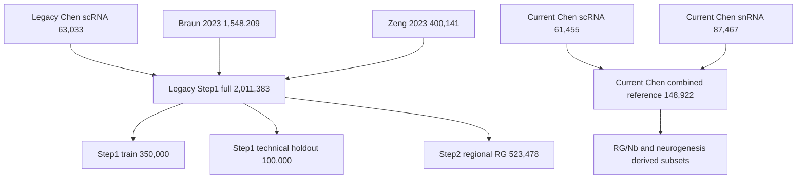

# BRIDGE 数据与 Reference Registry

## 文档信息

| 项目 | 内容 |
| --- | --- |
| Registry 版本 | `DATA-REF-v0.2-draft` |
| 审计日期 | 2026-08-31 |
| 覆盖范围 | 当前可用于 BRIDGE 构建、校准、评测、OOD challenge 和 graft 后验分析的数据 |
| 详细研究主表 | 内部工作簿保存受控技术字段；本文件保存公开科学事实摘要 |
| 机器可读基础矩阵 | [BRIDGE foundation materials](../registries/BRIDGE_foundation_materials_matrix_20260713.tsv) |

本 registry 记录脱敏的逻辑资产、公开科学 metadata 和稳定资产 ID。

## 一、卡片字段

每个正式数据资产至少记录：

```text
asset_id / asset_version / parent_asset_ids
study_family / accession / citation
assay_modality / specimen_type / organism
sampling_context / anatomy / timepoint
sample_unit / biological_unit / n_profiles / n_features
data_role / query_eligibility / split_group
availability / metadata_status / access_policy / evaluation_eligibility
known_limitations / prohibited_uses
annotation_version / preprocessing_version / checksum
```

任何从 source 过滤、合并、抽样、整合或训练得到的对象必须填写 `parent_asset_ids`，不能作为独立研究重复计数。

## 二、数据角色

| 角色 | 含义 | 是否进入移植前正式证据 |
| --- | --- | --- |
| `developmental_reference` | 定义人类发育、区域、状态和相邻谱系 | 是，作为 reference evidence；不作为产品 query 或产品真值 |
| `spatial_reference` | 提供解剖位置、邻域和 marker 空间证据 | 是，作为移植前区域与解剖 reference evidence；不单独定义细胞身份 |
| `pretransplant_query` | 体外、移植前完整制剂或工艺中间态 | 是，需满足 Card、MeasurementSpec 和 eligibility；当前不发布域分数 |
| `calibration` | 建立阈值、error curve、stage 或风险边界 | 否 |
| `locked_validation` | 冻结后一次性检验算法 | 否，不用于调参 |
| `negative_ood` | 生物学负对照及相对于已登记 reference 的 out-of-reference / out-of-distribution challenge，用于检验 specificity、unknown 和拒答；两者不自动等价 | 否 |
| `graft_context` | 独立评估移植后组成与状态 | 独立后验层 |
| `reserve` | 待转换、核实或未来扩展 | 否 |
| `excluded` | 当前合同不允许使用 | 否 |

## 三、Reference 血缘



关键规则：

- `61,455-cell current snapshot` 与 `63,033-cell legacy snapshot` 是同一研究来源的不同版本，不能相加。
- `2,011,383 full`、`350,000 train`、`100,000 technical holdout` 和 `523,478 regional RG` 具有直接父子关系。
- 100k holdout 是同来源 cell-level random holdout，只能用于软件回归和内部标签检查，不能称为独立生物验证。
- 一旦某 source 进入 reference 或模型训练，该 source 的 query 子集不能再被称为完全独立验证。

### 3.1 移植前与移植后 reference 路由

| 用户数据场景 | 首要 reference | 补充 reference | 使用边界 |
| --- | --- | --- | --- |
| 移植前产品 scRNA-seq：腹侧中脑细胞身份与细粒度状态 | `REF-CHEN-VMB-SC-v1`，本组 61,455 个 whole cells | 经审核的 scRNA-only L2/L3 profiles | 本组单细胞是移植前细胞状态判断的首要 reference；当前由 scRNA/snRNA 合并对象派生的 L2/L3 只能先作 sensitivity |
| 移植前产品 scRNA-seq：全脑背景、区域与 off-axis 细胞 | `REF-LEGACY-STEP1-FULL-v1`，本组旧版 scRNA + Braun 2023 + Zeng 2023，共 2,011,383 个 whole cells | 三个父来源的 source-specific profiles | 整合对象包含本组细胞，不能再与本组 reference 相加为两个独立来源；使用前需完成 parent manifest、标签与 preprocessing 版本核对 |
| 移植前产品 scRNA-seq：空间工作标签 QA / candidate label-program lookup | `REF-SPATIAL-HEB58-v1` | 公开空间 reference reserve | 只检查当前标签与正 marker program 的相容性并提供候选 lookup；其初始标签迁移使用了本组单细胞 reference，不构成 calibration、解剖定位、独立身份验证或产品空间映射 |
| 移植后 graft snRNA-seq（用户可选提供） | `REF-CHEN-VMB-SN-v1` 及经审核的 snRNA-derived broad/fine profiles | 成人 mDA 或跨来源 graft reference sensitivity | 只进入独立 P0-12 graft assessment；不回填或改变移植前产品结论 |
| 发育路径与跨模态轨迹 | `REF-CHEN-VMB-COMBINED-v1` | scRNA-only 与 snRNA-only trajectory views | 作为 P0-04 发育路径、方向和分支的候选 reference；不进入移植前细胞身份默认流程，也不作为独立来源重复计数 |

这一路由按待评数据的采样阶段、assay 和分析问题选择 reference，而不是把 scRNA、
snRNA 和空间数据混成同一个“共识 reference”。若用户只提供移植前 scRNA-seq，
细胞身份默认流程不会启用单核 reference；P0-04 可另行读取 sc/sn 整合对象研究
发育路径，但必须先在两种模态内分别重建，再用 GW16/GW20 重叠阶段检查一致性。
只有用户提供移植后 graft 数据时，才进入独立 graft 页面和 assay-matched 身份
reference。

## 四、核心发育 Reference

| Asset ID | Assay 与材料 | 时间与真实解剖范围 | 规模 | P0 用途 | 当前状态 | 关键限制 |
| --- | --- | --- | ---: | --- | --- | --- |
| `REF-CHEN-VMB-SC-v1` | scRNA-seq，whole cells | final RDS：GW7/8/9/12/16/20；人胚腹侧中脑 | 61,455 cells | 移植前产品的首要细胞身份、早期区域、祖细胞和目标/相邻程序 reference | `ready_freeze_required + metadata_reconciliation_required` | final RDS 与历史 notebook 的胎龄重标注未解释一致；身份映射评估可继续，发育 benchmark 暂不运行 |
| `REF-CHEN-VMB-SN-v1` | snRNA-seq，nuclei | GW14/16/18/20/24/25；人胚腹侧中脑 | 87,467 nuclei | graft snRNA 的 broad/neurogenesis reference；同时作为 P0-04 跨模态发育轨迹的一条分模态轨道 | `ready_freeze_required` | 与 scRNA 为不同胚胎，不能称配对数据；不得作为移植前默认细胞身份 reference |
| `REF-CHEN-VMB-COMBINED-v1` | scRNA + snRNA integrated | 12 个非配对胚胎、10 个登记孕周；腹侧中脑 | 148,922 profiles | ontology、发育路径/方向、分支结构与跨模态 trajectory sensitivity | `ready_with_caveat + metadata_reconciliation_required` | 年龄与模态耦合；胎龄映射闭合后仍须分模态验证；不是细胞身份主 reference、独立证据来源或因果谱系真值 |
| `REF-CHEN-RGNB-v1` | derived sc/sn profiles | 14 个区域 RG/Nb states | 15,095 profiles | L2 ontology 与 modality sensitivity | `ready_with_caveat` | 当前来自合并对象；移植前正式使用前需生成或确认 scRNA-only profiles，并冻结 parent manifest |
| `REF-CHEN-NEUROGENESIS-v1` | derived sc/sn profiles | vMB neurogenesis states | 83,017 profiles | 发育路径、分支方向与 modality sensitivity | `candidate_P0` | modality/age imbalance；不是移植前细胞身份默认 reference，也不是因果谱系真值 |
| `REF-BRAUN-2023-v1` | whole-cell scRNA；论文另有 spatial | PCW5-14；第一孕期全脑多区域 | 1,548,209 cells | broad regional/off-axis background | `processed_ready` | 全脑 reference 不能替代 vMB 产品真值 |
| `REF-ZENG-2023-v1` | scRNA；论文另有 PCW4 spatial | PCW3-12；全胚、全头、全脑 | 400,141 cells | early embryo、neural tube、brain 与 non-neural background | `processed_ready` | 本地 harmonization 的年龄和区域标签需冻结 |
| `REF-LAMANNO-2016-v1` | human fetal VM scRNA | PCW6-11；腹侧中脑 | 1,977 fetal cells | 经典独立 VM 发育 reference | `ready_small` | 旧平台、样本量有限；需单独报告 platform shift |
| `REF-BIRTELE-2022-v1` | fetal VM scRNA 与原代培养 | 6-11 周 post-conception；腹侧中脑 | 77,804 cells；25,032 genes；13 个 GEO samples | 原代胎儿 VM maturation external-source 候选 | `conditionally_approved_source_holdout`；P0-02 `biological_review_in_progress` | 仅允许 source-level holdout、stage-level description 与 provisional-group sensitivity；raw reads 因隐私不可用，公开记录仍不足以把 13 个矩阵无歧义映射到 biological units，当前均为 `not_estimable` replicates；不构成科学冻结 |

2026-08-31 对 final RDS 的直接读取确认 scRNA 各年龄观测数为：GW7 6,644、
GW8 7,730、GW9 6,333、GW12 6,366、GW16 20,454、GW20 13,928，合计
61,455。历史 integration notebook 另记录 GW6/9/12 → GW8/9/10、GW11 → GW12
的重标注步骤；最终样本表与转换 manifest 尚未说明两者关系。因此发育路径、真实
时间耦合和 D16 产品软定位保持 `not_assessed`，不影响本轮按 final 对象完成身份
映射评估与 reference/figure QA。当前 processed scRNA H5AD 只有 `counts` layer；
RNA velocity 也保持
`not_assessed`。

上表 Chen vMB family 是受控、未发表的内部 reference，本 registry 未记录其公开
accession 或 primary paper。相关 pilot 观察只能由 BRIDGE 的版本化验证记录支持，
不能用外部论文替代内部结果证据。

核心公开来源：

- Braun et al., *Comprehensive cell atlas of the first-trimester developing human brain*, Science 2023, [DOI 10.1126/science.adf1226](https://doi.org/10.1126/science.adf1226), HCA project `cbd2911f-252b-4428-abde-69e270aefdfc`。
- Zeng et al., *The single-cell and spatial transcriptional landscape of human gastrulation and early brain development*, Cell Stem Cell 2023, [DOI 10.1016/j.stem.2023.04.016](https://doi.org/10.1016/j.stem.2023.04.016), `GSE155121`。
- La Manno et al., *Molecular Diversity of Midbrain Development in Mouse, Human, and Stem Cells*, Cell 2016, [DOI 10.1016/j.cell.2016.09.027](https://doi.org/10.1016/j.cell.2016.09.027), `GSE76381`。
- Birtele et al., *Single-cell transcriptional and functional analysis of dopaminergic neurons in organoid-like cultures derived from human fetal midbrain*, Development 2022, [DOI 10.1242/dev.200504](https://doi.org/10.1242/dev.200504), [GEO `GSE192405`](https://www.ncbi.nlm.nih.gov/geo/query/acc.cgi?acc=GSE192405)；13 个 GEO samples，processed CSV 可用，raw reads 因隐私不可用。

## 五、Legacy 与派生 Reference

| Asset ID | 父资产 | 规模 | 历史用途 | v0.1 状态 | 允许用途 |
| --- | --- | ---: | --- | --- | --- |
| `REF-LEGACY-CHEN-SC-v1` | Chen scRNA 旧快照 | 63,033 | Step1 中脑 anchor | `legacy_snapshot` | 版本对齐和旧模型复现 |
| `REF-LEGACY-STEP1-FULL-v1` | legacy Chen + Braun + Zeng，均为 whole-cell scRNA | 2,011,383 | whole-brain reference universe | `candidate_reuse_after_lineage_review` | 移植前 broad/off-axis source context 与旧模型复现；不得与三个父来源重复计数 |
| `REF-LEGACY-STEP1-TRAIN-v1` | Step1 full | 350,000 | SCVI/SCANVI 训练输入 | `legacy_model_input` | 工程复现；新模型需重新拆分 |
| `REF-LEGACY-STEP1-HOLDOUT-v1` | Step1 full | 100,000 | 同来源随机 holdout | `technical_holdout` | 软件回归、标签 sanity check |
| `REF-LEGACY-STEP2-RG-v1` | Step1 full 中的 11 个 RG subtypes | 523,478 | target `RG_Mesencephalon_FP` identity | `legacy_target_reference` | 旧结果复现；新阈值需非循环验证 |
| `REF-LEGACY-SCENICLIKE-v1` | 旧调控分析对象 | 17,527 x 4,261 | regulon/GRN/AUCell comparison | `legacy_candidate` | 血缘核实后作为独立调控通道 |
| `REF-ADULT-BRAIN-RESERVE-v1` | 成人脑 reference reserve | 3,369,219 x 33,538 | adult-state context | `reserve` | OOD/context；不能定义胎期产品窗口 |

正式实现必须为每个派生对象生成 immutable parent manifest、cell ID/hash 列表和 preprocessing record。

## 六、空间与正交 Reference

| Asset ID | 数据 | 时间/位置 | 规模 | 当前用途 | 状态与限制 |
| --- | --- | --- | ---: | --- | --- |
| `REF-SPATIAL-HEB58-v1` | Visium HD，segmented profiles | GW7 人胚中脑，section 2/9 | 上游登记 411,161；basic-filter joint H5AD 408,539；去背景 final H5AD 385,361 profiles；18,085 probes | 当前 20 个工作标签的正 marker supporting-expression QA 与 candidate label-program lookup | 上游 411,161 的源 manifest/hash 待补；两张切片来自同一胚胎，不能当两个生物重复；初始标签迁移依赖本组单细胞 reference；anti-marker、人工 confidence 和逐位置产品映射均未记录 |
| `REF-SPATIAL-CHEN-CS-v1` | 计划中的冠状/矢状空间 | 人胚中脑；单时间点 | 数据等待返回 | donor/section-aware spatial reference | `pending_data`；返回后登记 assay、donor、section、ROI 和 QC |
| `REF-IF-CHEN-MARKERS-v1` | IF/IHC marker validation | 人胚中脑，GW/PCW 与切面待冻结 | 进行中 | marker 解剖定位和正交支持 | 在样本、抗体批次和成像合同冻结前不进入量化 |
| `REF-SPATIAL-ZENG-PCW4-v1` | 公开空间数据 | PCW4，全胚/全头/早期脑 | 论文级可用 | early anatomy context | 需独立下载、版本和 ROI 审计 |
| `REF-SPATIAL-PUBLIC-RESERVE-v1` | transformed spatial objects / large R objects | 早期发育脑，具体范围逐项核实 | 多个储备对象 | P1/P2 reference swap | 当前未形成 BRIDGE-ready contract |

当前可复核对象把三个计数阶段分开保存：上游登记为 225,107 + 186,054 =
411,161；basic-filter joint H5AD 为 223,428 + 185,111 = 408,539；去背景 final
H5AD 为 209,932 + 175,429 = 385,361。正式图以 final H5AD 的 385,361 个
segmented profiles 为分母。final 对象包含 20 个当前 `cell_type` 标签、两套
reference prediction 及其 score/margin，但没有人工 annotation confidence 字段；
该审核状态显示为 `not_recorded`。没有版本化 crosswalk 时，两套 prediction 只比较
`Uncertain` 比例和已定义 uncertainty state，不报告直接标签分歧。产品分组与当前
标签平均表达程序的相似性只是依赖标签的候选 lookup，不构成 calibration、
cell-to-location projection、anatomical localization 或 independent validation。

当前 hEB58 结果只称 `hEB58 Reference/Figure QA` 或 `Candidate Label-program Lookup`；在 P0-03 applicability gate 通过并实际运行合格 mapping 前，不称空间对应、解剖定位或产品细胞映射，更不能称移植后宿主微环境相容性。

## 七、移植前产品与工艺数据

正确 query unit 必须是 `preparation/sample x timepoint x protocol`，不能是整个 accession。

| Asset ID | 体系与 assay | 时间点 | 本地规模 | 建议角色 | 关键限制 |
| --- | --- | --- | ---: | --- | --- |
| `Q-GSE204796-v1` | Chen/Xu mDA differentiation，scRNA | D8/D14/D21/D28/D35 | 37,397 | development anchor；time-course benchmark | 五个时间点分开；4 月 graft 另建对象 |
| `Q-EMTAB14729-v1` | Boost/Boost+，scRNA | D16/D25/D40 | 26,303 | sealed competitor test | 仅在 BRIDGE 合同冻结后运行；不得进入 RAG、reference、prior、训练、校准或调参；6 个 group 不是 6 个独立 lot |
| `Q-GSE200610-D16-v1` | RC17 VM preparation，scRNA | D16 | 8,166 | clinical-related single-timepoint comparator | 不等于患者 GMP lot；graft 与 multiome 分开 |
| `Q-GSE227070-v1` | H9/4X LR-USC mDA，scRNA；parent SuperSeries `GSE227071` | D16/D28/D62 | 48,196 | cell-source、stage、protocol shift | 本 scRNA query 不含 GBX2-KO；D62 与 D16/D28 不共享产品阶段 |
| `Q-GSE76381-ES-v1` | hESC mDA，scRNA | D0/D12/D17/D35 | 1,715 | historical trajectory sanity | 低样本量；D0 不是产品 |
| `Q-GSE76381-IPS-v1` | iPSC mDA，scRNA | D42/D63 | 337 | smoke/platform sanity | 不足以支持 rare-state 或正式比较 |
| `Q-JERBER-v1` | population-scale iPSC DA，scRNA | D11/D30/D52；D52 含 rotenone block | >750,000 | donor/batch/timepoint robustness | 需按 donor、batch、condition 和 study family 去重 |
| `Q-BRAINSTEM-TOH-v1` | midbrain organoid，scRNA | D20/D25/D30/D40/D50/D60 | 34,702；48 sequencing sublibraries（每个时间点 8 个） | 2D/3D domain shift 和时间点描述 | biological sample/organoid/replicate map 冻结前，不能把 48 sublibraries 当作 48 biological replicates；仅作 `descriptive_only` |
| `Q-FIORENZANO-v1` | VM organoid，scRNA | D15/D30/D60/D90/D120 | 91,034 | organoid trajectory/region comparator | organoid 不与 2D product 直接总排名 |
| `Q-SPHEREDIFF-v1` | 陈跃军组 SphereDiff，3D mDAP scRNA | D28 | v1 下游对象 9,547；上游 `count_ready` 尚不可用 | published-study-linked historical comparator | Zhang et al., Cell Stem Cell 2025 的原始序列位于受控 `HRA008865`；精确样本映射闭合前只作 `analysis_ready` 对照 |
| `Q-MACRODIFF-v1` | 陈跃军组内部 MacroDiff，mDA protocol scRNA | D14/D21/D28 | 原始计数 78,542；v1 下游对象 57,464 | internal unpublished comparator | 六个 capture 不代表六个独立 biological preparations；公开报告仅使用聚合证据 |
| `Q-LEGACY-MSKDA01-v1` | Studer-protocol D16 object | D16 | 原始计数 11,087；v1 下游对象 9,046 | published-protocol-linked comparator | Piao et al., Cell Stem Cell 2021 支持 MSK-DA01 方案背景，不定义该测序对象的论文数据身份 |

代表文献：

- Xu et al., *Human midbrain dopaminergic neuronal differentiation markers predict cell therapy outcomes in a Parkinson's disease model*, JCI 2022, [DOI 10.1172/JCI156768](https://doi.org/10.1172/JCI156768), `GSE204796`。
- Kim et al., *Modulation of WNT and FGF18 enhances yield and subtype identity of hPSC-derived midbrain dopamine neurons*, JCI 2026, [DOI 10.1172/JCI190954](https://doi.org/10.1172/JCI190954), `E-MTAB-14729`。
- Storm et al., *Lineage tracing of stem cell-derived dopamine grafts in a Parkinson's model reveals shared origin of all graft-derived cells*, Science Advances 2024, [DOI 10.1126/sciadv.adn3057](https://doi.org/10.1126/sciadv.adn3057), `GSE200610`。
- Maimaitili et al., *Enhanced production of mesencephalic dopaminergic neurons from lineage-restricted human undifferentiated stem cells*, Nature Communications 2023, [DOI 10.1038/s41467-023-43471-0](https://doi.org/10.1038/s41467-023-43471-0), scRNA `GSE227070`；`GSE227071` 为 parent SuperSeries。
- Jerber et al., *Population-scale single-cell RNA-seq profiling across dopaminergic neuron differentiation*, Nature Genetics 2021, [DOI 10.1038/s41588-021-00801-6](https://doi.org/10.1038/s41588-021-00801-6)。
- Zhang et al., *3D-generation of high-purity midbrain dopaminergic progenitors and lineage-guided refinement of grafts supports Parkinson's disease cell therapy*, Cell Stem Cell 2025, [DOI 10.1016/j.stem.2025.10.001](https://doi.org/10.1016/j.stem.2025.10.001)。
- Piao et al., *Preclinical Efficacy and Safety of a Human Embryonic Stem Cell-Derived Midbrain Dopamine Progenitor Product, MSK-DA01*, Cell Stem Cell 2021, [DOI 10.1016/j.stem.2021.01.004](https://doi.org/10.1016/j.stem.2021.01.004)。

## 八、移植后 graft 后验层

| Asset ID | Assay/宿主单位 | 移植后时间 | 当前用途 | 与 preparation 关系 | 禁止解释 |
| --- | --- | --- | --- | --- | --- |
| `GRAFT-GSE204796-v1` | graft-derived human whole-cell scRNA；graft sample | 4 月 | composition、marker 与后验机制 context | 需建立 originating preparation map | 不能作为移植前产品或疗效标签 |
| `GRAFT-GSE200610-v1` | human graft snRNA；animal/graft | 3/6 月 | DA/astrocyte/VLMC、成熟与 lineage context | 与 D16/D18 preparation 显式链接 | 不能把 graft fraction 回填至 D16 |
| `GRAFT-EMTAB14729-v1` | human graft snRNA；protocol x graft | 1/9 月 | maturation、subtype、off-target context | 与 Boost/Boost+ origin 显式链接 | 不与体外 scRNA 视为同分布数据 |
| `GRAFT-TIKLOVA-v1` | graft scRNA；animal/graft | 6/12 月 | 长期 graft composition context | 来源 D16 preparation，需按原文冻结 | 不提供临床 outcome truth |
| `GRAFT-OTHER-RESERVE-v1` | counts/RPKM/archive | study-defined | 文献和 composition reserve | linkage 待核实 | 不能当统一 single-cell 输入 |

graft 结果必须使用独立 `GraftAssessment`。只有存在明确 `originating_preparation_id` 和来源证据时，Agent 才能生成 preparation-graft 描述性关联。

## 九、机制校准与风险数据

| Asset ID | 数据 | 时间/条件 | 规模 | 用途 | 限制 |
| --- | --- | --- | ---: | --- | --- |
| `CAL-SISBAR-207921-v1` | scRNA + SISBAR | Stage I-IV；D13/D21/D30/D45 | 47,155 | stage transition、lineage-state consistency | stage/experiment 不等于 GMP lot |
| `CAL-SISBAR-221592-v1` | scRNA + SISBAR replicates | Stage I-IV | 168,805 | replicate-aware lineage calibration | combined 与 split objects 不能重复计数 |
| `CAL-STRESS-249360-v1` | single-cell expression | sorting groups；basal/MPP+ 24 h | 1,530 | sorting/stress boundary | 分化 D 和 assay metadata 仍需冻结 |
| `CAL-OPIOID-260711-v1` | midbrain organoid scRNA | D53 acute、D77 chronic、D79 withdrawal | 20,322 | perturbation/stress robustness | 药物暴露不是产品质量标签 |
| `CAL-PD-PINK1-v1` | Drop-seq | D6/D15/D21 等 | local subset 3,324 | mutation/stage robustness | 子集不代表完整研究 |
| `CAL-PD-LRRK2-v1` | Drop-seq organoid | D35/D70 | 10,517 | organoid disease/region robustness | 来源映射需冻结 |

SISBAR 只能约束获得直接支持的状态转变，不能自动确定其他方案的最佳收获日。

## 十、Negative/OOD Panel

| Asset ID | 生物场景 | Assay/时间 | 可运行规模 | OOD 目的 | 状态 |
| --- | --- | --- | ---: | --- | --- |
| `OOD-GSE190729-v1` | connected cerebral organoid | scRNA；时间待核实 | 17,636 | cortical/cerebral rejection | `ready_metadata_gap` |
| `OOD-GSE129519-v1` | reproducible cortical organoid | scRNA；3 月 | 10,000 sampled | high-quality cortical OOD | `ready_sampled` |
| `OOD-GSE267791-v1` | hiPSC motor neuron | scRNA；D 待核实 | 1,341 | neuronal but non-mDA rejection | `ready_small` |
| `OOD-GSE188516-v1` | developing human spinal cord | sc/sn；PCW17-18 | 20,000 sampled | ventral CNS but non-midbrain | `ready_sampled` |
| `OOD-GSE221853-v1` | neural crest/sympathoadrenal | scRNA；D0-D28 | 29,857 | peripheral lineage rejection | `ready` |
| `OOD-GSE224152-v1` | adult bone-marrow MSC | scRNA | 1,771 | non-neural/mesenchymal rejection | `ready_small` |
| `OOD-GSE86153-v1` | whole-brain organoid | scRNA；3/6 月 | 10,000 sampled | heterogeneous brain OOD | `ready_sampled` |
| `OOD-GSE86982-v1` | hESC neural lineages | scRNA；D 待核实 | 2,365 | difficult neural/caudal OOD | `ready_metadata_gap` |
| `OOD-FAN-CORTEX-v1` | fetal cortex | scRNA；PCW7-28 | 13,124 | in-vivo forebrain/cortex OOD | `ready` |

Negative/OOD 数据检验 specificity 和拒答能力，不代表“低质量 PD 产品”。评测单位必须保持 publication/sample/timepoint，禁止 cell-level random split 冒充外部验证。

## 十一、Reserve 与排除项

| Asset ID | 内容 | 状态 | 原因/下一步 |
| --- | --- | --- | --- |
| `RES-EGA-NISHIMURA-v1` | D0/D11/D16/D21/D28 hESC differentiation | `controlled_access` | 获得合法访问并冻结 sample map 后再评估 |
| `RES-EGA-ASGRIMSDOTTIR-v1` | D14/D17/D28 RG lineage + TREX | `controlled_access` | 不得在未获得数据时宣称可运行 |
| `RES-RETINA-138002-v1` | fetal/adult retina + organoid | `downloaded_pending_conversion` | 作为感觉 CNS OOD reserve |
| `RES-CORTEX-STRESS-132672-v1` | cortical organoid stress | `downloaded_pending_conversion` | 大对象需抽样策略和 metadata contract |
| `RES-CHONDRO-160625-v1` | hPSC chondrogenesis | `downloaded_pending_conversion` | mesoderm severe OOD |
| `RES-ENDODERM-75748-v1` | hESC definitive endoderm | `downloaded_pending_conversion` | germ-layer severe OOD |
| `EXC-LUO-198565-v1` | fetal cerebellum | `excluded_retracted_source` | 隔离，不进入 reference、prior 或 benchmark |
| `EXC-ATAC-216323-v1` | teratoma scATAC-only archive | `excluded_wrong_modality` | P0 transcriptomic query 不使用；未来 multiome 单独立项 |

## 十二、Case 构建规则

| 数据家族 | 正确单位 | 错误单位 |
| --- | --- | --- |
| GSE204796 | sample x D；D28/D35 可作为声明产品窗口候选 | 合并 D8-D35 为一个产品 |
| E-MTAB-14729 | protocol x D；必要时再按 sample | 把 accession 或 6 groups 当独立 lots |
| GSE200610 | D16 sample；graft 按 animal/timepoint | 合并 D16 scRNA 与 3/6 月 snRNA |
| GSE227070（parent `GSE227071`） | cell source x D | 合并 H9/4X 和 D16/D28/D62，或把 GBX2-KO 加入本 scRNA query |
| GSE281535 | 在 biological sample/organoid/replicate map 冻结后确定；当前只按 timepoint 描述 | 将 48 sequencing sublibraries 当作 48 biological replicates |
| Jerber | donor x differentiation batch x D x condition | 以全部 cells 或论文名作为一个产品 |
| OOD | publication x sample x timepoint | cell-level random train/test split |
| Graft | animal/graft x post-transplant timepoint | 将 nuclei 当作移植前 whole cells |

## 十三、P0 推荐数据划分

| 分区 | 候选数据 | 用途 |
| --- | --- | --- |
| Development | Chen references、GSE204796、SISBAR、stress calibration、部分 OOD | Card、MeasurementSpec、阈值和 error curve |
| Public locked | GSE200610、GSE227070、预注册 OOD | 算法冻结后评测 |
| Domain shift | Jerber、Toh、Fiorenzano、La Manno | cross-source/2D/3D robustness |
| Internal unpublished | MacroDiff、经批准的其他内部 preparations | 受控方法开发与可视化评估；公开记录限于聚合证据 |
| Published study context | SphereDiff、Studer-protocol D16 | SphereDiff 上游为受控数据且样本映射待确认；Studer 仅以已发表方案作为 protocol context；两者均保留来源和 checksum manifest |
| Graft context | GSE200610、E-MTAB-14729、GSE204796、Tiklová | 独立后验层，不训练或修改移植前分域评估分数；竞争来源仍遵守 sealed policy |
| Competitor sealed | E-MTAB-14729 及其他竞争研究公开 query，合法取得后 | BRIDGE 全部冻结后一次性测试；进入全局 clean-room denylist |

最终 split 必须以 study/donor/preparation 为分组单位，并记录所有 parent/derivative overlap。

## 十四、待冻结事项

1. Chen current 与 legacy scRNA 两个快照的 preprocessing 和 annotation 差异。
2. combined sc/sn reference 的 feature universe、SysVI/model 版本、分模态轨迹、GW16/GW20 重叠阶段一致性，以及 root/terminal-state sensitivity。
3. hEB58 两张切片的方向、ROI、segmentation 和同胚胎关系。
4. 待返回空间数据的 donor、section、切面和时间合同。
5. BrainSTEM 研究家族、样本、assay 和重复对象去重。
6. MacroDiff 的 biological preparation hierarchy；SphereDiff `HRA008865` 样本与分析对象的精确对应；Studer-protocol D16 测序来源与已发表方案的边界。
7. 各 graft 的 originating preparation、宿主、animal 和 timepoint map。
8. 所有待核实 D/timepoint 字段不得由 Agent 按论文惯例补全。
