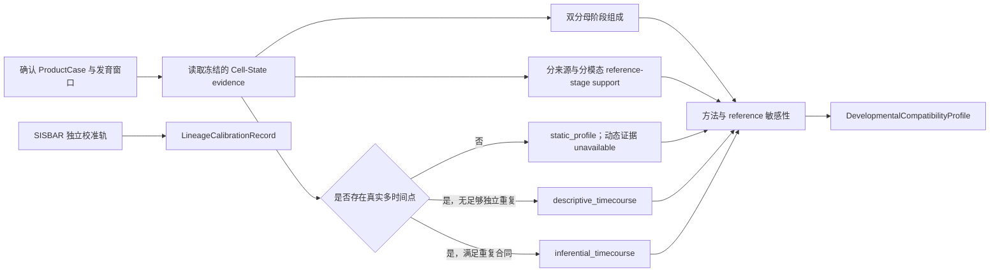

# BRIDGE P0 Developmental Compatibility 任务卡

| 字段 | 内容 |
| --- | --- |
| Task ID | `TASK-DEVELOPMENT-v0.1` |
| 文档版本 | `0.1` |
| 日期 | 2026-08-06 |
| 状态 | `candidate` |
| 首个实例 | 移植前 hPSC-derived VM floor-plate/mDA 产品 |
| 上游输入 | `QCReadinessProfile`、`CellStateEvidenceProfile`、`ProductDefinitionCard` |
| 主要输出 | `DevelopmentalCompatibilityProfile`；校准轨另存 `LineageCalibrationRecord` |

## 1. 任务目标与边界

本模块判断待评产品的转录组状态对研究者确认发育窗口的支持程度，并区分窗口前、窗口内、窗口后、分支偏移和未解析状态。当前阶段只整理并验证数据、方法、环境和输出合同，不制定 0-100 分数。

- 发育相容性是相对于 `ProductDefinitionCard` 的条件化证据，不寻找跨产品通用的最优阶段。
- 人胎 reference 定义生物学状态轴；体外时间序列只用于过程校准和同条件比较。
- 体外 `D` 与体内 `GW/PCW` 分别保存，不能相互换算。
- 目标窗口未确认时仍可输出发育画像，但 `domain_score=null`、`score_state=unavailable`。
- 当前没有疗效、功能或安全性真值，本模块不输出相关结论。

## 2. `DevelopmentWindowSpec`

`ProductDefinitionCard` 必须引用一个版本化 `DevelopmentWindowSpec`。Agent 可以预选模板并展示依据，研究者确认后才能发布窗口相容性结果。

| 模板 ID | 研究问题 | 候选状态范围 | 默认状态 |
| --- | --- | --- | --- |
| `early_patterning_progenitor` | 是否处于早期区域化和底板建立阶段 | 早期 patterning、floor-plate establishment 及相邻状态 | `candidate` |
| `transplantable_mFP_mDA_progenitor` | 是否支持移植用 mFP/mDA progenitor 窗口 | mFP progenitor、mDA-committed progenitor 及经审核的相邻状态 | `default_preselected + freeze_required` |
| `immature_mDA` | 是否进入未成熟 mDA 神经元阶段 | immature mDA 及经审核的过渡状态 | `candidate` |

每个窗口至少记录：`window_spec_id`、目标产品、允许的内部状态、`earlier/within/later/branch_shift` 映射、适用 assay、reference snapshot、依据、reviewer、确认时间和版本。具体状态角色必须经发育生物学审核，不能仅由 marker 或标签名称自动生成。

## 3. 输入与当前资产

### 3.1 必要输入

- 已确认的 `ProductDefinitionCard` 和 `DevelopmentWindowSpec`。
- `all_cells_view` 与可用时的 `eligible_cells_view`。
- Cell-State soft assignment、prediction set、unknown/OOD 和方法分歧。
- sample、preparation、batch、cell line/donor、biological replicate 与真实 `D/Stage`。
- 冻结的 expression/count view、内部 `DevelopmentStateMap`、reference 与方法版本。

### 3.2 当前可用资产

| 资产 | 主要内容 | 本模块用途 | 关键限制 |
| --- | --- | --- | --- |
| Chen vMB scRNA reference | GW7/8/9/12/16/20；61,455 cells | 早中期状态轴 | 与 snRNA reference 的胎龄不重叠完整 |
| Chen vMB snRNA reference | GW14/16/18/20/24/25；87,467 nuclei | 中晚期状态轴 | assay 与胎龄耦合 |
| Chen neurogenesis derived set | GW7-GW25；83,017 profiles | 状态、阶段和历史轨迹候选 | 派生对象，不作独立证据重复计数 |
| La Manno VM reference | PCW6-11；1,977 cells | 独立来源敏感性 | 规模小、平台较旧 |
| 体外 mDA 时间序列 | D0-D120 的多研究 2D/3D 数据 | 真实时间趋势和过程比较 | 方案、cell line、平台及重复结构不同 |
| SISBAR lineage assets | 三个相邻阶段的独立 split-barcoding 实验 | 轨迹方法校准 | 不能拼成一条连续克隆轨迹 |
| sealed competitor test | D16/D25/D40 | 冻结后外部测试 | 不进入 reference、prior、方法选择或阈值调整 |

完整数据条目、规模、角色和状态由配套 Excel 的 `Current Data` 工作表维护。

## 4. 分析流程

## 5. 方法组合

### 5.1 窗口组成

- 读取 Cell-State soft composition，并按 `DevelopmentStateMap` 聚合为 `earlier`、`within_window`、`later`、`branch_shift` 和 `unresolved`。
- 主分母为 target-related cells；同时报告全部 eligible product cells 的组成，不能只展示富集后的目标子集。
- 区间使用 sample-preserving bootstrap。只有一个独立样本时，区间只能描述细胞抽样或注释不确定性，不能代表批次间生物变异。

### 5.2 Reference-stage support

- 对每个 sample/preparation 构建 pseudobulk，并分别对每个 reference source 与 modality 计算阶段支持分布。
- source-aware ordinal classifier 作为独立阶段映射通道，训练和验证按 source、donor、lab 与 modality 分组。
- 输出 `top_supported_reference_interval` 及完整支持分布；该区间只表示 reference 相似性，不表示胎龄换算。
- RAPToR 作为 `shadow` 候选，必须使用 BRIDGE 自有 reference 重新验证后才可解释。

### 5.3 真实时间点趋势

- 按真实 `D/Stage` 展示阶段组成和发育程序趋势，不使用 pseudotime 代替实验时间。
- 有独立 biological replicates 时，可比较 propeller/speckle 与 scCODA/pertpy-scCODA 等组成模型；模型单位是 sample/preparation，不是 cell。
- 样本层 spline/GAM 用于真实时间趋势。重复不足时只输出 `descriptive_timecourse`，不发布推断性统计。

### 5.4 轨迹与转变方法

DPT/PAGA、Palantir、Slingshot、VIA、CellRank、moscot/WOT、tradeSeq、CellAlign、TrAGEDy 和 scVelo 纳入方法目录，但初始状态为 `benchmark`、`conditional` 或 `shadow`。它们可用于方向、分支、动态程序或跨时间耦合的校验，不默认进入正式 Developmental Compatibility 指标。

现有 DPT、Palantir 和 CellRank 产物登记为 `historical_candidate`。由于 scRNA/snRNA 与胎龄耦合，并且 root/terminal state 含人工设定，必须重新按冻结合同验证。

### 5.5 SISBAR 校准轨

- Adapter 将表达对象与 `Cell.Barcode`、`Virus.Barcode`、`Cluster.Id` lineage 表显式连接。
- Stage I-II、II-III、III-IV 是三个独立实验；每个 experiment/replicate 单独生成 observed transition matrix。
- 输出 clone coverage、barcode multiplicity、匹配率、转变矩阵和不确定性；禁止跨实验拼接克隆。
- SISBAR 只用于评测轨迹方法和构建有适用性门槛的 transition prior，不进入普通产品的正式域结果。
- CoSpar 是 lineage/state 联合分析的 `shadow` 候选。普通产品没有 lineage barcode 时，不输出克隆命运结论。

## 6. 输出合同

### 6.1 `DevelopmentalCompatibilityProfile`

| 字段 | 含义 |
| --- | --- |
| `analysis_mode` | `static_profile` / `descriptive_timecourse` / `inferential_timecourse` |
| `window_spec_id` | 研究者确认的窗口、版本和确认记录 |
| `target_related_denominator` | target-related cells/weights、数量与视图 |
| `whole_product_denominator` | 全部 eligible product cells、数量与视图 |
| `stage_fractions` | 两套分母下的 window、earlier、later、branch-shift、unresolved 比例及区间 |
| `reference_stage_support` | 按 source/modality 保存的阶段支持分布 |
| `top_supported_reference_interval` | 最高支持的 reference 区间及不作胎龄换算的说明 |
| `timecourse_profile` | 真实 D/Stage 的组成、程序趋势、重复结构和统计模式 |
| `sensitivity` | reference、modality、preprocessing、方法和 QC view 敏感性 |
| `evidence_state` | `available` / `shadow` / `unavailable` |
| `domain_score` | 固定为 `null`，等待独立 `ScoreContract` |
| `provenance` | Card、window、tool、reference、environment、参数和 Evidence ID |

### 6.2 `LineageCalibrationRecord`

保存 experiment、replicate、相邻 stage pair、barcode join 结果、clone coverage、multiplicity、observed transition matrix、方法预测、edge recovery、方向一致性、校准度和 provenance。它与普通产品 profile 分库存储。

## 7. 运行环境

| 环境 | 用途 | 当前状态 |
| --- | --- | --- |
| `ENV-DEVELOPMENT-PY-v0.1` | composition、pseudobulk、statsmodels/sklearn、Scanpy DPT/PAGA、Palantir | `proposed` |
| `ENV-DEVELOPMENT-CELLRANK-v0.1` | CellRank 条件性轨迹验证 | `proposed_conditional` |
| `ENV-DEVELOPMENT-VELOCITY-v0.1` | RNA velocity 研究性验证 | `proposed_exploratory`；独立冻结稳定版本 |
| `ENV-DEVELOPMENT-VIA-v0.1` | VIA shadow benchmark | `proposed_shadow` |
| `ENV-DEVELOPMENT-BIOC-v0.1` | Slingshot、tradeSeq、speckle/propeller、RAPToR | `proposed_isolated` |
| `ENV-DEVELOPMENT-OT-v0.1` | moscot/JAX 隔离运行 | `proposed_isolated` |
| `ENV-DEVELOPMENT-LINEAGE-v0.1` | SISBAR adapter 与 CoSpar | `proposed_isolated` |

这些工具不应全部混装在一个环境。Python core、R/Bioconductor、JAX/OT、lineage 和 velocity 分别冻结，环境间只交换版本化 h5ad/Parquet/TSV、矩阵和 JSON manifest。

## 8. Web 必备可视化

- 双分母阶段组成图，显示区间、unknown 与分母。
- 按真实 `D/Stage` 排列的 sample-level 时间轴。
- 按 reference source/modality 分面的 stage-support 热图或 ridge plot。
- 发育程序动态热图与 sample-level trend。
- reference、modality、preprocessing、方法和 QC view 敏感性图。
- SISBAR alluvial/transition matrix，仅显示在 calibration 视图。

每张正式图绑定 Evidence ID、输入版本、分母、单位、窗口、reference、方法和缺失状态。单时间点界面必须明确显示动态证据 `unavailable`。

## 9. 拒答与降级规则

- `DevelopmentWindowSpec` 未确认：只输出候选发育画像，不发布窗口相容性结论。
- Cell-State evidence 不可用或 target-related 分母不足：相应组成返回 `unavailable`。
- 单时间点：`analysis_mode=static_profile`，不输出时间进展或转变证据。
- 无足够独立重复：最多 `descriptive_timecourse`，细胞数不能代替 biological replicate。
- reference source/modality 冲突且无法协调：保留各自结果并标记 `unstable` 或 `unavailable`。
- 缺少 lineage barcode：不输出克隆关系、命运或 observed transition。
- sealed competitor test 不参与任何方法选择、reference 构建、prior 或阈值调整。

## 10. Benchmark 与冻结要求

| 验证项 | 最低要求 |
| --- | --- |
| 数据拆分 | source、donor、lab、cell line 和 modality holdout；禁止 cell-level random split 充当外部验证 |
| 阶段与窗口 | leave-one-timepoint-out、leave-one-state-out，以及早/窗内/晚/branch/OOD 混合测试 |
| 稳健性 | cell/gene 下采样、reference swap、modality split、preprocessing/QC view 和随机种子敏感性 |
| 时间序列 | 单时间点正确降级；重复不足不发布 inferential 结果；样本层模型不把 cell 当重复 |
| SISBAR adapter | barcode 唯一性、join rate、experiment/replicate 隔离和 observed transition 重建 |
| 轨迹校准 | 对 SISBAR observed transitions 评测 edge recovery、方向一致性与校准度 |
| 数据隔离 | sealed competitor test 到 reference、prior、训练、调参和阈值的数据流为零 |
| 工程冻结 | tool、environment、window、reference、MeasurementSpec、参数、seed、schema 和验收阈值均版本化 |

未通过验证的方法保持 `candidate`、`conditional`、`shadow` 或 `historical_candidate`。只有冻结方法才能写入正式 Evidence Graph。

## 11. 主要官方来源

- Scanpy DPT/PAGA: https://scanpy.readthedocs.io/en/stable/generated/scanpy.tl.dpt.html ; https://scanpy.readthedocs.io/en/stable/generated/scanpy.tl.paga.html
- Palantir: https://palantir.readthedocs.io/
- CellRank RealTimeKernel: https://cellrank.readthedocs.io/en/stable/api/_autosummary/kernels/cellrank.kernels.RealTimeKernel.html
- scVelo: https://scvelo.readthedocs.io/
- Slingshot / tradeSeq: https://bioconductor.org/packages/slingshot/ ; https://bioconductor.org/packages/tradeSeq/
- speckle/propeller: https://bioconductor.org/packages/speckle/
- scCODA: https://pertpy.readthedocs.io/en/latest/tutorials/notebooks/sccoda.html
- RAPToR: https://github.com/LBMC/RAPToR ; https://www.nature.com/articles/s41592-022-01540-0
- moscot / WOT: https://moscot.readthedocs.io/en/stable/ ; https://github.com/broadinstitute/wot
- VIA: https://github.com/ShobiStassen/VIA
- CellAlign / TrAGEDy: https://www.nature.com/articles/nmeth.4628 ; https://github.com/No2Ross/TrAGEDy
- SISBAR / GSE221592: https://www.ncbi.nlm.nih.gov/geo/query/acc.cgi?acc=GSE221592 ; https://www.sciencedirect.com/science/article/pii/S1934590923000449
- CoSpar: https://cospar.readthedocs.io/en/latest/
