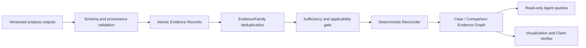

# BRIDGE P0 Evidence Compiler 任务卡

| 字段 | 内容 |
| --- | --- |
| Task ID | `TASK-EVIDENCE-COMPILER` |
| Version | `v0.1-draft` |
| Date | 2026-08-07 |
| Analysis unit | `metric x claim target x context` |
| Primary output | `EvidenceRecord`、`CaseEvidenceGraph`、`ComparisonEvidenceGraph` |
| Current state | `candidate` |

## 1. 任务目标与边界

Evidence Compiler 将已完成分析产生的版本化结果转换为可追溯的原子证据，并由 Deterministic Reconciler 按预注册规则完成适用性检查、同源去重和冲突协调。

本模块回答：

- 一个结论来自哪个产品、样本、工具、reference、prior 和合同版本。
- 多个结果是否属于同一证据家族，能否视为独立支持。
- 当前结论有哪些支持、反对、冲突和缺失证据。
- 证据是否具备协调资格，以及协调结果是否稳定。
- Agent 和 Web 应读取哪一段证据子图进行解释和下钻。

本模块不重新运行单细胞分析，不计算生物指标、域指数、综合总分或产品排名。LLM 可以解释图中已有证据，无权创建或修改数值、Evidence ID、证据等级、生命周期或协调状态。

## 2. 输入与原子证据合同

### 2.1 必要输入

每次编译至少读取：

- 已确认且版本化的 `ProductCase`、`ProductDefinitionCard` 和 sample/preparation 层级。
- `MeasurementSpec`，以及存在时的 `ScoreContract`。
- 上游 `ToolRunRecord`、`MeasurementResult` 和 artifact manifest。
- 对应域的 `EvidenceSufficiencyProfile`。
- 使用过的 reference、prior、knowledge 和 ontology snapshot。
- Tool、algorithm、environment、parameter 和 validation 版本。
- evidence-family registry、claim spec 和 `ReconciliationSpec`。

系统不得从文件名、目录名、accession 或实验室名称推断缺失关系。schema 不完整的对象保留失败记录，但不能编译为正式 Evidence Record。

### 2.2 原子记录

一个 `EvidenceRecord` 只表达一个：

```text
metric x claim_target x biological_context x measurement_contract
```

同一个 `MeasurementResult` 可以拆分为多个 Evidence Record。例如组成比例、区间上界和方法敏感性分别支持不同 Claim 时，必须分别记录，不能把整个结果文件视作一条证据。

每条记录至少保存：

```text
evidence_id / evidence_version / logical_key / content_hash
product_case_ref / sample_or_preparation_ref / domain_id
measurement_result_ref / measurement_spec_ref / score_contract_ref
metric_id / value / unit / numerator / denominator / interval
claim_target_ref / biological_context / evidence_state
evidence_tier / lifecycle_state / applicability
evidence_family_ref / sufficiency_profile_ref
tool_run_ref / reference_refs / prior_refs / artifact_refs
created_at / compiler_version
```

标识采用稳定逻辑键、显式版本和规范化 JSON 内容哈希。相同版本输入重复编译必须幂等；内容、合同或人工修正变化时追加新版本，不覆盖旧记录。

### 2.3 分层状态

| 字段 | 枚举 | 作用 |
| --- | --- | --- |
| `evidence_tier` | `formal`、`shadow`、`exploratory` | 控制证据是否允许进入正式协调 |
| `lifecycle_state` | `active`、`superseded`、`invalidated` | 保留修正、替代和撤回历史 |
| ToolRun state | `succeeded`、`partial`、`failed`、`skipped` | 记录工具执行结果，不等同于科学有效性 |

`exploratory`、`failed`、`superseded` 和 `invalidated` 对象进入审计图，但不得进入正式协调。`negative`、`missing`、`unknown`、`unavailable` 和 `alert` 继续保持不同语义，不能相互替换。

## 3. Evidence Graph 合同

### 3.1 图模型

Evidence Graph 使用有向属性多重图。每个 ProductCase 保存逻辑独立的 `CaseEvidenceGraph`；每次比较生成 `ComparisonEvidenceGraph`，只引用已有案例证据，不复制或改写 `ProductEvidenceObject`。

主要节点：

| 节点 | 作用 |
| --- | --- |
| `ProductCase`、`ProductDefinitionCard` | 定义产品、目标、assay、sampling context 和版本 |
| `Sample`、`Preparation` | 记录真实分析单位和分母来源 |
| `MeasurementSpec`、`ScoreContract` | 固定测量与评分合同 |
| `ToolRun`、`MeasurementResult` | 保存执行和确定性结果 |
| `EvidenceRecord` | 原子、不可变的证据单元 |
| `Claim` | 由已注册 ClaimSpec 定义的可支持或反对结论 |
| `EvidenceFamily` | 表示共享数据、方法、reference 或知识来源的相关证据 |
| `EvidenceRequirement` | 表示某项 Claim 按合同仍需要但尚未获得的证据 |
| `EvidenceSufficiencyProfile` | 提供数据、方法和 prior 的门控状态 |
| `ReferenceSnapshot`、`PriorSnapshot`、`Artifact` | 保存 provenance 和版本引用 |
| `ComparisonRecord` | 绑定多产品比较合同与比较证据图 |

### 3.2 关系

| 关系 | 语义 |
| --- | --- |
| `derived_from` | 结果来自哪个输入、ToolRun、reference、prior 或 artifact |
| `supports` / `contradicts` | Evidence Record 支持或反对哪个 Claim |
| `depends_on` | 对象依赖哪些合同、门控或上游结果 |
| `applicable_to` | 证据适用于哪些产品、域、状态和上下文 |
| `missing_for` | EvidenceRequirement 尚未满足哪个 Claim |
| `belongs_to_evidence_family` | Evidence Record 属于哪个证据家族 |
| `supersedes` | 新版本替代旧版本，但保留旧报告可复现性 |
| `invalidates` | 新记录明确撤回或否定旧记录的当前有效性 |

`same_evidence_family` 只作为“共享同一 EvidenceFamily”的派生查询，不物化为两两关系，避免关系数量随证据数平方增长。

### 3.3 显式缺失

缺失证据通过 `EvidenceRequirement` 和 `missing_for` 表达，至少记录 requirement ID、来源合同、所需模态或实验、阻塞范围和状态。没有测量不能生成 value=0 的 Evidence Record，也不能解释为阴性、风险不存在或产品失败。

## 4. Evidence Family 去重

EvidenceFamily 由版本化 registry 预先声明，不由 Agent 根据当前结果临时聚类。至少记录：

```text
evidence_family_id / version / family_type
shared_source_family / shared_algorithm_family
shared_reference_or_prior / independence_scope
known_dependencies / rationale / reviewer / status
```

以下情况默认不得作为独立证据：

- 同一数据、同一标签或同一 reference 的不同可视化。
- 同一算法仅更换实现语言、封装器或轻微参数。
- 共享同一数据库主体记录的多个工具输出。
- 同一分析结果在 cell、cluster 和 report 层的重复汇总。

EvidenceFamily 去重只防止重复计数，不删除原始结果。相关工具的一致性可以展示，但不能转化为多数票。

## 5. Deterministic Reconciler

每类 Claim 绑定版本化 `ReconciliationSpec`：

```text
reconciliation_spec_id / version / claim_type
required_channel_roles / optional_channel_roles
independence_requirements / applicability_rules
sufficiency_requirements / conflict_rules
integration_sensitivity_rule / missing_behavior
validation_ref / reviewer / status
```

协调顺序固定为：

1. 校验 ClaimSpec、MeasurementSpec 和对象版本。
2. 读取 Evidence Sufficiency 和 applicability。
3. 排除不合格 tier、生命周期和 ToolRun 状态。
4. 按 EvidenceFamily 去重并检查预注册独立通道。
5. 识别支持、反对、缺失和 integration-sensitive 证据。
6. 按 `ReconciliationSpec` 输出 eligibility、state 和 reason codes。



`reconciliation_eligibility` 与协调状态分开保存：

| Eligibility | 含义 |
| --- | --- |
| `eligible` | 输入、合同和必要证据满足该 Claim 的协调条件 |
| `insufficient_evidence` | 关键证据或适用性不足，停止方向协调 |
| `not_assessed` | ClaimSpec、ReconciliationSpec 或必要上游记录尚未生成 |

只有 `eligible` 才输出：

| State | 含义 |
| --- | --- |
| `stable` | 按预注册通道去重后方向一致，且无未解决硬冲突 |
| `consensus_supported` | 初始结果存在差异，经预注册的独立通道复核后获得支持 |
| `integration_sensitive` | 结论对联合分析或 integration choice 敏感 |
| `unstable` | 冲突无法按冻结规则解决，停止定向结论 |

不同方法家族不得简单等权、求平均或按数量投票。`consensus_supported` 的独立通道由具体 `ReconciliationSpec` 定义，不采用通用“至少两个工具”规则。

## 6. 存储、查询与互操作

### 6.1 正式事实源

- 规范化 JSON 保存不可变对象记录。
- Parquet 保存节点表、关系表和重建 manifest。
- JSON/Parquet 是正式事实源；所有数据库投影必须能从它们确定性重建。
- 使用规范化 JSON 内容哈希验证幂等性、完整性和版本变化。

### 6.2 LadybugDB 查询投影

LadybugDB 作为 P0 推荐的嵌入式属性图查询层：

- Python 3.12、Cypher、ACID、磁盘持久化和 Parquet/JSON 交换满足当前需求。
- 单个 Web 后端进程持有 `READ_WRITE` Database 对象，Agent 和 Web 通过后端 API 查询。
- 不允许多个独立进程同时直接读写同一数据库文件。
- LadybugDB 文件可删除并由正式 JSON/Parquet 重建，不作为唯一证据副本。

NetworkX 只用于结构校验、测试 fixture 和 Cytoscape.js elements 导出，不作为正式数据库。Neo4j 保留为多服务扩展候选；Apache AGE 仅在未来统一采用 PostgreSQL 时复评；Memgraph 和 FalkorDB 登记许可与服务运维边界；已归档的 Kuzu 不作为新依赖。

### 6.3 Agent 只读查询

Agent 不获得任意 Cypher 或写权限，只调用注册的参数化查询：

- `get_claim_evidence`
- `trace_evidence_provenance`
- `get_conflicting_evidence`
- `get_missing_requirements`
- `get_evidence_family_members`
- `get_case_evidence_subgraph`
- `compare_evidence_paths`

每个查询限制 graph scope、ProductCase、最大深度、最大节点数和可见字段，并返回 Evidence IDs、版本、状态和截断提示。LLM 输出不能直接写回 Evidence Graph。

W3C PROV-O、RO-Crate 和 JSON-LD 只登记为互操作 `shadow` 导出，不改变内部属性图合同。

## 7. 工具与环境

| 工具/组件 | 角色 | 当前状态 | 环境 | 关键边界 |
| --- | --- | --- | --- | --- |
| `BRIDGE-EVIDENCE-COMPILER-v0.1` | 原子记录、ID、版本和图构建 | `adopted_spec`；实现 `proposed/candidate` | `evidence_graph`，CPU | 不计算生物指标或修改上游结果 |
| `BRIDGE-EVIDENCE-RECONCILER-v0.1` | 去重、适用性和冲突协调 | `adopted_spec`；实现 `proposed/candidate` | `evidence_graph`，CPU | 只读取冻结 ReconciliationSpec |
| Pydantic + JSON Schema | 对象与枚举校验 | `shortlisted` | `evidence_graph` | schema 合格不代表科学结论正确 |
| RFC 8785 canonicalization + SHA-256 | 内容哈希与幂等性 | `shortlisted` | `evidence_graph` | 哈希不替代版本和 provenance |
| PyArrow/Parquet | 节点、关系和 manifest 事实表 | `shortlisted` | `evidence_graph` | 固定 schema 和字段分类 |
| LadybugDB | 可重建的 Cypher 查询投影 | `proposed_primary` | `evidence_graph` | 单后端写入；不是唯一事实源 |
| NetworkX | 图约束、fixture 和导出校验 | `shortlisted_validation` | `evidence_graph` | 不承担正式持久化 |
| Cytoscape.js elements | Web 图数据交换 | `conditional` | Web backend | 只输出权限允许的子图 |
| W3C PROV-O / RO-Crate / JSON-LD | 互操作导出 | `shadow` | `evidence_interop` | 不改变内部证据语义 |

`ENV-EVIDENCE-v0.1` 需要 Python 3.12、LadybugDB、Pydantic、jsonschema、PyArrow 和 NetworkX，并以 CPU 运行为主。`ENV-EVIDENCE-INTEROP-v0.1` 仅在互操作导出进入开发时建立。

## 8. 输出合同与 Web 展示

正式输出包括：

- `EvidenceRecordSet`
- `EvidenceFamilyAssignment`
- `EvidenceRequirementSet`
- `ReconciliationRecord`
- `CaseEvidenceGraphManifest`
- `ComparisonEvidenceGraphManifest`
- JSON/Parquet canonical artifacts
- LadybugDB projection manifest
- Cytoscape.js elements export

Web 必备视图：

- Claim 中心的支持、反对和缺失证据子图。
- 从 Claim 到 sample、ToolRun、reference、prior 和 artifact 的 provenance 下钻。
- EvidenceFamily 展开与去重原因。
- 冲突和 reconciliation trace。
- missing requirement 清单及其阻塞范围。
- 版本时间线，显示 `supersedes` 和 `invalidates`。
- Case Graph 与 Comparison Graph 的独立切换。

每个图表或子图必须绑定 graph ID、Evidence IDs、版本、状态、过滤条件和截断信息。颜色不能成为状态的唯一编码。

## 9. 拒答与失败规则

- 缺 ProductCase、MeasurementSpec、ToolRun 或 MeasurementResult：拒绝编译正式 Evidence Record。
- schema 错误、非法枚举、悬空引用或内容哈希不一致：记录失败并阻止对应图版本发布。
- ClaimSpec 或 ReconciliationSpec 缺失：`reconciliation_eligibility=not_assessed`。
- Evidence Sufficiency 不足或 required evidence 缺失：`insufficient_evidence`，不生成方向协调状态。
- EvidenceFamily 未审核：对应记录最多为 `shadow`，不得假定独立。
- 工具失败：保留 ToolRun 与 artifact 日志，不制造负面 Evidence Record。
- Agent 请求任意写入、改值、改状态或绕过 graph scope：拒绝执行并记录审计事件。
- 图数据库不可用：从 JSON/Parquet 提供有限只读查询或重建投影，不丢失正式证据。

## 10. Validation 与冻结要求

| 场景 | 预期结果 |
| --- | --- |
| 相同输入重复编译 | Evidence ID、版本、内容哈希和图结构逐字段一致，不产生重复节点 |
| 上游结果或合同变化 | 追加新版本并连接 `supersedes`，旧图和报告仍可重建 |
| 人工确认记录错误 | 新记录通过 `invalidates` 指向旧记录，不物理删除历史 |
| schema 错误或悬空边 | 编译失败并生成稳定 reason code |
| 同 EvidenceFamily 多工具一致 | 保留所有 provenance，但协调时只占一个预注册通道 |
| negative / missing / unknown / unavailable / alert | 分别保留，任何转换均被拒绝 |
| exploratory 或 failed ToolRun | 可在审计图查看，但不进入正式协调 |
| 支持与反对证据并存 | 按 ReconciliationSpec 输出 stable、consensus_supported 或 unstable |
| 独立轨与联合轨方向冲突 | `integration_sensitive` 或 `unstable` |
| sufficiency 不足 | `reconciliation_eligibility=insufficient_evidence`，state 留空 |
| Case 与 Comparison Graph | 比较图只引用案例证据，不复制或改写原节点 |
| Agent 越权写入 | 请求被拒绝，正式 JSON/Parquet 和投影均不变化 |
| LadybugDB 删除后重建 | 节点、边、属性、版本和查询 fixture 与原投影一致 |
| JSON/Parquet/Cytoscape round-trip | ID、类型、方向和状态无丢失或重解释 |
| sealed competitor | 对 EvidenceFamily、ClaimSpec、ReconciliationSpec 和规则设计的数据流为零 |

任务晋升为 `frozen` 前，需完成 JSON Schema、幂等、append-only、引用完整性、边类型约束、evidence-family 去重、冲突协调、跨案例隔离、权限、投影重建和当前规模加十倍压力测试。性能阈值在服务器实测后冻结，不在文档阶段臆定。

工作簿已保留筛选、状态下拉和条件格式。当前 `artifact-tool` 的 XLSX 导出未保留冻结窗格，登记为 `known_tool_limit`；待导出器支持后冻结前四行和前两列。文档包登记的官方 URL 已于 2026-08-07 在线核对；工作簿保留完整明文 URL，因为当前导出器不实现 `HYPERLINK` 公式。

## 11. Legacy Migration

旧 product baseline 仅可复用 JSON/CSV/Markdown 序列化、artifact manifest、adapter provenance、schema/file 检查、allowlist 和私有路径扫描思路。以下语义不得迁入：

- Evidence Confidence Score 或固定 90/70/50 完整度分数。
- role-based product/negative pass/fail 阈值。
- integrated score、potency proxy 或综合排名。
- 缺失证据补零、工具数量投票或把执行成功视为科学验证通过。
- 将旧 ScoreMatrix 直接转换成新 Evidence Graph 的正式域语义。

## 12. 主要官方来源

- LadybugDB：https://github.com/LadybugDB/ladybug
- LadybugDB concurrency：https://docs.ladybugdb.com/concurrency/
- LadybugDB export：https://docs.ladybugdb.com/export/
- Neo4j Operations Manual：https://neo4j.com/docs/operations-manual/current/
- Apache AGE：https://age.apache.org/overview/
- Memgraph：https://github.com/memgraph/memgraph
- FalkorDB：https://github.com/FalkorDB/FalkorDB
- JSON Schema：https://json-schema.org/specification
- RFC 8785 JSON Canonicalization Scheme：https://www.rfc-editor.org/rfc/rfc8785.html
- Apache Arrow / Parquet：https://arrow.apache.org/docs/python/parquet.html
- NetworkX node-link JSON：https://networkx.org/documentation/stable/reference/readwrite/generated/networkx.readwrite.json_graph.node_link_data.html
- Cytoscape.js elements：https://js.cytoscape.org/
- W3C PROV-O：https://www.w3.org/TR/prov-o/
- RO-Crate 1.3：https://www.researchobject.org/ro-crate/specification/1.3/introduction.html
