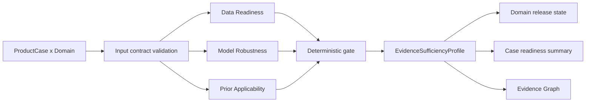

# BRIDGE P0 Evidence Sufficiency 任务卡

| 字段 | 内容 |
| --- | --- |
| Task ID | `TASK-EVIDENCE-SUFFICIENCY` |
| Version | `v0.1-draft` |
| Date | 2026-08-07 |
| Analysis unit | `product case x domain x MeasurementSpec` |
| Primary output | `EvidenceSufficiencyProfile` |
| Current state | `candidate` |

## 1. 任务目标与边界

Evidence Sufficiency 判断某个域的分析结果是否具有足够证据支持当前发布方式。它读取已经生成的 QC、域分析、benchmark、敏感性和知识适用性记录，不重新运行单细胞分析，也不评价产品本身好坏。

本模块回答：

- 当前输入是否足以测量该域。
- 方法或模型是否经过验证，并适用于当前案例。
- reference、prior 和知识快照是否适用于当前生物学上下文。
- raw evidence 可以正式展示、仅作 shadow，还是应返回证据不足。
- 域分数是否具备发布资格。

本模块不生成综合置信分、产品总等级、临床疗效、安全性、potency、GMP 放行或绝对产品排名。`Data Grade` 在本任务中统一改称 `Data Readiness`。

## 2. 输入合同

每次门控至少读取：

- 已确认的 `ProductCase`、`ProductDefinitionCard`、assay、sampling context 和数据角色。
- 对应域和版本的 `MeasurementSpec`，以及存在时的 `ScoreContract`。
- `QCReadinessProfile`、输入数据视图、分母、基因覆盖和检出能力记录。
- 域级 `MeasurementResult`、uncertainty、missing behavior 和 Evidence IDs。
- Tool/Environment/Task Card 状态及 benchmark、source holdout、modality holdout 和校准记录。
- reference、prior、ontology 和 knowledge snapshot 的版本与适用范围。
- reference、preprocessing、annotation、assay、方法和下采样敏感性结果。

系统不得从文件名、路径、accession 或实验室名称推断缺失合同。任一输入记录必须绑定对象版本和 provenance。

## 3. 三轴证据合同

### 3.1 Data Readiness

Data Readiness 针对具体域判断数据是否足以支持相应测量，不形成产品质量等级。

| 状态 | 含义 |
| --- | --- |
| `adequate` | 输入级别、分析单位、分母、assay、基因覆盖和检出能力满足冻结 MeasurementSpec |
| `limited` | 结果仍可解释，但覆盖、独立重复、精度、LOD 或 metadata 存在明确限制 |
| `insufficient` | 关键矩阵、样本层级、分母、基因覆盖或检测能力不满足测量要求 |
| `not_assessed` | `QCReadinessProfile`、MeasurementSpec 或必要资格记录尚未生成 |

必须逐域检查。一个数据集可以对 Target Identity 为 `adequate`，同时对 rare off-target detection 为 `limited` 或 `insufficient`。

### 3.2 Model Robustness

Model Robustness 同时覆盖学习模型和确定性分析方法。它读取任务级验证与案例级适用性，不按工具数量投票。

| 状态 | 含义 |
| --- | --- |
| `validated_applicable` | 方法已冻结，验证范围覆盖当前 source、modality 和 Context of Use，案例级敏感性合格 |
| `candidate_applicable` | 方法可运行且无已知硬失败，但验证、校准或部分敏感性仍未冻结 |
| `unstable` | 结论在冻结的 reference、preprocessing、annotation、assay 或方法替换中发生不可接受漂移 |
| `not_applicable` | 输入、assay、modality、OOD 或模型适用范围与当前案例不相容 |
| `not_required` | MeasurementSpec 明确声明无需学习模型，并已有经验证的确定性测量路径 |
| `not_assessed` | benchmark、适用性或敏感性记录缺失 |

校准需同时查看 prediction-set coverage、reliability、错误类型和 OOD 表现。单一 Brier score、accuracy 或 embedding mixing 指标不能独立证明稳健性。

### 3.3 Prior Applicability

Prior Applicability 判断 reference 和先验知识能否用于当前域，不能将数据库存在本身视为适用。

| 状态 | 含义 |
| --- | --- |
| `applicable` | 物种、assay、标本、解剖区域、发育阶段、产品定义、基因覆盖、版本和许可均满足合同 |
| `partially_applicable` | 主要上下文相容，但存在已记录的层级、模态、阶段或覆盖差异 |
| `inapplicable` | required prior 与当前生物学上下文或数据表示不相容 |
| `not_required` | MeasurementSpec 明确不依赖外部 prior |
| `not_assessed` | prior snapshot、适用性声明或 crosswalk 尚未建立 |

同一 evidence family 的重复数据库记录必须去重。实时联网证据只能进入策展候选，不能改变当次门控。

## 4. 确定性门控

门控按以下优先级执行：

| 条件 | `evidence_sufficiency_state` | 允许行为 |
| --- | --- | --- |
| 必需合同或轴记录尚未生成 | `not_assessed` | 只列出待补记录，不解释域结果 |
| Data Readiness=`insufficient`，或模型=`unstable/not_applicable`，或 required prior=`inapplicable` | `insufficient` | 保留已产生的原始记录；拒绝定向或评分结论 |
| 无硬失败，但数据有限、模型仍为 candidate 或 prior 部分适用 | `limited` | raw evidence 可解释性展示，限制必须与结果并列 |
| 三轴均通过，任务和依赖均在冻结验证范围内 | `sufficient` | raw evidence 可按合同发布 |

`score_state` 与 raw evidence 的充分性分开判断：

| 条件 | `domain_score` | `score_state` |
| --- | --- | --- |
| sufficiency=`sufficient`，Task 和 ScoreContract 已冻结，且存在有效数值 | 数值 | `available` |
| sufficiency 不存在硬失败，使用候选 ScoreContract 生成候选数值 | 候选数值 | `shadow` |
| 没有 ScoreContract、没有数值，或 sufficiency=`insufficient/not_assessed` | `null` | `unavailable` |

当前五个 P0 域没有冻结 ScoreContract，因此即使 raw evidence 为 `sufficient`，仍保持 `domain_score=null`、`score_state=unavailable`。这不表示产品得分为零。

## 5. 分析流程



LLM 可以解释 reason code、帮助研究者补充缺失信息和生成湿实验可读说明，无权修改轴状态、门控结果、阈值、版本或 Evidence ID。

## 6. 工具与方法

| 工具/组件 | 角色 | 当前状态 | 运行方式 | 关键边界 |
| --- | --- | --- | --- | --- |
| `BRIDGE-EVIDENCE-SUFFICIENCY-ENGINE-v0.1` | 三轴规则与最终门控 | `adopted_spec`；实现 `proposed/candidate` | `ENV-EVIDENCE-v0.1`，CPU | 只读取冻结合同和结果，不计算生物指标 |
| Pydantic | 对象、枚举和 JSON Schema 校验 | `shortlisted` | `ENV-EVIDENCE-v0.1` | schema 合格不代表科学证据充分 |
| Pandera | MeasurementResult/benchmark 表格合同候选 | `catalog_only` | `ENV-EVIDENCE-SCHEMA-v0.1` | 非 P0 必需依赖 |
| SciPy bootstrap | 检查区间方法和验证 fixture | `shortlisted/conditional` | `ENV-EVIDENCE-v0.1` | 本模块不擅自对产品细胞重采样 |
| scikit-learn calibration | 校准记录、reliability 和 proper-score 校验 | `shortlisted/conditional` | `ENV-EVIDENCE-v0.1` | 单一指标不能代表完整校准 |
| scConform/conformal outputs | prediction-set coverage 与 OOD 证据输入 | `external_result_only`；`conditional` | 上游 Cell-State benchmark 环境 | 本模块不重跑模型，也不放宽 exchangeability 假设 |
| scIB/scib-metrics outputs | integration 与 biological-conservation 稳健性输入 | `external_result_only`；`conditional` | 上游 Comparison benchmark 环境 | batch removal 和 biology conservation 必须同时看 |
| `BRIDGE-PRIOR-APPLICABILITY-MATCHER-v0.1` | 上下文、覆盖和版本规则匹配 | `adopted_spec`；实现 `proposed/candidate` | `ENV-EVIDENCE-v0.1`，CPU | 不根据数据库条目数量计算支持度 |
| OAK | ontology traversal/crosswalk 候选 | `proposed_optional`；`catalog_only` | `knowledge_curator` | 不作为 P0 正式门控依赖 |

正式门控不依赖 GPU，也不要求联网。所有外部工具只通过版本化结果和 Evidence IDs 交换信息。

## 7. `EvidenceSufficiencyProfile` 输出合同

至少包含：

```text
profile_id / profile_version / gate_rule_version
product_case_ref / product_definition_ref / domain_id
measurement_spec_ref / score_contract_ref
data_readiness / data_reason_codes / qc_profile_ref
model_robustness / robustness_reason_codes / validation_refs
prior_applicability / prior_reason_codes / snapshot_refs
evidence_sufficiency_state / blocking_reasons / limiting_reasons
domain_score / score_state
measurement_result_refs / evidence_refs / sensitivity_refs
created_at / deterministic_run_ref
```

案例级 `CaseEvidenceReadinessSummary` 只包含各域 `sufficient/limited/insufficient/not_assessed` 数量、`score_state` 数量和阻塞原因列表。不得生成 overall grade、总分、排行榜或“通过/失败产品”标签。

## 8. 运行环境

| 环境 | 组件 | 当前状态 |
| --- | --- | --- |
| `ENV-EVIDENCE-v0.1` | Pydantic、pandas、SciPy、scikit-learn 与确定性门控 | `proposed` |
| `ENV-EVIDENCE-SCHEMA-v0.1` | Pandera 及 schema fixture | `proposed_optional`；不阻塞 P0 |
| upstream benchmark environments | scConform、scIB 和其他域级 benchmark | `external_result_only` |
| `knowledge_curator` | OAK 与 ontology 审核工具 | `proposed_optional` |

主流程使用 CPU。正式冻结需保存 package lock、gate-rule snapshot、schema fixture、reason-code catalog 和确定性回归测试。

## 9. Web 必备可视化

- domain x 三轴状态矩阵，状态文字和颜色同时编码。
- 单域 gate trace，显示每个输入、规则、reason code 和最终状态。
- Data Readiness 下钻：输入级别、基因覆盖、分母、LOD 和缺失 metadata。
- Model Robustness 下钻：holdout、calibration、OOD、下采样和方法敏感性。
- Prior Applicability 下钻：context match、crosswalk、覆盖、版本和证据家族。
- missing/negative/unknown/unavailable/alert 状态矩阵。
- 案例运行摘要，只显示域状态计数和阻塞原因。

不得使用综合仪表盘、总等级或 Evidence Confidence Score。每个图表必须绑定 ProductCase、domain、MeasurementSpec、gate-rule version 和 Evidence IDs。

## 10. 拒答与失败规则

- 缺 ProductCase、domain 或 MeasurementSpec：返回 `not_assessed`。
- 缺关键矩阵、分母或样本层级：Data Readiness=`insufficient`。
- benchmark 未覆盖当前 source/modality：不得写 `validated_applicable`。
- reference gap 或 OOD 使结果不可解释：Model Robustness=`not_applicable` 或 `unstable`。
- required prior 不适用：Prior Applicability=`inapplicable`。
- 同源数据库或相关方法数量增加：不得提高 sufficiency。
- 工具执行失败：保留失败记录，不自动换用未注册方法。
- 一个域不足：只阻塞该域，不修改其他域的 raw evidence 或状态。

## 11. Validation 与冻结要求

| 场景 | 预期结果 |
| --- | --- |
| 五域输入状态不同 | 每个域独立门控，不传播零值或失败状态 |
| raw evidence 充分但无 ScoreContract | `sufficient` + `domain_score=null` + `score_state=unavailable` |
| candidate 方法或 partial prior | `limited`，限制与结果并列 |
| 关键 metadata、reference 或方法适用性失败 | `insufficient` 和稳定 reason code |
| 合同记录完全缺失 | `not_assessed`，不冒充 negative |
| 同 evidence family 多工具一致 | 去重后保留一致性，不进行多数投票 |
| reference/preprocessing swap 反转结论 | `unstable`，阻塞定向结论 |
| sealed competitor | 对规则、阈值、reason code 和工具选择的数据流为零 |
| 重复运行同一版本输入 | 输出逐字段一致 |
| Agent/LLM 给出不同意见 | 数值、状态和 reason code 保持不变 |

任务晋升为 `frozen` 前，需完成 schema、missing-input、source/modality holdout、OOD、下采样、reference/preprocessing swap、同源证据去重、版本迁移、隐私和 claim review。

## 12. Legacy Migration

以下旧语义明确废弃：

- `complete/partial/minimal -> 90/70/50` 的 Evidence Confidence Score。
- 根据 dataset role 和固定 target/off-target 阈值生成 product/negative `pass/fail`。
- 将 Evidence Confidence 当作产品质量域或与生物域共同合成总分。
- 证据缺失时补零、推断负控通过或推断产品失败。

服务器现有 `validation.py` 只可复用 schema/file 检查、字段白名单和私有路径扫描思路；旧 domain list、角色阈值和 pass/fail 规则不得迁入新门控。PRD、Analysis Task Cards、Object Schemas 和 Visualization Registry 的术语同步在本任务审核通过后另行进行。

## 13. 主要官方来源

- Pydantic JSON Schema：https://pydantic.dev/docs/validation/latest/concepts/json_schema/
- Pandera：https://pandera.readthedocs.io/en/stable/
- SciPy bootstrap：https://docs.scipy.org/doc/scipy/reference/generated/scipy.stats.bootstrap.html
- scikit-learn probability calibration：https://scikit-learn.org/stable/modules/calibration.html
- scConform / conformal single-cell annotation：https://pmc.ncbi.nlm.nih.gov/articles/PMC12506889/
- scIB metrics：https://scib-metrics.readthedocs.io/en/stable/api.html
- Ontology Access Kit：https://incatools.github.io/ontology-access-kit/introduction.html
