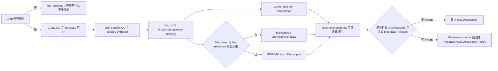

# BRIDGE P0 Graft 独立评估任务卡

| 字段 | 内容 |
| --- | --- |
| Task ID | `TASK-GRAFT-ASSESSMENT-v0.1` |
| 文档版本 | `0.2-candidate` |
| 日期 | 2026-08-24 |
| 状态 | `candidate` |
| 适用范围 | 可选的移植后 graft scRNA-seq/snRNA-seq 独立评估 |
| 当前运行输入 | 一个 `GraftAssessmentSpec` 和一个 `GraftEvidenceBundle`；未来证据生产层仍可读取 `GraftCase`、QC、MeasurementSpec 与 reference snapshot |
| 主要输出 | 当前可执行切片输出一个 `GraftAssessment`；显式 preparation linkage 作为内部记录嵌入，不另造第二个运行产物 |

## 1. 任务目标与边界

本模块对移植后的 graft 进行独立转录组画像，回答 graft 中形成了哪些细胞状态、mDA 细胞与人胎中晚期参考的相似性、不同 animal/graft 或移植后时间点之间是否稳定，以及观察结果与来源 preparation 是否存在描述性支持或冲突。

- Graft 是可选输入。用户未提供 graft 时返回 `not_provided`，不降低移植前产品的证据状态。
- Graft 结果与移植前产品评估分库存储，不回填移植前分域结果、阈值、训练标签或产品比较结论。
- 当前没有匹配的临床疗效、安全性或功能真值。本模块不输出临床疗效、安全性、potency、GMP 放行或 graft 总分。
- scRNA-seq 与 snRNA-seq 使用独立 `MeasurementSpec`，不得直接复用未验证的阈值、检出边界或分类校准。
- 分析单位为独立 `animal/graft x post-transplant timepoint`。cell 或 nucleus 不能充当 biological replicate。
- 时间、cell line、protocol、sorting 或 assay 完全混杂时，只能输出 `descriptive_only`。

### 1.1 当前可执行切片

P0-12 v0.2.0 不直接执行本任务卡后文列出的表达矩阵 QC、物种分配、
reference mapping、cell-state、composition、maturation、trajectory 或
communication 方法。它只封装这些上游流程已经形成的结构化观测：

- 一个 checksummed `GraftAssessmentSpec` 提供 ProductCase/MeasurementSpec/
  assay/sampling/reference/algorithm 绑定，以及 channel、单位、可接受
  evidence state、最小独立单位数和可选解释区间；
- 一个 checksummed `GraftEvidenceBundle` 提供显式 graft context、按
  `animal/graft/timepoint` 组织的独立单位、预计算观测、design constraint
  引用及可验证的 preparation linkage；
- 代码只输出每个配置 channel 的 eligible unit 数、均值、范围和相对输入
  区间的位置。它不含 state 名称、物种、月份、基因、程序或阈值常量；
- `graft_availability=not_provided` 是显式输入状态，会产生可追溯的
  `not_provided` 结果，不降低任何移植前证据；
- `graft_score` 与 `domain_score` 固定为 `null`，`product_backfill` 固定为
  `not_performed`。

因此后文的生物学路线仍是候选研究要求，不是当前执行器已经完成的能力。
未来调整状态、reference、宿主、时间设计或解释阈值时，应版本化输入对象，
而不是修改本模块的确定性汇总代码。

## 2. 当前数据资产

### 2.1 内部数据

| 逻辑资产 ID | Assay 与时间 | 当前规模与命名 | 当前角色 | 关键限制 |
| --- | --- | --- | --- | --- |
| `GRAFT-INT-679M-SN-v0.1` | human graft snRNA；6/7/9 MPT | 16,872 nuclei；DA0-4、Glut、Astro、OPC/Oligo、VLMC | 主要内部描述性案例；reference mapping 与可视化开发 | 6M=H9、7M=BJES、9M=PD023，timepoint 与 cell line 完全混杂；未发现可用 animal/graft ID |
| `GRAFT-INT-1246M-LEGACY-v0.1` | 1/2/4/6 MPT；assay/specimen 待冻结 | 89,139 profiles；历史 neuronal/glial-perivascular 及细状态命名 | 历史方法和数据清点 | 早期 annotation 可靠性不足；sample、animal、assay 与来源合同不完整 |

`GRAFT-INT-679M-SN-v0.1` 的细胞数为：6M H9 4,341、7M BJES 6,938、9M PD023 5,593。历史标签包括 DA0 1,125、DA1 665、DA2 4,908、DA3 2,625、DA4 2,422、Glut 1,696、Astro 2,774、OPC/Oligo 142 和 VLMC 515。这些标签是待重新评测的 annotation 资产，不自动视为 BRIDGE 冻结真值。

`GRAFT-INT-1246M-LEGACY-v0.1` 的时间点规模为：1M 25,114、2M 17,459、4M 29,930、6M 16,636。完成 assay、specimen、sample、animal 和 annotation provenance 审核前保持 `historical_candidate`。

### 2.2 公开数据

| 资产 | Assay、宿主与时间 | 本地状态 | 本模块用途 | 限制 |
| --- | --- | --- | --- | --- |
| `GSE200610` | human graft snRNA；6-OHDA rat；3/6 MPT | 12 个 graft h5ad、14,414 nuclei；`converted_partial` | whole-graft composition、lineage context、公开方法验证候选 | 当前对象缺少可直接使用的 animal/timepoint/lineage manifest |
| `GSE204796` | human EGFP+ graft scRNA；PD mouse；4 MPT | sorted/unsorted 原始矩阵本地可用；`conversion_required` | scRNA graft 模态候选；sorting sensitivity | 不能把 sorted fraction 直接当 whole-graft composition |
| `GSE118412/GSE132758` | graft Smart-seq2/10x scRNA；rat；6/12 MPT | counts/RPKM 与 archive 本地可用；`conversion_required` | 长期 graft composition 和跨研究 sensitivity | 不同 assay 和实验块需分别建立 manifest |
| `E-MTAB-14729` | Boost/Boost+ graft snRNA；1/9 MPT | graft 矩阵当前不在本地；`sealed_competitor` | 冻结后外部检验 | 不进入 reference、prior、方法选择、调参或阈值设计 |
| `GSE233885` | hPSC-derived graft snRNA + projection barcode；rat；约 12 MPT | `not_local/candidate` | 未来 projection-linked mDA subtype 验证 | 本轮不下载；projection evidence 不能替代普通 graft 的 measured data |

公开来源见第 13 节。服务器绝对路径、用户名和内部样本 metadata 不进入本文档或配套 Registry。

## 3. 两级 Reference 合同

### 3.1 一级：GW14-25 snRNA broad/neurogenesis reference

- 完整人胎 snRNA 对象包含 GW14/16/18/20/24/25 共 87,467 nuclei 和 15 个 broad cell types。
- 正式 graft neurogenesis mapping 使用其中 57,666 个 GW14-25 snRNA neurogenesis profiles，包括 9,516 个 `Neuron_DA`，并保留 Glut、GABA、Sero、OMTN、ChAT、RG/Nb/IPC 等相邻或 off-axis 状态。
- 该 reference 支持 whole-graft broad composition、DA broad identity 和 neuronal lineage context。
- 合并 sc/sn 的 83,017-profile neurogenesis 派生对象只能作为同一 source family 的派生视图，不能与父 reference 重复计数。

### 3.2 二级：GW14-20 fine mDA reference

历史 fine mDA 对象包含 GW14/16/18/20 共 6,442 nuclei、4 个 mDA group 和 14 个 fine subtype。按标准化 barcode 与胎龄回接完整 snRNA 对象后：

- 6,149 个细胞可唯一回接。
- 6,143 个在完整对象中为 broad `Neuron_DA`。
- 293 个细胞未回接。
- 6 个细胞存在 broad-label 冲突。

该对象当前为 `freeze_required`。正式晋升前必须冻结 barcode crosswalk、处理未映射和冲突细胞、核对完整 count view、完成 marker/程序审核，并通过 source/modality holdout 与开放集验证。在此之前，fine subtype mapping 只能进入 `benchmark` 或 `shadow`。

### 3.3 成人 mDA sensitivity

成人 mDA reference 仅用于检查 graft 结果是否对 adult reference 敏感，不作为主 reference，也不把 adult-like support 自动解释为功能成熟或产品更好。

一级、二级和成人派生视图均记录 `source_family` 与 `evidence_family_id`。同一父数据派生出的多个视图不能被当成多个独立支持证据。

## 4. 输入合同

`GraftCase` 至少包含：

```text
graft_case_id / asset_version / checksum / source_accession
host_species / disease_model / graft_site / hemisphere
animal_id / graft_id / post_transplant_timepoint
donor_or_cell_line / originating_preparation_id / linkage_evidence
assay / specimen / library_method / sorting_strategy
species_assignment_method / data_role / access_policy
sample_id / biological_replicate / technical_replicate
count_view / expression_view / annotation_version
missing_fields / user_confirmations
```

- `animal_id`、`graft_id` 或 timepoint 缺失时，Agent 只能运行不依赖该字段的模块。
- `originating_preparation_id` 缺失时仍可生成独立 `GraftAssessment`，但 linkage 状态必须为 `provided_unlinked`。
- 系统不得从文件名、目录、cluster 名或论文惯例推断 graft 关系。
- 人源细胞已经过物理 sorting 或仅提供人源矩阵时，必须如实记录 species assignment 未重新评测。

## 5. 分析流程



## 6. 分析任务与工具组合

### 6.1 GraftCase、Species 与 QC

- `GRAFT-CASE-VALIDATOR` 核对宿主、动物、graft、时间、assay、specimen、sorting、species 和来源关系。
- 基础 QC 复用 Input Audit & QC 的 `all_cells_view`、`eligible_cells_view` 和 `sensitivity_views`，但使用 graft-specific scRNA/snRNA `MeasurementSpec`。
- 提供混合物种原始 FASTQ 时，可条件性评测 XenoCell 或双物种 reference mapping；只提供处理后人源矩阵时不得声称重新验证了 host/graft 分离。
- mixed-species multiplet、ambiguous species 和 host contamination 分开报告，不自动删除原始 counts。

### 6.2 Graft Cell-State Ensemble

Cell-State 模块在 graft 场景下仍是方法评测与证据整合框架，不预设单一分类器。首轮目录包括：

- 内部 marker/gene-program evidence。
- sample/state pseudobulk reference correlation。
- CellTypist custom classifier、SingleR 和 scmap。
- Seurat anchor transfer、MetaNeighbor、scVI/scANVI/scArches。
- prediction set、方法分歧和 OOD/unknown。

方法必须分别在 broad composition、neurogenesis state 和 fine mDA subtype 三个标签层级上评测。历史 Seurat transfer、MetaNeighbor、correlation heatmap 和人工 marker 结果登记为 `historical_candidate`，不能直接进入正式 Evidence Graph。

### 6.3 Whole-graft Composition

- 主分母为全部 human graft `eligible_cells_view`，不得只分析 DA 富集子集。
- 报告 DA、other neuronal、astrocyte、OPC/oligo、VLMC/perivascular、progenitor、clear off-axis、role unresolved 和 unknown。
- 以 soft assignment 为主、hard label 为 sensitivity；保存 count、fraction、区间、分母和 rare-state 检出边界。
- 单 animal/graft 只作描述性组成。存在独立重复时再评测 propeller、scCODA/sccomp 等 sample-level 组成模型。
- Astrocyte、VLMC 和 OPC/oligo 的比例升高不解释为产品改善，也不在缺少阈值证据时施加任意线性惩罚。

### 6.4 mDA Maturation 与 Subtype

- 先使用 GW14-25 snRNA reference 输出 broad DA 与 neurogenesis state support，再在 DA 子集上调用通过验证的 fine mDA mapping。
- 保存完整 `reference_support_distribution`，不只输出单个标签。
- pseudobulk correlation、marker/program evidence 与一个监督或映射通道构成互补证据；同一模型的多个输出不算独立证据。
- dopamine synthesis/handling、axon、synapse、electrophysiology-related、mitochondrial/oxidative 和 maturation programs 分开记录 measured expression 与 inferred activity。
- CytoTRACE2、trajectory/pseudotime 和 adult reference mapping 只作 `shadow`；输出不得称“等效胎龄”“达到成人成熟”或真实功能。

### 6.5 Time、Stability 与跨研究比较

- 以 animal/graft 为分析单位，报告同条件下的组成和状态差异、区间及 reference/preprocessing sensitivity。
- 有独立 biological replicates 时，可用 sample-level pseudobulk、propeller、muscat/edgeR/limma 或预注册 mixed model。
- 内部 6/7/9M 数据因 timepoint 与 cell line 完全混杂，固定返回 `descriptive_only`，不能推断时间进展或 cell line 效应。
- 内部 1/2/4/6M 历史数据在 metadata 和 annotation 冻结前不进入正式时间比较。
- 不同 assay、host、graft site、sorting 或 preparation 的结果只能作为 contextual comparator，不能直接排名。

### 6.6 Preparation-Graft Association

仅在存在显式 `originating_preparation_id` 和 linkage evidence 时生成 `PreparationGraftAssociationRecord`。记录 preparation 与 graft 在身份、组成、程序或 unknown 上的支持、冲突和 unresolved evidence，不执行因果归因，不把 graft 结果写回移植前对象。

### 6.7 Lineage、Projection 与 Host-Graft Communication

- lineage barcode 只有在 barcode table、experiment、replicate 和 join contract 完整时运行；普通 graft 不推断克隆命运。
- projection-linked subtype 只适用于具有实际 retrograde barcode 或 projection measurement 的数据；外部 projection prior 不能替代样本测量。
- host-graft communication 仅在 host 与 graft profiles 同时测得、物种分离和 ortholog/ligand-receptor contract 合格时运行，否则为 `not_assessed`。
- 三类结果均为 `conditional/shadow`，不构成 graft 分数或移植前产品结论。

## 7. 输出合同

当前 v0.2.0 只实现下表中的 availability、linkage、analysis mode、配置化
channel summary、reason/provenance、null score 与 no-backfill 边界。composition、
reference support、subtype、program、time 和 sensitivity 等丰富字段仍属于后续
证据生产与合同扩展，不是当前运行结果中伪造的空壳。

### 7.1 `GraftAssessment`

| 字段 | 含义 |
| --- | --- |
| `graft_availability` | `not_provided` / `provided` |
| `linkage_state` | `provided_unlinked` / `provided_linked` / `not_applicable` |
| `analysis_mode` | `static_profile` / `descriptive_only` / `inferential` / `unavailable` |
| `measurement_spec_ref` | graft scRNA 或 snRNA 的冻结合同 |
| `species_qc` | species method、human/host/ambiguous evidence 与适用性 |
| `denominators` | all/eligible human graft profiles 及 sensitivity views |
| `composition_profile` | 各状态 count、soft/hard fraction、区间和 LOD |
| `fetal_reference_support` | GW14-25 broad/neurogenesis 支持分布 |
| `mda_subtype_support` | fine mDA 支持、prediction set、分歧和状态 |
| `maturation_programs` | measured/inferred program evidence 与基因覆盖 |
| `unknown_ood` | unknown 原因、OOD 与 reference gap |
| `time_stability` | animal/graft/timepoint 设计、效应和混杂 |
| `sensitivity` | reference、method、QC、preprocessing、assay sensitivity |
| `evidence_state` | `available` / `shadow` / `unavailable` |
| `graft_score` | 固定为 `null` |
| `provenance` | case、tool、reference、environment、参数、artifact 与 Evidence IDs |

### 7.2 `PreparationGraftAssociationRecord`

保存 preparation/graft 引用、linkage evidence、共同可比较指标、支持/冲突/unresolved 状态、方法限制、Evidence IDs 和版本。该对象只能为描述性关联，不能表示移植前产品导致了 graft 结果。

## 8. 状态、拒答与降级规则

| 条件 | 输出行为 |
| --- | --- |
| 用户未提供 graft | `graft_availability=not_provided`；移植前评估不受影响 |
| graft 已提供但无 preparation linkage | 生成独立 `GraftAssessment`；`provided_unlinked` |
| 缺少 animal/graft ID | 不发布个体间变异或推断性统计 |
| timepoint 与 cell line/protocol 完全混杂 | `descriptive_only`；显式列出混杂 |
| sc/sn MeasurementSpec 不匹配 | 对应结果 `unavailable`，不复用另一模态阈值 |
| species assignment 不可复核 | 保留提供方状态并标记 `not_reassessed` |
| fine reference 未冻结或 DA 分母不足 | fine subtype 为 `shadow` 或 `unavailable` |
| reference/method 严重冲突 | 保留各通道并标记 `unstable`；拒绝定向结论 |
| 某状态零观测 | `not_detected_above_lod` 或 `cannot_exclude`，不能写“确定不存在” |
| sealed competitor | 不参与方法选择、参数、reference、prior 或阈值 |

## 9. Web 可视化

- GraftCase、metadata completeness、species/QC 与分析资格摘要。
- 以完整 human graft 为分母的组成图，并可下钻 broad family、internal state、unknown 和 LOD。
- DA subset 的 fine subtype support、prediction set 与方法分歧图。
- 按 source/modality 分面的 fetal reference support 热图或 ridge plot。
- maturation program heatmap/dot plot，区分 measured expression 与 inferred activity。
- animal/graft/timepoint 组成与状态差异；混杂设计必须显示 `descriptive_only`。
- reference、method、preprocessing、QC 和 assay sensitivity 图。
- preparation-graft Evidence Graph；lineage/projection 图只在对应数据真实存在时显示。

每张正式图绑定 Evidence ID、输入版本、分母、单位、assay、reference、方法、区间和 missing/unknown 状态。

## 10. 运行环境

| 环境 | 用途 | 当前状态 |
| --- | --- | --- |
| `ENV-GRAFT-PY-v0.1` | AnnData/Scanpy、组成、bootstrap、pseudobulk、scVI/scANVI、统计与可视化 | `proposed` |
| `ENV-GRAFT-CELLTYPIST-v0.1` | CellTypist custom classifier | `proposed_benchmark` |
| `ENV-GRAFT-BIOC-v0.1` | SingleR、scmap、MetaNeighbor、Seurat、speckle/propeller、muscat 等 | `proposed_isolated` |
| `ENV-GRAFT-SPECIES-v0.1` | XenoCell、双物种 reference 与 species fixture | `proposed_isolated` |
| `ENV-GRAFT-LINEAGE-v0.1` | lineage/projection adapter 与条件性工具 | `proposed_isolated` |

正式核心流程不依赖 GPU。深度 reference mapping 可在 benchmark 中使用 GPU，但安装成功不等于科学验证通过。环境间只交换版本化 h5ad/Parquet/TSV、矩阵、JSON manifest 和 checksum。

## 11. Benchmark 与冻结要求

| 验证项 | 最低要求 |
| --- | --- |
| Metadata | host、animal、graft、timepoint、cell line、assay、specimen、sorting 和 linkage 字段逐项检查 |
| Reference lineage | source/derived/evidence-family 血缘明确，不重复计数 |
| Fine mDA crosswalk | 复现 6,149 mapped、293 unmapped 和 6 broad-label conflicts；冲突有审核结论 |
| 数据拆分 | source、lab、donor/cell line、animal 与 modality holdout；禁止 cell-level random split 充当外部验证 |
| 物种 | human/host/ambiguous/mixed fixture、species contamination 与 mixed-species multiplet 测试 |
| Cell state | broad、neurogenesis 和 fine subtype 分层评测；包含 leave-one-state-out 与真实 OOD |
| Composition | 已知比例混合、rare-state spike-in、下采样、区间覆盖和 false reassurance |
| 稳健性 | reference、method、preprocessing、QC view、gene coverage 和 sc/sn swap |
| 时间/重复 | 无 animal ID 或完全混杂时正确降级；cell 不作为 replicate |
| Leakage | sealed competitor 到 reference、prior、训练、方法选择和阈值的数据流为零 |
| Claim | 不出现疗效、安全性、potency、放行、等效胎龄、成人成熟或 graft 回填措辞 |

只有通过任务级验证并冻结 tool、environment、reference、MeasurementSpec、参数、schema、reason code 和验收阈值的方法才能生成 formal Evidence。其他方法保持 `candidate`、`benchmark`、`shadow`、`historical_candidate` 或 `deferred`。

## 12. Agent 调用边界

Agent 可以读取已确认的 `GraftCase`、选择已注册且适用的工具组合、解释 Evidence Graph、展示混杂与缺失、推荐需要补充的 metadata 或正交测量。

Agent 不可以：

- 从文件名推断 animal、timepoint、cell line 或 preparation linkage。
- 根据待评 graft 的结果临时挑选最有利的 reference、方法或参数。
- 修改工具数值、阈值、Evidence ID 或冻结状态。
- 把细胞数量当作 biological replication。
- 把 graft composition、maturation 或 projection 解释为移植前产品疗效、安全性或功能标签。

## 13. 主要官方来源

- GSE200610：https://www.ncbi.nlm.nih.gov/geo/query/acc.cgi?acc=GSE200610
- GSE204796：https://www.ncbi.nlm.nih.gov/geo/query/acc.cgi?acc=GSE204796
- GSE118412：https://www.ncbi.nlm.nih.gov/geo/query/acc.cgi?acc=GSE118412
- GSE132758：https://www.ncbi.nlm.nih.gov/geo/query/acc.cgi?acc=GSE132758
- Tiklova et al. graft composition：https://www.nature.com/articles/s41467-020-16225-5
- GSE233885：https://www.ncbi.nlm.nih.gov/geo/query/acc.cgi?acc=GSE233885
- TARGET-seq：https://pmc.ncbi.nlm.nih.gov/articles/PMC11588066/
- XenoCell：https://pmc.ncbi.nlm.nih.gov/articles/PMC7847033/ ; https://gitlab.com/XenoCell/XenoCell
- Seurat reference transfer：https://satijalab.org/seurat/reference/findtransferanchors
- SingleR：https://www.bioconductor.org/books/release/SingleRBook/
- scmap：https://bioconductor.org/packages/release/bioc/html/scmap.html
- MetaNeighbor：https://bioconductor.org/packages/release/bioc/html/MetaNeighbor.html
- scVI/scANVI/scArches：https://docs.scvi-tools.org/en/stable/tutorials/notebooks/scrna/scarches_scvi_tools.html
- CellTypist：https://celltypist.readthedocs.io/
- speckle/propeller：https://bioconductor.org/packages/release/bioc/html/speckle.html
- scCODA：https://sccoda.readthedocs.io/
- muscat：https://bioconductor.org/packages/release/bioc/html/muscat.html
- CytoTRACE2：https://github.com/digitalcytometry/cytotrace2
- Cell Ranger reference building：https://www.10xgenomics.com/support/software/cell-ranger/latest/analysis/inputs/cr-3p-references
