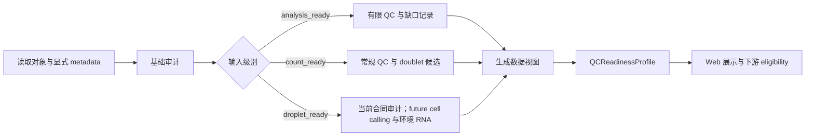

# BRIDGE P0 输入审计与 QC 任务卡

| 字段 | 内容 |
| --- | --- |
| Task ID | `TASK-INTAKE-QC-v0.1` |
| 文档版本 | `0.1` |
| 日期 | 2026-08-06 |
| 状态 | `candidate` |
| 适用范围 | 移植前 scRNA-seq / snRNA-seq 表达对象；PD hPSC-mDA 为首个实例 |
| 运行边界 | 从表达矩阵或分析对象开始，不覆盖 FASTQ/BAM 重处理 |

## 1. 任务目标与边界

本任务判断输入数据是否足以支持后续 BRIDGE 分析，并生成结构化的 `QCReadinessProfile`。它检查数据结构、矩阵语义、样本层级、常规单细胞 QC、doublet、cell calling 与环境 RNA 证据，但不生成产品质量总分，也不对临床疗效、安全性、功能或放行作结论。

P0 遵循以下原则：

- 保留原始输入及全部细胞，不静默覆盖 counts 或删除细胞。
- 缺失上游文件或原始 droplets 记为 `not_assessed` 或 `not_applicable`，不记为阴性结果。
- scRNA-seq 与 snRNA-seq 共用任务框架，但分别绑定冻结的 `MeasurementSpec`。
- 所有 count-based 方法必须确认矩阵为未归一化、非负、整数型 UMI counts。
- 基因集合指标必须绑定 `var_names` 或显式声明的 `var` 基因符号列；未覆盖目标基因集合时返回 `unavailable`，不得写成比例为零。
- 单个 observation 的 total count 为零时，mitochondrial、ribosomal 与 top-gene fraction 均为未定义值；该 observation 不得进入候选 eligible view。
- 三列 10x MTX 必须提供完整的 feature-type 值，且 QC 矩阵只保留精确标记为 `Gene Expression` 的行；ADT、guide 或其他 feature 不得混入基因 QC。既有两列 `genes.tsv/features.tsv` 仍按“全部为 Gene Expression”的显式兼容假设读取，并记录 `legacy_two_column_features_assumed_gene_expression`，不得静默升级证据。
- `sample_id`、文件名或目录名不得被自动解释为 `capture_id`、library 或 biological replicate。

## 2. 输入级别

输入级别描述可运行能力，不表示样本质量高低；后一级包含前一级要求。

| 输入级别 | 最低要求 | 可运行模块 | 缺失行为 |
| --- | --- | --- | --- |
| `analysis_ready` | 可读取的 cell × gene 表达对象；唯一 cell/gene ID；assay、物种、样本层级及矩阵语义声明 | 结构审计、元数据完整性、基因覆盖、有限的已处理表达分布检查 | count-based QC、doublet、cell calling 和环境 RNA 模块标记 `ineligible` 或 `not_assessed` |
| `count_ready` | `analysis_ready` + cell-called barcodes 的未归一化 UMI counts；每个 observation 有逐行完整、由调用者声明的 `capture_id`；建库/chemistry 信息 | 常规 QC、flag 生成、scDblFinder/Scrublet 候选评估、下采样和阈值敏感性 | 无未过滤 droplet matrix 时，不运行 cell calling 或环境 RNA 建模 |
| `droplet_ready` | 未过滤 10x droplet matrix、明确 `capture_id`、原始/filtered barcode 关系和上游运行信息 | 当前仅做结构与合同审计；future executor 才条件运行 emptyDrops、CellBender 或 SoupX | cell calling 与环境 RNA 返回 `not_assessed`，不能把全部 barcode 当作细胞 |

- 历史公开数据允许以 `analysis_ready` 或部分 `count_ready` 进入，并明确证据缺口。
- 新测内部数据以 `droplet_ready` 为采集目标，同时保存上游运行报告和不可变原始矩阵。

## 3. 条件化分析流程

1. **基础审计**：验证对象可读性、稀疏矩阵、维度、唯一 ID、基因标识符、缺失值、非负性、矩阵层语义、样本层级与来源版本。
2. **上游运行审计**：若提供 Cell Ranger 或等价报告，抽取 reads、mapping、barcode、cell count 等运行指标；未提供时只记录缺失。
3. **常规 QC**：只在 capture 值逐 observation 完整且不含显式 missing sentinel 时按 capture 展示 counts、detected genes、mitochondrial/ribosomal fraction、top-gene fraction 与离群状态。阈值来自对应 `MeasurementSpec`，不跨 scRNA/snRNA 复用。
4. **Doublet**：仅对 `count_ready` 及以上输入按 capture 运行。scDblFinder 是待验证主候选，Scrublet 是同一转录组证据家族的算法校验；二者不构成正交证据。
5. **Cell calling**：仅对 `droplet_ready` 输入运行 emptyDrops 或其他已冻结方法，并与原始 barcode call 并列展示。
6. **环境 RNA**：仅在输入满足工具要求时运行。校正矩阵只进入 `sensitivity_views`，原始 counts 始终保留为主要计数视图。
7. **视图与结论**：根据冻结规则生成数据视图和模块 eligibility；技术不足不能被解释为产品生物学低分。

## 4. 推荐工具组合

| 分析步骤 | 推荐工具/方法 | 适用输入 | 当前状态 | 正式用途 | 主要失败条件 |
| --- | --- | --- | --- | --- | --- |
| 案例与结构审计 | `BRIDGE-CASE-VALIDATOR` | 全部 | `adopted_spec` | 校验 ProductCase、样本层级、矩阵声明和缺失字段 | 数据角色或关键层级未声明 |
| 对象读取 | AnnData | h5ad/zarr | `adopted` | 检查 `X/layers/obs/var/obsm/uns` 与数据指纹 | 对象损坏、ID 不唯一、矩阵不可读 |
| 上游报告汇总 | MultiQC Cell Ranger module | 有上游报告 | `conditional` | 汇总 vendor/library metrics | 报告缺失或格式不受支持 |
| 基础 QC 指标 | Scanpy QC | 明确的 count/expression view | `adopted` | 计算并保存透明 raw metrics | layer 语义不明或 count 方法收到 normalized matrix |
| QC flags | `BRIDGE-QC-FLAG-ENGINE` | `analysis_ready` 及以上 | `adopted_spec` | 按 MeasurementSpec 生成可追溯 flags | assay spec 未冻结或关键分母缺失 |
| QC 独立校验 | scuttle / miQC | 条件满足的 scRNA-seq | `candidate` / `conditional` | 检查离群规则或概率边界的敏感性 | 当前 scuttle release 为 legacy；miQC 不直接外推至 snRNA |
| Doublet 主候选 | scDblFinder | `count_ready` 及以上 | `candidate` | per-capture score、class 与阈值记录 | `capture_id` 未逐 observation 完整声明、细胞过少、counts 不合格 |
| Doublet 算法校验 | Scrublet | `count_ready` 及以上 | `conditional` | 同证据家族敏感性比较 | 多 capture 混跑、counts 不合格、阈值不稳定 |
| Cell calling | DropletUtils `emptyDrops` | `droplet_ready` | `conditional` | barcode-level cell-containing evidence | 缺未过滤 droplet matrix |
| 环境 RNA 模型 | CellBender `remove-background` | `droplet_ready` | `conditional` | 生成校正矩阵、posterior 和运行报告 | 工具未部署、GPU/输入不满足、版本未冻结 |
| 环境 RNA 校验 | SoupX | `droplet_ready` scRNA-seq | `candidate` | contamination estimate 与替代校正视图 | 缺 empty droplets、cluster/context 或 snRNA 适用性未验证 |
| 扩展 QC | scQCenrich / SampleQC | 专项开发数据 | `deferred` | 研究期比较，不进入 P0 正式结论 | 适用范围、循环证据或多样本要求未解决 |

具体版本、许可证、环境、官方文档、源码和论文由配套 Excel Registry 维护。安装成功不等于科学验证通过。

## 5. 知识与 reference 绑定

QC 只绑定与数据解释直接相关的版本化资源：

- 基因标识符与注释：GENCODE、HGNC、Ensembl。
- 线粒体、核糖体及 feature biotype 集合：由冻结 gene annotation snapshot 派生。
- 上游运行指标定义：测序平台或 Cell Ranger 官方文档。
- assay 规则：分别维护 `MeasurementSpec.scRNA` 与 `MeasurementSpec.snRNA`。

疾病 marker、目标细胞 marker、产品优劣标签和下游过程状态程序不进入本任务的 QC 判定，避免与后续评估形成循环证据。

## 6. `QCReadinessProfile` 输出合同

| 字段 | 内容 |
| --- | --- |
| `input_level` | `analysis_ready` / `count_ready` / `droplet_ready` |
| `assay_spec_id` | 已冻结的 scRNA 或 snRNA `MeasurementSpec` ID |
| `schema_integrity` | 对象结构、维度、ID 和数据类型检查结果 |
| `metadata_completeness` | 必填层级与字段的存在性，不保存私有原始值 |
| `matrix_provenance` | counts/expression view、基因标识来源、语义和验证状态 |
| `upstream_library_qc` | 上游报告证据；无报告时为 `not_assessed` |
| `cell_qc` | sample/capture 级 raw metrics、flags、分母与区间 |
| `doublet_assessment` | 方法、score/class、分歧、适用性与证据家族 |
| `cell_calling_assessment` | 原 call 与候选 call 的 barcode-level 比较 |
| `ambient_assessment` | contamination evidence 及原始/校正视图差异 |
| `module_eligibility` | 各下游模块的 `eligible` / `conditional` / `ineligible` |
| `missing_inputs` | 未提供但会影响分析的问题 |
| `blocking_issues` | 阻断正式下游分析的问题 |
| `warnings` | 不阻断但需要解释的问题 |
| `evidence_ids` | 指向输入、工具结果、图表和参数记录的 Evidence ID |

状态统一使用：`ready`、`limited`、`blocked`、`not_assessed`、`not_applicable`。不允许用零值替代缺失模块。

## 7. 数据视图与下游规则

| 视图 | 定义 | 下游用途 |
| --- | --- | --- |
| `all_cells_view` | 保留原始 cell-called 细胞和原始 counts/expression 语义 | 所有正式分析的完整分母与敏感性基线 |
| `eligible_cells_view` | 依据冻结 flags 和 exclusion contract 形成，不修改源对象 | 正式下游分析的主要细胞视图；无法形成时标记 `unavailable` |
| `sensitivity_views` | 阈值变体、doublet 排除、替代 cell call、ambient-corrected matrix 等 | 检验主要结果是否依赖 QC 选择，不替代原始视图 |

若关键组成、身份或过程结论在视图间发生超过冻结标准的变化，相关下游结果标记 `qc_sensitive`，不得发布稳定的定向结论。

## 8. Web 必备可视化

- 输入级别、模块 eligibility、缺失项和 blocking issue 总览。
- 每个 sample/capture 的细胞数、counts、detected genes、mitochondrial/ribosomal fraction 和 top-gene fraction 分布。
- counts–genes、counts–mitochondrial fraction 散点图及 flag 叠加。
- 从 `all_cells_view` 到 `eligible_cells_view` 的 flag 交集和细胞流向图。
- Doublet score 分布、阈值、方法分歧和嵌入定位图。
- `droplet_ready` 时展示 barcode rank、cell-calling 差异和环境 RNA 原始/校正对照。
- 三类数据视图下的细胞组成和关键下游结果敏感性面板。

每张正式图绑定 Evidence ID、输入版本、分母、单位、方法、参数和缺失状态；未注册图表只能标记为 `exploratory`。

## 9. 拒答与解释规则

- 矩阵语义未确认：不运行 count-based 方法。
- 未识别到所需线粒体或其他 QC 基因集合：对应指标和依赖它的 eligibility 返回 `unavailable`，不报告为零。
- `capture_id` 未由调用者逐 observation 完整声明、为空或含常见 missing sentinel：metadata completeness 为 false，不生成 pooled capture summary，doublet 和 typed lineage 返回稳定的 unavailable/reason-code 结果；其余可读的 v0.1 QC 不因此整体失效。
- 三列 10x MTX 含空/缺失 feature-type、没有 `Gene Expression` 行或 feature-type 语义不明确：返回结构化失败，不用其他 feature 代替基因；两列 legacy 文件只在上述带警告的兼容边界内读取。
- 无未过滤 droplet matrix：cell calling 与环境 RNA 模块返回 `not_assessed`。
- 缺上游运行报告：只说明 library-level 证据缺失，不判定失败。
- 仅有已处理表达值：可以做结构审计和有限分布检查，不能声称完成原始 QC。
- scRNA 规则不得直接用于 snRNA；对应 MeasurementSpec 缺失时返回 `blocked` 或 `limited`。
- doublet 与 ambient 预测是技术证据，不得直接解释为真实细胞身份、产品安全性或功能。

## 10. Benchmark 与冻结要求

| 验证项 | 最低要求 |
| --- | --- |
| 结构与矩阵测试 | 覆盖稀疏/稠密、重复 ID、空层、非整数 counts、缺失 metadata 和损坏对象 |
| 指标一致性 | 用小型 fixture 核对 Scanpy 与独立实现的 counts、genes、feature fraction 和分母 |
| Doublet benchmark | scDblFinder 为主候选、Scrublet 为同家族校验；使用 hashing/genotype 等正交标签、source holdout、稀有状态和下采样测试 |
| Cell calling benchmark | 比较原 call、emptyDrops 和已知/模拟空 droplets；报告 FDR、召回与组成变化 |
| Ambient benchmark | 使用可控污染或有正交证据的数据；确认原始 counts 不变，并报告校正前后差异和过校正风险 |
| assay 分离 | scRNA 与 snRNA 分别验证阈值、feature set、mitochondrial 解释和适用性 |
| 敏感性 | 检查阈值、下采样、工具切换及三类数据视图对下游结论的影响 |
| 工程冻结 | 冻结 tool/version、environment、参数、随机种子、MeasurementSpec、输入/输出 schema 和验收阈值 |

正式晋升前必须完成结构测试、跨工具一致性、正负控/正交真值、source holdout、敏感性、许可和 claim review。未达标的工具保持 `candidate`、`conditional`、`shadow` 或 `deferred`。

## 11. 当前适配状态

- P0-01 已实现 h5ad、10x H5 和 10x MTX 的 `analysis_ready`、`count_ready` 与 `droplet_ready` 合同审计。
- `droplet_ready` 当前不执行 cell calling 或 ambient correction；两项均返回 `not_assessed`。
- scRNA 与 snRNA 使用独立候选 MeasurementSpec、feature-set policy、解释文本和 observation unit；两类结果不共用未验证阈值。
- 缺少所需 gene-set coverage 时，对应 fraction 与候选筛选视图返回 `unavailable`，不得补零。
- 输入先复制到私有 byte snapshot；原始初始 checksum、snapshot checksum 与复制后原始 checksum 必须一致，执行只读取 snapshot。所有产物先写入唯一私有 staging bundle，发布前再次核验原始输入，再以目录 rename 原子发布；失败清理 staging，既有 bundle 只有逐文件完全一致时才复用。
- Scrublet 仅在明确请求、每个 capture 满足最低细胞量且 counts 合格时作为候选通道运行。
- scDblFinder、DropletUtils、SoupX、miQC 和 CellBender 仍是待独立环境与 benchmark 的条件方法。
- counts 语义、capture mapping 或基因符号来源未确认时，只保留不依赖该字段的结果。

### 11.1 V2 数据视图与生物单位谱系

P0-01 保持 v0.1 `ToolRequest`、`ToolRun.result` 与 `qc_readiness_profile.json` 的既有语义，并额外写出 `qc_readiness_profile_v2.json`。对 `analysis_ready` 与 `count_ready` 输入，v2 profile 的 `selected_data_view` 绑定原始不可变资产、matrix location/semantics、完整 observation 数量与排序无关的 observation-ID digest；当前不会把仅添加候选 flags、但没有实际删行的 `candidate_qc_view.h5ad` 声称为筛选后视图。`droplet_ready` 的 barcode 尚未完成 cell calling，因此 `selected_data_view=null`。

可选的 `asset.metadata.biological_unit_lineage` 只接受显式且带版本的声明：

| 字段 | 最低语义 |
| --- | --- |
| `source_unit_kind` / `source_unit_ref` | 单一 `sample` 或 `preparation` 来源及其 `object_id@object_version`；不得从文件名或 sample/capture 标签推断 |
| `unit_identity_namespace_ref` | 本次 unit identity 命名空间的版本化引用 |
| `analysis_unit_kind` | 当前测量采用的显式分析单位；不是 cell 数量的同义词 |
| `independence_group_kind` / `independence_scope_ref` | 显式独立组类型与适用范围；只允许 preparation/sample/donor/animal |
| `observation_ref_columns` | unit kind 到 h5ad `obs` 列的映射；列值必须已经是完整版本化引用；`count_ready` 必须显式映射 versioned capture ref |
| `constant_unit_refs` | 明确声明应用于视图中每个 observation 的版本化 unit；不得与同 kind 的列映射并用 |

谱系闭合时额外写出 checksummed `biological_unit_assignment.json` 与 `biological_unit_manifest.json`，并由 v2 `DataViewBinding` 绑定 manifest ref/hash。同一个 preparation/analysis unit 可对应多个 capture binding，但这些 binding 必须共享 analysis kind 与同一 independence ref/kind；assignment row 必须匹配完整 typed hierarchy。对 `count_ready`，typed `capture_ref` 的 observation partition 还必须与实际用于 QC/Scrublet 的逐行完整 caller-declared `capture_id` partition 双向一对一等价，标签文本可不同；缺少该 partition 或存在 split/merge 时只令 v2 lineage `unavailable`。一个 capture 映射多个 biological source 仍 fail closed，直到另有显式 demultiplexing 合同。任何缺列、缺值、无版本引用、单一来源不一致、冲突 lineage 或非法 independence kind 都只令新增 lineage 输出变为 `unavailable`，不阻断仍合法的 v0.1 QC 结果，也不留下未登记的部分 lineage 产物。

每次成功运行还写出 `structured_output_index.json`（`bridge://schemas/p0-01-structured-output-index/v0.1`）。其 `ArtifactManifest.kind` 等于该 schema URI，index 逐项登记本次实际存在的 v2 profile、assignment 与 biological manifest 的 role、相对文件名、artifact ID、checksum、media type、schema ref 和 object version；它不改变 v0.1 `ArtifactManifest` 或 `ToolRun.result`。

P0-01 的 `generator_tool_id` 固定为 `P0-01`，`lineage_state` 只能是 `declared`，review gate 必须为空。该声明不证明 preparation/sample/donor/animal 的生物学真实性、不授予 `reviewed`/`frozen` 权限，也不证明任何组在统计上独立。真实数据与人工科学审核仍需验证 unit mapping、pooling/multiplexing、独立重复和后续 estimand。

旧 `sample_id`、`capture_id`、列名、文件名、目录名、cell 数或 capture 数均不得自动生成 preparation、donor、animal 或 independence group。技术 capture 和 graft unit 不可作为 independence group；P0-01 不据此做效力、安全、放行或产品质量结论。

## 12. 运行环境与协作方式

整套任务不建议塞入单一环境。P0 采用三个冻结计算环境，Agent runtime 只负责编排，不在自身进程中混装全部分析依赖。

| 目标环境 | 可放在一起的工具 | 基本要求 | 是否与 core 同环境 | 原因与当前状态 |
| --- | --- | --- | --- | --- |
| `ENV-P0-CORE-v0.1` | Case Validator、AnnData、Scanpy-compatible IO、BRIDGE metrics/flags、Scrublet、artifact rendering | `bridge-p0-core`；Python 3.12；CPU；GPU 可选；冻结依赖、随机种子和 fixture | 是 | 当前 P0-01 与 Tool Runtime 的唯一执行合同；`health_check_passed`，但不表示候选方法已完成科学验证 |
| `ENV-QC-BIOC-v0.1` | scDblFinder、DropletUtils/emptyDrops、miQC、scuttle、SoupX | `bridge-qc-bioc`；冻结 R/Bioconductor release；CPU；保存 `sessionInfo()` | 否 | `proposed`；R/Bioconductor 有独立版本耦合 |
| `ENV-CELLBENDER-v0.1` | CellBender `remove-background` | `bridge-cellbender`；独立 Python/PyTorch/CUDA lock；保存 report、posterior、log 和 known-issue 检查 | 否 | `proposed`；深度学习依赖和 GPU 调度与 core 不同 |
| `ENV-QC-RESEARCH-v0.1` | scQCenrich、SampleQC 等 deferred 候选 | `bridge-qc-research`；按研究任务单独冻结；不得写入正式结果 | 否 | `proposed`；避免未验证依赖污染 P0 core |

环境间通过 h5ad、Matrix Market、Parquet/TSV、JSON manifest 和 `MeasurementResult` 交换数据；每个产物保存 checksum、输入视图、工具版本和环境 ID。R 工具不通过未冻结的 `rpy2` 等方式嵌入 Python 主进程。若以后确认一组工具在同一 lock 下通过全部 fixture，可以合并环境，但必须创建新的 Environment ID 并重新验证，不能原地变更。

## 13. 官方来源

- AnnData: https://anndata.readthedocs.io/en/stable/generated/anndata.AnnData.html
- Scanpy QC metrics: https://scanpy.readthedocs.io/en/latest/api/generated/scanpy.pp.calculate_qc_metrics.html
- MultiQC Cell Ranger: https://docs.seqera.io/multiqc/modules/cellranger
- Cell Ranger metrics: https://www.10xgenomics.com/support/software/cell-ranger/latest/analysis/outputs/cr-outputs-metrics-count
- OSCA quality control: https://bioconductor.org/books/release/OSCA/quality-control.html
- scDblFinder: https://bioconductor.org/packages/release/bioc/html/scDblFinder.html
- Scrublet: https://github.com/swolock/scrublet
- scuttle: https://bioconductor.org/packages/release/bioc/html/scuttle.html
- miQC: https://bioconductor.org/packages/release/bioc/html/miQC.html
- DropletUtils: https://bioconductor.org/packages/release/bioc/html/DropletUtils.html
- CellBender: https://cellbender.readthedocs.io/en/latest/usage/index.html
- SoupX: https://github.com/constantAmateur/SoupX
- GENCODE: https://www.gencodegenes.org/human/
- HGNC: https://www.genenames.org/download/statistics-and-files/
- Ensembl: https://www.ensembl.org/info/data/ftp/index.html
