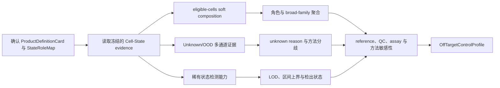

# BRIDGE P0 Off-target Control 任务卡

| 字段 | 内容 |
| --- | --- |
| Task ID | `TASK-OFFTARGET-v0.1` |
| 文档版本 | `0.1` |
| 日期 | 2026-08-06 |
| 状态 | `candidate` |
| 首个实例 | 移植前 hPSC-derived VM floor-plate/mDA 产品 |
| 上游输入 | `QCReadinessProfile`、`CellStateEvidenceProfile`、`ProductDefinitionCard` |
| 主要输出 | `OffTargetControlProfile` |

## 0. 当前可执行候选

P0-05 v0.2.0 实现全产品静态组成的最小确定性路径。它通过
`ToolRequestV2` 读取带 checksum 的 ProductCase、ProductDefinitionCard、
OffTargetRoleSpec、CellStateEvidenceProfile 和 QCReadinessProfile，输出一个
OffTargetControlResult。

代码不包含具体状态、产品角色、OOD 规则、稀有状态 LOD、比例阈值或危害判断；
这些决定只来自版本化 OffTargetRoleSpec 或未来独立校准输入。当前不运行 OOD
模型、rare-state spike-in、区间模型或临床解释；相应通道明确为
`not_assessed`，而不是用占位算法代替。

## 1. 任务目标与边界

本模块描述全部移植前制剂中的目标、相邻、非目标、角色未决和 unknown/OOD 组成，并量化稀有状态的检测能力。当前阶段只整理并验证数据、方法、环境和输出合同，不制定 0-100 分数。

- `known_off_target` 表示某个已识别状态不属于当前产品定义的目标组成，不等同于已经证实的临床危害。
- 非目标状态比例升高不能解释为产品改善；缺少剂量-反应或阈值证据时，也不施加任意线性惩罚。
- `role_unresolved` 表示细胞身份可描述但产品角色尚未确定；`unknown` 表示身份本身不能可靠解析，两者必须分开。
- 残余多能性、异常增殖和其他程序复核信号由 Proliferation & Stress Response 处理，本模块不重复计算。
- 移植后 graft 只提供发育潜能或来源解释，不能反推移植前制剂会产生相同比例。
- 当前没有疗效、功能或安全性真值，本模块不输出临床安全、疗效、potency 或放行结论。

## 2. 细胞角色合同

### 2.1 三层字段

每个内部细胞状态必须通过版本化 `StateRoleMap` 与当前 `ProductDefinitionCard` 建立关系。

| 字段 | 允许值 | 含义 |
| --- | --- | --- |
| `product_role` | `target`、`acceptable_adjacent`、`known_off_target`、`role_unresolved` | 状态在当前产品定义中的角色 |
| `role_evidence_class` | `clear_off_axis`、`context_dependent_non_target`、`intended_accessory`、`insufficient_evidence` | 该角色由哪类证据支持 |
| `evidence_direction` | `adverse_direction_supported`、`non_target_no_optimum_known`、`context_dependent`、`insufficient_evidence` | 证据允许怎样解释比例变化 |

`StateRoleMap` 至少记录：内部状态 ID、Card ID、角色、证据类别、证据方向、适用物种与场景、来源、审核人、版本和生效日期。角色不能根据标签名称自动推断。

`target` 和常规 `acceptable_adjacent` 的目标依据由 `ProductDefinitionCard` 单独管理，此时 `role_evidence_class` 与 `evidence_direction` 可以为空。身份为 unknown 或由其他模块处理的状态也不填写产品角色字段。

### 2.2 PD-mDA v0.1 候选规则

| 细胞状态或家族 | 默认 `product_role` | 默认证据类别 | 解释边界 |
| --- | --- | --- | --- |
| 经审核的 mFP/mDA progenitor 或目标 mDA 状态 | `target` | 空；由 ProductDefinitionCard 定义 | 只表示目标身份支持，不替代功能验证 |
| 经审核的正常过渡或邻近状态 | `acceptable_adjacent` | 空；由 ProductDefinitionCard 定义 | 必须注明允许范围与发育窗口 |
| Astrocyte | `known_off_target` | `context_dependent_non_target` | 计入非目标组成；比例升高不解释为改善；主动共移植证据不能外推为自发 astrocyte 的最佳比例 |
| VLMC/pericyte-like | `known_off_target` | `context_dependent_non_target` | 可见于 hPSC graft 并邻近血管，但目前没有理想比例或功能阈值 |
| OPC/oligo | `known_off_target` | `context_dependent_non_target` | 计入非目标组成；没有证据支持“越多越好”或通用惩罚斜率 |
| Serotonergic lineage | `known_off_target` | `clear_off_axis` | 在特定动物模型中存在 adverse-direction 证据；不能直接转写为临床安全阈值 |
| Cortical/forebrain、spinal/motor、neural crest、hindbrain | `known_off_target` | `clear_off_axis` | 与当前 VM/mDA 产品轴偏离；按 broad family 与内部状态分别报告 |
| 非神经谱系 | `known_off_target` | `clear_off_axis` | 明确报告身份与比例，不据此单独作临床结论 |
| 身份已知但角色证据不足 | `role_unresolved` | `insufficient_evidence` | 保留组成，不并入 target 或 known off-target |
| 身份无法可靠解析 | 不分配产品角色 | 不适用 | 进入 `unknown`，并记录原因 |

Astrocyte、VLMC/pericyte-like 或 OPC/oligo 只有在 `ProductDefinitionCard` 明确声明细胞身份、预期支持作用、目标比例范围和验证方案时，才可改为 `intended_accessory`。该变更需要新建 Card 与 `StateRoleMap` 版本，即使被声明为 accessory，也不采用“比例越高越好”的解释。

## 3. 输入与当前资产

### 3.1 必要输入

- 已确认的 `ProductDefinitionCard` 与冻结的 `StateRoleMap`。
- `all_cells_view` 与 `eligible_cells_view`，以及各视图的排除规则。
- Cell-State prediction set、soft assignment、hard label、置信度、unknown reason 和方法分歧。
- sample、preparation、batch、cell line/donor、biological replicate 与 assay 信息。
- 冻结的 reference、preprocessing、`MeasurementSpec`、工具和知识快照版本。

### 3.2 当前可用资产

| 资产 | 主要内容 | 本模块用途 | 关键限制 |
| --- | --- | --- | --- |
| 内部 VM/mDA annotation | broad cell type、RG/Nb-derived state 与候选细分状态 | 状态主命名与组成下钻 | 当前为 `freeze_required`，需完成生物学审核 |
| 发育与体外 mDA references | 多来源人胎 VM/脑参考及体外分化数据 | target、adjacent、off-axis 与 reference-gap 判断 | source、modality 与阶段分布不均衡 |
| Development OOD panel | 皮层/脑类器官、运动神经元、神经嵴、MSC、全脑类器官等 6 个 source family | 方法选择、开放集与偏移开发 | 部分只有 dataset-level 标签或 metadata 缺口 |
| Locked OOD panel | 胎儿皮层、皮层类器官、发育脊髓 3 个 source family | 冻结后独立 OOD 验证 | 不参与训练、方法选择或阈值调整 |
| graft 单细胞/单核数据 | DA neuron、astrocyte、VLMC 等移植后状态 | 解释谱系潜能与场景适用性 | 不回填移植前比例或评分 |
| 稀有状态模拟资产 | 已知比例混合、下采样和 marker 正交证据 | 建立经验 LOD、UCB 与 false-positive burden | 模拟不能替代真实稀有阳性样本 |

完整 OOD 条目、标签粒度、允许指标和冻结分区由配套 Excel 的 `Current Data` 与 `OOD Benchmark Split` 工作表维护。

## 4. 分析流程

## 5. 组成分析

- 主分母为全部 `eligible_cells_view`；同时生成 `all_cells_view` sensitivity，不以 target-enriched subset 代替完整制剂。
- 正式候选使用 Cell-State soft assignment 聚合组成，hard label 只作敏感性分析。
- 输出 `target`、`acceptable_adjacent`、`clear_off_axis`、`context_dependent_non_target`、`role_unresolved` 与 `unknown`；同时保留 broad family 和内部状态下钻。
- 区间使用 sample-preserving hierarchical bootstrap，并保留 annotation uncertainty。只有一个独立 preparation 时，区间不能解释为批次间变异。
- propeller/speckle、scCODA/pertpy-scCODA 和 sccomp 只用于具有独立 preparation 的产品比较；单样本只做描述性组成。
- 文献证据决定角色解释边界，不直接提供产品比例阈值或惩罚函数。

## 6. Unknown/OOD 分析

候选通道包括预测置信度、entropy/margin、reference/kNN/Mahalanobis distance、reconstruction residual、conformal prediction、energy-based OOD、模型不确定性和跨方法/跨 reference 分歧。

- BRIDGE 先分别验证每个通道，再冻结适用通道与协调规则；不临时选择对待评产品最有利的方法，也不默认等权平均。
- `unknown_reason` 固定为 `reference_gap`、`method_conflict`、`biological_unresolved`、`technical_shift` 或 `technical_unavailable`。
- dataset-level OOD 标签只允许评测整体拒答与分布偏移，不能声称 cell-level OOD 精度。
- OOD 结果必须与 QC、assay 和 reference sensitivity 联合展示，避免把技术偏移自动解释成新的生物状态。

## 7. 稀有状态与检测边界

- 对预先定义状态报告 observed count、fraction、精确二项区间及零观测时的上界。
- 使用 sample-preserving empirical spike-in 建立检出曲线、最小经验证可检出比例和 false-positive burden。
- marker/program 或 scGate 类规则作为独立正交检查，不能单独决定产品角色。
- CellSIUS、GiniClust3、RaceID3、FiRE、RareQ 和 CIARA 等用于 discovery/shadow benchmark；新发现群体先标记为 `candidate_unresolved`。
- 检出状态只允许为 `detected`、`not_detected_above_lod`、`cannot_exclude` 或 `not_assessed`。零观测不得写成“确定不存在”。

## 8. 输出合同

### `OffTargetControlProfile`

| 字段 | 含义 |
| --- | --- |
| `state_role_map_id` | 当前 Card 对应的角色映射及版本 |
| `primary_denominator` | `eligible_cells_view` 的数量、权重、排除规则和样本结构 |
| `sensitivity_denominators` | `all_cells_view` 及其他冻结 sensitivity views |
| `role_composition` | 各角色的 count、soft fraction、hard fraction、区间和分母 |
| `off_target_breakdown` | clear off-axis、context-dependent non-target 的 broad family 与内部状态 |
| `role_evidence` | 角色证据类别、方向、场景、来源和适用性 |
| `unknown_profile` | unknown 比例、原因、prediction set、距离和方法分歧 |
| `rare_state_profile` | observed count/fraction、区间/UCB、经验检出曲线、false-positive burden 和检出状态 |
| `sensitivity` | reference、method、QC、preprocessing、assay 与分母敏感性 |
| `evidence_state` | `available` / `shadow` / `unavailable` |
| `domain_score` | 固定为 `null`，等待独立 `ScoreContract` |
| `provenance` | ProductCase、Card、tool、reference、environment、参数、知识快照和 Evidence ID |

## 9. 运行环境

| 环境 | 用途 | 当前状态 |
| --- | --- | --- |
| `ENV-OFFTARGET-PY-v0.1` | 正式组成聚合、bootstrap、精确区间、透明 OOD 指标和可视化 | `proposed` |
| `ENV-OFFTARGET-BAYES-v0.1` | pertpy/scCODA、PyMC/ArviZ 等贝叶斯组成模型 | `proposed_isolated` |
| `ENV-OFFTARGET-BIOC-v0.1` | speckle/propeller、sccomp、scGate 等 R 工具 | `proposed_isolated`；按 R/Bioconductor 与 CmdStan 依赖冻结 |
| `ENV-OFFTARGET-CONFORMAL-v0.1` | scConform 与 ontology 依赖 | `proposed_isolated` |
| `ENV-OFFTARGET-RARE-v0.1` | Rare-state discovery 工具的兼容性测试 | `proposed_isolated`；不污染正式环境 |

P0 正式主流程不依赖 GPU。深度 OOD 与 ensemble 仅作 `shadow` benchmark，可按需使用 GPU。不同环境只交换版本化 h5ad/Parquet/TSV、矩阵和 JSON manifest。

## 10. Web 必备可视化

- 全制剂组成图：显示 soft fraction、区间、分母、role unresolved 与 unknown。
- 非目标 broad family 总览及内部状态下钻。
- unknown reason 分解与方法/reference 分歧图。
- OOD calibration、precision-recall、coverage-selective-risk 和 shift-stratum 图。
- Rare-state LOD/UCB 曲线，以及 observed 与 validated detectable range 对照。
- QC、reference、preprocessing、assay、method 和 hard/soft composition 敏感性图。
- 细胞角色文献证据表，明确 pre-transplant、graft observation、lineage tracing、active co-graft 与 animal outcome 场景。

每张正式图绑定 Evidence ID、输入版本、分母、单位、状态、方法和缺失信息。界面不把 `unknown` 合并进 known off-target，也不把零观测渲染为确定不存在。

## 11. 拒答与降级规则

- `ProductDefinitionCard` 或 `StateRoleMap` 未确认：只输出身份组成，不发布产品角色组成。
- Cell-State evidence 不可用：不得在本模块重新训练注释器；相应结果返回 `unavailable`。
- 关键状态 reference 缺失或方法冲突：保留 `unknown` 与原因，不强制分配终末标签。
- 只有一个独立 preparation：不进行推断性组成比较。
- 稀有状态未完成 spike-in/false-positive 校准：最多报告区间与 `cannot_exclude` 或 `not_assessed`。
- 只有 dataset-level OOD 标签：不发布 cell-level OOD 指标。
- graft 观察不能改写移植前 `StateRoleMap`、比例、阈值或域结果。
- 文献场景与待评产品不匹配时，证据状态降级为 `context_dependent` 或 `insufficient_evidence`。

## 12. Benchmark 与冻结要求

| 验证项 | 最低要求 |
| --- | --- |
| 数据拆分 | source、lab、donor/cell line 与 modality holdout；整个 source family 保持在同一分区 |
| OOD 开发 | 6 个 development OOD source family；仅用于方法开发与校准 |
| OOD 锁定测试 | 3 个 locked OOD source family；冻结后一次性评测，不参与方法选择或阈值调整 |
| 组成准确性 | 已知比例混合、soft/hard 组成误差、区间覆盖与 sample-level 稳健性 |
| 稀有状态 | empirical spike-in、下采样、recall、precision、false-positive burden、LOD 与 UCB 覆盖 |
| OOD 指标 | AUROC/AUPRC、coverage、selective risk、false-reassurance；按标签粒度限制可发布指标 |
| 敏感性 | reference、preprocessing、QC view、assay、方法、随机种子和分母 swap |
| 角色审核 | 每个角色结论可追溯到 Card、场景化文献、审核记录与版本 |
| 工程冻结 | tool、environment、reference、knowledge snapshot、MeasurementSpec、参数和 schema 均版本化 |

未通过验证的方法保持 `candidate`、`conditional`、`shadow`、`catalog_only` 或 `deferred`。只有冻结方法可以写入正式 Evidence Graph；`domain_score` 在独立 ScoreContract 建立前始终为 `null`。

## 13. 文献解释矩阵

| 证据 | 实验场景 | 支持的结论 | 不允许外推的结论 |
| --- | --- | --- | --- |
| Song et al., JCI 2018 | 特定 VM/cortical astrocyte 与胚胎 VM NPC 主动共移植；6-OHDA 大鼠 | 特定 VM astrocyte 在该设计中可支持 DA neuron 存活和成熟 | 自发产生的 astrocyte 越多越好；通用产品比例阈值 |
| Tiklová et al., Nat Commun 2020 | hESC 与胎儿 VM graft 的 scRNA 和组织学 | hPSC graft 可出现 astrocyte 与血管邻近的 VLMC | VLMC 的理想比例、直接有益或直接有害 |
| Storm et al., Sci Adv 2024 | GSE200610 lineage tracing 与 graft 分析 | DA neuron、astrocyte 与 VLMC 可来自共同祖细胞 | 共同来源等同于产品优劣或最佳组成 |
| lineage-restricted study, Nat Commun 2023 | 谱系限制与常规 hPSC VM 分化/移植比较 | 限制非目标谱系伴随更高 mDA 产出和 VLMC 减少 | VLMC 本身是造成结局差异的直接原因 |
| Carlsson et al., J Neurosci 2007 | serotonin-rich graft；6-OHDA 大鼠与 L-DOPA dyskinesia | 支持 serotonergic contamination 的情境性 adverse-direction 警示 | 直接临床安全结论或人产品阈值 |
| Xu et al., JCI 2022 | mDA progenitor 富集、动物 graft 与行为结局 | 富集 mDA、减少 off-target neuron 与更稳定 graft 相伴 | 任意产品的通用细胞比例阈值 |

## 14. 主要官方来源

- FDA human somatic cell guidance: https://www.fda.gov/files/vaccines%2C%20blood%20%26%20biologics/published/Guidance-for-Industry--Guidance-for-Human-Somatic-Cell-Therapy-and-Gene-Therapy.pdf
- FDA potency tests guidance: https://www.fda.gov/regulatory-information/search-fda-guidance-documents/potency-tests-cellular-and-gene-therapy-products
- EMA human cell-based medicinal products guideline: https://www.ema.europa.eu/en/human-cell-based-medicinal-products-scientific-guideline
- Astrocyte co-graft study: https://www.jci.org/articles/view/93924
- hPSC graft composition and VLMC: https://www.nature.com/articles/s41467-020-16225-5
- Shared progenitor lineage evidence: https://pmc.ncbi.nlm.nih.gov/articles/PMC11488568/
- Lineage-restricted mDA differentiation: https://www.nature.com/articles/s41467-023-43471-0
- Serotonergic graft evidence: https://pubmed.ncbi.nlm.nih.gov/17652591/
- mDA progenitor enrichment: https://www.jci.org/articles/view/156768
- SciPy exact binomial test: https://docs.scipy.org/doc/scipy/reference/generated/scipy.stats.binomtest.html
- scikit-learn OOD primitives: https://scikit-learn.org/stable/
- Lopez-De-Castro conformal cell annotator: https://doi.org/10.1093/bioinformatics/btaf521 and https://pmc.ncbi.nlm.nih.gov/articles/PMC12506889/
- scConform prediction-set/hierarchical coverage calibration: https://arxiv.org/abs/2410.23786, https://doi.org/10.1093/jrsssc/qlag037 and https://bioconductor.org/packages/scConform/
- speckle/propeller: https://bioconductor.org/packages/speckle/
- pertpy/scCODA: https://pertpy.readthedocs.io/en/latest/tutorials/notebooks/sccoda.html
- sccomp: https://bioconductor.org/packages/sccomp/
- scGate: https://github.com/carmonalab/scGate
- CellSIUS: https://github.com/Novartis/CellSIUS
- GiniClust3: https://giniclust3.readthedocs.io/en/latest/
- RaceID3: https://github.com/dgrun/RaceID3_StemID2
- FiRE: https://github.com/princethewinner/FiRE
- RareQ: https://github.com/xiaolab-xjtu/RareQ
- SCOPIT: https://pmc.ncbi.nlm.nih.gov/articles/PMC6852764/
- CIARA: https://doi.org/10.1242/dev.201264
