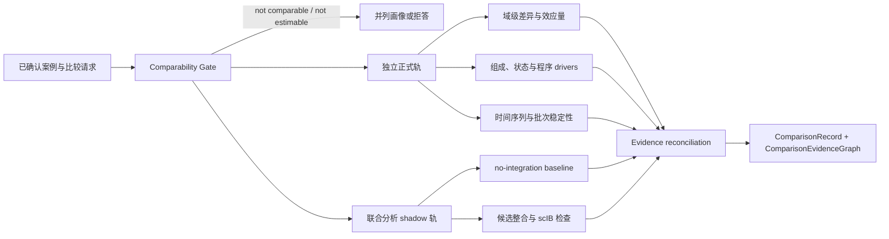

# BRIDGE P0 Product Comparison and Stability 任务卡

| 字段 | 内容 |
| --- | --- |
| Task ID | `TASK-COMPARISON` |
| Version | `v0.1-draft` |
| Date | 2026-08-07 |
| Scope | 同阶段跨方案、真实时间序列及 batch/lot/preparation 稳定性 |
| Primary unit | 经外部审核的 `BiologicalUnitManifest.independence_group`；preparation/capture 先在组内聚合 |
| Primary output | `ComparisonRecord` |
| Current state | `candidate` |

## 1. 任务目标与边界

本模块在统一合同下比较多个移植前产品案例，回答：

- 哪些分域指标和原始证据存在稳定差异。
- 差异主要来自组成、细胞状态、程序、时间点还是批次。
- 结果是否依赖 reference、annotation、preprocessing 或联合整合方法。
- 当前设计只能支持描述性比较，还是具备样本层推断条件。

本模块不重新计算上游科学域，不生成综合总分或绝对产品排名。Evidence Sufficiency 是上游 gate；Comparison 只读取其结果，不在本模块内重新定义。

本任务中的“稳定性”表示当前转录组测量和分析合同下的 preparation 间重复性，不代表 GMP 工艺能力、临床疗效、安全性或放行结论。

### 当前可执行切片（2026-08-24）

P0-07 v0.2 已先收口为窄的 pairwise descriptive runtime：输入两个
`ProductCase`、一个 `ComparisonSpec`、一个 `ComparisonEvidenceBundle`、两个完整
`EvidenceSufficiencyRunResult` 和两个 `BiologicalUnitManifest`，只比较
两个明确绑定的 ProductCase，并在经审核 independence-group 层报告均值、范围和 raw
`candidate - baseline` 差值。

以下内容全部来自版本化、带 checksum 的输入，而不是代码常量：需要相等
的合同维度、assay/target/reference/prior/算法/预处理引用、metric ID、单位、
可用证据状态、方向和最小独立 biological-unit 数。每个 evidence summary 的
unit 引用必须与对应 ProductCase/manifest 的 assignment 完全一致，同一 group 内
的重复 preparations 先按合同聚合，两个比较臂不得共享 independence group；
至少一个 metric 必须标为 required。只接受完整 P0-08 结果，不能用脱离 profile
和 gate trace 的 readiness summary 代替。当前代码不包含具体产品、
状态、程序、基因、阶段、范围或生物阈值。

该切片固定为 `descriptive_only`。效应量、区间、推断统计、时间序列、
批次/联合分析、stability inference 和 Pareto 均仍未实现；没有冻结
ScoreContract 时 `overall_score/overall_rank=null`。下文保留为后续科学与
方法开发目标，不表示这些能力已经可执行。

## 2. 比较合同

### 2.1 比较场景

| 场景 | 主要问题 | 允许输出 | 关键限制 |
| --- | --- | --- | --- |
| 同阶段跨方案/产品 | 相同目标阶段下哪些证据域不同 | 域级差异、效应量、驱动因素和条件化方向结论 | 需要相容合同；protocol 与 lab 完全混杂时不可归因 |
| 同方案时间序列 | 产品状态随真实 D/Stage 如何变化 | 组成、程序、域指标趋势和阶段转换 | D 不换算为 GW/PCW；不自动给出全局最佳收获日 |
| batch/lot/preparation | 相同方案与阶段下重复性如何 | preparation 间变异、距离、区间和异常批次提示 | 需要真实独立重复；technical replicate 不替代 biological replicate |

### 2.2 可比性状态

| 状态 | 合同 |
| --- | --- |
| `strictly_comparable` | ProductDefinitionCard、目标阶段、assay、sampling context、reference、prior、MeasurementSpec、ScoreContract 和算法版本一致，必要域可用 |
| `contextual_comparator` | 生物问题相关，但存在明确的阶段、体系、assay 或合同差异；只并列展示相容字段 |
| `reference_or_OOD` | 仅用于定位、特异性或拒答测试，不进入产品优劣比较 |
| `not_comparable` | 关键合同不相容，无法形成合法比较 |
| `not_estimable` | protocol、lab、batch、cell line 或其他关键因素完全混杂，无法分离目标效应 |

不同合同版本的历史结果不能直接比较。选定案例必须在同一冻结合同下重跑，既有 `ProductEvidenceObject` 和报告保持不变。

### 2.3 比较模式与结论

| 模式 | 发布规则 |
| --- | --- |
| `descriptive_only` | 每组只有一个独立 preparation，或样本表尚未满足推断合同；报告 raw delta、描述性效应量和敏感性，不报告显著性或方案层推广结论 |
| `inferential` | 满足 MeasurementSpec 预注册的独立重复、设计、协变量和模型假设后，发布样本层区间和推断统计 |

严格可比、Evidence Sufficiency 合格且结论跨敏感性分析稳定时，允许报告：

- “A 在域 X 的转录组相容性证据高于/低于 B”。
- “A 在当前 mandatory domains 上形成稳定 Pareto 优势”。

Pareto 判断必须逐域使用冻结方向、区间和最小可分辨差异；任一必要域不可用、方向不明或结论对分析选择敏感时，不生成优势结论。

## 3. 输入与当前资产

### 3.1 必要输入

- 已确认的 `ProductCase`、`ProductDefinitionCard` 和目标阶段。
- sample、preparation、lot、batch、protocol、timepoint、donor/cell line 及 biological/technical replicate 层级。
- 上游 `ProductEvidenceObject`、Evidence Sufficiency、gate 和 alert 状态。
- 同版本 reference、prior、MeasurementSpec、ScoreContract、算法和 preprocessing snapshot。
- 域级 raw metrics、分母、区间、分数状态和 Evidence IDs。
- 需要组成、状态或程序 driver 分析时，读取冻结的 cell-state output、soft composition 和 sample/state pseudobulk views。

系统不得从文件名、目录名或 accession 自动推断 replicate、产品关系或比较组。

### 3.2 当前可用于方法开发的数据

| Asset ID | 体系/时间 | 规模 | 主要用途 | 当前限制 |
| --- | --- | ---: | --- | --- |
| `Q-GSE204796-v1` | mDA scRNA；D8/D14/D21/D28/D35 | 37,397 | 真实时间序列与阶段差异 | timepoint 必须按 sample/preparation 拆分 |
| `Q-GSE227070-v1` | H9/4X LR-USC；D16/D28/D62；parent SuperSeries `GSE227071` | 48,196 | cell source、阶段和方案 shift | 本 scRNA query 不含 GBX2-KO；D62 与 D16/D28 不属于同一产品阶段 |
| `Q-GSE76381-ES-v1` | hESC mDA；D0/D12/D17/D35 | 1,715 | 小型历史时间序列 sanity | 样本量低；D0 不是产品 |
| `Q-JERBER-v1` | population-scale iPSC DA；D11/D30/D52 | >750,000 | donor、batch、timepoint 与扰动稳健性 | 需冻结 donor/batch/condition map 并按 source family 去重 |
| `Q-BRAINSTEM-TOH-v1` | midbrain organoid；D20/D25/D30/D40/D50/D60 | 34,702；48 sequencing sublibraries（每个时间点 8 个） | 3D 时间点描述与 domain shift | biological sample/organoid/replicate map 冻结前只作 `descriptive_only`；48 sublibraries 不是 48 biological replicates；organoid 不与 2D product 直接排名 |
| `Q-FIORENZANO-v1` | VM organoid；D15-D120 | 91,034 | 3D trajectory comparator | 只作 contextual comparator |
| `Q-GSE200610-D16-v1` | RC17 VM；D16 | 8,166 | 单时间点临床相关 comparator | 不等于患者 GMP lot；默认描述性 |
| `Q-SPHEREDIFF-v1` | 3D mDAP；D28 | 9,547 | 内部/已发表 comparator | source metadata 和 disclosure 需冻结 |
| `Q-MACRODIFF-v1` | 内部 mDA；D14/D21/D28 | 57,464 | 内部方案与时间序列比较 | sealed；权限、sample map 和披露范围待冻结 |
| `Q-EMTAB14729-v1`（E-MTAB-14729） | Boost/Boost+；D16/D25/D40 | 26,303 | 最终 competitor test | sealed；六个 group 不是六个独立 lot，不参与方法选择或调参 |

在完整 replicate map 冻结前，上述多数公开数据默认进入 `descriptive_only`。`Q-EMTAB14729-v1` 只在分析合同冻结后运行。

## 4. 分析流程

开发期负责 benchmark 和冻结方法；新产品运行期只检查输入适用性、OOD、证据充分性和设计资格，不能根据结果临时选择最有利的方法。

## 5. 正式独立比较轨

### 5.1 域级差异与效应量

- 始终先报告原始量、分母和组内 sample/preparation 值，再报告域分数差异。
- `BRIDGE Comparison Engine` 计算 raw delta、相对变化、配对或非配对效应量、区间和方向一致性。
- 区间和 permutation/bootstrap 必须保留 preparation 层级；单样本内重采样只能表示测量/细胞抽样敏感性。
- 标准化效应量只有在量纲和设计适用时发布，不能替代 raw delta。
- Pareto 结果不使用加权平均；方向、非劣 margin 和最小可分辨差异由各域 MeasurementSpec 冻结。

### 5.2 组成比较

- 输入来自冻结的 soft composition；hard composition 只作敏感性分析。
- propeller/speckle、scCODA 和 sccomp 进入首轮 replicated-composition benchmark。
- scCODA 的结果必须注明 reference category；sccomp 的 CmdStan 依赖和后验诊断必须冻结。
- 三种方法共享同一 sample-level composition evidence family，只能用于方法稳健性，不得重复计为独立生物证据。
- 没有独立 preparation 时，只显示组成差异、区间和检测边界。

### 5.3 状态和程序比较

- 按 `sample/preparation x cell-state` 聚合 raw counts，保留基因覆盖、细胞数和 library size。
- benchmark edgeR、limma-voom、DESeq2 及 muscat orchestration，不预设某个工具必然最优。
- 正式输出以 pseudobulk 的 log fold change、区间和 FDR 为主；细胞级检验不能替代样本层推断。
- 程序差异同时报告 sample/state pseudobulk 与上游单细胞程序分布，避免将组成变化误写成状态内表达变化。
- 相关 DE 工具共享原始 pseudobulk evidence family，不能按显著工具数量投票。

### 5.4 时间序列与重复测量

- 真实 D/Stage 是独立时间轴，不转换为 GW/PCW。
- 单一时间序列且缺少独立重复时，只输出 `descriptive_timecourse`。
- 有 donor/cell line 或 preparation 重复时，dreamlet/variancePartition 作为 repeated-measures 和 variance-component 候选。
- 非线性趋势只有在时间点和重复满足预注册要求时使用 spline/GAM；否则只显示预定义相邻 contrast。
- 不同目标阶段之间不生成综合质量排序，也不据此自动确定最佳收获日。

### 5.5 连续状态发现

- Milo/miloR 用于发现 cluster 边界内外的 differential abundance neighborhood。
- scDist 用于评测能否在 mixed-effects 设计下恢复多维 transcriptomic shift。
- 两者均为 `shadow` driver discovery，结果必须回到已定义状态、程序和 Evidence Record 解释。
- graph、embedding 或低维表示对 integration/reference 敏感时，结果标记 `integration_sensitive`。

### 5.6 稳定性与敏感性

至少报告：

- 域指标的 preparation 间离散度和区间。
- soft composition 的 Jensen-Shannon distance；发育图分布适用时可登记 graph-Wasserstein distance。
- state/program pseudobulk correlation、距离和关键 driver 方向一致性。
- 细胞和基因下采样漂移。
- reference、annotation、preprocessing、assay 和方法 swap。
- batch、cell line、donor、protocol 和 timepoint 的可估计 variance components。

距离本身是描述性量。只有存在独立 preparation 和预注册 null 时，才允许生成推断性检验。

## 6. 联合分析 Shadow 轨

- `no-integration` 是固定基线。
- 候选整合方法沿用 Cell-State Registry，不在本模块重复选择或重新调参。
- scIB/scib-metrics 同时检查 batch removal 和 biological conservation；不能只追求跨产品混合。
- 已知 protocol、timepoint、cell source 和真实 composition shift 必须在联合空间中得到保留。
- 联合输出只用于 shared-state discovery、continuous driver 和可视化敏感性，不覆盖独立 `ProductEvidenceObject`。
- 独立轨与联合轨一致时可记为 `stable` 或 `consensus_supported`；联合结果改变结论时记为 `integration_sensitive`；多种冻结方法仍冲突时记为 `unstable`。

## 7. 输出合同

### `ComparisonRecord`

| 字段 | 内容 |
| --- | --- |
| `comparison_id / version` | 追加式版本标识 |
| `case_refs` | 被比较案例、组别和 comparator role |
| `common_contract_snapshot` | Card、阶段、assay、sampling context、reference、prior、MeasurementSpec、ScoreContract 和算法版本 |
| `comparison_eligibility` | 可比性状态及逐项原因 |
| `comparison_mode` | `descriptive_only` 或 `inferential` |
| `design_and_confounding_check` | replicate、pairing、协变量、缺失和完全混杂检查 |
| `domain_differences` | raw metrics、分母、分数状态、delta、效应量和区间 |
| `composition_results` | sample-level composition、差异和方法敏感性 |
| `state_program_results` | pseudobulk/state/program drivers |
| `timecourse_results` | 真实时间点趋势、contrast 和分析模式 |
| `stability_results` | preparation 变异、距离、下采样和 swap 结果 |
| `joint_shadow_results` | no-integration 与候选整合输出、scIB metrics 和 overcorrection checks |
| `directional_claims` | 域级或 Pareto 条件化结论及适用范围 |
| `reconciliation_state` | `stable`、`consensus_supported`、`integration_sensitive` 或 `unstable` |
| `evidence_refs` | Evidence IDs 与 `ComparisonEvidenceGraph` 引用 |
| `overall_score / overall_rank` | 固定为 `null` |

所有差异必须绑定单位、分母、方向、区间、证据状态和版本。缺失域显示 `unavailable`，不能补零或解释为产品较差。

## 8. 运行环境

| 环境 | 用途 | 当前状态 |
| --- | --- | --- |
| `ENV-COMPARISON-PY-v0.1` | 描述性比较、bootstrap、距离、敏感性、no-integration baseline 和可视化 | `proposed` |
| `ENV-COMPARISON-BIOC-v0.1` | muscat、edgeR、limma、DESeq2、dreamlet、variancePartition 和 miloR | `proposed_isolated` |
| `ENV-OFFTARGET-BIOC-v0.1` | 复用 speckle/propeller 与 sccomp | `proposed_isolated` |
| `ENV-OFFTARGET-BAYES-v0.1` | 复用 pertpy/scCODA 组成模型 | `proposed_isolated` |
| `ENV-INTEGRATION-BENCHMARK-v0.1` | scib-metrics 与联合整合 benchmark | `proposed_isolated` |
| 各 integration method 环境 | 运行 Cell-State Registry 已登记的候选整合方法 | 继承原方法状态 |

正式独立比较不依赖 GPU；scVI 等联合分析可按需使用 GPU。跨环境只交换版本化 h5ad/zarr、Parquet/TSV 和 JSON manifest，不交换 Python pickle 或未登记 RDS。

## 9. Web 必备可视化

- 域级效应量森林图：显示 raw delta、区间、方向、状态和 denominator。
- 多产品画像/优势矩阵：逐域展示，不合并成总分。
- 完整制剂组成及 composition-delta 图。
- state/program pseudobulk effect heatmap 和 driver drill-down。
- 真实时间序列：显示 preparation-level points、趋势和分析模式。
- batch/lot 距离矩阵、variance-component 图和异常 preparation 下钻。
- reference、annotation、preprocessing、assay 和方法敏感性矩阵。
- 联合嵌入与 scIB 指标面板，始终显示 `shadow` 标记和 no-integration 对照。

每张正式图绑定 Comparison ID、Evidence IDs、输入版本、单位、分母、区间和证据状态。`descriptive_only` 图表不显示推断显著性。

## 10. 拒答与降级规则

- ProductDefinitionCard、目标阶段或 sample hierarchy 未确认：不运行正式比较。
- 合同不相容：返回 `not_comparable`，只允许并列画像。
- protocol、lab、batch 或 cell line 完全混杂：返回 `not_estimable`，不归因于产品或方案。
- 独立 biological unit 不足：保留 raw 描述性结果并返回相应 limitation；重复
  measurement、technical replicate 或跨臂复用 unit 不得增加独立样本量。
- Evidence Sufficiency 不足：保留可用 raw metrics，相应结论返回 `unavailable` 或 `shadow`。
- mandatory domain 不完整：不生成 Pareto 方向结论。
- 独立轨与联合轨冲突：返回 `integration_sensitive` 或 `unstable`。
- 不同阶段、2D/3D 或不同 assay：只作 contextual comparison，不生成综合排序。
- 工具执行失败不能自动切换到未注册方法；兼容替代必须预先共享同一 MeasurementSpec。

## 11. Benchmark 与冻结要求

| 类别 | 必测内容 |
| --- | --- |
| Null control | 无真实组间差异时的假阳性率、方向偏差和伪 Pareto 优势 |
| Known composition shift | 已知比例混合、soft assignment 不确定性和方法恢复误差 |
| Known expression shift | sample-preserving pseudobulk spike-in 的方向、效应量和 FDR |
| Replicate design | 配对/非配对、重复不足、technical replicate、缺失协变量和不平衡设计 |
| Confounding | protocol=lab、protocol=batch、cell line=product 等不可估计场景 |
| Time course | 相邻时间点、非线性趋势、leave-one-timepoint-out 和单时间点降级 |
| Stability | 下采样、reference/preprocessing/annotation swap、组内重复性和区间覆盖 |
| Joint shadow | batch removal、生物差异保留、overcorrection 和 no-integration 一致性 |
| Versioning | 跨合同结果拒绝直接比较，并在共同冻结合同下重跑 |
| Sealed test | `Q-EMTAB14729-v1` 只在方法冻结后运行，不用于选择工具、阈值或 margin |

冻结前至少保存：Tool/Environment version、MeasurementSpec、设计矩阵、contrast、随机种子、输入 hash、Evidence IDs、benchmark fixture、预期输出和允许主张。

## 12. 主要官方来源

- muscat 与 multi-sample differential-state analysis：https://bioconductor.org/packages/release/bioc/html/muscat.html
- biological replicate 与 pseudobulk benchmark：https://www.nature.com/articles/s41467-021-25960-2
- edgeR：https://bioconductor.org/packages/release/bioc/html/edgeR.html
- limma：https://bioconductor.org/packages/release/bioc/html/limma.html
- DESeq2：https://bioconductor.org/packages/release/bioc/html/DESeq2.html
- dreamlet：https://bioconductor.org/packages/release/bioc/html/dreamlet.html
- variancePartition：https://bioconductor.org/packages/release/bioc/html/variancePartition.html
- speckle/propeller：https://bioconductor.org/packages/release/bioc/html/speckle.html
- scCODA：https://www.nature.com/articles/s41467-021-27150-6
- sccomp：https://bioconductor.org/packages/release/bioc/html/sccomp.html
- Milo/miloR：https://bioconductor.org/packages/release/bioc/html/miloR.html
- scDist：https://www.nature.com/articles/s41467-024-51649-3
- scIB benchmark：https://www.nature.com/articles/s41592-021-01336-8
- scib-metrics：https://scib-metrics.readthedocs.io/en/stable/
