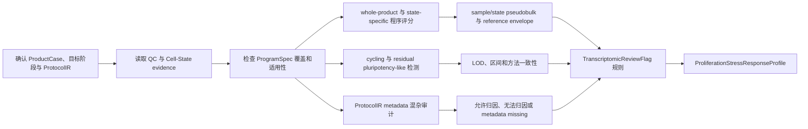

# BRIDGE P0 Proliferation & Stress Response 任务卡

| 字段 | 内容 |
| --- | --- |
| Task ID | `TASK-PROCESS-v0.1` |
| 文档版本 | `0.2.0` |
| 日期 | 2026-08-24 |
| 状态 | `candidate` |
| 首个实例 | 移植前 hPSC-derived VM floor-plate/mDA 产品 |
| 上游输入 | `ProductCase`、`QCReadinessProfile`、`DevelopmentalCompatibilityResult`、`ProgramAssessmentSpec`、`ProgramEvidenceBundle`、`BiologicalUnitManifest` |
| 主要输出 | `ProliferationStressResponseProfile`、`TranscriptomicReviewFlag[]` |

## 1. 任务目标与边界

本模块在已有 Cell-State 与组成证据基础上，描述移植前产品中阶段条件化的增殖、应激及相关转录程序，识别需要复核的信号，并区分生物状态、样本处理影响和证据不足。当前阶段只整理并验证数据、方法、环境和输出合同，不制定 0-100 指数。

- Proliferation & Stress Response 表示这些增殖、应激及相关转录程序与当前 `ProductDefinitionCard`、目标阶段及参考范围的相容性；它不重新判定细胞身份或计算 off-target 比例。
- cycling、stress 或其他程序升高必须结合细胞身份、发育阶段、样本处理和 assay 解释，不能自动标记为异常。
- 本模块不判断临床安全性、致瘤性、potency、疗效、GMP 合规或产品放行。
- PRD 中的 Critical Alerts 在本任务内暂实现为 `TranscriptomicReviewFlag`；当前全部保持 `shadow`，只表示需要正交复核。
- Off-target Control 负责细胞组成；本模块只读取其状态证据，不重复计算非目标比例。
- 缺少 process metadata 时可以描述信号，不能把信号归因于具体工艺步骤。

### 1.1 当前可执行切片

P0-06 的首个可调用 candidate 只装配上游已经计算好的程序观测，不直接
打开表达矩阵，也不在运行时选择 UCell、decoupler、Scanpy 或其他评分器。
它读取 checksummed `ProgramAssessmentSpec` 和 `ProgramEvidenceBundle`，按输入
给出的 stage context、reference interval、gene coverage、eligible evidence
state、independence group 和 review direction 做确定性比较与去重。
BiologicalUnitManifest 的 analysis units 先在 group 内聚合；只有外部
`reviewed`/`frozen` 且带 checksummed review gate 的 lineage 才可贡献独立组数。
`declared` lineage 保留 provenance，但独立组数为 0，结果为
`cannot_resolve`；P0-06 不能审核自己的重复结构。

程序名称、基因、权重、阶段、reference/null、阈值、检测边界和复核方向均不
写入代码。后续生物学审核通过创建新版本输入对象改变这些决定，无需修改执行器。
当前 `ProtocolIR`、residual-pluripotency LOD 和 transcriptomic CNV 没有进入
此切片，均返回 `not_assessed`；未触发 shadow review flag 不能解释为安全或
不存在风险。

## 2. 增殖、应激及相关程序合同

### 2.1 程序分层

| Program ID | 程序 | P0 层级 | 当前校准证据 | 解释边界 |
| --- | --- | --- | --- | --- |
| `PROC-PLURI` | residual pluripotency-like | `candidate_P0` | hESC D0 提供部分分析阳性对照 | 不代表残留比例阈值、转化细胞或致瘤性 |
| `PROC-CYCLE` | stage-conditioned proliferation/cell cycle | `candidate_P0` | 多时间点发育与体外数据支持阶段基线 | 生理性 cycling progenitor 不能自动称为异常 |
| `PROC-DISSOC` | dissociation/heat-shock stress | `candidate_P0` | 外部解离研究与 ProtocolIR；本项目无直接校准 | 缺采样处理信息时不能归因于解离流程 |
| `PROC-OXSTRESS` | oxidative/acute stress | `candidate_P0` | MPP+ 24 h 与 D52 rotenone 提供窄场景校准 | 特定扰动不等于通用产品质量标签 |
| `PROC-HYPOXIA` | hypoxia | `candidate_P0` | 当前无直接匹配校准 | 只保存 raw/shadow evidence，不设警报阈值 |
| `PROC-UPR` | UPR/ER stress | `candidate_P0` | 当前仅有间接扰动证据 | 不由相关 stress 信号替代专门校准 |
| `PROC-APOPTOSIS` | apoptosis/death-associated | `candidate_P0` | MPP+ 研究提供部分方向证据 | scRNA 主要观测存活细胞，不能替代 viability assay |
| `PROC-EMT` | EMT | `shadow` | 无直接 PD-mDA 校准 | 仅解释，不能进入正式结果或阈值 |
| `PROC-IFNHLA` | IFN/HLA/inflammatory | `shadow` | 无直接 PD-mDA 校准 | 不能直接解释为免疫原性或临床风险 |
| `PROC-DNAP53` | DNA-damage/p53 | `shadow` | 无基因组或功能真值 | 转录响应不等于 DNA 损伤或遗传异常 |
| `PROC-SENESCENCE` | senescence-like | `shadow` | 无直接校准 | 不由单一 signature 诊断细胞衰老 |
| `PROC-CNV` | transcriptomic CNV signal | `shadow` | 当前无匹配基因组真值 | 只触发核型、CMA、FISH 或 WGS 复核 |

每个程序由版本化 `ProgramSpec` 管理，至少记录程序定义、正负方向、基因及权重、来源、`evidence_family_id`、适用细胞状态和阶段、assay、基因覆盖要求、reference/null、允许输出、禁止主张、版本、许可和审核状态。不同数据库中的同源 gene set 不作为独立证据重复计数。

### 2.2 分母与解释单位

- 主要分析单位为 sample/preparation，并保留 batch、cell line/donor 和 biological replicate 层级。
- 所有程序同时报告 whole-product 和 state-specific view；whole-product 使用 `eligible_cells_view`，并展示 `all_cells_view` sensitivity。
- residual pluripotency-like 以全部 eligible product cells 为主分母；cell-cycle 需同时报告各细胞状态内比例。
- scRNA 与 snRNA 使用独立 `MeasurementSpec`、reference envelope 和基因覆盖规则，不直接混用阈值。

## 3. 输入与当前资产

### 3.1 必要输入

- 已确认的 `ProductCase`、`ProductDefinitionCard` 和 `DevelopmentWindowSpec`。
- `QCReadinessProfile`、`all_cells_view`、`eligible_cells_view`、冻结 counts/expression views 及排除规则。
- `CellStateEvidenceProfile` 中的 prediction set、soft assignment、hard label、unknown reason 和方法分歧。
- sample、preparation、batch、cell line/donor、biological/technical replicate 和 assay 信息。
- `ProtocolIR` 中可获得的解离、FACS/sorting、冻融、运输、恢复、培养条件和采样时间信息。
- 冻结的 `ProgramSpec`、reference/null、`MeasurementSpec`、工具、环境和知识快照版本。

### 3.2 当前可用资产

| 资产 | 条件与规模 | 本模块用途 | 关键限制 |
| --- | --- | --- | --- |
| `CAL-STRESS-249360-v1` | iPSC-mDA；sorting groups；basal/MPP+ 24 h；1,530 cells | sorting-stratified oxidative/acute stress 与部分 death-associated 方向校准 | 分化 D 待冻结；单条件样本结构不支持一般性推断 |
| `CAL-JERBER-ROTENONE-D52-v1` | Jerber D52 rotenone block；父对象 >750,000 cells | donor/batch-matched oxidative-stress 鲁棒性 | 仅 D52；不能与 D11/D30 合并为扰动对照 |
| `CAL-OPIOID-260711-v1` | midbrain organoid；D53 acute、D77 chronic、D79 withdrawal；本地已处理对象 20,322 cells（GEO 原研究报告 25,510） | 药物相关应激/反应程序的外部方向检查 | 需冻结父对象、过滤规则和对象版本；不同时间点对照结构不同；药物暴露不是产品质量标签 |
| `CAL-PLURI-LAMANNO-ES-D0-v1` | hESC mDA 时间序列中的 D0；父对象 1,715 cells | pluripotency-like 分析阳性和同研究 spike-in | D0 不是产品、真实残留污染或致瘤性标签 |
| `Q-GSE204796-v1` | hPSC-mDA D8/D14/D21/D28/D35；37,397 cells | stage-conditioned cycling 和相关程序基线 | 时间点、样本与 preparation 必须分开 |
| SISBAR family | H9 hESC mDA；Stage I-IV；47,155 + 168,805 cells | 发育状态和 cycling 的程序背景 | 只支持实际观测转变，不提供异常或安全标签 |
| `RES-CORTEX-STRESS-132672-v1` | cortical organoid stress | stress specificity reserve | `downloaded_pending_conversion`；非 PD-mDA 场景 |
| 内部与公开产品队列 | 多时间点、多方案、2D/3D scRNA | 无标签稳定性和 false-review-flag 检查 | 无功能、安全性或工艺真值 |

当前没有 transformed-cell、genomic-instability、tumorigenicity、临床安全、potency 或产品放行真值。完整来源关系和可用状态由 Data/Reference Registry 与配套 Excel 维护。

## 4. 分析流程

## 5. 方法组合

### 5.1 程序评分

- 首轮 benchmark 比较 UCell/pyUCell、decoupler 和 Scanpy `score_genes`；AUCell 作为同方法家族实现纳入复现检查。
- singscore、GSVA/ssGSEA、VISION 和 escape 登记为扩展或独立实现候选；JASMINE 因许可和维护信息不足保持 `catalog_only`。
- per-cell score 必须聚合到 sample/preparation 和 cell-state 层，并报告 gene coverage、分布、效应量和区间。
- sample/state pseudobulk 使用 edgeR/limma-voom 或 muscat 复核；DESeq2/dreamlet 为条件候选。没有独立重复时只作描述性结果。
- 不默认等权平均多个工具。各方法先单独验证，再冻结协调规则和适用范围。

### 5.2 Cell cycle 与 residual pluripotency-like

- Scanpy `score_genes_cell_cycle` 为 Python baseline；Seurat `CellCycleScoring` 和 tricycle 作为 R 侧敏感性/连续周期候选。
- 同时输出 S/G2M evidence、phase、cycling fraction、细胞身份和阶段匹配 reference envelope。
- residual pluripotency-like 联合 Cell-State evidence、冻结 marker/program 和 Off-target 模块的 rare-state LOD；单个 marker 或单种算法不能触发复核信号。
- D0 hESC/iPSC 只用于建立分析灵敏度和同来源 spike-in，不定义临床允许比例。

### 5.3 Process confounding

- `ProtocolIR` 至少区分解离/FACS、sorting、冻融、运输、恢复培养、采样时间、batch 和 chemistry。
- process metadata 完整且存在可比样本时，可报告处理步骤与程序变化的条件化关联。
- metadata 缺失、处理步骤与 batch 完全混杂或无独立重复时，`attribution_state=cannot_attribute`。
- 已发表 dissociation signature 只作为候选 prior；必须验证在 PD-mDA 和当前 assay 中的特异性。

### 5.4 Transcriptomic CNV shadow

- inferCNVpy、inferCNV 和 CopyKAT 分别登记，使用独立环境和明确 reference cells、基因坐标及样本边界。
- 输出仅称 relative expression-derived CNV signal；不得称为测得的 DNA copy number。
- inferCNV 官方实现已停止维护，CopyKAT 许可需要进一步审核；两者保持 `deferred`，inferCNVpy 保持 `shadow`。
- 任何结果只生成核型、CMA、FISH 或 WGS 的复核建议，不进入 Proliferation & Stress Response 分域分数或安全结论。

## 6. `TranscriptomicReviewFlag`

| 字段 | 含义 |
| --- | --- |
| `review_flag_state` | `transcriptomic_review_flag`、`not_detected_above_lod`、`cannot_resolve` 或 `not_assessed` |
| `flag_status` | 当前固定为 `shadow`；未来通过独立验证后另建版本 |
| `program_id` | 触发或检查的版本化 `ProgramSpec` |
| `analysis_scope` | sample/preparation、cell state、assay、stage 和分母 |
| `rule_id` | 预先冻结的规则及版本；禁止 Agent 临时修改 |
| `evidence_ids` | 支持、冲突、同源和缺失证据节点 |
| `lod_state` | 检测边界及其适用范围 |
| `applicability` | reference、assay、stage、metadata 和方法是否适用 |
| `orthogonal_follow_up` | 建议复核的 assay 类型，不给剂量或处理时序 |

单基因、单方法、未经阶段匹配的偏高或缺少 gene coverage 的结果不能触发 `transcriptomic_review_flag`。未触发只允许写“当前数据和已验证检出边界内未检测到”，不能写成“风险不存在”。复核信号独立展示，不被其他域结果抵消。

## 7. 输出合同

### `ProliferationStressResponseProfile`

| 字段 | 含义 |
| --- | --- |
| `analysis_units` | sample/preparation、batch、cell line/donor 和 replicate 结构 |
| `primary_denominator` | `eligible_cells_view` 的数量、权重、排除规则和样本结构 |
| `sensitivity_denominators` | `all_cells_view` 及其他冻结 sensitivity views |
| `program_results` | 每个程序的 raw score、分布、gene coverage、reference envelope、效应量和区间 |
| `state_specific_results` | 各 Cell-State 内的程序结果和 unresolved 状态 |
| `cell_cycle_profile` | S/G2M evidence、phase、cycling fraction、细胞身份和阶段 context |
| `pluripotency_profile` | observed count/fraction、marker/program evidence、区间、LOD 和方法分歧 |
| `process_context` | ProtocolIR 完整度、混杂因素、允许归因和不可归因项 |
| `review_flags` | `TranscriptomicReviewFlag[]` 及 Evidence IDs |
| `sensitivity` | method、reference、QC、preprocessing、assay、gene coverage 和 denominator sensitivity |
| `evidence_state` | `measured`、`inferred`、`prior_only`、`negative`、`missing`、`unknown` 或 `unavailable` |
| `score_state` | `shadow` 或 `unavailable` |
| `domain_score` | 固定为 `null`，等待独立 `ScoreContract` |
| `provenance` | ProductCase、Card、tool、environment、参数、reference、knowledge snapshot、checksum 和 Evidence ID |

`negative` 只表示预先定义的转录证据在已验证范围内未达到规则，不表示安全或产品合格。public-safe 输出只保留脱敏汇总，不暴露原始 SOP、私有 metadata 或内部路径。

## 8. 运行环境

| 环境 | 用途 | 当前状态 |
| --- | --- | --- |
| `ENV-PROCESS-PY-v0.1` | Scanpy、decoupler、statsmodels、基础聚合、bootstrap 与可视化 | `proposed` |
| `ENV-PROCESS-DECOUPLER-BENCH-v0.1` | decoupler 独立版本复核 | `proposed_benchmark_only`；不得与正式结果静默混用 |
| `ENV-PROCESS-BIOC-v0.1` | UCell、AUCell、singscore、GSVA、escape、muscat、edgeR/limma、DESeq2、dreamlet、tricycle | `proposed_isolated` |
| `ENV-PROCESS-CNV-v0.1` | inferCNVpy、inferCNV、CopyKAT 兼容性与 shadow benchmark | `proposed_isolated`；需分别冻结 Python/R 依赖和许可 |

P0 核心候选不依赖 GPU。不同环境只交换版本化 h5ad/Parquet/TSV、矩阵和 JSON manifest；安装成功不等于方法验证通过。

## 9. Web 必备可视化

- sample x program 热图，显示 stage/state-matched reference envelope、gene coverage 和 evidence state。
- whole-product 与 state-specific 程序分布，可下钻到 sample、preparation 和细胞状态。
- cycling fraction、S/G2M evidence 与细胞身份联动图。
- residual pluripotency-like observed fraction、区间、LOD/UCB 和 spike-in 检出曲线。
- ProtocolIR process timeline 与可归因/不可归因状态。
- perturbation calibration、false-review-flag 和方法/reference/preprocessing sensitivity 图。
- `TranscriptomicReviewFlag` 证据卡与 Evidence Graph 下钻。
- CNV shadow heatmap 仅在输入和 reference 合格时展示，并持续显示“expression-derived”。

每张正式图绑定 Evidence ID、输入版本、单位、分母、区间、状态和缺失信息。界面不能用绿色“通过”表示未触发复核信号。

## 10. 拒答与降级规则

- `ProductDefinitionCard` 或目标阶段未确认：保留描述性程序画像，阶段条件化结果返回 `unavailable`。
- Cell-State evidence 不可用：不得强行生成 state-specific 过程结论。
- 程序 gene coverage 不足或 `ProgramSpec` 不适用：该程序返回 `unavailable`，不补值。
- 无独立 preparation/replicate：不发布推断性差异，只作 `descriptive_only`。
- 缺少 ProtocolIR 或与 batch 完全混杂：报告 `cannot_attribute`，不归因工艺。
- residual pluripotency-like 未完成 spike-in/false-positive 校准：最多返回 `cannot_resolve` 或 `not_assessed`。
- perturbation 场景不匹配：只用于 robustness，不转移阈值。
- transcriptomic CNV 缺少合格 reference cells、基因坐标或 DNA 正交证据：不生成基因组异常结论。

## 11. Benchmark 与冻结要求

| 验证项 | 最低要求 |
| --- | --- |
| 数据拆分 | source、lab、donor/cell line、preparation、batch 与 modality holdout；禁止 cell-level random split 充当外部验证 |
| 程序方向 | 在匹配对照中检验 MPP+、rotenone、opioid 等已知扰动的方向恢复；不将扰动组称为差产品 |
| 阶段特异性 | GSE204796、SISBAR、GSE76381 等建立 state/stage baseline，检验生理性 cycling 的 false flag |
| Pluripotency-like | D0 与阶段匹配产品做 sample-preserving spike-in；评价 recall、false-review-flag、LOD 与区间覆盖 |
| 方法稳定性 | UCell/pyUCell、decoupler、Scanpy baseline 与 sample/state pseudobulk 的一致性、分歧和资源消耗 |
| 敏感性 | gene/cell downsampling、gene-set overlap、reference、preprocessing、QC、assay、denominator 和随机种子 swap |
| Process attribution | metadata 完整、缺失和 batch-confounded fixture 均能正确区分关联、不可归因与不可评估 |
| Review flag | 规则预先冻结；单基因/单方法不触发；未触发不生成安全性措辞 |
| Sealed test | E-MTAB-14729 仅在合同冻结后运行，不参与程序、方法或阈值选择 |
| 工程冻结 | tool、environment、ProgramSpec、reference、MeasurementSpec、参数、schema 和知识快照全部版本化 |

未通过验证的方法保持 `candidate`、`conditional`、`shadow`、`catalog_only` 或 `deferred`。只有冻结方法可以写入正式 Evidence Graph；所有 `TranscriptomicReviewFlag` 在正交验证合同建立前保持 `shadow`。

## 12. 主要官方来源

- PMDA undifferentiated/transformed cell and genomic stability guideline: https://www.pmda.go.jp/files/000277800.pdf
- FDA potency tests guidance: https://www.fda.gov/regulatory-information/search-fda-guidance-documents/potency-tests-cellular-and-gene-therapy-products
- EMA human cell-based medicinal products guideline: https://www.ema.europa.eu/en/human-cell-based-medicinal-products-scientific-guideline
- Dissociation-induced expression: https://www.nature.com/articles/nmeth.4437
- UCell / pyUCell: https://bioconductor.org/packages/release/bioc/html/UCell.html ; https://github.com/carmonalab/pyucell
- AUCell: https://bioconductor.org/packages/release/bioc/html/AUCell.html
- decoupler: https://decoupler.readthedocs.io/en/stable/
- Scanpy gene and cell-cycle scoring: https://scanpy.readthedocs.io/en/stable/generated/scanpy.tl.score_genes.html ; https://scanpy.readthedocs.io/en/stable/api/scanpy.tl.score_genes_cell_cycle.html
- singscore / GSVA / escape: https://bioconductor.org/packages/release/bioc/html/singscore.html ; https://bioconductor.org/packages/release/bioc/html/GSVA.html ; https://bioconductor.org/packages/release/bioc/html/escape.html
- VISION / JASMINE: https://github.com/YosefLab/VISION ; https://github.com/NNoureen/JASMINE
- muscat / edgeR / limma / DESeq2 / dreamlet: https://bioconductor.org/packages/release/bioc/html/muscat.html ; https://bioconductor.org/packages/release/bioc/html/edgeR.html ; https://bioconductor.org/packages/release/bioc/html/limma.html ; https://bioconductor.org/packages/release/bioc/html/DESeq2.html ; https://gabrielhoffman.github.io/dreamlet/
- inferCNVpy / inferCNV / CopyKAT: https://infercnvpy.readthedocs.io/en/latest/ ; https://github.com/broadinstitute/infercnv ; https://github.com/navinlabcode/copykat
- GSE249360 / GSE260711: https://www.ncbi.nlm.nih.gov/geo/query/acc.cgi?acc=GSE249360 ; https://www.ncbi.nlm.nih.gov/geo/query/acc.cgi?acc=GSE260711
