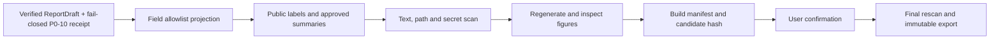

# BRIDGE P0 Public-safe Export 任务卡

| 字段 | 内容 |
| --- | --- |
| Task ID | `TASK-PUBLIC-SAFE` |
| Version | `v0.1-draft` |
| Date | 2026-08-08 |
| Input | original `ReportDraft` + `ClaimVerificationResult` receipt + `PublicExportPolicySpec` |
| Primary output | `PublicSafeReport`、`PublicExportManifest`、`PublicExportCheckRecord` |
| Current state | `candidate` |

## 1. 任务目标与边界

Public-safe Export 将通过 Claim Verifier 的内部报告转换为可以公开分享的新对象，并检查公开对象及其文件中是否仍包含内部路径、内部编号、受限 metadata、凭据、隐藏图表数据或未经批准的产品信息。

本模块回答：

- 哪些字段允许进入公开摘要。
- 公开数据、内部产品和 sealed 案例分别允许显示什么名称与结果。
- JSON、CSV、Markdown 和注册图表中是否存在泄漏或不安全内容。
- 输出包是否完整、可复现，并与用户确认的候选版本一致。

本模块不验证科学结论，也不重新判断产品质量。它不修改原始 `ReportDraft` 或
P0-10 receipt，不自动上传文件，不处理原始单细胞数据，不执行通用患者微数据匿名化，也不负责 PDF、Office 或任意 HTML 发布。

### 当前可执行切片（2026-08-24）

P0-11 v0.2 先实现最小的 allowlist-first JSON 投影：输入一个 ReportDraft、
一个 release state 为 `verified` 或 `verified_with_warnings`、但明确
`public_release_authority_state=not_configured` 且 `public_export_eligibility=ineligible`
的 P0-10 receipt，以及一个 PublicExportSpec，只输出一个新的
PublicSafeReport review candidate。选择哪些 claim、允许哪些 claim/evidence 状态、
公开 claim ID、case label、公开 accession 和禁止字面量全部来自版本化、带
checksum 的策略对象。已经核验的 claim text 必须逐字保留；策略不能提供任意
字符串替换。

当前输出不会携带 source report/claim/ProductCase/Evidence/binding ID；未选中的
claim 不会先复制再删除。由于当前没有可信 public-release authority，所有输出
固定为 `review_required` 并携带 `public_release_authority_not_configured`；P0-10
warning 另加独立 reason。当前切片不会产生 `ready_for_confirmation` 或
`exported`。

本切片不处理 CSV、Markdown、压缩包、图表、SVG/HTML、媒体 metadata、外部
scanner、PII 匿名化、确认 receipt 或上传。下文这些内容仍是后续设计目标，
不表示已经可调用。

## 2. 核心原则

1. **白名单生成**：从允许字段生成新对象，不能先复制内部报告再尝试删除敏感内容。
2. **分层披露**：公开数据可以保留公开 accession 和正式名称；内部或 sealed 案例只能使用获批公开别名和获批汇总字段，否则整项省略。
3. **最小数据**：公开包只包含当前发布目的必需的信息，不携带原始 metadata、细胞级表格、内部关联表或未使用 artifact。
4. **扫描器是第二道防线**：PII、密钥和路径扫描未命中不能证明安全，字段白名单和 disclosure policy 才是正式依据。
5. **公开图表重新生成**：图表从 public-safe data payload 重新渲染，不直接复制内部图表文件。
6. **不可变和可追溯**：策略、输入或候选包任一变化都产生新版本，并使旧确认失效。
7. **人工确认后导出**：Agent 可以生成候选包和解释阻塞原因，但不能替用户批准导出。

## 3. 输入与输出合同

### 3.1 必要输入

- 原始 `ReportDraft`。
- `ClaimVerificationResult` 的 release state 为 `verified` 或
  `verified_with_warnings`，receipt 中的 report ref/hash/audience 与原始
  ReportDraft 一致，artifact checksum 与输入 ref 一致；当前 authority state
  必须是 `not_configured`，export eligibility 必须保持 `ineligible`。
- 冻结的 `PublicExportPolicySpec` 和字段白名单。
- 案例级 disclosure decision、公开别名和可公开 accession。
- 允许公开的 `VisualizationArtifact` 及其机器可读 data payload。
- 用户发起的 `PublicExportRequest`，包含目标发布通道和确认范围。

缺少任一必要对象时返回 `not_assessed` 或 `export_blocked`。系统不得从文件名、dataset ID、实验室名称或目录结构推断公开权限。

### 3.2 主要对象

| 对象 | 作用 |
| --- | --- |
| `PublicExportPolicySpec` | 定义受众、字段白名单、别名规则、允许文件类型和必需扫描器 |
| `PublicExportRequest` | 记录请求者、目标通道、案例范围、语言和确认状态 |
| `PublicAliasMap` | 内部 ID 到获批公开别名的受限映射，不进入公开包 |
| `PublicSafeReport` | 由白名单重新生成的公开摘要对象 |
| `PublicExportCheckRecord` | 记录每项 schema、字段、文本、文件和包检查结果 |
| `PublicExportManifest` | 记录公开文件、类型、大小、hash、来源 public object 和工具版本 |

`PublicSafeReport` 至少保存：

```text
public_report_id / version / schema_version
source_report_hash / claim_verification_receipt_hash / export_policy_ref
public_case_labels / public_source_accessions
approved_summary_fields / approved_visualization_refs
limitations / public_statement_refs
export_state / manifest_ref / created_at
```

内部 Evidence ID、样本 ID 或 preparation ID 如需公开追溯，必须映射为新的 public ID；映射表保留在内部，不进入导出包。

### 3.3 导出状态

| 状态 | 条件 | 行为 |
| --- | --- | --- |
| `not_assessed` | 尚未运行或缺少活动策略 | 不生成候选包 |
| `export_blocked` | 白名单、文件或泄漏检查存在 blocker | 修正输入或策略后重新运行 |
| `review_required` | 无确定性泄漏，但存在别名、自由文本或图表语义待确认 | 等待授权审核者 |
| `ready_for_confirmation` | 未来只有可信授权源接入并升级合同时才可能出现 | 当前 v0.2 不输出 |
| `exported` | 用户确认与候选 hash 一致，最终包复核通过 | 保存不可变公开包；不自动上传 |

## 4. 简化工作流



固定流程：

1. 校验输入对象、策略版本、release state 和 export eligibility。
2. 按字段白名单投影结构，并应用公开名称或整项省略规则。
3. 从 public-safe payload 渲染 Markdown、CSV 和注册图表。
4. 扫描文本、字段值、文件名、文件内容和媒体 metadata。
5. 校验文件类型、CSV 内容、SVG 安全性和 manifest 完整性。
6. 规范化 JSON，生成逐文件 hash 和候选包 hash。
7. 用户确认候选包；确认绑定候选 hash。
8. 最终写出前重复检查，生成不可变 `PublicExportManifest`。

## 5. 工具组合

### 5.1 结构投影

| 工具 | 用途 | P0 状态 | 边界 |
| --- | --- | --- | --- |
| `BRIDGE-PUBLIC-EXPORT-ENGINE-v0.1` | 按 `PublicExportPolicySpec` 生成新对象 | `candidate` | 唯一正式字段投影通道 |
| Pydantic | 对象、枚举和序列化合同 | `shortlisted` | schema 通过不代表无敏感内容 |
| JSON Schema/jsonschema | 独立结构校验 | `shortlisted` | 与 Pydantic 属于结构验证通道 |
| pandas/PyArrow | 生成允许的公开表格 | `shortlisted` | 不读取或导出细胞级私有表 |

### 5.2 泄漏扫描

| 工具 | 用途 | P0 状态 | 边界 |
| --- | --- | --- | --- |
| `BRIDGE-LEAK-SCANNER-v0.1` | 路径、内部 ID、文件名、字段和固定 deny patterns | `candidate` | 正式确定性检查，与字段白名单共同使用 |
| `regex` | 中英文本、路径、凭据格式和内部模式预筛 | `shortlisted` | 不能识别所有语义泄漏 |
| Microsoft Presidio | PII 和结构化文本扫描 | `conditional` | 需加入中文及项目内部 recognizer；仅作辅助 |
| Gitleaks | token、API key 和 credential 扫描 | `conditional` | 面向秘密信息，不替代字段级检查 |

Presidio 和 Gitleaks 的未命中结果不能将候选包自动判为安全。若策略将某扫描器标为 required 而运行失败，导出必须阻止。

### 5.3 文件与图表检查

| 工具 | 用途 | P0 状态 | 边界 |
| --- | --- | --- | --- |
| `file` / python-magic | 检查文件真实类型与扩展名 | `candidate` | 类型识别不检查内容语义 |
| Pillow | 重新编码 PNG/JPEG 并显式移除非必要 metadata | `shortlisted` | 输出后仍需独立 metadata 审计 |
| ExifTool | 检查 EXIF、XMP、comment 和软件 metadata | `conditional` | 当前未安装；作为独立审计通道 |
| defusedxml | 安全解析 SVG/XML | `shortlisted` | 只解决 XML 解析风险 |
| DOMPurify | 检查 SVG 中 script、事件属性和不安全链接 | `conditional` | 放在 Web 验证环境，不处理科学内容 |

正式 SVG 只能来自注册组件和 public-safe payload。任意上传 SVG、外部图片链接、`foreignObject`、script、事件处理器、隐藏内部文本或未登记 tooltip data 均阻止导出。

### 5.4 打包与完整性

| 工具 | 用途 | P0 状态 | 边界 |
| --- | --- | --- | --- |
| RFC 8785 实现 | 规范化 JSON 以产生稳定 hash | `proposed` | 当前环境未安装实现 |
| Python `hashlib` | SHA-256 文件与对象指纹 | `shortlisted` | hash 证明完整性，不证明内容安全 |
| Python `zipfile` | 构建受控公开包 | `shortlisted` | 禁止绝对路径、父目录跳转和符号链接 |
| Python `csv` | 受控 CSV 写出 | `shortlisted` | 必须防止 spreadsheet formula injection |
| `sha256sum`、`zip`、`unzip` | 独立包完整性复核 | `available` | 只作 CLI 复核，不决定字段允许性 |

## 6. 字段披露规则

| 字段类别 | 默认行为 | 示例 |
| --- | --- | --- |
| `public` | 直接输出 | 公开 accession、DOI、公开文章标题 |
| `public_if_approved` | 有活动审批和公开别名时输出 | 内部产品公开代号、获批汇总结果 |
| `derived_public` | 从允许输入重新计算或投影 | 汇总 count、domain state、公开图表 payload |
| `restricted` | 不输出，可保留在内部 manifest linkage | 内部 Evidence ID、case ID、样本关系 |
| `prohibited` | 阻止导出 | 服务器路径、用户名、凭据、原始 metadata、SOP 自由文本 |

公开汇总中的数值必须同时保留单位、分母、区间和 evidence state。`missing`、`unknown`、`unavailable`、`negative` 和 `alert` 不得因导出而改写或合并。

## 7. 环境

### 7.1 环境合同

| 环境 | 用途 | 资源 | 状态 |
| --- | --- | --- | --- |
| `ENV-PUBLIC-SAFE-CORE-v0.1` | 白名单投影、结构校验、CSV/JSON/Markdown、hash 和 manifest | CPU，Python 3.12 | `proposed` |
| `ENV-PUBLIC-SAFE-SCANNERS-v0.1` | Presidio、自定义 recognizer、Gitleaks、ExifTool 和 MIME 检查 | CPU，隔离运行 | `proposed` |
| `ENV-WEB-VALIDATION-v0.1` | DOMPurify、注册 SVG 和 Playwright 渲染复核 | CPU，Node/浏览器 | `proposed` |

P0 正式导出不依赖 GPU，也不需要实时联网。正式环境建立后需冻结 lock、scanner rules、MIME policy、health check 和测试 fixture。

## 8. Agent 调用边界

Agent 可以：

- 选择已注册的 public export policy。
- 调用结构投影、泄漏扫描、图表复核和打包工具。
- 展示阻塞字段、失败文件和修复所需审批。
- 请求用户确认候选包 hash。

Agent 和 LLM 不可以：

- 临时增加白名单字段或更改 disclosure decision。
- 自行将内部 ID 改写为“看起来匿名”的字符串后输出。
- 因扫描器未命中而批准导出。
- 删除 blocker、伪造用户确认或自动上传公开包。
- 把内部全文发送给外部 LLM 做脱敏。

## 9. Validation

### 9.1 必测场景

- 在嵌套 JSON、表格、Markdown、文件名和图表 payload 中植入合成路径、用户名、邮箱、IP、token、内部 ID 和 SOP 片段，全部应被阻止。
- 公开 accession、DOI 和已审批公开名称应通过，不能被内部 ID 规则误删。
- 内部或 sealed 案例没有获批别名时整项省略；存在别名时只输出获批字段。
- 未在白名单中的嵌套字段即使名称看似安全也不得进入输出。
- CSV 中以公式触发字符开头的文本必须按冻结规则处理并通过 fixture。
- 文件扩展名与真实类型不符、未登记文件、归档父目录跳转、绝对路径或符号链接必须阻止。
- PNG/JPEG 中 EXIF、XMP、comment 或软件 metadata 必须被清除并由独立工具复核。
- SVG 中 script、事件属性、外部资源、隐藏文本、内部 tooltip payload 或不允许元素必须阻止。
- manifest 中每个文件具有类型、大小和 SHA-256；包中不得出现 manifest 外文件。
- 相同输入、策略和工具版本产生相同 canonical payload 和 hash。
- 用户确认后任何字段、文件或策略变化都使确认失效。
- required scanner 不可用或失败时返回 `export_blocked`；语义不确定但无确定性泄漏时返回 `review_required`。

### 9.2 冻结标准

- 已登记禁止字段和合成泄漏 fixture 的漏放行为 0。
- 正式输出字段 100% 来自活动白名单或已登记 `derived_public` 转换。
- 公开 accession 和 DOI 的允许 fixture 不产生阻塞性误报。
- 图表、文本、表格和包检查均生成可追溯 `PublicExportCheckRecord`。
- 候选包、确认 hash 和最终包逐文件一致。
- 至少一名湿实验用户和一名实现者走查真实 public-safe 候选报告。

## 10. Legacy Handoff

旧 `validation.py` 可复用：

- required-column 和 schema 检查思路。
- 字段 allowlist、路径 marker 和 JSON/CSV 读取骨架。
- 输出前再次执行 public-safe assertion 的工程模式。

必须废弃：

- 旧 Target/Potency/Purity/Risk/Evidence Confidence/Integrated score 域列表。
- product、negative、reference 或 boundary role 的 pass/fail 阈值。
- 将文件存在、某个分数存在或扫描器未命中解释为公开安全。
- 在同一函数中同时决定科学验证结果和 public-safe 状态。

## 11. 主要官方来源

- Pydantic：https://docs.pydantic.dev/latest/
- JSON Schema：https://json-schema.org/specification
- Microsoft Presidio：https://microsoft.github.io/presidio/learn_presidio/
- Gitleaks：https://github.com/gitleaks/gitleaks
- Pillow security：https://pillow.readthedocs.io/en/stable/handbook/security.html
- ExifTool：https://exiftool.org/
- defusedxml：https://github.com/tiran/defusedxml
- DOMPurify：https://github.com/cure53/DOMPurify
- RFC 8785：https://www.rfc-editor.org/rfc/rfc8785.html
- Python hashlib：https://docs.python.org/3/library/hashlib.html
- Python zipfile：https://docs.python.org/3/library/zipfile.html
- OWASP CSV Injection：https://owasp.org/www-community/attacks/CSV_Injection
