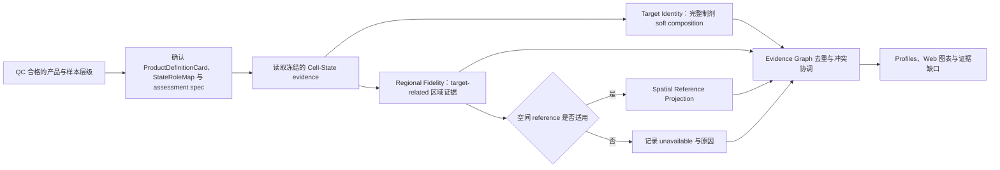

# BRIDGE P0 Target Identity 与 Regional Fidelity 任务卡

| 字段 | 内容 |
| --- | --- |
| Task ID | `TASK-TARGET-IDENTITY-v0.1`；`TASK-REGIONAL-FIDELITY-v0.1` |
| 文档版本 | `0.2 executable-candidate update` |
| 日期 | 2026-08-25 |
| 状态 | `candidate` |
| 首个实例 | 移植前 hPSC-derived VM floor-plate/mDA progenitor |
| 上游输入 | 11 个 checksummed JSON：`ProductCase`、`ProductDefinitionCard`、`StateRoleMap`、`TargetRegionalAssessmentSpec`、`MeasurementSpecV2`、`CellStateEvidenceProfileV3`、`QCReadinessProfileV2`、`BiologicalUnitManifest`、`BiologicalUnitAssignmentArtifact`、`AnnotationVocabulary`、`ReferenceManifest` |
| 主要输出 | `TargetRegionalEvidenceResult`；每个请求 channel 的 3 个独立 checksummed `MeasurementResultV2` |

## 0. 当前可执行候选

P0-03 v0.2.0 实现组成解释的最小确定性路径。它通过
`ToolRequestV2` 精确接收上表 11 个带 Schema、版本和 SHA-256 的本地 JSON
对象，原子发布一个 `TargetRegionalEvidenceResult`，并为每个请求 channel
分别发布 3 个 `MeasurementResultV2`：`target_identity_fraction`、
`regional_fidelity_fraction` 和
`whole_product_target_region_fraction`。旧 Cell-State v0.1/v0.2 profile 不构成
兼容入口。

实现代码不包含具体状态名、marker、状态到产品角色的映射、阈值或固定的
正向角色集合。下文 PD-mDA 内容仍是待审核科学候选；一次运行实际采用的状态
product role、composition view、source、label level，以及区域 numerator 与
denominator state-ID sets 全部来自版本化、带 checksum 的输入。因此生物学决定变化
时替换对象版本即可，不需要修改执行器。

“外部可配置”不等于可以重新解释 unknown。执行合同只固化不可变的安全约束：
角色不能自相矛盾；`SOURCE_SPECIFIC` 与 `source_ids` 必须成对；上游
`unknown`/`ood` 使对应 channel 成为 `not_assessed`，三个指标都不携带数值；
缺失或 unresolved mapping 同样不得补零。target-related denominator 为零时，
`regional_fidelity_fraction` 必须是 `unavailable` 且 value/numerator/denominator
均为 null。其他角色集合完全由评估 spec 决定。

11 对象脊柱要求 ProductCase、MeasurementSpec、P0-01 data view、P0-02 input
view、manifest 和 assignment 的 observation set、analysis unit、independence group、
hierarchy、ref 与 checksum 全部闭合；同时严格绑定共享 StateRoleMap 和 P0-02 V3
中的 MeasurementSpec、AnnotationVocabulary、ReferenceManifest 与 QC SHA。assignment
不参与生物学角色求和，只证明观测对应的实验单位。`declared` 仍不能被解释为
已审核的独立生物重复。

当前路径不重跑表达分析或空间投射，不输出区间、分数、效力、安全或放行结论。
三个 `MeasurementResultV2` 只承载分母明确的原始比率。所有可评估结果仍为
`shadow`，`domain_score=null`。

## 1. 任务目标

本模块把 Cell-State 的状态证据解释为两个独立的产品评估问题：

- **Target Identity**：完整制剂中有多少细胞支持 ProductDefinitionCard 声明的目标细胞身份。
- **Regional Fidelity**：目标相关细胞是否支持预期的腹侧中脑/底板区域身份，主要偏移到哪里。

两项任务合并交付，但分别保存分母、raw metrics、不确定性和证据状态。当前阶段只整理并验证方法，不制定 0-100 分数或阈值。

## 2. 评估边界

- Cell-State 模块负责生成 prediction set、连续权重、方法分歧和 unknown；本模块负责依据 ProductDefinitionCard 解释这些证据。
- Target Identity 分母来自所选 P0-02 composition channel，并由输入记录显式携带。
- Regional Fidelity 分母由 `TargetRegionalAssessmentSpec` 指定的 state-ID 集合组成；同时单列完整制剂中的区域支持比例。
- 区域身份、细胞谱系和发育阶段分别判断。体外分化日不能自动换算为 GW/PCW。
- 体外产品 scRNA 投射到人胚空间参考称为 **Spatial Reference Projection**，不表示产品具有真实组织空间结构。
- 非目标细胞和异常状态传递给 Off-target Control 与 Proliferation & Stress Response，不在本模块重复定义。
- 输出仅表示转录组证据相容性，不表示临床疗效、安全性、potency、GMP 放行或绝对产品优劣。

## 3. 当前 Reference

| Reference | 数据与范围 | 本模块用途 | 当前状态与限制 |
| --- | --- | --- | --- |
| `REF-CHEN-VMB-SC-v1` | scRNA-seq；GW7/8/9/12/16/20；人腹侧中脑；61,455 cells | 早期 target、区域和邻近状态 | `freeze_required`；需冻结 annotation 与样本表 |
| `REF-CHEN-VMB-SN-v1` | snRNA-seq；GW14/16/18/20/24/25；人腹侧中脑；87,467 nuclei | 中晚期神经元和 DA 状态 | sc/sn 与胎龄耦合，需模态敏感性分析 |
| `REF-CHEN-RGNB-v1` | Chen reference 派生 RG/Nb 子集；14 states；15,095 profiles | mFP、mBMP、mBIP 及间脑状态 | 派生对象，不作为独立证据重复计数 |
| `REF-LAMANNO-2016-v1` | scRNA-seq；PCW6-11；人胎腹侧中脑；1,977 cells | 独立 VM sensitivity reference | 平台较旧、规模较小 |
| `REF-BRAUN-2023-v1` | scRNA-seq；PCW5-14；第一孕期全脑 | forebrain/midbrain/hindbrain 区域背景 | 全脑 reference 不能替代 VM 产品定义 |
| `REF-ZENG-2023-v1` | scRNA-seq；PCW3-12；全胚、全头和全脑 | 早期区域与非神经背景 | 区域标签与版本仍需冻结 |
| `REF-SPATIAL-HEB58-ANNOT-v0.1-draft` | Visium HD segmented profiles；GW7 人胚中脑；2 sections；385,361 profiles、18,085 genes、20 个最终标签 | 空间 marker、区域锚定和投射 benchmark | `available + freeze_required`；两张切片来自同一胚胎，不能作为两个生物重复 |
| `REF-SPATIAL-CHEN-CS-v1` | 计划中的冠状/矢状空间数据；单时间点 | 后续切面和 ROI 稳健性 | `pending_data` |

`REF-SPATIAL-HEB58-ANNOT-v0.1-draft` 的最终 `cell_type` 覆盖中脑 FP/BP/AP/RP、MHB、后脑、前脑/间脑及非神经状态。对象同时保留两套模型初注释和人工空间修订标签；正式冻结前需补齐标签定义、人工修订记录、切片方向、ROI、处理版本和 checksum。

## 4. ProductDefinitionCard、共享 StateRoleMap 与区域集合

P0-03 复用 P0-05 唯一的 `StateRoleMap` Schema，不在本模块重复定义同 URI
合同。产品角色与区域归属仍是两个外部审核轴：

| 外部对象 | 责任 |
| --- | --- |
| `StateRoleMap.product_role` | `target` / `acceptable_adjacent` / `known_off_target` / `role_unresolved` |
| `TargetRegionalAssessmentSpec` | 绑定 StateRoleMap ref/checksum，并显式列出区域分子、区域分母与 whole-product 区域 state IDs |
| Developmental Compatibility | 单独判断 stage，不写入 StateRoleMap |
| Proliferation & Stress Response | 单独判断 process，不写入 StateRoleMap |

首张 Card 的候选逻辑为：`RG_mFP`、`Nb_mFP` 和早期/成熟 `Neuron_DA` 分别报告，不合并成一个目标比例；mFP progenitor 提供主要 target/region 支持，`Nb_mFP` 和早期 DA 状态是否属于 target 或 `acceptable_adjacent` 由研究者确认。`mBMP/mBIP`、AP、MHB、前脑、间脑和后脑先作为待核实的区域状态或偏移方向，不依据标签名称直接冻结角色。所有映射必须经生物学审核，文献 marker 不能单独决定角色。

## 5. 分析流程

## 6. Target Identity 工具组合

| 分析需求 | 推荐方法 | 正式输出候选 |
| --- | --- | --- |
| 状态角色解释 | BRIDGE `StateRoleMap` + assessment spec | product role 与区域 state-ID membership |
| 完整制剂组成 | soft composition + sample-preserving bootstrap | target、acceptable adjacent、unresolved 比例和区间 |
| marker/program 校验 | 内部 program + UCell/decoupler；AUCell sensitivity | program coverage、方向一致性和冲突 |
| 独立 reference 校验 | sample/state pseudobulk correlation；SingleR/scmap sensitivity | correlation、margin、reference sensitivity |
| 分类/映射证据 | Cell-State benchmark 后冻结的 custom classifier/reference mapper | posterior、prediction set、unknown 和 applicability |
| 连续或混合身份 | NNLS/simplex 或经验证的连续分解 | target weight、residual、hybrid/unknown |

正式运行只读取 Cell-State 已冻结的方法组合。多个工具共享 marker、reference 或训练数据时归入同一 evidence family，不按投票数重复加权。

## 7. Regional Fidelity 工具组合

### 7.1 转录组区域证据

- 使用内部区域标签和冻结的 regional programs，分别量化 vMB/mFP、其他中脑亚区、MHB、间脑、前脑和后脑支持。
- 保留 marker/program、pseudobulk correlation、分类/映射和开放集四类输出；同源证据先去重。
- `regional_shift` 必须报告具体方向，reference coverage 不足时返回 `unknown` 或 `unavailable`。

### 7.2 Spatial Reference Projection

| 方法 | 在 BRIDGE 中的候选角色 | 关键限制 |
| --- | --- | --- |
| BRIDGE correlation/cosine/kNN baseline | 透明的 cell/state-to-spatial-profile 基线 | 需做 shared-gene、distance 和 OOD gate |
| Tangram | 直接空间投射首轮候选；输出 cell/cluster-to-location probability | 官方要求 sc/sn 与空间数据来自相同组织/区域；跨样本产品投射需严格适用性检查 |
| SpaOTsc | optimal transport 独立校验候选 | 依赖较旧，需隔离环境；映射质量必须单独验证 |
| CellTrek | R/Seurat cell charting benchmark | 共嵌入和参数敏感性需测试；不默认优于透明基线 |
| CytoSPACE | optimization-based assignment benchmark | hard assignment 可能强制映射 OOD 细胞，必须设置拒答/残差通道 |
| cell2location | 空间 reference 构建、注释与区域 abundance 校验 | 主要解决空间数据的 cell-type abundance，不作为产品细胞直接坐标投射主方法 |
| SpatialData / Squidpy | 空间对象管理、邻域/marker/ROI 质控和可视化 | 属于 reference QC，不单独证明产品区域身份 |

Web 可以突出展示 cell-level 投射图；正式可比较 raw metrics 先按 sample/state 聚合，并同时显示拟合质量和不确定性。

## 8. 输出合同

### 8.1 `TargetIdentityProfile`

| 字段 | 含义 |
| --- | --- |
| `denominator` | 全部 eligible product cells 及数量 |
| `target_soft_fraction` | target 权重之和/分母 |
| `acceptable_adjacent_soft_fraction` | acceptable adjacent 权重之和/分母 |
| `unresolved_fraction` | unknown、ambiguous 或 Card 未映射部分 |
| `interval` | sample-preserving bootstrap 或预注册等价区间 |
| `method_evidence` | 各独立 evidence family 的原始输出 |
| `evidence_state` | `available` / `negative` / `unknown` / `missing` / `unavailable` / `shadow` |

### 8.2 `RegionalFidelityProfile`

| 字段 | 含义 |
| --- | --- |
| `target_related_denominator` | target + acceptable adjacent 细胞/权重 |
| `target_region_soft_fraction` | target region 权重/target-related 分母 |
| `acceptable_region_soft_fraction` | 邻近可接受区域权重/target-related 分母 |
| `regional_shift_profile` | 前脑、间脑、MHB、后脑等偏移方向及权重 |
| `whole_product_target_region_support` | target region 权重/全部 eligible cells；单列展示 |
| `reference_sensitivity` | reference、模态、预处理和方法切换后的结果变化 |
| `evidence_state` | 与 Target Identity 相同的证据状态枚举 |

### 8.3 `SpatialReferenceProjectionProfile`

保存 `shared_gene_coverage`、ROI/location probability、projection entropy、reconstruction/holdout fit、residual、section consistency、method disagreement、`applicability_state` 和全部 provenance。若适用性 gate 未通过，不发布定向区域结论。

## 9. 运行环境

本模块不能可靠地塞进单一环境。环境之间使用版本化 h5ad/Parquet/TSV 和 JSON manifest 交换结果。

| 环境 | 用途 | 当前状态 |
| --- | --- | --- |
| `ENV-TARGET-REGION-PY-CORE-v0.1` | composition、program、correlation、Cell-State 结果聚合 | `proposed`；需建立 lock 与 health check |
| `ENV-SPATIAL-CORE-v0.1` | AnnData/Scanpy/SpatialData/Squidpy/cell2location 与 hEB58 reference | `proposed_isolated`；需固定唯一版本和 fixture |
| `ENV-SPATIAL-PROJECTION-PY-v0.1` | Tangram 与 BRIDGE 透明投射基线 | `proposed`；兼容性验证后再决定是否与 spatial core 合并 |
| `ENV-SPAOTSC-v0.1` | SpaOTsc | `proposed_isolated`；旧依赖隔离 |
| `ENV-CELLTREK-v0.1` | CellTrek/Seurat | `proposed_isolated` |
| `ENV-CYTOSPACE-v0.1` | CytoSPACE 与 solver | `proposed_isolated`；按官方环境锁定 |

所有运行保留环境 ID、软件版本、随机种子、资源记录和输出 checksum。安装成功不等于方法通过科学验证。

## 10. Web 必备可视化

- 完整制剂 target/acceptable adjacent/unresolved 组成及区间。
- target-related 区域组成与 product-wide regional-support 并列图。
- 前脑、间脑、中脑亚区、MHB 和后脑的区域证据热图。
- hEB58 两张切片上的 cell-level Spatial Reference Projection、概率和 uncertainty overlay。
- shared-gene coverage、holdout fit、entropy/residual 及 section sensitivity。
- 方法一致性、共享 evidence family、冲突和 missing evidence 下钻。

每张正式图绑定 Evidence ID、分母、单位、Card、reference、方法和环境版本；空间图必须显示“参考投射，不代表产品真实空间结构”。

## 11. Benchmark 与冻结要求

| 验证项 | 最低要求 |
| --- | --- |
| StateRoleMap | 湿实验/发育生物学审核；角色、依据、版本和 reviewer 完整 |
| Target Identity | source/lab/donor holdout、真实 OOD、人工混合、下采样和组成误差 |
| Regional Fidelity | close-region OOD、region holdout、reference swap、scRNA/snRNA sensitivity 和具体偏移方向准确性 |
| Spatial projection | spatial-cell pseudo-query、held-out genes、leave-section-out、ROI/crop sensitivity、随机种子和 method swap |
| hEB58 reference | 两切片按同一胚胎处理；标签 provenance、方向、ROI、annotation 与 checksum 冻结 |
| 拒答 | shared genes 不足、OOD、拟合差或方法冲突时返回 `unknown`/`unavailable`，不强制映射 |
| 一致性 | cell-level 图与 sample/state 聚合结果可追溯，独立运行与联合比较不改写原始 evidence |

未完成这些验证前，输出保持 raw metrics 或 `shadow`。0-100 `domain_score` 的公式、方向和阈值在独立 ScoreContract 中另行开发。

## 12. 主要官方来源

- [Tangram documentation](https://tangram-sc.readthedocs.io/)、[Tangram source](https://github.com/broadinstitute/Tangram)、[Tangram paper](https://www.nature.com/articles/s41592-021-01264-7)
- [SpaOTsc source](https://github.com/zcang/SpaOTsc)、[SpaOTsc paper](https://www.nature.com/articles/s41467-020-15968-5)
- [CellTrek source](https://github.com/navinlabcode/CellTrek)、[CellTrek paper](https://www.nature.com/articles/s41587-022-01233-1)
- [CytoSPACE source](https://github.com/digitalcytometry/cytospace)、[CytoSPACE paper](https://www.nature.com/articles/s41587-023-01697-9)
- [cell2location documentation](https://cell2location.readthedocs.io/)、[SpatialData](https://spatialdata.scverse.org/)、[Squidpy](https://squidpy.readthedocs.io/)
- [La Manno et al. 2016](https://doi.org/10.1016/j.cell.2016.09.027)、[Kirkeby et al. 2017](https://doi.org/10.1016/j.stem.2016.09.004)、[CORIN sorting study](https://pmc.ncbi.nlm.nih.gov/articles/PMC3964289/)
