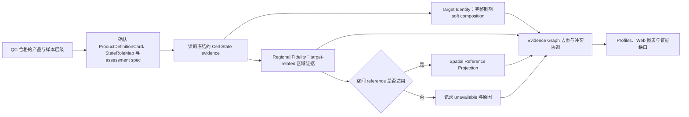

# BRIDGE P0 Target Identity 与 Regional Fidelity 任务卡

| 字段 | 内容 |
| --- | --- |
| Task ID | `TASK-TARGET-IDENTITY-v0.1`；`TASK-REGIONAL-FIDELITY-v0.1` |
| 文档版本 | `0.4 spatial-method candidate update` |
| 日期 | 2026-08-31 |
| 状态 | `candidate` |
| 首个实例 | 移植前 hPSC-derived VM floor-plate/mDA progenitor |
| 上游输入 | 11 个 checksummed 核心 JSON；表达模式另加 1 个 analysis-ready H5AD 与 1 个 `TargetRegionalMethodSpec` |
| 主要输出 | `TargetRegionalEvidenceResult`、3 类 `MeasurementResultV2`；表达模式另加 `TargetRegionalMethodBundle` |

## 0. 当前可执行候选

P0-03 v0.3.0 提供两个兼容入口：

- **聚合模式**：读取 11 个 checksummed JSON，发布三个分母明确的
  `MeasurementResultV2` 与 `TargetRegionalEvidenceResult`。
- **表达模式**：在同一合同上增加 QC-selected H5AD 和
  `TargetRegionalMethodSpec`，执行 target/regional pseudobulk correlation、
  target NNLS、target/regional decoupler ULM、independence-group bootstrap、
  cross-reference 与 scRNA/snRNA sensitivity，并发布
  `TargetRegionalMethodBundle`。

两套 reference 集合、program card、coverage minima、状态角色和区域集合均由
版本化输入给出。代码不包含具体状态名、marker、产品阈值或固定正向角色。下文
PD-mDA 内容仍是待审核科学候选，改变生物学定义时应更新输入对象而非执行器。

表达模式还要求调用方声明版本化的表达语义合同；该合同把 query、reference、
归一化/变换和基因标识命名空间绑定为一个可审核的可比性声明。`REG-MODALITY`
只比较显式匹配的 feature view 与 context group，不再以 assay 名不同代替匹配设计。
NNLS 的 relative L2 residual 上限同样来自外部 applicability contract；缺少合同或
超过上限时返回 typed `not_assessed`/`unknown`，不把系数送入 bootstrap。

表达矩阵中的 observation IDs 必须与 P0-01/P0-02 DataView 及
`BiologicalUnitAssignmentArtifact` 完全一致。Pseudobulk 按其中的
`analysis_unit_ref` 聚合；bootstrap 按 `independence_group_ref` 重采样。只有
一个独立单位时只发布 `descriptive_only`，不伪造区间。

上游 `unknown`/`ood`、缺失映射和零分母仍保持 typed
`not_assessed`/`unavailable`，不得补零。旧 Cell-State v0.1/v0.2 profile 不是
兼容入口。

空间投射尚未进入本版本。所有数值仍为 `shadow`，`domain_score=null`；真实
方法可执行不等于 reference、program 或产品结论已经过生物学验证。

## 1. 任务目标

本模块把 Cell-State 的状态证据解释为两个独立的产品评估问题：

- **Target Identity**：完整制剂中有多少细胞支持 ProductDefinitionCard 声明的目标细胞身份。
- **Regional Fidelity**：目标相关细胞是否支持预期的腹侧中脑/底板区域身份，主要偏移到哪里。

两项任务合并交付，但分别保存分母、raw metrics、不确定性和证据状态。当前阶段只整理并验证方法，不制定 0-100 分数或阈值。

## 2. 评估边界

- Cell-State 模块负责生成 prediction set、连续权重、方法分歧和 unknown；本模块负责依据 ProductDefinitionCard 解释这些证据。
- Target Identity 分母来自所选 P0-02 composition channel，并由输入记录显式携带。
- Regional Fidelity 分母由 `TargetRegionalAssessmentSpec` 指定的 state-ID 集合组成；同时单列完整制剂中的区域支持比例。
- 区域身份、细胞谱系和发育阶段分别判断。体外分化日不能自动换算为 GW/PCW。
- 体外产品 scRNA 投射到人胚空间参考称为 **Spatial Reference Projection**，不表示产品具有真实组织空间结构。
- 非目标细胞和异常状态传递给 Off-target Control 与 Proliferation & Stress Response，不在本模块重复定义。
- 输出仅表示转录组证据相容性，不表示临床疗效、安全性、potency、GMP 放行或绝对产品优劣。

## 3. 当前 Reference

| Reference | 数据与范围 | 本模块用途 | 当前状态与限制 |
| --- | --- | --- | --- |
| `REF-CHEN-VMB-SC-v1` | scRNA-seq；GW7/8/9/12/16/20；人腹侧中脑；61,455 cells | 早期 target、区域和邻近状态 | `freeze_required`；需冻结 annotation 与样本表 |
| `REF-CHEN-VMB-SN-v1` | snRNA-seq；GW14/16/18/20/24/25；人腹侧中脑；87,467 nuclei | 中晚期神经元和 DA 状态 | sc/sn 与胎龄耦合，需模态敏感性分析 |
| `REF-CHEN-RGNB-v1` | Chen reference 派生 RG/Nb 子集；14 states；15,095 profiles | mFP、mBMP、mBIP 及间脑状态 | 派生对象，不作为独立证据重复计数 |
| `REF-LAMANNO-2016-v1` | scRNA-seq；PCW6-11；人胎腹侧中脑；1,977 cells | 独立 VM sensitivity reference | 平台较旧、规模较小 |
| `REF-BRAUN-2023-v1` | scRNA-seq；PCW5-14；第一孕期全脑 | forebrain/midbrain/hindbrain 区域背景 | 全脑 reference 不能替代 VM 产品定义 |
| `REF-ZENG-2023-v1` | scRNA-seq；PCW3-12；全胚、全头和全脑 | 早期区域与非神经背景 | 区域标签与版本仍需冻结 |
| `REF-SPATIAL-HEB58-ANNOT-v0.1-draft` | Visium HD segmented profiles；GW7 人胚中脑；2 sections；385,361 profiles、18,085 genes、20 个最终标签 | 当前工作标签的正 marker QA 与 candidate label-program lookup；未来 mapping benchmark 仅在 P0-03 applicability gate 通过后启用 | `available + freeze_required`；两张切片来自同一胚胎，不能作为两个生物重复；当前不构成 calibration、解剖定位、独立验证或产品映射 |
| `REF-SPATIAL-CHEN-CS-v1` | 计划中的冠状/矢状空间数据；单时间点 | 后续切面和 ROI 稳健性 | `pending_data` |

`REF-SPATIAL-HEB58-ANNOT-v0.1-draft` 的最终 `cell_type` 覆盖中脑 FP/BP/AP/RP、MHB、后脑、前脑/间脑及非神经状态。对象同时保留两套模型初注释和人工空间修订标签；正式冻结前需补齐标签定义、人工修订记录、切片方向、ROI、处理版本和 checksum。

## 4. ProductDefinitionCard、共享 StateRoleMap 与区域集合

P0-03 复用 P0-05 唯一的 `StateRoleMap` Schema，不在本模块重复定义同 URI
合同。产品角色与区域归属仍是两个外部审核轴：

| 外部对象 | 责任 |
| --- | --- |
| `StateRoleMap.product_role` | `target` / `acceptable_adjacent` / `known_off_target` / `role_unresolved` |
| `TargetRegionalAssessmentSpec` | 绑定 StateRoleMap ref/checksum，并显式列出区域分子、区域分母与 whole-product 区域 state IDs |
| Developmental Compatibility | 单独判断 stage，不写入 StateRoleMap |
| Proliferation & Stress Response | 单独判断 process，不写入 StateRoleMap |

首张 Card 的候选逻辑为：`RG_mFP`、`Nb_mFP` 和早期/成熟 `Neuron_DA` 分别报告，不合并成一个目标比例；mFP progenitor 提供主要 target/region 支持，`Nb_mFP` 和早期 DA 状态是否属于 target 或 `acceptable_adjacent` 由研究者确认。`mBMP/mBIP`、AP、MHB、前脑、间脑和后脑先作为待核实的区域状态或偏移方向，不依据标签名称直接冻结角色。所有映射必须经生物学审核，文献 marker 不能单独决定角色。

## 5. 分析流程

## 6. Target Identity 工具组合

表中短 ID 来自主目录的 `tool_id`，运行时作为 method selector；Tool Package
Spec 使用知识快照中的规范化 `METHOD-*` ID，二者通过 catalog alias 对应。

| 能力 | 方法 ID / 软件 | 当前调用位置 | 输出 |
| --- | --- | --- | --- |
| 状态角色与组成 | `TRG-ROLEMAP` / soft composition | P0-03 聚合模式直接执行 | target/adjacent/unresolved 分母与比例 |
| Target reference similarity | `TRG-PBCORR` | P0-03 表达模式直接执行 | Spearman/cosine、margin、shared genes |
| 连续身份 | `TRG-NNLS` / SciPy | P0-03 表达模式直接执行 | state weights、relative L2 residual 与 applicability state |
| Signed program | `TRG-DECOUPLER` / decoupler ULM | P0-03 表达模式直接执行 | activity、p-value 与 marker coverage |
| 不确定性 | `TRG-BOOTSTRAP` | P0-03 表达模式直接执行 | independence-group interval 或 `descriptive_only` |
| 分类/映射/open-set | CellTypist、scANVI、SingleR、scmap、Symphony、scConform | P0-02 benchmark adapter；P0-03 只消费其已绑定 evidence | prediction、similarity、mapping 与 abstention evidence |
| 其他候选 | UCell、AUCell、popV、scArches | catalog only；本版本不直接执行 | 尚无 P0-03 runtime artifact |

共享 marker、reference 或训练数据的方法归入同一 evidence family，不按工具数量重复加权。

## 7. Regional Fidelity 工具组合

### 7.1 转录组区域证据

| 能力 | 方法 ID / 软件 | 当前调用位置 | 输出 |
| --- | --- | --- | --- |
| Regional role aggregation | `REG-ROLEMAP` | P0-03 聚合模式直接执行 | target-region 与 whole-product 比例 |
| Regional reference similarity | `REG-PBCORR` | P0-03 表达模式直接执行 | label support、margin、shared genes |
| Signed regional program | `REG-DECOUPLER` / decoupler ULM | P0-03 表达模式直接执行 | activity 与 coverage |
| Reference robustness | `REG-CROSSREF` | P0-03 表达模式直接执行 | label agreement 与 support range |
| Modality robustness | `REG-MODALITY` | P0-03 表达模式直接执行 | declared matched-group agreement 或 typed refusal |
| 分类、映射与 open-set | CellTypist、scANVI、SingleR、Symphony、scConform | P0-02 benchmark adapter；P0-03 消费已绑定 evidence | regional prediction/mapping evidence |
| Ontology crosswalk | UBERON/HsapDv | catalog only；当前不执行 | 尚无 runtime artifact |

区域偏移必须报告具体方向；reference coverage 不足时返回 `unknown` 或
`unavailable`。

### 7.2 空间 reference QA 与候选 mapping

空间问题按任务分别比较，不再以 Tangram 为中心排列，也不生成跨任务总排名：

| 任务 | 首轮候选 | 条件候选或敏感性 | 解释边界 |
| --- | --- | --- | --- |
| segmentation sensitivity | 当前 segmentation、Bin2cell、ENACT | 有原始 2 µm bins 时加入 FICTURE 无分割对照 | 比较边界、marker 保留和小区域稳定性；不把 segmented profile 称为已验证单细胞 |
| 标签复核 | 当前双 reference 的 `Uncertain` 层、正 marker supporting-expression panel、RCTD reject/doublet | anti-marker 为 `not_recorded` | final 对象的 20 个 `cell_type` 是当前工作标签；没有版本化 crosswalk 时不声称两套 prediction 的直接标签分歧 |
| spatial domain | BANKSY、CellCharter | 标签稳定后再评估 NicheCompass；Novae 仅作 zero-shot sensitivity | 评估空间连续性和 domain 稳定性，不直接证明细胞身份 |
| scRNA → spatial mapping | 聚合尺度 cell2location、RCTD | Tangram 只作 ROI/held-out-gene 验证；DestVI 为条件候选 | 保留方法原生输出：cell2location posterior absolute abundance（如 mean/q05）、RCTD weights/proportions 与 singlet/doublet/reject state、Tangram cell×voxel mapping matrix；不统称概率，也不假设每种方法都有 native OOD |
| section alignment | PASTE2、moscot | STAligner embedding sensitivity | 仅在切片连续性、方向和重叠 ROI 均确认后运行 |
| spatial trajectory | `deferred` | spaTrack 仅在后续存在明确问题和合格设计时评估 | hEB58 两张切片来自同一胚胎，不是时间序列或两个生物学重复 |

当前 P0-02 分支只绘制 hEB58 reference/figure QA 和 candidate
label-program lookup：两张 section 同比例展示，保留 20 个现有工作标签、两套
reference 的 `Uncertain` 及正 marker supporting-expression panel。没有版本化
crosswalk 时不声称直接标签分歧；原对象没有 anti-marker 或人工 confidence 字段，
均写 `not_recorded`。产品分组相似度是标签级 lookup，不是 calibration、逐位置
推断、解剖定位或独立验证。P0-03 后续 PR 才实现产品到空间 reference 的方法比较。

LungChat 不登记为 BRIDGE 分析方法，仅借鉴其参数、表格、图形和运行记录的组织
方式。CellChat 只在以后出现明确的 hEB58 通讯问题且空间 QC 合格时单独评估。

## 8. 输出合同

### 8.1 `TargetIdentityProfile`

| 字段 | 含义 |
| --- | --- |
| `denominator` | 全部 eligible product cells 及数量 |
| `target_soft_fraction` | target 权重之和/分母 |
| `acceptable_adjacent_soft_fraction` | acceptable adjacent 权重之和/分母 |
| `unresolved_fraction` | unknown、ambiguous 或 Card 未映射部分 |
| `interval` | sample-preserving bootstrap 或预注册等价区间 |
| `method_evidence` | 各独立 evidence family 的原始输出 |
| `evidence_state` | `available` / `negative` / `unknown` / `missing` / `unavailable` / `shadow` |

### 8.2 `RegionalFidelityProfile`

| 字段 | 含义 |
| --- | --- |
| `target_related_denominator` | target + acceptable adjacent 细胞/权重 |
| `target_region_soft_fraction` | target region 权重/target-related 分母 |
| `acceptable_region_soft_fraction` | 邻近可接受区域权重/target-related 分母 |
| `regional_shift_profile` | 前脑、间脑、MHB、后脑等偏移方向及权重 |
| `whole_product_target_region_support` | target region 权重/全部 eligible cells；单列展示 |
| `reference_sensitivity` | reference、模态、预处理和方法切换后的结果变化 |
| `evidence_state` | 与 Target Identity 相同的证据状态枚举 |

### 8.3 `SpatialReferenceProjectionProfile`

保存 `shared_gene_coverage`、方法原生 mapping output、可定义时的 entropy、
reconstruction/holdout fit、residual、reject state、section consistency、
method disagreement、`applicability_state` 和全部 provenance。cell2location、
RCTD、Tangram 的 abundance、weight/state 与 mapping matrix 分开建模；没有 native
OOD 或 residual 的方法不得补造。若适用性 gate 未通过，不发布定向区域结论。

## 9. 运行环境

P0-03 v0.3.0 的聚合与当前表达方法均在冻结的
`ENV-CELLSTATE-PY-v0.1` 中运行。AnnData 负责 H5AD I/O，NumPy/pandas/SciPy
负责 pseudobulk、correlation、NNLS 和 bootstrap，decoupler 负责 ULM。

空间候选当前均无 P0-03 runtime artifact。Bin2cell/ENACT/FICTURE、BANKSY/
CellCharter/NicheCompass、cell2location/RCTD/Tangram/DestVI 及
PASTE2/moscot 必须按任务建立隔离环境、合成 fixture 和资源记录。

所有运行保留环境 ID、软件版本、随机种子、资源记录和输出 checksum。安装成功不等于方法通过科学验证。

## 10. Web 必备可视化

- 完整制剂 target/acceptable adjacent/unresolved 组成及区间。
- target-related 区域组成与 product-wide regional-support 并列图。
- 前脑、间脑、中脑亚区、MHB 和后脑的区域证据热图。
- hEB58 两张切片同尺度的 reference/figure QA 图，分开显示工作标签、reference uncertainty 与正 marker support，并明确“reference only；no product cells mapped”。
- 只有空间适用性门禁通过后，才显示产品到 reference 的方法原生 mapping output；residual、reject、entropy 或 OOD 仅在对应方法定义并验证时出现。
- shared-gene coverage、holdout fit、entropy/residual 及 section sensitivity。
- 方法一致性、共享 evidence family、冲突和 missing evidence 下钻。

每张正式图绑定 Evidence ID、分母、单位、Card、reference、方法和环境版本；空间图必须显示“参考投射，不代表产品真实空间结构”。

## 11. Benchmark 与冻结要求

| 验证项 | 最低要求 |
| --- | --- |
| StateRoleMap | 湿实验/发育生物学审核；角色、依据、版本和 reviewer 完整 |
| Target Identity | source/lab/donor holdout、真实 OOD、人工混合、下采样和组成误差 |
| Regional Fidelity | close-region OOD、region holdout、reference swap、matched scRNA/snRNA sensitivity 和具体偏移方向准确性 |
| Spatial projection | spatial-cell pseudo-query、held-out genes、leave-section-out、ROI/crop sensitivity、随机种子和 method swap |
| hEB58 reference | 两切片按同一胚胎处理；工作标签 provenance、方向、ROI、正 marker panel、缺失 anti-marker、annotation 与 checksum 审核 |
| 拒答 | shared genes 不足、OOD、拟合差或方法冲突时返回 `unknown`/`unavailable`，不强制映射 |
| 一致性 | cell-level 图与 sample/state 聚合结果可追溯，独立运行与联合比较不改写原始 evidence |
| 方法比较 | segmentation、标签、domain、mapping、alignment 分任务报告；禁止跨任务总排名 |

未完成这些验证前，输出保持 raw metrics 或 `shadow`。0-100 `domain_score` 的公式、方向和阈值在独立 ScoreContract 中另行开发。

## 12. 主要官方来源

- [Spatial integration benchmark](https://www.nature.com/articles/s41592-022-01480-9)
- [Bin2cell](https://doi.org/10.1093/bioinformatics/btae546)、[ENACT](https://doi.org/10.1093/bioinformatics/btaf094)、[FICTURE](https://www.nature.com/articles/s41592-024-02415-2)
- [BANKSY](https://www.nature.com/articles/s41588-024-01664-3)、[CellCharter](https://www.nature.com/articles/s41588-023-01588-4)
- [NicheCompass](https://www.nature.com/articles/s41588-025-02120-6)
- [RCTD](https://www.nature.com/articles/s41587-021-00830-w)、[cell2location](https://www.nature.com/articles/s41587-021-01139-4)
- [Tangram documentation](https://tangram-sc.readthedocs.io/)、[Tangram paper](https://www.nature.com/articles/s41592-021-01264-7)
- [PASTE2](https://pmc.ncbi.nlm.nih.gov/articles/PMC9881963/)、[moscot](https://www.nature.com/articles/s41586-024-08453-2)
- [SpatialData](https://spatialdata.scverse.org/)、[Squidpy](https://squidpy.readthedocs.io/)
- [La Manno et al. 2016](https://doi.org/10.1016/j.cell.2016.09.027)、[Kirkeby et al. 2017](https://doi.org/10.1016/j.stem.2016.09.004)、[CORIN sorting study](https://pmc.ncbi.nlm.nih.gov/articles/PMC3964289/)
