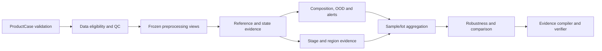

# BRIDGE Tool Registry

## 文档信息

| 项目 | 内容 |
| --- | --- |
| Registry 版本 | `TOOL-v0.1` |
| 审计日期 | 2026-08-03 |
| 目标 | 按科学问题管理 Agent 可调用工具，而非按软件名称堆叠流程 |
| 正式计算原则 | 当前只发布绑定 MeasurementSpec 的 raw evidence；`domain_score` 固定为 `null` |

软件许可证来自官方仓库或项目文档的当前状态；冻结工具时仍需保存具体 release 的 LICENSE、版本和 checksum。

## 一、Tool Card 合同

```text
tool_id / tool_version / registry_state / priority
scientific_question / biological_construct
supported_assays / supported_specimen / supported_contexts
required_inputs / required_metadata / raw_data_requirement
analysis_unit / reference_dependencies / knowledge_dependencies
measurement_spec_ref / score_contract_ref / evidence_family_ids
formal_outputs / uncertainty_outputs / diagnostic_outputs
environment_id / cpu_gpu_class / memory_class
determinism / random_seed_policy
failure_detection / abstention_rules / prohibited_claims
validation_cases / validation_state
official_source / software_license / citation
```

`registry_state` 使用 `adopted_spec`、`candidate`、`conditional`、`shadow`、`frozen`、`deferred`、`excluded`。`adopted_spec` 只表示合同已接受；安装成功或合同已接受均不等于获得 `frozen` 状态。

## 二、P0 执行主线



P0 采用双视图：

- `count_view`：原始或可确认的 integer-like counts，用于 QC、pseudobulk 和要求 counts 的算法。
- `expression_view`：冻结的 normalization/log transform，用于可视化和部分映射。

Agent 必须先确认每个 layer 的来源，不能仅因 layer 名称为 `counts` 就认定其为原始 counts。

## 三、输入、资格与 QC

| Tool ID | 工具/方法 | 科学问题与正式输出 | 输入要求 | 拒答与边界 | 环境 | 状态/许可 |
| --- | --- | --- | --- | --- | --- | --- |
| `BRIDGE-CASE-VALIDATOR` | BRIDGE 待实现的 schema validator | ProductCase、sample hierarchy、role、eligibility、missing fields | 结构化 manifest + 数据 header | 不从文件名推断 assay/role/linkage | `ENV-P0-CORE-v0.1` | `adopted_spec`, P0 |
| `ANNDATA-IO` | [AnnData](https://anndata.readthedocs.io/) | 读取 h5ad、检查 obs/var/layers/obsm/uns、生成数据指纹 | 可读 h5ad；唯一 obs/var names | 只验证结构，不证明 layer 生物语义 | `ENV-P0-CORE-v0.1` | `adopted`, BSD-3-Clause |
| `SCANPY-QC` | [Scanpy](https://scanpy.readthedocs.io/) | n_counts、n_genes、mitochondrial/ribosomal fraction、sample distributions | 明确 count/expression view、sample key | processed-only matrix 只能做有限 QC | `ENV-P0-CORE-v0.1` | `adopted`, BSD-3-Clause |
| `SCRUBLET` | [Scanpy Scrublet wrapper](https://scanpy.readthedocs.io/en/latest/api/generated/scanpy.pp.scrublet.html) | per-sample doublet score 与 predicted flag | 单样本未归一化 counts；预注册 expected rate | 无 raw counts、混合多个 capture、细胞过少时跳过；预测不等于真实 doublet | `ENV-P0-CORE-v0.1` | `conditional_P0`, Scrublet/Scanpy release license |
| `CELLBENDER-RB` | [CellBender remove-background](https://cellbender.readthedocs.io/en/latest/usage/) | background-corrected counts、posterior 与 QC report | 未过滤 raw droplet matrix，最好有 GPU | 只有 filtered h5ad 时不可运行；结果需与原 counts 并列敏感性分析 | `cellbender-proposed` | `conditional_P1`, BSD-3-Clause |
| `EMPTYDROPS` | [DropletUtils emptyDrops](https://bioconductor.org/packages/release/bioc/html/DropletUtils.html) | cell-containing barcode evidence | raw droplet count matrix | processed cell matrix不适用 | `ENV-BIOCONDUCTOR-v0.1` | `conditional_P1`, Bioconductor package license |
| `SOUPX` | [SoupX](https://github.com/constantAmateur/SoupX) | ambient contamination estimate/corrected matrix | raw + filtered droplet matrices，cluster/context 信息 | 无 empty droplets 时不可运行；不能把校正后差异自动解释为生物变化 | `ENV-BIOCONDUCTOR-v0.1` | `candidate_P1`, release license 待冻结 |

P0 默认执行 flag-first QC：保留原对象，生成 `qc_flag`、`eligible_view` 和 `sensitivity_views`。任何过滤阈值必须在 MeasurementSpec 中版本化。

## 四、样本级统计与预处理

| Tool ID | 工具/方法 | 正式用途 | 输入/单位 | 边界 | 环境 | 状态 |
| --- | --- | --- | --- | --- | --- | --- |
| `BRIDGE-PSEUDOBULK` | 待实现的 sparse aggregation | sample/lot x cell-state counts、gene coverage、replicate table | raw counts；sample/lot 为 biological unit | 细胞不能作为独立重复；单样本只作 descriptive | `ENV-P0-CORE-v0.1` | `adopted_spec`, P0 |
| `SCANPY-PREPROCESS` | Scanpy normalize/log/HVG/PCA/neighbors | 冻结 expression view 与探索图 | count_view、batch/sample metadata | 每个下游工具不得各自静默重做不同预处理 | `ENV-P0-CORE-v0.1` | `adopted`, P0 |
| `PSEUDOBULK-DE` | edgeR/DESeq2 或经验证的等价实现 | group/timepoint contrast、effect size、CI | 至少满足预注册 biological replicate requirement | 无生物重复时不发布推断统计显著性 | `ENV-BIOCONDUCTOR-v0.1` | `candidate_P1` |
| `DOWNSAMPLE-STABILITY` | BRIDGE 待实现 | minimum_cells、rare-state LOD、rank/score stability curves | sample-preserving subsampling | 禁止跨样本混池后声称批间稳定 | `ENV-P0-CORE-v0.1` | `adopted_spec`, P0 |

## 五、Reference Mapping 与 Cell-State Evidence

| Tool ID | 方法 | 核心输出 | 依赖 | 失败/拒答条件 | 环境 | 状态/许可 |
| --- | --- | --- | --- | --- | --- | --- |
| `MARKER-EVIDENCE` | versioned marker/program rules | marker coverage、directional coherence、conflict | ProductDefinitionCard + marker snapshot | marker 缺失或 assay coverage 低时 withheld；marker 不单独定义 cell type | `ENV-CELLSTATE-PY-v0.1` | `adopted_spec`, P0 |
| `REF-PSEUDOBULK-CORR` | sample/state pseudobulk correlation | 与独立 reference state 的 correlation 与 margin | raw/log view、reference card | source overlap、低 gene coverage、单一 reference 时降低 robustness | `ENV-CELLSTATE-PY-v0.1` | `candidate_P0` |
| `CELLTYPIST` | [CellTypist](https://celltypist.readthedocs.io/) | supervised label probability/decision score | 匹配的自训练模型；gene overlap | 通用预训练模型不能替代 PD-specific model；OOD 时拒答 | `ENV-CELLSTATE-PY-v0.1` | `candidate_P0`, MIT |
| `SCANVI-MAPPER` | [scVI/scANVI](https://docs.scvi-tools.org/) | reference latent mapping、state posterior、model uncertainty | frozen reference model、counts、batch fields | query/reference gene 和 modality 不满足合同；不可重训后继续称 frozen mapping | `ENV-CELLSTATE-PY-v0.1` | `candidate_P0`, BSD-3-Clause |
| `SCARCHES-MAP` | [scArches](https://docs.scarches.org/) | query-to-reference surgery/mapping | frozen compatible model 与 query counts | 需记录 reference update policy；query 不得改变 reference labels | `ENV-CELLSTATE-PY-v0.1` | `candidate_P1`, project release license |
| `SINGLER` | [SingleR](https://bioconductor.org/packages/release/bioc/html/SingleR.html) | correlation-based independent annotation channel | reference expression + labels | reference 与 query 血缘重叠时不能当独立证据 | `ENV-CELLSTATE-BIOC-v0.1` | `candidate_P1`, Artistic-2.0 |
| `ONTOLOGY-DECOMPOSITION` | BRIDGE 待开发 | hierarchical posterior、ontology distance、target/adjacent/off-axis/unknown | ontology snapshot + calibrated model outputs | ontology coverage 或 model calibration 不足时 domain unavailable | `ENV-CELLSTATE-PY-v0.1` | `adopted_spec`, P0 |

多个 mapper 共享 reference、marker 或训练数据时属于相关 evidence family。组合权重只能由 leave-source-out calibration 确定，不能根据最终产品排序选择。

## 六、Unknown/OOD、组成与 Rare State

| Tool ID | 方法 | 输出 | 输入/验证 | 拒答边界 | 状态 |
| --- | --- | --- | --- | --- | --- |
| `BRIDGE-OOD-ENSEMBLE` | 待开发的 residual + confidence + disagreement | cell-level unknown evidence、sample unknown fraction | OOD panel、source holdout、calibration curves | 不把 unknown 强制分给最近 label | `adopted_spec`, P0 |
| `COMPOSITION-SOFT` | soft posterior aggregation | target、acceptable、off-axis、unknown fraction 与区间 | 完整制剂为分母；sample-level bootstrap | 只分析预筛 target cells 时禁止称完整制剂 composition | `adopted_spec`, P0 |
| `RARE-STATE-LOD` | binomial/beta-binomial + spike-in | detection limit、UCB、false-reassurance rate | per-sample cell count、synthetic/real spike-in | 未达到 power 时只报“无法排除” | `adopted_spec`, P0 |
| `MODEL-DISAGREEMENT` | reference/model swap | label/score discordance、robustness interval | 至少两个预注册独立配置 | 临时增加有利模型不允许进入当次正式结果 | `adopted_spec`, P0 |

## 七、发育状态、时间与谱系

| Tool ID | 工具/方法 | 输出 | 输入要求 | 边界 | 环境 | 状态 |
| --- | --- | --- | --- | --- | --- | --- |
| `REAL-TIMEPOINT-CONTRAST` | BRIDGE timepoint occupancy/contrast | stage-state occupancy、program trend、protocol x D contrast | 显式 D、sample/replicate hierarchy | D 不换算为 GW/PCW；不同 intended stage 不总排名 | `ENV-DEVELOPMENT-PY-v0.1` | `adopted_spec`, P0 |
| `SISBAR-CALIBRATION` | lineage-barcode linked state transitions | directly supported transitions、transition consistency | barcode/state/sample linkage | 不外推未观测方案的最佳收获日 | `ENV-DEVELOPMENT-LINEAGE-v0.1` | `candidate_P0` |
| `CELLRANK` | [CellRank](https://cellrank.readthedocs.io/) | transition matrix、macrostate、fate probability | validated kernel input，可来自 real time/velocity/pseudotime | 输出为 trajectory evidence，不证明真实谱系；需 source/time holdout | `cellrank` | `conditional_P1`, BSD-3-Clause |
| `SCVELO` | [scVelo](https://scvelo.readthedocs.io/) | RNA velocity 与 dynamical evidence | spliced/unspliced layers、适配 chemistry 和 QC | 普通 processed h5ad 无 layers 时不运行；不把箭头当因果轨迹 | `scvelo` | `conditional_P2`, release license 待冻结 |

P0 优先使用真实时间点、state occupancy 和 SISBAR 支持；pseudotime/velocity 是辅助证据。

## 八、Risk 与 Process Integrity

| Tool ID | 方法 | 输出 | 知识/数据依赖 | 拒答边界 | 状态 |
| --- | --- | --- | --- | --- | --- |
| `RISK-PROGRAMS` | stage-conditioned program scoring | pluripotency-like、cycling、stress、hypoxia、UPR、EMT、IFN/HLA 等 burden | frozen program snapshot + stage-matched null | 增殖不能脱离目标阶段解释；缺 protocol context 时降级 | `candidate_P0` |
| `CELL-CYCLE` | Scanpy + frozen gene sets | phase evidence、cycling fraction | expression coverage | 不能将所有 cycling progenitor 称为异常 | `candidate_P0` |
| `CNV-TRIGGER` | inferCNV/CopyKAT 类方法候选 | transcriptomic CNV trigger 与 uncertainty | adequate gene/order/reference cells | 只触发核型/CMA/FISH/WGS；不证明遗传异常 | `shadow_P1` |
| `PROCESS-CONFOUNDING` | BRIDGE metadata model | dissociation、freeze/thaw、transport、recovery 与 stress contrast | protocol metadata + replicate/batch | metadata 缺失时不能归因工艺 | `adopted_spec`, P0 |
| `CRITICAL-ALERT` | deterministic rule engine | non-compensable alert + evidence IDs | validated rules、LOD、severity registry | 未验证 rule 保持 shadow；alert 不取反为安全分 | `adopted_spec`, P0 |

## 九、调控网络

| Tool ID | 工具/方法 | 输出 | 配套知识 | 边界 | 环境 | 状态/许可 |
| --- | --- | --- | --- | --- | --- | --- |
| `DECOUPLER-TF` | [decoupler](https://decoupler.readthedocs.io/) ULM/MLM | sample/state TF activity、coverage、stability | frozen CollecTRI/DoRothEA subset | TF activity 是 inferred；prior coverage 低时 withheld | `decoupler` | `shadow_Q + E`, BSD-3-Clause |
| `PYSCENIC` | [pySCENIC](https://pyscenic.readthedocs.io/) | data-driven GRN、motif-pruned regulon、AUCell | cisTarget ranking DB、motif annotations、TF list | coexpression/motif 不证明 TF binding；reference/query 血缘需审计 | `pyscenic_stable` | `shadow_Q + E`, GPL-3.0 |
| `AUCELL` | pySCENIC AUCell | per-cell gene-set/regulon activity | frozen gene set/regulon | gene set 来源与 coverage 必须保存 | `pyscenic_stable` | `candidate_P1` |
| `SCENICPLUS` | SCENIC+ | TF-CRE-gene eRegulon | matched scATAC/multiome、genome/motif DB | 仅有 scRNA 时不运行 | `scenicplus` 待审计 | `deferred_P2` |

调控报告分开保存 TF expression、signed activity、data-driven regulon、motif/ChIP prior 和冲突，禁止压成不可追溯单值。

## 十、Pathway、功能与代谢

| Tool ID | 方法 | 输出 | 配套知识 | 边界 | 环境 | 状态 |
| --- | --- | --- | --- | --- | --- | --- |
| `DECOUPLER-PROGENY` | decoupler + PROGENy | signed pathway footprint | frozen PROGENy snapshot | pathway activity 是 transcriptomic inference | `decoupler` | `shadow_Q + E`, P1 |
| `REACTOME-GO-PROGRAM` | weighted program completeness/coherence | dopamine synthesis、vesicle、axon、synapse、stress pathways | Reactome/GO + expert program cards | 简单平均不等于 pathway activation 或功能 | `ENV-KNOWLEDGE-PY-v0.1` | `candidate_P1` |
| `GSEA-ORA` | gseapy/fgsea 类方法 | enrichment diagnostic | frozen gene universe + gene-set snapshot | 单细胞 cell-level p 值不作产品重复；多重检验必须记录 | `ENV-KNOWLEDGE-PY-v0.1` / `ENV-BIOCONDUCTOR-v0.1` | `shadow_E`, P1 |
| `METABOLIC-PROXY` | MitoCarta/curated metabolic programs | mitochondrial、redox、mitophagy、relative readiness | frozen knowledge snapshot | 不报告绝对 flux | `ENV-KNOWLEDGE-PY-v0.1` | `shadow_Q + E`, P1 |
| `SCFEA-METAFLUX` | scFEA/METAFlux 类方法 | relative flux proxy | model-specific network、足够 coverage | 无代谢组/示踪时不能称真实代谢通量 | 独立环境待建 | `deferred_P2` |

## 十一、细胞通讯与微环境

| Tool ID | 工具/方法 | 输出 | 依赖 | 边界 | 环境 | 状态/许可 |
| --- | --- | --- | --- | --- | --- | --- |
| `LIANA` | [LIANA](https://liana-py.readthedocs.io/) | multi-method ligand-receptor consensus、sample contrast | frozen intercellular resource、cell-state labels | 解离 scRNA 只支持 communication potential | `liana` | `shadow_E`, GPL-3.0 |
| `CELLPHONEDB` | [CellPhoneDB](https://cellphonedb.readthedocs.io/) | complex-aware interactions、expression proportion、microenvironment filter | CellPhoneDB data release、HGNC mapping | 与 LIANA 共享来源时只作 audit，不重复计权 | 独立环境待建 | `candidate_P1`, MIT |
| `NICHENET` | NicheNet | ligand-to-receiver target program evidence | ligand-target prior、receiver programs | 预测 targets 不证明实际 signaling | `ENV-COMMUNICATION-BIOC-v0.1` | `candidate_P2` |
| `EXTERNAL-ENV-NODES` | BRIDGE Protocol IR adapter | 培养基因子/小分子与内源 ligand 分离 | protocol metadata | 缺 protocol 时 communication attribution 降级 | `ENV-COMMUNICATION-PY-v0.1` | `adopted_spec`, P1 |

正式输出必须按 biological sample 独立计算，再在 sample/lot 层比较。不得将 ligand 和 receptor 共表达写成真实通讯。

## 十二、空间分析

| Tool ID | 工具/方法 | 输出 | 输入 | 边界 | 环境 | 状态/许可 |
| --- | --- | --- | --- | --- | --- | --- |
| `SPATIALDATA-IO` | [SpatialData](https://spatialdata.scverse.org/) | image/shape/point/table 坐标与 transformation 管理 | 可审计 SpatialData/Visium outputs | coordinate system 未确认时拒绝跨切片比较 | `spatial` | `candidate_P0`, BSD-3-Clause |
| `SQUIDPY` | [Squidpy](https://squidpy.readthedocs.io/) | spatial graph、neighborhood enrichment、autocorrelation | spatial coordinates、ROI、cell/state annotation | 同一胚胎两 section 不视为 biological replicates | `spatial` | `candidate_P1`, BSD-3-Clause |
| `CELL2LOCATION` | [cell2location](https://cell2location.readthedocs.io/) | scRNA reference signatures 与 spatial abundance posterior | matched reference、counts、hyperparameters | 参数与 reference sensitivity 必须报告；abundance 不等于直接细胞计数 | `spatial` | `candidate_P1`, Apache-2.0 |
| `SPATIAL-CONCORDANCE` | BRIDGE 待开发 | marker/state anatomical specificity、donor/section consistency | frozen ROI/anatomy map | P0 不声称 graft-host niche compatibility | `spatial` | `adopted_spec`, P1 |

## 十三、批次、Integration 与 Robustness

| Tool ID | 工具/方法 | 输出 | 规则 | 环境 | 状态 |
| --- | --- | --- | --- | --- | --- |
| `NO-INTEGRATION-BASELINE` | unintegrated PCA/pseudobulk | biological signal baseline | 所有 integrated 结果必须与其比较 | `ENV-COMPARISON-PY-v0.1` | `adopted`, P0 |
| `SCVI-INTEGRATION` | scVI/scANVI | latent representation、batch sensitivity | 仅在 integration intent 明确时运行 | `ENV-INTEGRATION-BENCHMARK-v0.1` | `candidate_P0` |
| `SCIB-METRICS` | [scib-metrics](https://scib-metrics.readthedocs.io/) | batch removal + biological conservation metrics | 不以 UMAP 混合程度单独判断 | `ENV-INTEGRATION-BENCHMARK-v0.1` | `candidate_P1` |
| `REFERENCE-SWAP` | BRIDGE deterministic runner | primary/swap reference score interval | swap list 必须预注册 | `ENV-COMPARISON-PY-v0.1` | `adopted_spec`, P0 |
| `PREPROCESS-SWAP` | BRIDGE deterministic runner | reasonable preprocessing sensitivity | 仅运行冻结配置集合 | 多试配置后挑有利结果禁止 | `ENV-COMPARISON-PY-v0.1` | `adopted_spec`, P0 |

## 十四、graft 后验分析

| Tool ID | 方法 | 输出 | 输入/单位 | 边界 | 状态 |
| --- | --- | --- | --- | --- | --- |
| `GRAFT-CASE-VALIDATOR` | BRIDGE schema validator | host、animal、graft、timepoint、origin linkage | graft manifest | 缺链接时保持 unlinked | `adopted_spec`, P0 |
| `GRAFT-STATE-MAPPING` | graft-specific reference ensemble | graft cell/nucleus state evidence | modality-aware graft reference | 不复用移植前阈值而不验证 | `candidate_P0` |
| `GRAFT-COMPOSITION` | animal/graft-level soft composition | DA、astrocyte、VLMC、off-axis、unknown | 完整 graft-derived human profiles | 不能合并进 pretransplant denominator | `candidate_P0` |
| `PREP-GRAFT-CONCORDANCE` | descriptive paired contrast | 支持、冲突、unresolved evidence | explicit preparation-graft links | 不推断疗效、安全或因果 | `shadow_E`, P1 |

## 十五、Evidence、报告与核验

| Tool ID | 组件 | 输出 | 正式要求 | 状态 |
| --- | --- | --- | --- | --- |
| `EVIDENCE-COMPILER` | 待实现 deterministic service | schema-valid MeasurementResult、Evidence Graph | 数字、denominator、source、version 全可追溯 | `adopted_spec`, P0 |
| `DOMAIN-ASSESSOR` | 未来 score-contract runner | 当前无输出 | 新 ScoreContract 与 Schema 通过独立验证前不得实现 | `deferred` |
| `COMPARABILITY-GATE` | 待实现 rules engine | comparable/display-only/withheld | Card、stage、assay、version 全检查 | `adopted_spec`, P0 |
| `CLAIM-VERIFIER` | deterministic checks + constrained LLM review | verified/release_blocked、claim evidence IDs | numeric fidelity 100%；missing-vs-negative | `adopted_spec`, P0 |
| `PUBLIC-SAFE-EXPORT` | allowlist exporter | 脱敏 summary | 禁止绝对路径、用户名和原始私有 metadata | `candidate_P0` |

历史 BRIDGE reporting、product manifest、adapter 和 validation 代码位于 `legacy/`，不参与当前安装或 Agent 调用。可复用设计必须按新合同重新实现并测试。

## 十六、资源等级

| 等级 | 典型任务 | 调度要求 |
| --- | --- | --- |
| `CPU-S` | schema/QC summary、program score、报告 | 可交互运行 |
| `CPU-M` | pseudobulk、mapping audit、sample comparison | 记录线程和内存预算 |
| `CPU-L` | pySCENIC GRN、large reference preprocessing | 队列运行，保存 checkpoint |
| `GPU-M` | query mapping、cell2location | 固定 GPU、seed、显存和模型版本 |
| `GPU-L` | large scVI training、CellBender raw matrices | 需要人工确认资源与输入资格 |

Agent 权限和长任务确认策略在 v0.1 中保持开放，但所有资源估计必须出现在 `AnalysisPlan`。

## 十七、工具晋升闸门

工具从 `candidate/shadow` 晋升为 `frozen` 至少满足：

1. Tool Card、输入 schema、环境、版本、参数和输出 schema 冻结。
2. 正控、负控、missing-input、OOD 和故障产物测试通过。
3. sample/source holdout、下采样和 reference/preprocessing swap 达到预注册稳定性。
4. 输出语义和 prohibited claims 通过生物学审核。
5. 软件许可证、知识依赖和再分发条件完成审计。
6. 与已有工具共享的 evidence family 已标记，未重复计权。
7. 生成独立 validation report 和 promotion decision。
